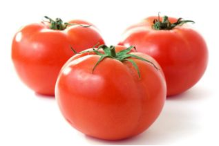
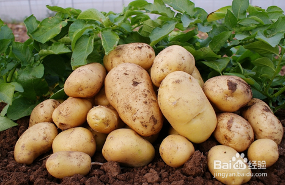
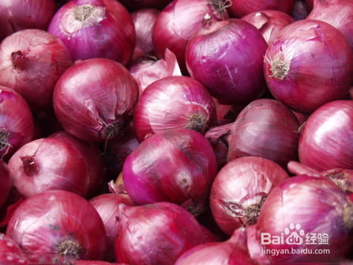
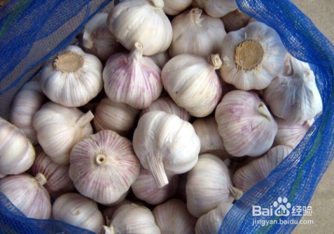
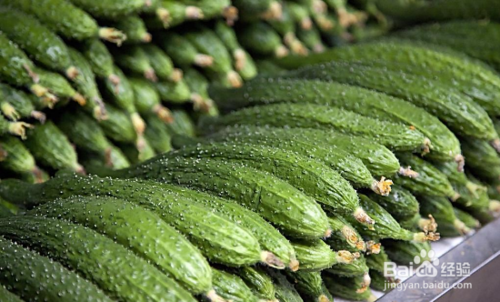
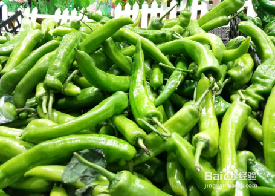

现在基本家家都有冰箱了，在炎热的天气或菜买的多的情况下，都喜欢放冰箱保存。以为一放冰箱就能长期保存了。但是有些蔬菜是不适合放冰箱保存的。这里小编来介绍下几种常见的不宜放冰箱保存的蔬菜。

## 工具/原料

- 冰箱

## 方法/步骤

1. 

   西红柿。西红柿怕低温，在冰箱的低温下会冻坏，容易变软出现水泡烂掉，或容易出现黑斑，所以不宜放在冰箱里保存。买回来后放在阴凉通风的地方常温保存就可以了。

   

2. 

   土豆。土豆在冰箱的低温下会促进内部的淀粉分解成糖分，吃起来有一种砂砾的感觉，影响土豆的口感，所以不宜放在冰箱里保存。买回来后放在箱子里常温保存就可以了。

   

3. 

   洋葱。冰箱里环境潮湿，会使洋葱的腐烂速度加快，也会使洋葱的辣味减少，影响口感，所以不宜放在冰箱里保存。买回来后放在干燥的地方常温保存就可以了。

   

4. 

   大蒜。冰箱低温潮湿，大蒜放在冰箱里容易变软，口感变差，放久了还会发霉。发霉了还不容易发现，一旦发现就是霉的比较厉害了，所以不宜放在冰箱里保存。买回后放在塑料袋中把口扎严密放在常温下保存就可以了。

   

5. 

   黄瓜。黄瓜一般只要放进冰箱3天时间，其表皮就会出现水浸状，变软，影响口感，以不宜放在冰箱里保存。买回来后放在干燥阴凉的地方常温保存就可以了。

   

6. 

   青椒，包括线椒圆椒等。青椒也怕低温，青椒在低温的环境下容易出现冻伤的现象，其表皮变黑，青椒变软影响口感甚至变质不能吃了，以不宜放在冰箱里保存。同样，买回来后放在阴凉干燥的地方常温保存就可以了。

   

   END

## 注意事项

- 不宜放冰箱保存的蔬菜还有不少，这里只列举了常见的几种。
- 如果对你有帮助请点左侧的大母指和下方的投票，是对小编的最大的鼓励。