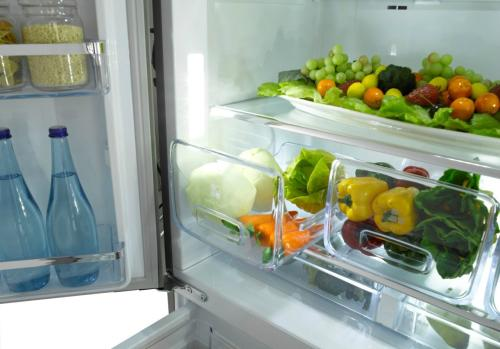
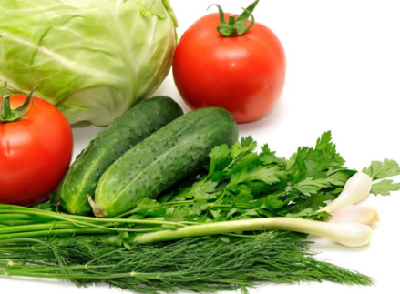
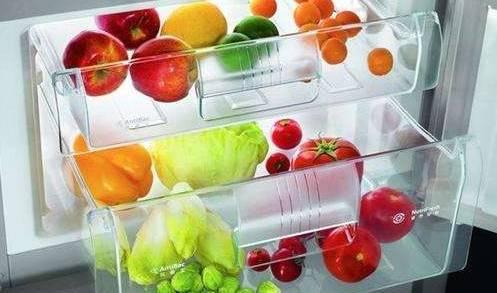
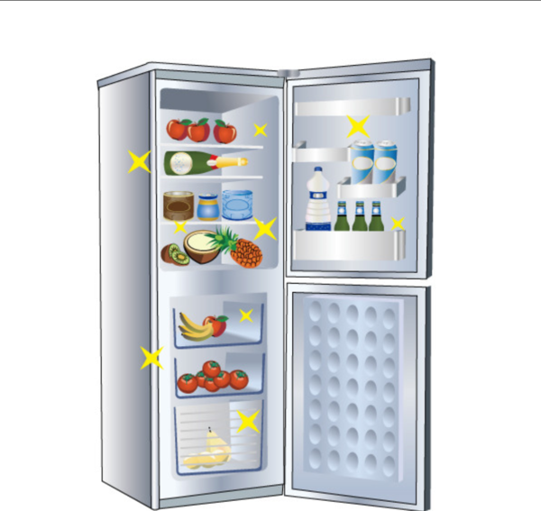
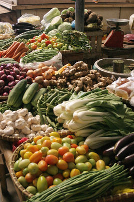

#  冰箱里放蔬菜最长可以放几天 

   冰箱里放蔬菜最长可以放几天   

-    

 我来答

分享

*举报*

 浏览 12187 次

9个回答

 [ #活动# 参与知道回答评论活动，赢千元好礼！ ](https://zhidao.baidu.com/question/246679440766080724.html?entry=hottopic) 

   墨陌沫默漠末 
  来自百度知道认证团队  2018-09-10    

 

冰箱里放蔬菜时间：

1，新鲜的蔬菜，韭菜、蒜毫、香菜、黄瓜、辣椒、芹菜、生菜、小油菜、[菠菜](https://www.baidu.com/s?wd=%E8%8F%A0%E8%8F%9C&tn=SE_PcZhidaonwhc_ngpagmjz&rsv_dl=gh_pc_zhidao)、茼蒿、叶径类的蔬菜用旧报纸分包起来，可以存放时间比较久，包装好了一个星期甚至两个星期都没问题。

2，葱头、萝卜、土豆、胡萝卜可以放很久，注意土豆别发芽就行。

3，实心的白菜也可以久放，吃的时候看情况把最外皮剥掉。

4，[西红柿](https://www.baidu.com/s?wd=%E8%A5%BF%E7%BA%A2%E6%9F%BF&tn=SE_PcZhidaonwhc_ngpagmjz&rsv_dl=gh_pc_zhidao)买的时候挑硬的，青点的，可以放一星期。

5，蔬菜不要套着塑料袋放冰箱，容易烂。

6，大蒜和葱就别放冰箱了。

7，绿豆芽和黄豆芽容易变质，一两天内吃掉。

8，生姜容易变质，剥皮，切好片，装保鲜袋放冷冻层，随吃随取，生姜发乌就不要吃了。

9，菌菇类的尽快吃，容易坏。

10，鲜豆腐现买现吃，不宜久放，不能马上吃掉的切成小块放冷冻层做冻豆腐。

## 扩展资料

蔬菜从采收开始就进入衰老阶段，表现在细胞内核糖体数目减少，叶绿体开始崩溃，线粒体减少，细胞老化，不耐贮藏，易腐烂。衰老是和乙烯、赤霉素或其他激素在蔬菜中的含量以及在贮藏中的变化，蔬菜的生长发育状况及贮藏条件等有密切关系的。

要延缓蔬菜的衰老，延长贮藏期，一是选择健壮、生长良好的蔬菜进行贮藏；二是严格控制蔬菜在贮藏过程中乙烯和其他激素的含量，以利延缓蔬菜衰老；三是创造最佳贮藏条件，如控制温湿度、气体组成和配比等。

果菜类、结球类、根菜类等，在贮藏过程中有后熟作用。在后熟过程中常发生一系列生理生化变化，如淀粉水解为糖，有机酸含量降低，单宁物质开始凝固与氧化，原果胶分解为溶解于水的果胶，叶绿素发生分解，风味改善，产生芳香成分，质地由硬变软等。

参考资料：[蔬菜_百度百科](https://baike.baidu.com/item/%E8%94%AC%E8%8F%9C/453?fr=aladdin)

 

   **47**     **21**     

评论(*1*)

分享

*举报*

收起

   雪音淼 
  来自百度知道认证团队  2018-09-03    

[西红柿](https://www.baidu.com/s?wd=%E8%A5%BF%E7%BA%A2%E6%9F%BF&tn=SE_PcZhidaonwhc_ngpagmjz&rsv_dl=gh_pc_zhidao)、柿子椒之类的放冰箱里最多可以保持10天左右，绿叶的蔬菜5天左右。

胡萝卜、芹菜：冷藏7~14天。

冷藏室上层 ：适宜储存热肉、咸肉、酸奶及硬奶酪等。未开封的肉食应在保存期之前食用。

一旦启封，热肉只能保存3～5天；咸肉、硬奶酪可保存3周。

冷藏室下层 ：可储存需要怏速加热的食物，如剩饭剩菜、煮好的鸡蛋、鱼肉等。

另外，容易冻伤的不带叶蔬菜和水果也最好储存于此。煮好的鸡蛋可存放7天。

剩余饭菜最好别超过3天，但觉得异常，最好扔掉；新鲜鱼只能在冰箱冷藏1天，

烧熟的鱼不要超过3-4天。

保鲜盒：位于冷藏室最底部，湿度最大，比较适合存放蔬菜，如绿叶蔬菜、辣椒和西兰花等。

这类食物最多可保存1周左右。

**扩展资料：**

白菜、芹菜、洋葱、胡萝卜等的适宜存放温度为0℃左右。南瓜适宜在10℃以上存放。

茄子、[西红柿](https://www.baidu.com/s?wd=%E8%A5%BF%E7%BA%A2%E6%9F%BF&tn=SE_PcZhidaonwhc_ngpagmjz&rsv_dl=gh_pc_zhidao)的适宜存放温度为7．2℃至10℃之间。

西红柿经低温冷冻后，肉质呈水泡状，显得软烂，或出现散裂现象，表面有黑斑，煮不熟，无鲜味，严

重的则腐烂。

黄瓜、青椒在冰箱中久存，会出现冻“伤”———变黑、变软、变味。

黄瓜还会长毛发黏。因为冰箱里存放的温度一般为4℃至6℃左右，而黄瓜贮存适宜温度为10℃至

12℃，青椒为7℃至8℃。故不宜久存。

参考资料：[百度百科-蔬菜保鲜冷藏技术](https://baike.baidu.com/item/%E8%94%AC%E8%8F%9C%E4%BF%9D%E9%B2%9C%E5%86%B7%E8%97%8F%E6%8A%80%E6%9C%AF/2728339)

  本回答被网友采纳

   **5**     **5**     

评论

分享

*举报*

收起

   朦胧美qrl 
  来自百度知道认证团队  2018-09-03    

新鲜蔬菜在冰箱内储存期不应超过3天，否则不利于身体健康。

长时间在冰箱里储存蔬菜非常危险，而危险也多来自蔬菜本身含有的硝酸盐，因为硝酸盐本身无毒，然而在储藏一段时间之后，由于酶和细菌的作用，硝酸盐被还原成亚硝酸盐，亚硝酸盐是一种有毒物质，它在人体内与蛋白类物质结合，可生成强致癌性的亚硝酸盐类物质。

储存蔬菜不仅会产生有害物质，而且会发生营养素的损失。试验证明，在30℃的屋子里储存24小时，绿叶蔬菜中的维生素C几乎全部损失，而亚硝酸盐的含量则上升了几十倍。

此外，苹果、梨、葡萄等水果放在冷藏室一般也不要超过72小时，这样营养才不会被完全破坏掉。橘子等柑橘类的水果室温下存放即可。芒果、柠檬、南瓜等适宜温度在10℃以上的水果、蔬菜放在冰箱里，营养就会流失，而且易烂易坏。香蕉、鲜荔枝等水果放在冷藏室也会被冻伤，果皮不久就会变暗变黑，果肉变味变质，不能食用。

## 扩展资料：  

一些常用的蔬菜保鲜小窍门，或许你可以试试

（1）冬季购买的韭菜、蒜黄等青菜，如果一时吃不完，可用新鲜的大白菜叶子包好，放在阴凉的地方，可保鲜数天。

（2）生菜只要放一段时间就会逐渐变软并变色，可将菜心摘除，然后将湿润的纸巾塞入菜心处让生菜吸收水分，等到纸巾较干时将其取出，再将生菜放入保鲜袋中冷藏。

（3）大蒜、葱、姜、辣椒大多为调味品，保存时最好能保持原貌。大蒜的保存方式与洋葱类似，可将其放入网袋中，然后悬挂在室内阴凉通风处，或是放在有透气孔的专用陶瓷罐中。而姜分为老姜和嫩姜，老姜不适合冷藏保存，可放在通风处和沙土里，嫩姜应用保鲜膜包起来放在冰箱内保存。

（4）香菜保鲜，挑选棵大、颜色鲜绿、带根的香菜，捆成500克左右的小捆，外包—层纸(不见绿叶为好)，装入塑料袋中，松散地扎上袋口，让香菜根朝上将袋置于阴凉处，随吃随取。用此法贮藏香菜，可使香菜在7—10天内菜叶鲜嫩如初。长期贮藏香菜，可将香菜根部切除，摘去老叶、黄叶，摊开晾晒1—2天，然后编成辫儿，挂在阴凉处风干。食用时用温开水浸泡即可，香菜色绿不黄，香味犹存。

（5）茄子保鲜。茄子的表皮覆盖着一层蜡质，它不仅使茄子发出光泽，而且具有保护茄子的作用，一旦蜡质层被冲刷掉或受机械损害，就容易受微生物侵害而腐烂变质。因此，要保存的茄子一般不能用水冲洗，还要防雨淋，防磕碰，防受，热，并存放在阴凉通风处。

（6）韭菜保鲜。新买回来的鲜韭菜用小绳捆起来，根朝下放在水盆里。就会长时间不于、不烂。芹菜、茼蒿、葱等也可采用这种方法保鲜。

（7）西红柿保鲜。挑选果体完整、品质好、五六分熟的西红柿，将其放入塑料食品袋内，扎紧口，置于阴凉处，每天打开袋口1次，通风换气5分钟左右。如塑料袋内附有水蒸气，应用干净的毛巾擦干然后再扎紧口。袋中的西红柿会逐渐成熟，—般可维持30天左右。

（8）水果去皮后，如不马上吃完，过一段时间空气会对水果起氧化作用，使其表面变成浅棕色，非常难看。如果将削皮的水果浸泡在凉开水中，既可防止氧化而保持原有色泽，还可使水果清脆香甜。

​          夏季水果不适宜冰着吃！对实热体质者（平时易面色红赤，口舌生疮，口干汗多，舌燥便秘，喜凉饮，常烦躁，易发火等）要多吃一点偏凉性的水果，如香瓜、梨、西瓜、香蕉、柚子、枇杷、芒果、甘蔗、甜瓜、柿子、桑椹、橙、生菱角、荸荠、猕猴桃等。可以协助清热泻火。

  本回答被网友采纳

   **3**     **1**     

评论

分享

*举报*

收起

   蔷祀 
  来自百度知道认证团队  2018-09-03    

西红柿、柿子椒等无叶类蔬菜的放冰箱里最多可以保持12天左右，绿叶的蔬菜（例如[菠菜](https://www.baidu.com/s?wd=%E8%8F%A0%E8%8F%9C&tn=SE_PcZhidaonwhc_ngpagmjz&rsv_dl=gh_pc_zhidao)、生菜）5天左右。

其实就算是冰箱，蔬菜也最好不要超过三天，超过三天以后被冰冻的绿色植物营养会大大减少。如果是炒好了的蔬菜，最多1天。放蔬菜的话，温度也不能一味的过低，保持在4——5℃即可。

**扩展资料**：

存储保鲜

把不同蔬菜存放在冰箱内，这种做法不妥。因每种蔬菜对于温度、湿度要求不同。如黄瓜、苦瓜、豇豆、南瓜等喜湿蔬菜，适宜存放在10℃左右的环境中，但不能低于8℃；绝大部分叶菜喜凉，适宜存放在0℃至5℃环境中，但不能低于0℃。蔬菜适宜存放的湿度为85%左右。存放蔬菜时，可选择较薄的保鲜袋，将新鲜完好的蔬菜放入保鲜袋，并用针在袋上扎6个小洞，然后将塑料袋封口。在冰箱内用适宜的温度存放。一定要记住买来的菜要装进无毒无害（一般非聚氯乙烯）的食品袋。

[蔬菜（食用类植物）_百度百科](https://baike.baidu.com/item/%E8%94%AC%E8%8F%9C/453?fr=aladdin#4_2)

  本回答被网友采纳

   **2**     **3**     

评论

分享

*举报*

收起

   虎虎生风77777 
  知道合伙人养生行家  2015-11-19    

  　　西红柿、柿子椒之类的放冰箱里最多可以保持10天左右，绿叶的蔬菜5天左右。建议尽量敞口放置，否则可能将菜捂了。其实3天就差不多了，被冰冻的绿色植物营养大大缩减了。如果是炒好了的蔬菜，最多1天。放蔬菜的话，最好把冰箱的温度调节在4-5度最好！如果家里的冰箱有光波保鲜的话，放带叶子的蔬菜不会鄢，但也不要时间过长。
　　延长蔬菜的保险时间，最简单的方法是利用旧报纸，将叶片喷点水，然后利用报纸包起来，以直立的姿势茎部朝下放入冰箱冷藏室，就可以有效的延长保存时间，留住新鲜。
　　通常“绿叶青菜”直接放冰箱里最容易脱水，将其放进冰箱之前做下处理，会保持“绿叶青菜”的常久新鲜。
　　冰箱里放蔬菜最多放几天
　　（1）购回的新鲜疏菜如果太脏，把虫叶、烂叶、脏叶大致清理一下，千万不要浸泡；如果是在菜市场买的菜(菜贩为了菜压称和诱人，会把菜浇巨多的水)们可以将水稍微甩甩，但不要甩太干；如果是在超市买的菜，菜本身会非常干，就必须为它点点水，水不能点太多，多了容易烂；
　　（2）然后将其放入保膜袋或食品袋中，封口不要封得太死，留点呼吸口，让它能呼吸，如果能够产生对流是最好的，分几处多扎几个小口就可以达到对流。这样可以保持蔬菜大叶菜里面的水分不会那么快地蒸发，而且得到呼吸，肯定新鲜啦！
　　（3）另外“绿叶青菜”在冰箱里面存放的位置非常重要，根部朝下放入冰箱冷藏室，可有效延长保存时间，留住新鲜。
　　一些常用的蔬菜保鲜小窍门，或许可以试试
　　（1）冬季购买的韭菜、蒜黄等青菜，如果一时吃不完，可用新鲜的大白菜叶子包好，放在阴凉的地方，可保鲜数天。
　　（2）生菜只要放一段时间就会逐渐变软并变色，可将菜心摘除，然后将湿润的纸巾塞入菜心处让生菜吸收水分，等到纸巾较干时将其取出，再将生菜放入保鲜袋中冷藏。
　　（3）大蒜、葱、姜、辣椒大多为调味品，保存时最好能保持原貌。大蒜的保存方式与洋葱类似，可将其放入网袋中，然后悬挂在室内阴凉通风处，或是放在有透气孔的专用陶瓷罐中。而姜分为老姜和嫩姜，老姜不适合冷藏保存，可放在通风处和沙土里，嫩姜应用保鲜膜包起来放在冰箱内保存。
　　（4）香菜保鲜，挑选棵大、颜色鲜绿、带根的香菜，捆成500克左右的小捆，外包—层纸(不见绿叶为好)，装入塑料袋中，松散地扎上袋口，让香菜根朝上将袋置于阴凉处，随吃随取。用此法贮藏香菜，可使香菜在7—10天内菜叶鲜嫩如初。长期贮藏香菜，可将香菜根部切除，摘去老叶、黄叶，摊开晾晒1—2天，然后编成辫儿，挂在阴凉处风干。食用时用温开水浸泡即可，香菜色绿不黄，香味犹存。
　　（5）茄子保鲜。茄子的表皮覆盖着一层蜡质，它不仅使茄子发出光泽，而且具有保护茄子的作用，一旦蜡质层被冲刷掉或受机械损害，就容易受微生物侵害而腐烂变质。因此，要保存的茄子一般不能用水冲洗，还要防雨淋，防磕碰，防受，热，并存放在阴凉通风处。
　　（6）韭菜保鲜。新买回来的鲜韭菜用小绳捆起来，根朝下放在水盆里。就会长时间不于、不烂。芹菜、茼蒿、葱等也可采用这种方法保鲜。
　　（7）西红柿保鲜。挑选果体完整、品质好、五六分熟的西红柿，将其放入塑料食品袋内，扎紧口，置于阴凉处，每天打开袋口1次，通风换气5分钟左右。如塑料袋内附有水蒸气，应用干净的毛巾擦干然后再扎紧口。袋中的西红柿会逐渐成熟，—般可维持30天左右。
　　（8）水果去皮后，如不马上吃完，过一段时间空气会对水果起氧化作用，使其表面变成浅棕色，非常难看。如果将削皮的水果浸泡在凉开水中，既可防止氧化而保持原有色泽，还可使水果清脆香甜。 