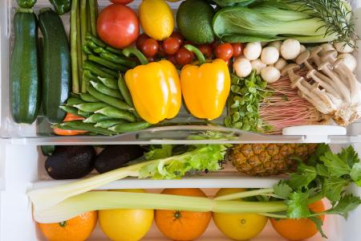
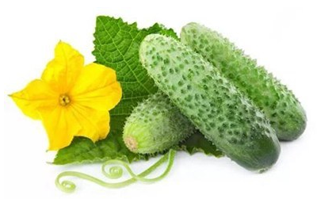
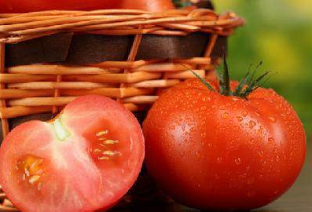
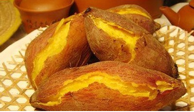
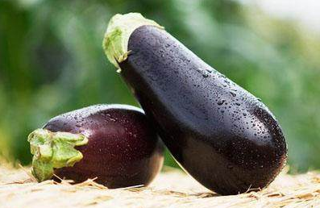
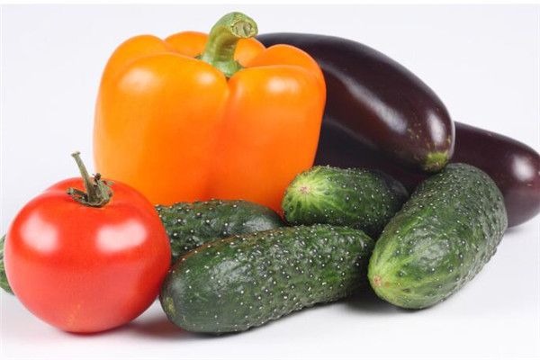
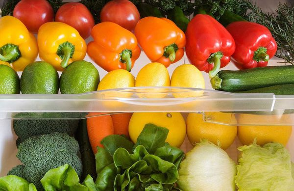

#  哪些蔬菜可以放冰箱？哪些不行？ 

-    

 我来答

分享

*举报*

 浏览 23508 次

8个回答

 [ #活动# 参与知道回答评论活动，赢千元好礼！ ](https://zhidao.baidu.com/question/246679440766080724.html?entry=hottopic) 

   丿染指流年丶丶 
  来自百度知道认证团队  2018-12-14    

 

 展开全部 

可以放在冰箱里的蔬菜：

叶菜类的蔬菜包括菠菜、生菜、白菜、卷心菜、蒜苗空心菜等，买回来用保鲜盒或带塑胶条的保鲜袋中放几张厨房用纸，再将未清洗的蔬菜或清洗确保擦干的放在其中。

还有胡萝卜也是可以放在冰箱里的。

不能放冰箱蔬菜：

1、黄瓜

贮存黄瓜的适宜温度在10度到12度之间，如果将黄瓜放在冰箱之中，不过三天，表皮便会呈水浸状，并失去黄瓜特有的风味。

2、青椒

青椒的最适贮存温度为7到8度，也不宜在冰箱中久存。时间稍长，放在冰箱里的青椒就会被冻伤，出现变黑、变软、变味等状况。

3、西红柿

西红柿也是不能放冰箱的食物，因为在温度过低的环境中西红柿的局部或全部果实会呈水浸状软烂，并出现褐色的圆斑等。

4、番薯

冷藏时会引起低温障碍，所以不适宜放进冰箱。

5、茄子

适宜存放温度为7.2℃至10℃之间。 所以不适合在冰箱里存放。

## 扩展资料： 

果蔬同放易变质“传染” 蔬菜和水果同放在一起，容易变质并“传染”。不仅人会得传染病，蔬果间的变质也会“传染”。

美国宾州州立大学的研究提醒，苹果、杏仁、红椒、桃子、哈密瓜、西红柿等，同其他蔬果放在一起时，会释放乙烯气体，让后者快速成熟、变质。另外，以上蔬果与十字花科蔬菜及绿色叶菜放在一起，也会让后者的叶子很快变黄变烂。

## 参考资料：[人民网——专家告诉你哪些食物不能放进冰箱](http://health.people.com.cn/n/2015/0627/c14739-27216858.html)

 

   **8**     **3**     

评论

分享

*举报*

   SC瘦脸面膜 
  来自百度知道认证团队  2018-12-02    

可以放冰箱蔬菜：

叶菜类的包括什么菠菜、生菜、白菜、卷心菜、蒜苗空心菜等还有胡萝卜可以放冰箱，买回来用保鲜盒或带塑胶条的保鲜袋中放几张厨房用纸，再将未清洗的蔬菜或清洗确保擦干的放在其中。

西兰花，将头部和尾部分别放入水中浸泡，然后用厨房纸巾包裹在西兰花外面，吸干其水分，再用保鲜膜包好，放入冰箱，这样便可以保鲜五天左右。

不能放冰箱蔬菜：

1、西红柿，西红柿经低温冷冻后，肉质呈水泡状，显得软烂，或出现散裂现象，表面有黑斑，煮不熟，无鲜味，严重的则腐烂。

2、黄瓜、青椒在冰箱中久存会出现变黑、变软、变味。黄瓜还会长毛发粘。因为冰箱里存放的温度一般为4℃至6℃左右，而黄瓜贮存适宜温度为10℃至12℃，青椒为7℃至8℃，因此不宜久存。

**扩展资料：**

蔬菜放冰箱注意事项：

1、在冷冻室贮藏。蔬菜、水果要把外表面水分擦干，放入箱内最下面，以零上温度贮藏为宜。

2、蔬果放冰箱前不要洗，一般蔬果表面都有一层蜡质，具有保护其不受微生物侵害的作用。蔬果在清洗后，尤其是用洗涤剂清洗干净后，其表面的蜡质层会遭到破坏，细菌很容易进入蔬果内部，导致蔬果变质腐烂。

参考资料来源：[人民网-专家告诉你哪些食物不能放进冰箱](http://health.people.com.cn/n/2015/0627/c14739-27216858.html)

参考资料来源：[人民网-注意！这些食物不能放冰箱储存](http://health.people.com.cn/n1/2016/0712/c21471-28545863.html)

参考资料来源：[人民网-冰箱不是保险箱 哪些食物不能放冰箱储存](http://shipin.people.com.cn/n/2015/0807/c85914-27427684.html)

参考资料来源：[人民网-蔬菜储藏前不洗芒果不要放冰箱](http://homea.people.com.cn/n/2015/0727/c41390-27364076.html)

  本回答被网友采纳

​    **9**     **12**     

评论

分享

*举报*

收起

   疯狂糖果屋 
  来自百度知道认证团队  2018-11-30    

一. 可以放在冰箱里保存的蔬菜有：圆白菜、生菜、萝卜、豆角、豆芽、芹菜、菠菜、茼蒿、大葱等。

\1. 圆白菜

最好不要直接放进冰箱，应先把表面水分风干，再用干净纸巾包裹好，装进袋子放入冰箱保存。或在冰箱保鲜盒里铺层纸巾，以吸收潮气，延长果蔬保鲜时间，可保存3~5天。

\2. 萝卜

叶子会吸收养分，让萝卜变糠，最好去掉缨放入冰箱保存，可保存3~5天。变糠、变软、没有水分可以食用，只是营养价值不高；若发黑则不要食用。

\3. 豆芽

最好买来当天就吃完，如需要保存，可将豆芽装入塑料袋密封好，放入冰箱冷藏保存，最多不能超过两天。黄豆芽变绿还可以食用，但若发黑就不能吃。

\4. 豆角

放久了容易干，可以先用沸水焯一下，然后放在阴凉处晾干，再用袋子装好，放进冰箱冷冻室，想吃的时候拿出来解冻，可以保鲜一个月。

\5. 葱

去掉皮、根，洗净沥干水分，切成段，放进保鲜袋，密封放入冰箱冷藏室，可保存一周左右。竖着放入冰箱里保存时间会更长。

二. 不可以放在冰箱里保存的蔬菜有：黄瓜、青椒、西红柿、洋葱、土豆、冬瓜、香菜、南瓜、茄子、藕、大蒜等。

\1. 黄瓜

贮存黄瓜的适宜温度在10度到12度之间，如果将黄瓜放在冰箱之中，不过三天，表皮便会呈水浸状，并失去黄瓜特有的风味。

\2. 西红柿

西红柿也是不能放冰箱的食物，因为在温度过低的环境中西红柿的局部或全部果实会呈水浸状软烂，并出现褐色的圆斑等。

\3. 青椒

青椒的最适贮存温度为7到8度，也不宜在冰箱中久存。时间稍长，放在冰箱里的青椒就会被冻伤，出现变黑、变软、变味等状况。

\4. 土豆

一般情况下，低温会把土豆里的淀粉分解，因而，把土豆放入冰箱，会让你尝到甜的或沙砾状的土豆（淀粉是葡萄糖的高聚体，可分解为麦芽糖和葡萄糖）。这样，不论你拿它做什么菜式，都很难会好吃。

\5. 洋葱

洋葱在冰箱里放太久会变软，甚至会发霉。如果洋葱已经切开，那么无论你已经把它裹得多么严实，洋葱的水分都会流失，并且，切开的洋葱会使得它所在的地方都染上它的气味。

参考资料：[人民网-注意！这些食物不能放冰箱储存](http://sd.people.com.cn/n2/2016/0712/c172848-28653660.html)

参考资料：[人民网-蔬菜的保质期有多久？](http://zj.people.com.cn/n2/2017/0523/c186943-30225183.html)

  本回答被网友采纳

   **5**     **12**     

评论

分享

*举报*

收起

   我是哈利伯伯 
   2007-11-02    

  您好~
白菜、芹菜、洋葱、胡萝卜等的适宜存放温度为0℃左右。 
黄瓜、茄子、西红柿等的适宜存放温度为7．2℃至10℃之间。 所以不适合在冰箱里存放,另外.黄瓜和西红柿也不应该放在一起.
南瓜适宜在10℃以上存放。 
西红柿西红柿经低温冷冻后，肉质呈水泡状，显得软烂，或出现散裂现象，表面有黑斑，煮不熟，无鲜味，严重的则腐烂。 
香蕉若把香蕉放在12℃以下的地方贮存，会使香蕉发黑腐烂。 
鲜荔枝若将荔枝在0℃的环境中放置一天，即会使其表皮变黑，果肉变味。 
巧克力巧克力在冰箱中冷藏后，一旦取出，在室温条件下即会在表面结出一层白霜，极易发霉变质，失去原味。 
火腿若将火腿放入冰箱低温贮存，其中的水分就会结冰，脂肪析出，火腿肉结块或松散，肉质变味，极易腐败。 

   **4**     **4**     

评论

分享

*举报*

收起

   solomonqq 
   2007-11-02    

你好！！

是的， 大部分蔬菜可以放到冰箱里保存，只有很少一部分蔬菜不可以放冰箱。

新鲜的蔬菜含有较多的水分和维生素C，但是，随着时间的推移，水分和维生素C都会急剧地减少。因此，适当的蔬菜保存法可以说是在于保存维生素C。为了达到这一目的，把蔬菜放入冰箱当然是比放在室温下要好，最理想的储存温度是5～7℃。

番薯冷藏时会引起低温障碍，所以不适宜放进冰箱。除此之外，其他的蔬菜放入冰箱保存，一般都没有问题。

但是，其中也有些蔬菜适宜保存在10℃左右。在栽培时需要较寒冷气候环境的蔬菜，如：菠菜、椰菜、天津大白菜、莴苣等，保存在5℃左右更好。

而在栽培时需要20℃生长环境的蔬菜，例如茄子、黄瓜等，在保存时就应该用10℃左右的温度。
?
因为对适宜于在10℃保存的蔬菜，如果放在5℃以下保存时，就会由于温度过低而出现问题，例如茄子等，在表皮上会出现小孔，内部的种子变成褐色。所以，在冰箱中保存这类蔬菜时，可采用报纸2～3层包好再放
入冰箱。

下面是一些具体的不适合放入冰箱长时间冷藏的蔬菜：

1. 香蕉：
在12℃以下的环境贮存，会使其发黑腐烂。 

2. 黄瓜：
在O℃的冰箱内放三天，表皮会呈水浸状，失去其持有的风味。 

3. 西红柿：
经冷冻，局部或全都果实会呈水浸状软烂，表现出褐色的圆斑。 

4. 青椒：
青椒在冰箱中久存，会出现冻“伤”——变黑、变软、变味。

新买的白菜、菠菜、芹菜、胡萝卜、等先在室温条件下保存一天，因为低温会抑制果蔬的酵素活动，一天后放入冰箱，适宜温度在0℃保存。

对于含水量多的蔬菜，如番茄、、柿子椒、等，最好保存在冷藏室的抽屉中，不宜久存。由于含水量多，长时间冷藏会出现变黑、变软、变味现象。

8个回答

 [ #活动# 参与知道回答评论活动，赢千元好礼！ ](https://zhidao.baidu.com/question/246679440766080724.html?entry=hottopic) 

   王果果316 
   2007-11-02    

  绿叶菜很容易打蔫，要让它保持新鲜，放冰箱的确是一种办法，但是冰箱温度最好控制在0－4摄氏度之间，外面再套个保鲜袋，或者放进保鲜盒储藏，才能达到保鲜效果。记得储藏前最好不要清洗，放置时间不宜太长，否则菜很容易捂烂。

像土豆、黄瓜、胡萝卜等块茎类蔬菜没有那么娇气，室温下保存就可以了，不需要放冰箱。(需要注意的是，西红柿不适合放入冰箱贮藏。因为西红柿经低温冷冻后，肉质就会呈水泡状，鲜味会消失，不容易煮熟，严重的还会酸败腐烂。)

芒果、柿子、香蕉等酱果类的水果。
所谓酱果类水果就是那些能够剥皮、果肉呈酱状的水果，[浆果类水果](https://www.baidu.com/s?wd=%E6%B5%86%E6%9E%9C%E7%B1%BB%E6%B0%B4%E6%9E%9C&tn=SE_PcZhidaonwhc_ngpagmjz&rsv_dl=gh_pc_zhidao)在低温条件下，香味会减退，表皮也会变质。比如说，我们都知道香蕉放在12℃以下容易发黑腐烂，还有鲜荔枝在0℃的环境中放置一天，果皮会变黑、果肉会变味。像橙子、柠檬、桔子等柑橘类的水果，在低温情况下，表皮的油脂很容易渗进果肉，果肉就容易发苦，所以也不适宜放冰箱，柑橘类水果最好放置在15度左右的室温下储藏。

像草莓、杨梅、桑椹等即食类水果，最好即买即食，放入冰箱不仅会影响口味，也容易霉变。苹果、西瓜则可以短期暂住冰箱，延长保质期。
白菜、芹菜、洋葱、胡萝卜等的适宜存放温度为0℃左右。
黄瓜、茄子、西红柿等的适宜存放温度为7．2℃至10℃之间。
南瓜适宜在10℃以上存放。
西红柿西红柿经低温冷冻后，肉质呈水泡状，显得软烂，或出现散裂现象，表面有[黑斑](https://www.baidu.com/s?wd=%E9%BB%91%E6%96%91&tn=SE_PcZhidaonwhc_ngpagmjz&rsv_dl=gh_pc_zhidao)，煮不熟，无鲜味，严重的则腐烂。
香蕉若把香蕉放在12℃以下的地方贮存，会使香蕉发黑腐烂。
鲜荔枝若将荔枝在0℃的环境中放置一天，即会使其表皮变黑，果肉变味。

中药不宜放在冰箱里,药材放入冰箱内，和其他食物混放时间一长，不但各种细菌容易侵入药材内，而且容易受潮，破坏了药材的药性，所以对一些贵重的药材，如人参、鹿茸、天麻、党参等，若需长期保存，可放在一个干净的玻璃瓶内，然后投入适量用文火炒至暗黄的糯米，待晾凉后放入，将瓶盖封严，搁置在阴凉通风处。

冰箱中的鱼不宜存放太久,家用电冰箱的冷藏温度一般为－15℃，最佳冰箱也只能达到－20℃，而水产品，尤其是鱼类，在贮藏温度未达到－30℃以下时，鱼体组织就会发生脱水或其它变化，如鲫鱼长时间冷藏，就容易出现鱼体酸败，肉质发生变化，不可食用。因此，冰箱中存放的鱼，时间不宜太久。

[冷冻食品](https://www.baidu.com/s?wd=%E5%86%B7%E5%86%BB%E9%A3%9F%E5%93%81&tn=SE_PcZhidaonwhc_ngpagmjz&rsv_dl=gh_pc_zhidao)解冻后不宜再存放,从市场上买回来的[冷冻食品](https://www.baidu.com/s?wd=%E5%86%B7%E5%86%BB%E9%A3%9F%E5%93%81&tn=SE_PcZhidaonwhc_ngpagmjz&rsv_dl=gh_pc_zhidao)，肉、鱼、鸡、鸭、蛋、[速冻蔬菜](https://www.baidu.com/s?wd=%E9%80%9F%E5%86%BB%E8%94%AC%E8%8F%9C&tn=SE_PcZhidaonwhc_ngpagmjz&rsv_dl=gh_pc_zhidao)等，一经解冻要尽快加工食用，不宜存放。如果存放时间太长，肉、鱼、鸡，鸭等会因为细菌和酶的活力恢复，不但能很快繁殖分解蛋白质引起变质，而且还能产生有毒的组胺物质，人吃了会引起[食物中毒](https://www.baidu.com/s?wd=%E9%A3%9F%E7%89%A9%E4%B8%AD%E6%AF%92&tn=SE_PcZhidaonwhc_ngpagmjz&rsv_dl=gh_pc_zhidao)；[冷冻蔬菜](https://www.baidu.com/s?wd=%E5%86%B7%E5%86%BB%E8%94%AC%E8%8F%9C&tn=SE_PcZhidaonwhc_ngpagmjz&rsv_dl=gh_pc_zhidao)存放时间太长，不仅色变，营养损失，品质下降，而且也很容易腐烂变质，不能食用。冷冻的肉、鱼、鸡、鸭等冷冻时由于水分结晶的作用，其[组织细胞](https://www.baidu.com/s?wd=%E7%BB%84%E7%BB%87%E7%BB%86%E8%83%9E&tn=SE_PcZhidaonwhc_ngpagmjz&rsv_dl=gh_pc_zhidao)便受到破坏，一经解冻，被破坏了的[组织细胞](https://www.baidu.com/s?wd=%E7%BB%84%E7%BB%87%E7%BB%86%E8%83%9E&tn=SE_PcZhidaonwhc_ngpagmjz&rsv_dl=gh_pc_zhidao)中，会渗出大量的蛋白质，就成了细菌繁殖的养料。有实验表明，将经冷冻1天的新鲜青花鱼，放在30℃温度下6小时，其腐败速度要比鲜鱼快1倍；将解冻的蛋黄放在18℃温度下2小时，细菌数增加约2倍，经8小时，细菌数增加50倍以上；将冷冻的鲜鸡蛋，放在0～15℃温度下达10天以上，因经冷、热温度的变化时间太长，不但卵膜变松、蛋清稀薄，而且还发生粘壳、散黄，甚至霉变、发臭，不能食用；冷冻过的蔬菜，尤其是在热天更不宜存放，否则绿叶蔬菜很快会变黄，维生素C也易被破坏。蔬菜放在20℃温度下，比放在6～8℃的温度下，维生素C的分解损失要多2倍。
1.西红柿

西红柿经低温冷冻后，肉质呈水泡状，显得软烂或出现散裂现象，表面有[黑斑](https://www.baidu.com/s?wd=%E9%BB%91%E6%96%91&tn=SE_PcZhidaonwhc_ngpagmjz&rsv_dl=gh_pc_zhidao)，煮不熟，无鲜味，严重的则酸败腐烂。

小编提醒：冰箱储存食物的六个注意事项

1.热的食物绝对不能放入运转着的电冰箱内。

2.存放食物不宜过满、过紧，要留有空隙，以利冷空气对流，减轻机组负荷，延长使用寿命，节省电量。

3.食物不可生熟混放在一起，以保持卫生。按食物存放时间、温度要求，合理利用箱内空间，不要把食物直接放在蒸发器表面上，要放在器皿里，以免冻结在蒸发器上，不便取出。

4.鲜鱼、肉要用塑料袋封装，在冷冻室贮藏。蔬菜、水果要把外表面水分擦干，放入箱内最下面，以零上温度贮藏为宜。

5.不能把瓶装液体饮料放进冷冻室内，以免冻裂包装瓶。应放在冷藏箱内或门档上，以4℃左右温度贮藏为最好。

6.存贮食物的电冰箱不宜同时储藏化学药品。

2.鲜荔枝

鲜荔枝在0℃环境中放一天，表皮变黑，果肉变味。

3.巧克力

巧克力在冰箱中冷存后，一旦取出，在室温条件下即会在其表面结出一层白霜，极易发霉变质，失去原味。

小贴士：在许多家庭，冰箱几乎成了食品的“保险箱”，不管生食熟食，也不管蔬菜还是肉类，只要往冰箱里一扔，就觉得万事大吉，给食物的品质上了保险。事实上，冰箱在骗取人们信任的情况下，有多种“渎职”的“罪过”。

滋生细菌：在低温环境中，食物本身的代谢也只是放缓，并未停止。多数细菌并不会因低温死亡，相反许多微生物很容易在低温下生长繁殖。同时，冰箱内湿度较大，这同样不利于食品保鲜。

偷窃营养：冰箱是窃取[食物营养](https://www.baidu.com/s?wd=%E9%A3%9F%E7%89%A9%E8%90%A5%E5%85%BB&tn=SE_PcZhidaonwhc_ngpagmjz&rsv_dl=gh_pc_zhidao)的“黑手”，特别是那些富含维生素的蔬果菜肴。有研究证实，在4℃的冰箱中储藏24小时会令黄瓜的维生素C含量下降30％。

破坏美味：冰箱是美味杀手，香气扑鼻的新鲜面包、新鲜诱人的香蕉与荔枝，还有风味别致的豆酱、火腿、肉罐头，经过冰箱储存往往颜色尽失、美味不再，搞得不好还会吸附一些异味。

冰箱疾病：直接来自冰箱的食物会导致胃内黏膜血管急剧收缩、痉挛而引发胃部不适甚至导致胃病，而那些在低温环境下滋生的微生物可以导致[急性肠炎](https://www.baidu.com/s?wd=%E6%80%A5%E6%80%A7%E8%82%A0%E7%82%8E&tn=SE_PcZhidaonwhc_ngpagmjz&rsv_dl=gh_pc_zhidao)甚至痢疾，耶尔细菌肠炎就叫“[冰箱肠炎](https://www.baidu.com/s?wd=%E5%86%B0%E7%AE%B1%E8%82%A0%E7%82%8E&tn=SE_PcZhidaonwhc_ngpagmjz&rsv_dl=gh_pc_zhidao)”，此细菌能够在－40℃低温中生存繁衍，冰箱正好是它们的乐园。

藏污纳垢：不论生熟、不分门类，各种食物以及食物自身分解产生的有害化学物质，茶叶、咖啡、烟草、化妆品甚至胶卷都在冰箱中汇聚，裹挟着各种气味，产生千千万万个细菌、真菌，冰箱逐渐成为藏污纳垢之所。

制造毒物：许多人喜欢大采购，将一周内的蔬菜购好后在冰箱存放。这种做法非常危险。蔬菜中原本含有硝酸盐，在硝酸还原酶的作用下会形成亚硝酸盐，这种物质具有毒性，可导致机体缺氧现象。冰箱中的熟菜也是亚硝酸盐的制造者，人吃过的剩菜受到细菌和唾液中酶的污染，亚硝酸盐形成的速度更快。

4.火腿

火腿放入冰箱低温贮存，其水分会结冰，脂肪析出，腿肉结块或松散，肉质变味，极易腐败。

5.香蕉

如将香蕉在12℃以下的地方贮存，香蕉就会发黑腐烂

小编支招：这里介绍四招，可以让冰箱达到为食物保鲜的目的

三台冰箱最理想：放在厨房的用于食物短期储存，放在书房的用于雪茄、胶卷、药品及化妆品等的存放，放在客厅的主要用于冷藏各种饮品、茶叶及水果、甜点。如果仅有一台冰箱，那么就需了解冰箱空间内的温度差异。蔬菜和果品适合放置于温度较低而湿度较高的冷藏室下部收纳盒中；牛奶、啤酒、果汁等要求的最佳保存温度为2～6℃；那些1～2天内食用的鱼肉类放在0℃冰温室最好；近期食用的肉类适合放在－7℃冷冻室内，食品无须解冻，可防止营养流失。

保鲜膜的用处多：当采购了新鲜的果蔬后，去除泥土、黄叶，当即用保鲜膜加以包裹，再放入冰箱。这样做的好处有四：一是减少外来的污染源，二是保护了蔬菜水果中的维生素，三是防止芳香的味道外逸使其他食物串味，四是减少了与氧气的接触，有利于保鲜。进入冷冻室的食品害怕反复冻融，因为冷冻又解冻会破坏细胞的结构，增加腐败的机会，也影响食物的口味。所以需要大致按照每次的食用量对食品先行分装，用厚实而干燥的塑料袋包好后再放入冷冻室。

医用酒精好清洁：可用医用酒精和干净的纱布定期清洁冰箱。75％的酒精能有效地杀灭各种微生物，溶解清除一些粘附在冰箱壁上的污渍，并且酒精容易挥发，不会像其他常用含氯消毒剂那样，在清洁之后留有异味。

食物避免“二进宫”：从冰箱中取用食物时应事先想好品种及用量。尽可能不将吃剩的东西重新放回冰箱，更要避免提前大量加工食物放入冰箱储存。这样做有损食物的营养价值，也增加了卫生隐患。
参考资料：<http://zhidao.baidu.com/question/19865991.html?fr=qrl3> 

  本回答被提问者采纳

   **23**     **7**     

评论(*1*)

分享

*举报*

收起

   唯爱凌宝宝 
  来自健康生活类芝麻团  2015-10-06    

  有些水果是不适宜冰箱储藏的，如芒果、柿子、香蕉等酱果类的水果（即能够剥皮、果肉呈酱状的水果）在12℃以下存放反而容易发黑腐烂；橙子、柠檬、桔子等柑橘类水果，在低温下表皮的油脂容易渗进果肉，导致果肉发苦；草莓、杨梅、桑葚等即食类水果，放入冰箱不仅会影响口味，也容易霉变，最好即买即食；但苹果、西瓜则可以暂时存放冰箱以延长保质期。  
至于蔬菜类的黄瓜、青椒在低温中会冻伤发黑，西红柿经冷藏后可能会酸败腐烂，都不宜冰箱贮藏。另外，面包、火腿、巧克力等食品也不宜在冰箱里存放，因为面包放在冰箱里要比放在室温中变硬的速度来得快。焙烤类食品如月饼在低温中熟化的淀粉会容易析出水分，变得老化（即“返生”），因此也不宜放入冰箱储存。 

   **64**     **130**     

评论(*1*)

分享

*举报*

   冰妍张 
   2007-11-02    

  基本上都可以吧？不过水分大的蔬菜，比如黄瓜，最好不要贴着冰箱的后壁放，那样会把蔬菜冻坏 