# [牛排大叔](https://www.cnblogs.com/beefsteak/)


 				[.net ef core 领域设计代码转换（上篇）](https://www.cnblogs.com/beefsteak/p/7805853.html) 			

# **一、前言**

.net core 2.0正式版已经发布几个月了，经过研究，决定把项目转移过来，新手的话可以先看一些官方介绍

传送门：<https://docs.microsoft.com/zh-cn/dotnet/core/>

由于在领域设计模型上遇到了一些坑，故给大家分享出来自己的一些解决方案。

 

ok,直接上干货，大概结构如下:

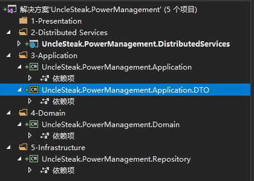

 比较教科书式的架构。

 

# 二、领域层

领域实体

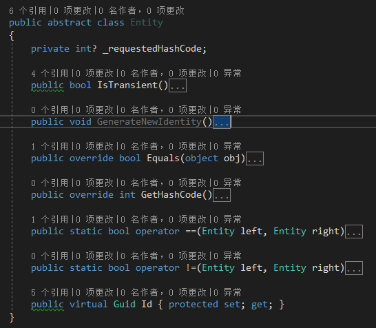

 

值对象

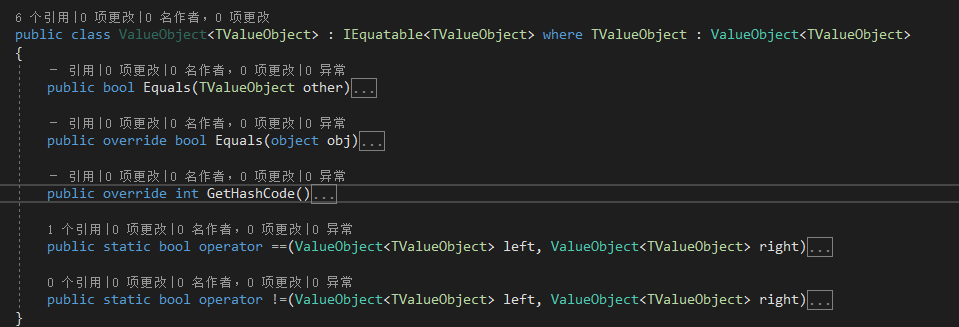

 

规约接口

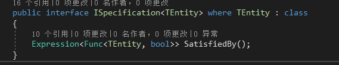

 

工作单元接口

 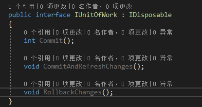

 

仓储接口

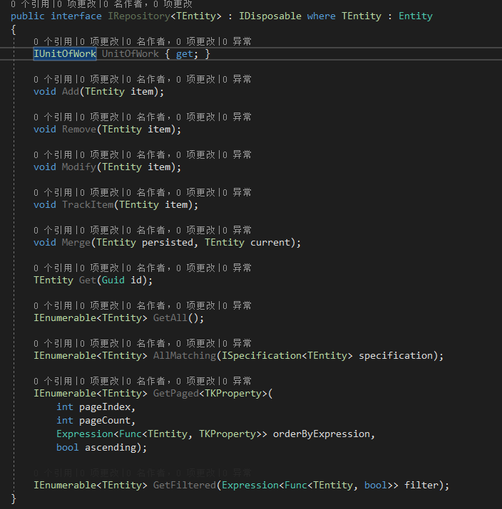

 

聚合跟划分，我们先建立一个简单的用户实体

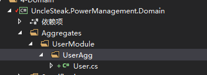

 

#  三、仓储层

引用Microsoft.EntityFrameworkCore.Sqlite

 

工作单元ISql接口

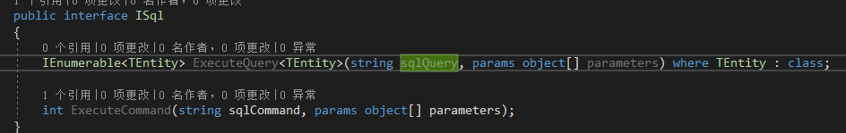

 

 工作单元IQueryableUnitOfWork接口

 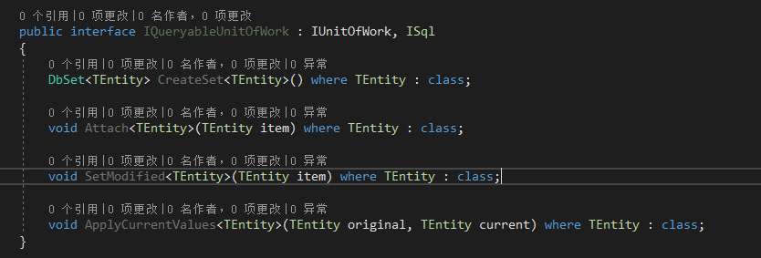

 

 接下来是重点了，构造函数的改变：

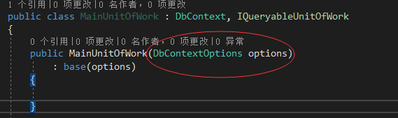

 

OnModelCreating变化：

以前的设置

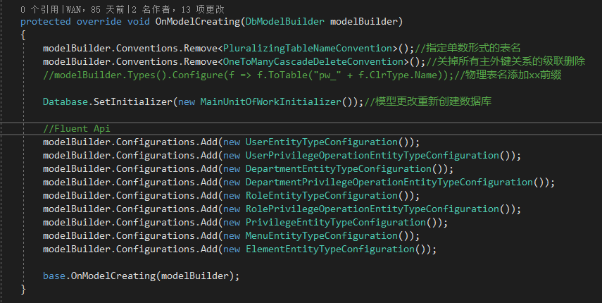

 

 现在ef core里面没有提供这么方便的封装，需要自己去实现

数据库表名更改：

```
public static void SetSimpleUnderscoreTableNameConvention(this ModelBuilder modelBuilder)
{
　　foreach (IMutableEntityType entity in modelBuilder.Model.GetEntityTypes())
　　{
　　　　Regex underscoreRegex = new Regex(@"((?<=.)[A-Z][a-zA-Z]*)|((?<=[a-zA-Z])\d+)");
　　　　entity.Relational().TableName = underscoreRegex.Replace(entity.DisplayName(), @"$1$2").ToLower();
　　}
}
```

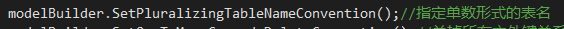

 

关掉所有主外键关系的级联删除

```
public static void SetOneToManyCascadeDeleteConvention(this ModelBuilder modelBuilder)
{
    foreach (var relationship in modelBuilder.Model.GetEntityTypes().SelectMany(e => e.GetForeignKeys()))
    {
        relationship.DeleteBehavior = DeleteBehavior.Restrict;
    }
}
```

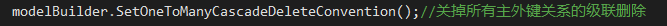

 

Fluent Api 配置

```
public abstract class EntityTypeConfiguration<TEntity> where TEntity : class
{
    public abstract void Map(EntityTypeBuilder<TEntity> builder);
}
public static void AddConfiguration<TEntity>(this ModelBuilder modelBuilder, EntityTypeConfiguration<TEntity> configuration) where TEntity : class
{
    configuration.Map(modelBuilder.Entity<TEntity>());
}
public class UserEntityTypeConfiguration : EntityTypeConfiguration<User>
{
    public override void Map(EntityTypeBuilder<User> builder)
    {
        builder.HasKey(u => u.Id);
    }
}
```

 

使用的时候就这样添加，毫无违和感。

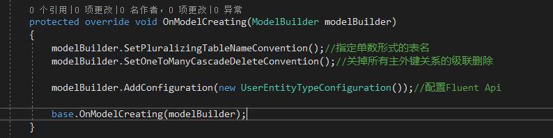

 

Sql查询的方式改变了一下

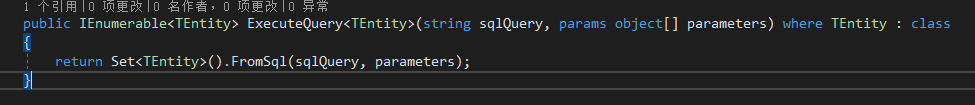

 

User表仓储实现的时候注意一下构造函数的类型，.net core依赖注入的时候会涉及到这里

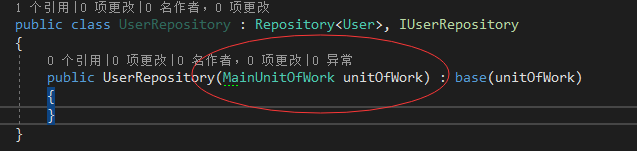

 

# 四、应用层

应用层没什么变化，直接贴代码

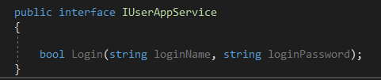

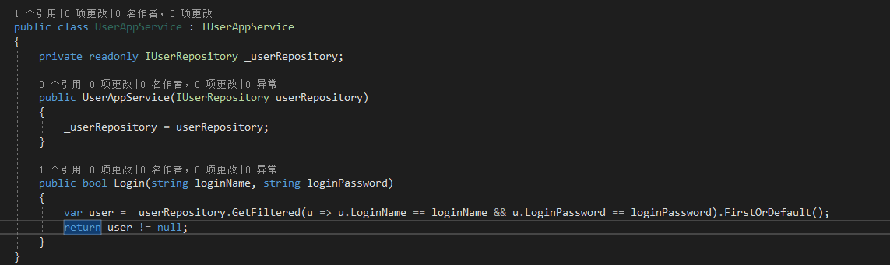

 

# 五、分布式服务层

.net core自带了一个简单的Ioc，所以以前我们用的类似于Unity等框架就可以去掉了

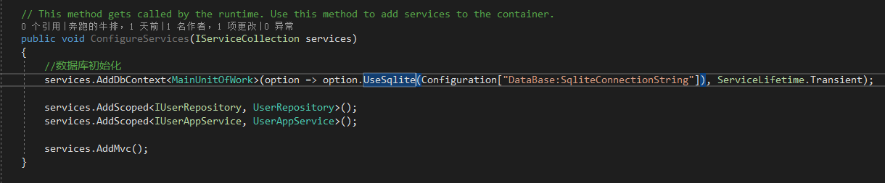

Configuration这个是怎么来的呢？

.net core现在建议采用Json等配置文件，用起来非常爽非常强大

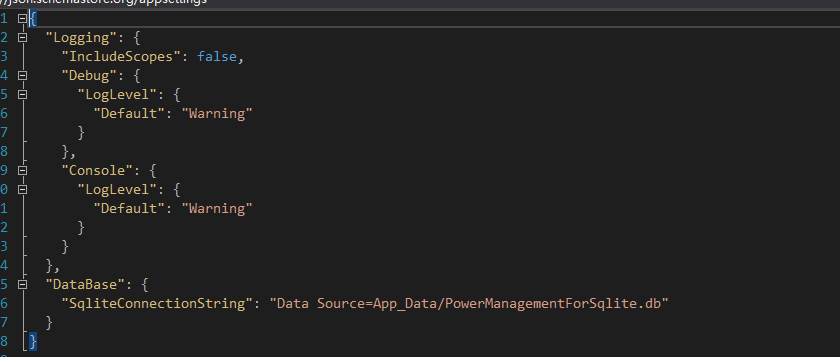

然后我们需要确保存数据库不存在的时候正确创建

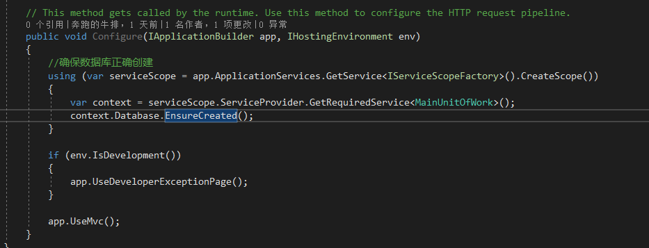

 UserController代码：

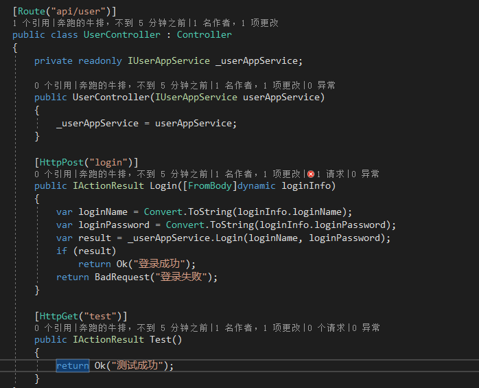

#  六：展示层

WPF界面简单弄一下

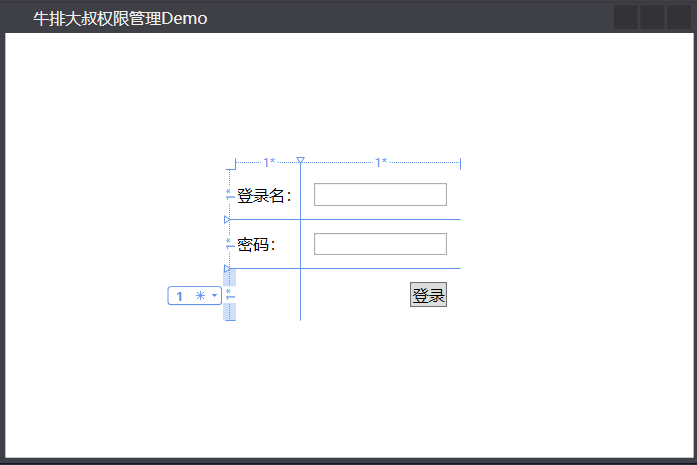

后台代码：

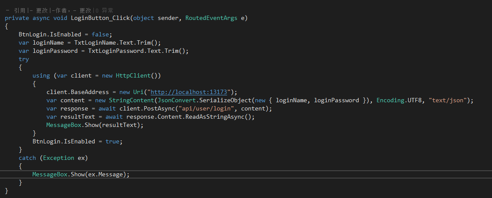

 


posted @ 2017-11-10 11:26 牛排大叔 阅读(1188) 评论(4)  [编辑](https://i.cnblogs.com/EditPosts.aspx?postid=7805853)


 				[.Net和C#介绍](https://www.cnblogs.com/beefsteak/p/5932697.html) 			

摘要: 一、前言  本文主要针对刚入门以及还需要对基础进行恶补一下的兄弟进行基础介绍，并尽可能的做到客观，如有错误也虚心接受高手门的纠正。 二、.Net平台简介  .net即DotNet，首先我先给出微软的定义: "Microsoft.NET 是 Microsoft.NET XML Web Services  平[阅读全文](https://www.cnblogs.com/beefsteak/p/5932697.html)


posted @ 2016-10-05 19:40 牛排大叔 阅读(164) 评论(0)  [编辑](https://i.cnblogs.com/EditPosts.aspx?postid=5932697)


### 公告


昵称：

牛排大叔

园龄：

6年8个月

粉丝：

3

关注：

5

[+加关注](javascript:void(0);)

| [<](javascript:void(0);)2019年5月[>](javascript:void(0);) |      |      |      |      |      |      |
| --------------------------------------------------------- | ---- | ---- | ---- | ---- | ---- | ---- |
| 日                                                        | 一   | 二   | 三   | 四   | 五   | 六   |
| 28                                                        | 29   | 30   | 1    | 2    | 3    | 4    |
| 5                                                         | 6    | 7    | 8    | 9    | 10   | 11   |
| 12                                                        | 13   | 14   | 15   | 16   | 17   | 18   |
| 19                                                        | 20   | 21   | 22   | 23   | 24   | 25   |
| 26                                                        | 27   | 28   | 29   | 30   | 31   | 1    |
| 2                                                         | 3    | 4    | 5    | 6    | 7    | 8    |

### 搜索

 

### 常用链接

- [我的随笔](https://www.cnblogs.com/beefsteak/p/)
- [我的评论](https://www.cnblogs.com/beefsteak/MyComments.html)
- [我的参与](https://www.cnblogs.com/beefsteak/OtherPosts.html)
- [最新评论](https://www.cnblogs.com/beefsteak/RecentComments.html)
- [我的标签](https://www.cnblogs.com/beefsteak/tag/)

### 我的标签

- [.net core](https://www.cnblogs.com/beefsteak/tag/.net%20core/)(1)
- [.net ef core](https://www.cnblogs.com/beefsteak/tag/.net%20ef%20core/)(1)
- [C#](https://www.cnblogs.com/beefsteak/tag/C%23/)(1)
- [程序人生](https://www.cnblogs.com/beefsteak/tag/%E7%A8%8B%E5%BA%8F%E4%BA%BA%E7%94%9F/)(1)
- [领域设计](https://www.cnblogs.com/beefsteak/tag/%E9%A2%86%E5%9F%9F%E8%AE%BE%E8%AE%A1/)(1)

### 随笔分类

- [.Net core(1)](https://www.cnblogs.com/beefsteak/category/1112249.html) 
- [C#(1)](https://www.cnblogs.com/beefsteak/category/890649.html) 
- [编码规范](https://www.cnblogs.com/beefsteak/category/1177601.html) 
- [程序人生](https://www.cnblogs.com/beefsteak/category/890597.html) 

### 随笔档案

- [2017年11月 (1)](https://www.cnblogs.com/beefsteak/archive/2017/11.html) 
- [2016年10月 (1)](https://www.cnblogs.com/beefsteak/archive/2016/10.html) 

### 最新评论

- [1. Re:.net ef core 领域设计代码转换（上篇）](https://www.cnblogs.com/beefsteak/p/7805853.html#3838903)
- 上源码吗？
- --ミ蓝色の雨っ
- [2. Re:.net ef core 领域设计代码转换（上篇）](https://www.cnblogs.com/beefsteak/p/7805853.html#3838365)
- unitofwork 放在具体的仓储中如何实现不同实体的事务控制呢
- --行走即歌
- [3. Re:.net ef core 领域设计代码转换（上篇）](https://www.cnblogs.com/beefsteak/p/7805853.html#3836748)
- @lg460和.net有啥区别啊...
- --遛遛狗
- [4. Re:.net ef core 领域设计代码转换（上篇）](https://www.cnblogs.com/beefsteak/p/7805853.html#3836736)
- 大神 厉害了我的哥
- --lg460

### 阅读排行榜

- [1. .net ef core 领域设计代码转换（上篇）(1188)](https://www.cnblogs.com/beefsteak/p/7805853.html)
- [2. .Net和C#介绍(164)](https://www.cnblogs.com/beefsteak/p/5932697.html)

### 评论排行榜

- [1. .net ef core 领域设计代码转换（上篇）(4)](https://www.cnblogs.com/beefsteak/p/7805853.html)

### 推荐排行榜

- [1. .net ef core 领域设计代码转换（上篇）(4)](https://www.cnblogs.com/beefsteak/p/7805853.html)


 		  Copyright ©2019 牛排大叔 	


# 喜欢请打赏

- [支付宝](javascript:;)
- [微信](javascript:;)

扫描二维码打赏


支付宝打赏

[了解更多](https://github.com/greedying/tctip)