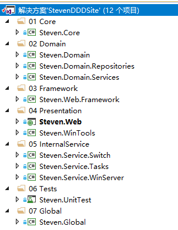

# Asp.Net DDD架构浅谈——整体框架说明

​              

​             [Steven_7](https://www.jianshu.com/u/2b4a7cffa62d)                          

https://www.jianshu.com/p/c9b28468015e

说在前面的话。
 不知不觉，已经写了8年的代码了，从最初的WebForm，到后来的MVC3，一路升级到现在的MVC5；ORM也从之前的ADO.Net，到EntityFramework  Model First，到现在转到Dapper；项目分层也从最简单的三层架构，到现在用DDD。
 技术一直在迭代更新，也会关注.Net  Core，而除了.Net开发，还学会的Android、iOS开发，虽然都不是很精通，但是开发一般的应用都是没问题。但是一路走来，发现很多知识点在慢慢的淡化，所以，2018的目标就是学会写作，把这么多年学到的技术、知识点都通过Blog的形式记录下来，希望能形成一整套的知识点，以此鞭笞自己。

## 解决方案目录

解决方案目录

整个方案分为7个目录

1. Core，主要是全局通用的Utility、Cache、Extensions等类，适用于所有的项目。
2. Domain，领域层，包含仓储Repository，以及复杂逻辑的Service。
3. Framework，为Web服务，Controller的基类，Filter，以及Html和Url的扩展类。
4. Presentation，表现层，比如说Web，网站项目；或者WinTools，一个工具类项目。
5. InternalService，后台服务，开发一些项目会经常需要后台任务，比如说发送邮件，生产统计数据等。
6. Tests，测试项目，目前这块是弱项，还没有实际的测试代码
7. Global，这个是用于存储一些静态的文件，比如SQL。该项目不用编译。

## 开发环境说明

- 采用Visual Studio 2017开发，.Net Framework的版本是4.7.1
- 数据库是MS SQL Server 2012 R2。
- 源码使用Git，项目地址是：[https://github.com/RaulSteven/StevenDDDSite](https://link.jianshu.com?t=https%3A%2F%2Fgithub.com%2FRaulSteven%2FStevenDDDSite) 

## 知识点

发现要写的东西很多，所以先把能写的点都列出来，然后再就每个知识点一步步展开来讲，顺序上也许会有一些混乱，完成所有知识点后会重新书写。

- **领域划分、仓储应用、Services层定义**
- **图片处理，缩略图的处理，是先链接后生成图片，还是先生成图片后链接。**
- **依赖注入，关于Autofac，构造注入以及属性注入**
- **网站配置，如何管理网站的各个配置项**

小礼物走一走，来简书关注我

​                      Asp.Net DDD架构浅谈 

​           © 著作权归作者所有         

​           举报文章         

​             [                ](https://www.jianshu.com/u/2b4a7cffa62d)            

Steven_7

写了 5796 字，被 58 人关注，获得了 66 个喜欢

 

​                                      [                    ](javascript:void((function(s,d,e,r,l,p,t,z,c){var f='http://v.t.sina.com.cn/share/share.php?appkey=1881139527',u=z||d.location,p=['&url=',e(u),'&title=',e(t||d.title),'&source=',e(r),'&sourceUrl=',e(l),'&content=',c||'gb2312','&pic=',e(p||'')].join('');function a(){if(!window.open([f,p].join(''),'mb',['toolbar=0,status=0,resizable=1,width=440,height=430,left=',(s.width-440)/2,',top=',(s.height-430)/2].join('')))u.href=[f,p].join('');};if(/Firefox/.test(navigator.userAgent))setTimeout(a,0);else a();})(screen,document,encodeURIComponent,'','','', '推荐 Steven_7 的文章《Asp.Net DDD架构浅谈——整体框架说明》（ 分享自 @简书 ）','https://www.jianshu.com/p/c9b28468015e?utm_campaign=maleskine&utm_content=note&utm_medium=reader_share&utm_source=weibo','页面编码gb2312|utf-8默认gb2312'));)                                                   [更多分享](javascript:void(0);)       

   

7条评论

只看作者

按时间倒序按时间正序

  

 

CoCoCode

6楼 · 2018.07.01 10:00

<http://study.163.com/course/courseMain.htm?courseId=1005643030&>;share=2&shareId=400000000535035  感觉这个DDD框架讲得很不错，也很实用，推荐给大家