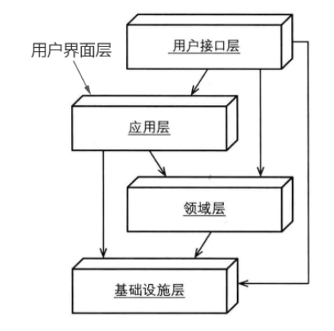

# [.Net Core + DDD基础分层 + 项目基本框架 + 个人总结](https://www.cnblogs.com/lifeng618/p/9649363.html)

https://www.cnblogs.com/lifeng618/p/9649363.html

https://github.com/Fengddd/ProjectNetCore.git

**阅读目录**

- [为什么要写这篇文章](https://www.cnblogs.com/lifeng618/p/9649363.html#_label0)
- [项目基础分层](https://www.cnblogs.com/lifeng618/p/9649363.html#_label1)
- [基础设施层](https://www.cnblogs.com/lifeng618/p/9649363.html#_label2)
- [应用层](https://www.cnblogs.com/lifeng618/p/9649363.html#_label3)
- [   领域层](https://www.cnblogs.com/lifeng618/p/9649363.html#_label4)
- [展现层](https://www.cnblogs.com/lifeng618/p/9649363.html#_label5)
- [简单的单元测试](https://www.cnblogs.com/lifeng618/p/9649363.html#_label6)
- [学习的方向，以及目标](https://www.cnblogs.com/lifeng618/p/9649363.html#_label7)
- [项目源码地址](https://www.cnblogs.com/lifeng618/p/9649363.html#_label8)

[回到顶部](https://www.cnblogs.com/lifeng618/p/9649363.html#_labelTop)

### 为什么要写这篇文章

1，在大半年前，公司开发任务比较轻松，自己不知道干什么，但是又想要学习技术，比较迷茫，后面我接触到了博客园，看了一个帖子，深有感触，我当时不知道学习什么，于是我信息给他，他居然回复我了，并且还给我建议学习的方向，以及学习的方法，我十分的感谢他。
 2，在一次面试中，有人问我，你工作1年多了有没有做过自我总结，你觉得你的优势是什么，我当时吞吞吐吐的回答了，内心十分的慌张,在此补上总结。
 3，学习了一段时间.Net Core了，记忆力比较差，记录下来，为以后用时做准备。
 

[回到顶部](https://www.cnblogs.com/lifeng618/p/9649363.html#_labelTop)

### 项目基础分层

在学习DDD的分层知识，现在的代码里面只运用了一些DDD战术设计的知识，现在这样分层为了以后知识积累够了，在上面完善，目前的技术很菜，结合网上以及使用的理解写出自己使用过或者能理解部分。
  

[回到顶部](https://www.cnblogs.com/lifeng618/p/9649363.html#_labelTop)

### 基础设施层

基础设施层使用的相关知识：Code First ，EF Core，Autofac依赖注入，仓储模式的实现接口，领域服务的实现接口，缓存，以及各种基础工具类
 一，Code First：使用Code First 数据迁移到数据库。
 常用的数据库迁移命令： Add-Migration 迁移名 —— 添加本次迁移 Update-Database——将本次迁移到数据库  Add-Migration InitialCreate -IgnoreChanges -—— 创建一次空的数据迁移：已现在版本为起始点

二，EF Core ：软删除 ——全局过滤删除的状态，AsNoTracking() ——不持久化到数据库时的查询使用  Any——查询判断使用Any ,Z.EntityFramework.Plus-——批量修改，删除，增删改查，简单封装异步 Anysnc  Await 方法

三，工具类，例如MD5，AutoMapperHelper，LamdaHelper，RedisHelper简单应用，读取配置文件,统一返回参数等。

四，Redis缓存，多种数据类型，查询，插入效率高，Redis与数据库同步策略，先更新数据库在删除缓存，延时双删，（延时，根据数据查询的数据来判断延时的时间），使用StackExchange.Redis
 

[回到顶部](https://www.cnblogs.com/lifeng618/p/9649363.html#_labelTop)

### 应用层

应用层使用的相关知识：AutoMapper，Dto，Autofac依赖注入

一，Dto：数据传输对象，主要是展现层和应用层传输数据

二，AutoMapper：对象之间传输数据，先使用仓储查询出数据，然后通过AutoMapper转换成前端需要的数据返回

[回到顶部](https://www.cnblogs.com/lifeng618/p/9649363.html#_labelTop)

###    领域层

领域层使用的相关知识：实体，值对象，领域服务接口，仓储接口，聚合，Autofac依赖注入
 一，实体：有唯一的标识（唯一，不可变），包含业务逻辑，以及自身的验证，构造函数实例化，实体的Set应设置为私有的

二，值对象：没有唯一的标识，用来描述一个东西的特征，代表是什么

三，聚合：聚合根是实体，聚合是对象的组合，由聚合本身维护自身的一致性，封装业务逻辑，聚合尽量小，聚合之间通过唯一标识引用

四，仓储：仓储是针对聚合的，封装领域逻辑，明确查询的意图，仓储中只维护聚合的状态，不进行持久化，仓储可以方便单元测试，更换ORM

五，领域服务：，领域服务是无状态的，有些业务逻辑不好放在聚合里面的可以使用领域服务，多个聚合根协调，领域服务中可以使用仓储

六，Autofac依赖注入：有利于项目层与层之间的解耦，方便单元测试，构造函数注入，依赖倒置，通过约定进行程序集的注入

[回到顶部](https://www.cnblogs.com/lifeng618/p/9649363.html#_labelTop)

### 展现层

一，展现层使用的相关知识：.Net Core WebApi ,MVC,JWT Swagger,日志异常的捕捉，模型的验证，Log4Net，Autofac依赖注入，过滤器

二，JWT：JWT包含了使用.分隔的三部分： Header 头部 Payload 负载 Signature 签名，在前端每次请求加上JWT 签发的Token 来替代Session，进行访问页面的验证

三，Swagger：可以使用Swagger来请求WebApi ，以及查看WebApi 接口，Swagger可以做接口文档

四，Log4Net：日志异常的全局捕捉，记录日志到TXT中

五，过滤器：使用过滤器来进行模型的验证 ，Log4Net的日志异常的全局捕捉，以及权限的访问

[回到顶部](https://www.cnblogs.com/lifeng618/p/9649363.html#_labelTop)

### 简单的单元测试

单元测试使用的相关知识：Xunit，Autofac依赖注入

[回到顶部](https://www.cnblogs.com/lifeng618/p/9649363.html#_labelTop)

### 学习的方向，以及目标

谢谢蟋蟀大哥的几句指导，学习.Net Core 开阔了我的视野，才了解到DDD，ABP，以及上面的技术，虽然我的技术还很菜，许多技术以及基础知识都不太牢固，但是我还会继续学习，谢谢博客园里面每一位技术分享者。
 一，方向：学习Redis ，消息队列, 读写分离，DDD ，业务分析能力, ABP

二，目标：明年成为一个中级的程序员
 

[回到顶部](https://www.cnblogs.com/lifeng618/p/9649363.html#_labelTop)

### 项目源码地址

<https://github.com/Fengddd/ProjectNetCore.git>

标签: [.Net Core](https://www.cnblogs.com/lifeng618/tag/.Net Core/), [DDD基础分层](https://www.cnblogs.com/lifeng618/tag/DDD基础分层/), [WebAPI](https://www.cnblogs.com/lifeng618/tag/WebAPI/), [基础框架](https://www.cnblogs.com/lifeng618/tag/基础框架/)