#  			[.NET领域驱动设计—看DDD是如何运用设计模式颠覆传统架构](https://www.cnblogs.com/wangiqngpei557/p/3266110.html)

阅读目录：

- 1.开篇介绍
- 2.简单了解缘由（本文的前期事宜）
- 3.DomainModel扩展性（运用设计模式设计模型变化点）
  - 3.1.模型扩展性
  - 3.2.设计模式的使用（苦心专研的设计模式、设计思想可以随意使用了）
  - 3.3.部分类的使用（封装内部对象）
  - 3.4.高强度的OO设计（面向特定领域的高度抽象设计形成特定领域框架）
- 4.DomainModel业务逻辑规则配置（将扩展点分离后使用适当的配置将规则IOC进去）
- 5.DDD简单总结（DDD是什么？它是“战术”） 

# 1】开篇介绍

这篇文章不会太长，但是绝对让你对DDD有一个比较直观的认可；

这篇文章所讲到的内容虽然不多但是不太容易被领悟（因为多数人对DDD的理解还是存在很大误区的；），当然也不是多么神奇的东西，只不过是本人最近一直研究DDD的成果一个小小的心得与大家分享一下；本文讲的这些设计方式本身就存在着很大优势，你会发现它与传统三层架构最明显的区别，这也是最有经典优势的地方，最有价值的地方；

> 本来这篇文章是“[[置顶\].](http://www.cnblogs.com/wangiqngpei557/p/3163985.html)[NET领域驱动设计—实践(穿过迷雾走向光明)](http://www.cnblogs.com/wangiqngpei557/p/3163985.html)”一文的一部分但是由于时间关系，完整的示例并没有跟文章同步发布，说实话时间太紧，写示例的目的是想全面的且细致的阐述DDD的分析、设计各个环节的最佳实践；原本想将文章的示例做好后在发布，但是由于工作关系和一些私人原因可能有一段时间不更新博客，又不想这篇文章拖的太久，所以我总结了两点比较有价值的地方分享给大家，目的不是让大家能会使用DDD来设计系统，而是能有一个突破点来衡量DDD到底比传统三层好在哪里，因为大部分人还没有DDD的开发经验所以能体会到应该没有相关途径；

网上很多的DDD文章有的还很不错，但是本人也是从对DDD一窍不通再到目前对DDD有一个整体的了解，觉得最大的问题是让能没有接触DDD的朋友能最贴切的体会到DDD到底哪里好，而不是一上来就大片的理论还一些UML模型图；其实完整的示例也只有这两点最有价值了，因为它是DDD所强调的中心；

# 2】.简单了解缘由（本文的前期事宜）

开始本文下面的章节之前先来了解一下我们将要做什么设计，我假设您没有时间阅读“[[置顶\].](http://www.cnblogs.com/wangiqngpei557/p/3163985.html)[NET领域驱动设计—实践(穿过迷雾走向光明)](http://www.cnblogs.com/wangiqngpei557/p/3163985.html)”一文，比较文章也有点长了，所以这里简单介绍一下连续性的内容；

这篇文章我们将运用两个常规的框架设计方法来对核心的业务进行细粒度的分解设计，在以往这点很难实现，所以我为什么要说框架的设计思想，因为我们对设计模式的运用主要在框架、组件这些非业务需求性的基础设施上；那么这里我们将用这些强大的武器来对最难对付的业务扩展性的设计；

本文全部的业务其实是一个简单的学习考试系统的背景，我们下面将要运用强大的设计能力来对**【Employee】**聚合进行细粒度的设计、配置；之前的设计已经全部结束，数据持久化也设计完成，就剩下编码阶段；编码的最大挑战就在于前期的相关接口的设计，这里是细粒度的接口设计，不是简单的分分层；

图1：

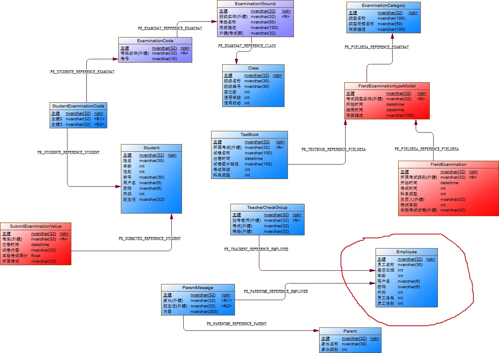

[(查看大图)](https://images0.cnblogs.com/blog/202205/201308/18160141-059b20ac02c64632bee1ee7d2a11ab23.jpg)

上图中我用红圈标记出我们下面要扩展的【Employee】聚合，在将模型落实到代码后我们将要通过规约模式来将【Employee】的验证对象化，然后通过设计模式的策略模式将规则策略化，再通过Configuraion  Manager来管理所有的业务规则的配置，这个时候IOC就派上用场了，一切都很顺手；传统三层你是无法做到的；

请看下面【Employee】实体类代码：

  View Code 

【Employee】聚合跟一般的聚合没多大区别，比较简单的结构，为了看起来完整一点，我加入了两个初始化的行为；ReSwitch是用来启用、关闭当前账户；

Reinitial是初始化当前【Employee】的初始默认密码，完全是演示而用；

那么我们下面要做什么呢？在以【Employee】为聚合根里面我们聚合了【ParentMessage】家长留言、【TeacherCheckGroup】站考，两个集合，其实这是用来做导航属性的；实体框架需要这些信息做实体导航使用，在设计的时候你需要权衡你需要多少这样的关联；

现在经过我们对需求的深入分析之后可能会存在这样的变动情况：

*【Parent家长】向【Employee教师】【留言】后，教师需要对留言内容做出反馈，比如要【及时的回复】，对于不同的【留言级别】需要给出不同的处理；*

这个需求很简单，但是它里面透露出来的是什么？设计的扩展性，这个扩展性在哪里？对于不同的【留言级别】需要给出不同的【处理】，很显然是一个可能随时会变化的点；

【Employee_Priority】代码：

  View Code 

有一个Priority属性，是标记该留言的紧急情况，看代码：

  View Code 

有两种级别，Normal表示普通的，Pressing表示紧急的，对于紧急的肯定是需要先处理的，而且处理的逻辑或多或少有点不同；在DDD中所有的业务逻辑都要在DomainModel  Layer  中处理，这是原则；所有的逻辑都不是直接使用，比如在登录的时候我们通常是验证用户名密码是否真确，但是通常还会有很多其他的条件，比如说当前用户是否是高级会员、是否欠费等等，这些都是在聚合规约工厂中统一获取的，这就便于我们将变化的点抽到专门的地方进行设计；

> 逻辑判断的地方原则是不直接写IF\ELSE，逻辑处理地方原则是不直接写实现代码，通过接口实现策略类；

图2：

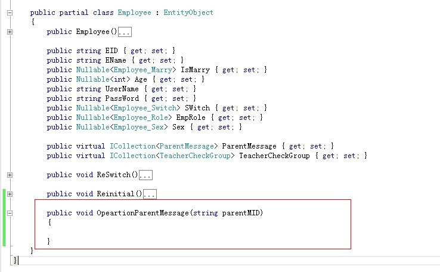

我们在【Employee】中加入了一个对【ParentMessage】实体的处理；由于我们的DomainModel通常不是直接持久化在MemberCache中的，所以对于有UI交互的操作都无法很好的进行实体直接使用，如果是自动化的操作这里的方法就不需要任何参数，每次都需要将留言的ID带过来，然后我们再进行内部的查找；当然这里还可以在Application  Layer 就把【ParentMessage】实例拿到穿进来也可以；

其实这个时候已经开始将进行细粒度的设计了，我们看一下DomainModel结构；

图3：

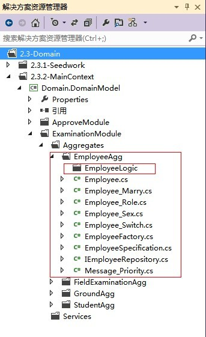

如果是数据库驱动，我们是无法提取出【Employee】的相关对象的，一些状态也只是数字表示而已缺乏OO思想，也就谈不上面向对象的设计了；这里最让人欣喜诺狂的是我们已经完全可以将【Employee】相关的逻辑进行细粒度的扩展性设计了，这里我们将把所有跟【Employee】相关的所有业务逻辑都放入专门EmployeeLogic目录中；这样的好处真的很多，跟我们最相关的就是项目的任务分配，这样设计完成后就完全可以将某些逻辑抽象出来接口分配给某人去实现；

这一节主要就是介绍一下相关的背景，下面我们就要将对【Employee】处理【ParentMesssage】的业务逻辑进行高度的分析、设计、配置化；

# 3】DomainModel扩展性（运用设计模式设计模型变化点）

模型扩展性是一个一直被我们关注无数次提起的焦点，对它的把握始终未能实现；传统分层架构将所有的业务逻辑洒满每个层面，从UI层到数据库都有多多少少的业务逻辑，而不是各负其责，管好自己分类的事情；UI层主要负责自己的样子好看，不要这里弄脏了那里弄脏了；数据库应该管好数据的存储，数据的优化等等，两者都没有权利去管业务逻辑的权利；

这里我们将要通过设计模式将对可能存在变化的业务逻辑抽象出来进行设计；

## 3.1】模型扩展性

在上面的介绍总我们大概了解了需求，下面我们要通过对【ParentMessage】的Priority属性进行判断，因为这两种优先级对于业务逻辑处理是不同的，但是可能会存在着相同的逻辑，这就完全符合我们的OOA、OOP的中心了，我们可以进行强大的**抽象**、**继承**来处理，这也是我们OO应该管理的范围，UI\数据库都不具备这样的能力；

> *可以将DDD与UI、数据库打个比方：*
>
> *UI：我没有什么事情，分点业务给我处理吧；*
>
> *数据库：我很强大，所有的数据都在我的管理范围之内，我想怎么处理就怎么处理，我天下第一；*
>
> *DDD说：各位兄弟，要么从一开始的时候就听我的，要不然后面出了什么事，我管不了你们了；——王清培；*

设计模式很强大，能处理当前业务问题的有很多模式可以选择，这里我们使用常用的*“策略模式”*来解决不同Priority的逻辑；

## 3.2】设计模式的使用（苦心专研的设计模式、设计思想可以随意使用了）

设计模式的强大不需要我再来废话了，大家都懂；那么这里我们需要将逻辑的处理抽出来放入专门的逻辑处理类中去，这也符合向扩展开放向修改封闭原则；

将逻辑的处理独立出去，跟DomainModel之间存在着一个带有阴影的重贴关系，虽然逻辑处理类相对独立当时它毕竟还是处于领域类的东西；将业务逻辑完全的封闭在领域层中，但是在这个层中不是胡子眉毛一把抓，还是需要就具体的业务进行细粒度的分析、设计，对架构师来说是一个不小的挑战，因为大部分的架构师比较关注纯技术的东西，对业务的分析设计缺乏经验和兴趣；

我们来看一下对Priority的处理简单设计：

图4：

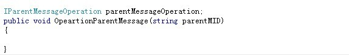

最理想的设计就是面向接口，【Employee】实体不会依赖哪一个具体的实现类；

图5：

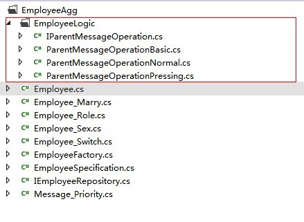

我们对Priority的处理逻辑抽象出来了相关的策略接口**IParentMessageOperation**，该接口有两个接口分别用来处理不同优先级的具体业务逻辑；***ParentMessageOperationNormal***是处理Priority为Normal的逻辑，***ParentMessageOperationPressing***是处理Priority为Pressing的逻辑，当然为了后面考虑我又加了一个**abstract calss ParentMessageOperationBasic** 做一些相同逻辑的抽象；

> 一个简单的Priority的逻辑都可以这样去设计，我想再复杂的业务只要业务分析好，这里的设计是不会有问题；到目前为止我都在为DDD的强大敢到震惊，我不相信你没有看出来它能把多么复杂的问题简单化，以往是绝对不可能完成这样的设计的，至少我从来没看见过也没听过谁能在传统三层架构下把复杂的业务系统设计的很灵活，而且又不会污染UI、数据库；

有策略接口那么我们还得把相应的实现类给绑上去，这里有两种方式，第一种使用简单接口直接判断然后创建策略实现，第二种是使用IOC的方式动态的注入进来，当然这里已经到了我们大家都比较擅长的范围了，每个人的设计思想不同就不多废话了； 

图6：

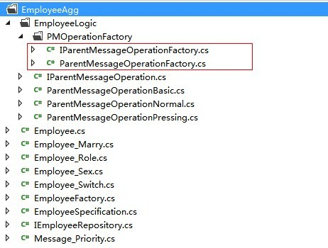

看着这样的结构，我没有理解再说DDD不优雅；到了这里已经很清晰了，我们使用**IParentMessageOperationFactory**创建***IParentMessageOperation***，具体的逻辑封装在以**IParentMessageOperation**接口为主的实现类中； 

图7：

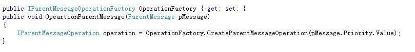

我们通过IParentMessageOperationFactory创建IParentMessageOperation实现，是不是很清爽； 

图8：

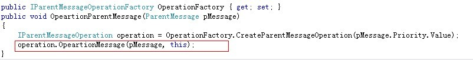

这里的代码几乎是不会随着业务的变化而变化，要变化的是在逻辑处理里面； 

图9：

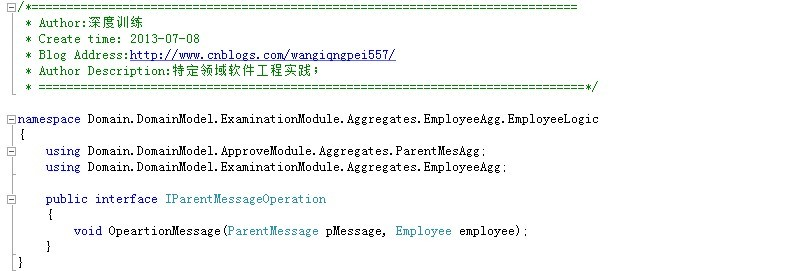

接口的处理逻辑方法，很简单约定一个【ParentMessage】、【Employee】两个实体，这里需要注意平衡实体之间的关联性； 

图10：

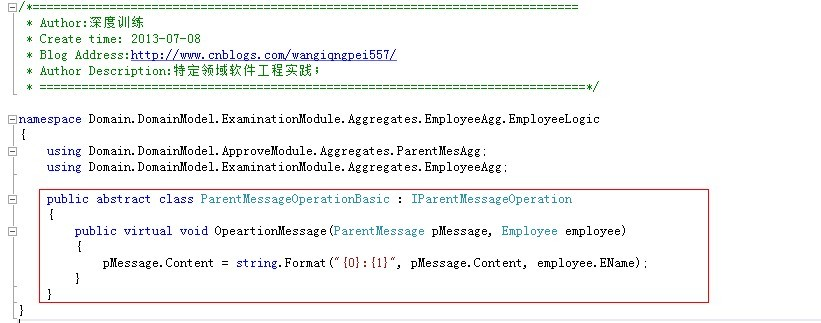

通过基类可以抽象点公共的逻辑，这里是为了演示而用；其实到了这一步大家都知道怎么来进行设计了，关键是要分析好业务，然后得出深层领域模型，在此基础上进行设计才是靠谱的，不要为了设计而设计，不要陷入技术的困境； 

图11：

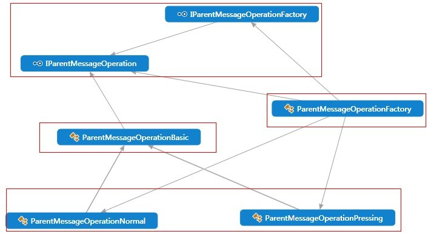

该图是我们对priority相关逻辑的设计，顶层是两个接口，右边是一个Factory实现，左边是Operation的继承树，还是比较简单的；

## 3.3】部分类的使用（封装内部对象）

在很多时候我们的设计需要借助部分类来规划对象的关系，以免污染其他的实体；比如这里的【Employee】需要在内部使用一个特定的类型，那么最好是放在【Employee】内部使用，不要暴露在外面；这点在逻辑处理中进行设计比较合理；

图12:

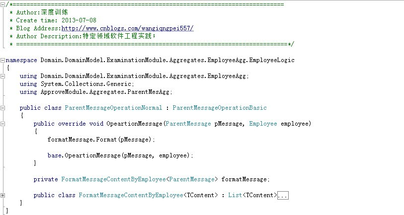

内部类再配合泛型一起用将发挥很大的设计奇效，这里就不扯了；

## 3.4】高强度的OO设计（面向特定领域的高度抽象设计形成特定领域框架）

从上面的3.3】节中我们能体会到，对于特定领域的抽象其实是可行的，也就是说最终会形成强大的面向特定领域的框架、组件，但是这样的框架是不通用的，也就是当前领域模型才能使用，这对于一般的项目而言确实成本很大，得不偿失；然后对于需要长期维护的项目、产品、电子商务平台值得投入，长期重构得出内聚性很强的领域框架；

图13：

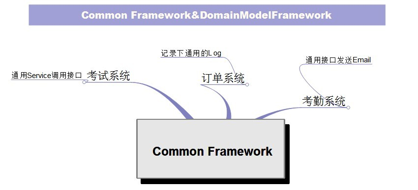

如果你一个框架做通用性的功能，只能做到泛泛而已，无法深入到业务内部；

图14：

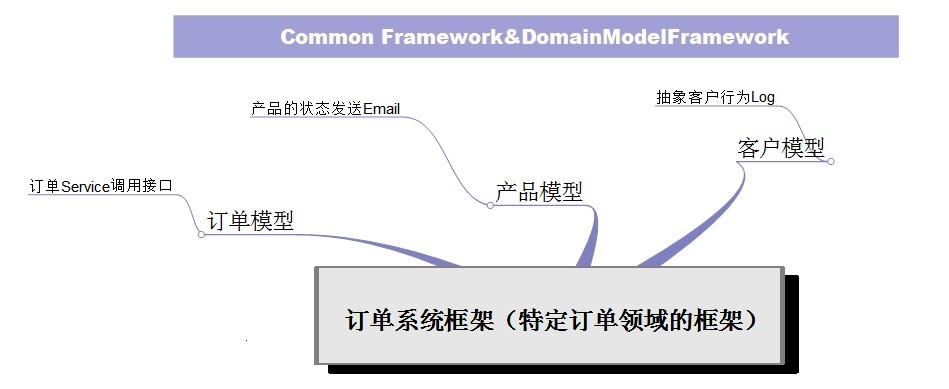

其实就是将精力集中在特定领域而已，逐渐重构出特定领域的框架；

# 4】DomainModel业务逻辑规则配置（将扩展点分离后使用适当的配置将规则IOC进来）

其实到了这里，再说将业务逻辑配置化已经不是什么大问题了，只需要将上面的***IParentMessageOperation***实现类通过IOC的方式配置好；但是这个配置的策略需要结合业务来判断，可能存在多维度的判断才能最终确定使用哪一个实现类，扯远点如果后面配合C#4.0的元编程其实真的可以实现运行时配置逻辑策略了，但是目前来看不是很成熟；我们只有先将所有的业务逻辑实现好，然后根据业务需要进行后台配置；

比如系统的后台管理自动检测是否是休息天，如果是休息天那么对于【Employee】就没有权利去执行【ParentMessage】的处理，是不是很简单？当然很多好的设计可以慢慢的搬到系统中来，前提是*“特定领域重构—特定领域框架设计”*，这个度好把握好；

# 5】DDD简单总结（DDD是什么？它是“战术”）

最近园子里讨论.NET技术值钱不值钱的文章很火，其实不管是.NET还是\JAVA都是工具，战斗的工具，必须具备一定的战略设计才能让他们彼此发挥具体的作用；可以把DDD比喻成孙子兵法，.NET只是打仗时的一个工具，JAVA也是如此，Python、ruby等等，关键是设计思想、战略；所以我们长期培养的是设计能力，适当的熟悉某一种技术平台，以不变应万变；JAVA在牛逼，不懂企业架构一样是垃圾，.NET再牛逼，不懂设计模式一样玩不转；

所有的技术框架都有其优缺点，我们只有先进行总体的设计、规划，然后在适当的位置使用适当的技术，这个技术在这个方面比较擅长，那么就把它安排在这个位置；.NET优势在开发速度、UI上，那么就用来进行前台部分的开发；JAVA可能在大数据、分布式后端有优势，那么用来做服务器开发，搜索引擎；Ruby是动态语言，可以用来实现复杂的业务动态配置，集众家之所长来完成一次大型的战役，没有谁离开谁转不了，没有谁比谁更重要，在一次战斗中连火头军都是不能少的，杨门女将中的杨排风谁看小看它，唯有军师不能糊涂；谢谢；

示例DEMO代码(领域模型)：<http://files.cnblogs.com/wangiqngpei557/Domain.DomainModel.zip>

 

作者：[王清培](http://www.cnblogs.com/wangiqngpei557/)

出处：<http://www.cnblogs.com/wangiqngpei557/>

本文版权归作者和博客园共有，欢迎转载，但未经作者同意必须保留此段声明，且在文章页面明显位置给出原文连接，否则保留追究法律责任的权利。

分类: [ddd](https://www.cnblogs.com/wangiqngpei557/category/495385.html),[企业架构、设计模式](https://www.cnblogs.com/wangiqngpei557/category/349962.html)

标签: [.NETDesign](https://www.cnblogs.com/wangiqngpei557/tag/.NETDesign/), [企业架构、设计模式](https://www.cnblogs.com/wangiqngpei557/tag/企业架构、设计模式/), [系统架构设计、DDD、TDD](https://www.cnblogs.com/wangiqngpei557/tag/系统架构设计、DDD、TDD/), [应用框架设计](https://www.cnblogs.com/wangiqngpei557/tag/应用框架设计/)

​         [好文要顶](javascript:void(0);)             [已关注](javascript:void(0);)     [收藏该文](javascript:void(0);)     ;)     ;) 

​             [王清培](http://home.cnblogs.com/u/wangiqngpei557/)
​             [关注 - 121](http://home.cnblogs.com/u/wangiqngpei557/followees)
​             [粉丝 - 2789](http://home.cnblogs.com/u/wangiqngpei557/followers)         

荣誉：[推荐博客](http://www.cnblogs.com/expert/)

​                 我在关注他 [取消关注](javascript:void(0);)     

​         15     

​         1     

​     

[« ](https://www.cnblogs.com/wangiqngpei557/p/3251637.html) 上一篇：[.NET框架设计(高级框架架构模式)—钝化程序、逻辑冻结、冻结程序的延续、瞬间转移](https://www.cnblogs.com/wangiqngpei557/p/3251637.html)
[» ](https://www.cnblogs.com/wangiqngpei557/p/3280687.html) 下一篇：[.NET项目开发—浅谈面向接口编程、可测试性、单元测试、迭代重构（项目小结）](https://www.cnblogs.com/wangiqngpei557/p/3280687.html)