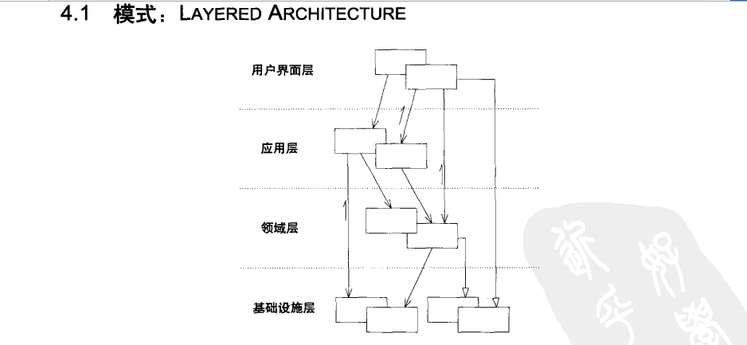
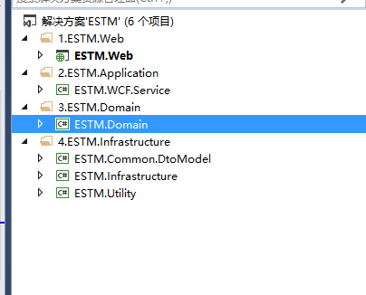
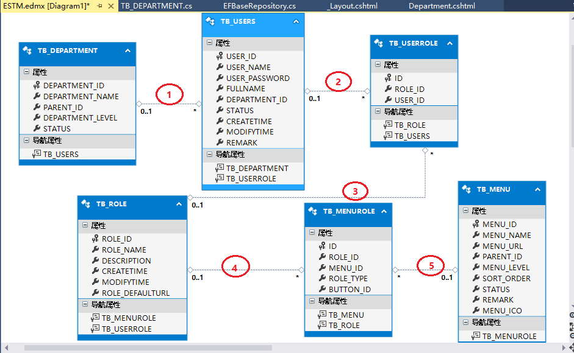
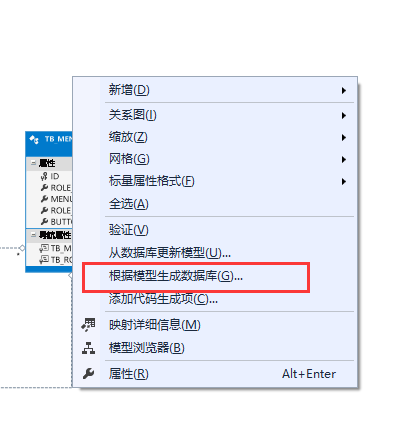
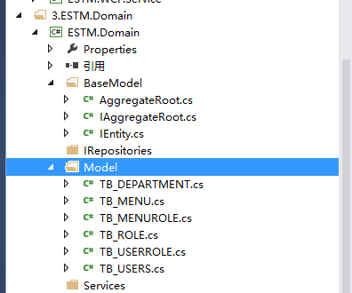

# DDD领域驱动设计初探（1）：聚合

http://blog.jobbole.com/99298/

​              2016/04/06 ·  [开发](http://blog.jobbole.com/category/programmer/)                                                      ·  [.Net](http://blog.jobbole.com/tag/net/), [DDD](http://blog.jobbole.com/tag/ddd/)              

原文出处： [懒得安分](http://www.cnblogs.com/landeanfen/p/4816706.html)   

前言：又有差不多半个月没写点什么了，感觉这样很对不起自己似的。今天看到一篇博文里面写道：越是忙人越有时间写博客。呵呵，似乎有点道理，博主为了证明自己也是忙人，这不就来学习下DDD这么一个听上去高大上的东西。前面介绍了下MEF和AOP的相关知识，后面打算分享Automapper、仓储模式、WCF等东西的，可是每次准备动手写点什么的时候，就被要写的Demo难住了，比如仓储模式，使用过它的朋友应该知道，如果你的项目不是按照DDD的架构而引入仓储的设计，那么会让它变得很“鸡肋”，用不好就会十分痛苦，博主的项目中也遇到类似的问题，虽然引入了仓储模式，但是由于没有架构好，把仓储的接口和实现统一放在了数据访问层，导致到后面代码越写越难维护，完全感觉不到仓储带来的好处。所以博主觉得单纯分享仓储模式很容易使读者陷入“为了模式而模式”的误区，再加上最近一段时间在看《领域驱动设计：软件核心复杂性应对之道.Eric.Eva》这本书和博客园大牛dax.net的DDD系列文章，所以打算分享一个Demo来说明仓储模式、Automapper、WCF等知识点。

## 一、领域驱动设计基本概念

根据《领域驱动设计：软件核心复杂性应对之道.Eric.Eva》书中的观点，领域模型是软件项目的公共语言的核心，是领域专家和开发人员共同遵守的通用语言规则，那么在DDD里面，建模的重要性不用多说，所以要想更好理解领域驱动设计，理解领域模型的划分和建立就变得相当必要。首先来看看DDD里面几个比较重要的概念：

1、领域模型：**领域模型与数据模型不同，它表述的是领域中各个类及其之间的关系**。从领域驱动设计的角度看，数据库只不过是存储实体的一个外部机制，是属于技术层面的东西。数据模型主要用于描述领域模型对象的持久化方式，应该是先有领域模型，才有数据模型，领域模型需要通过某种映射而产生相应的数据模型，从这点来说，最新的EF的Code  First就是一个很好的体现。领域模型对象分为实体、值对象和服务。

2、实体：在领域驱动设计里面，实体是模型中需要区分个体的对象。这里的实体和EntityFramework里面的实体不是一个概念，EF的实体为数据实体，不包含对象的行为。就博主的理解，**DDD概念里面的实体就是包括实体数据(EF的Model)和行为的结合体**。

3、值对象：通过对象属性值来识别的对象，它将多个相关属性组合为一个概念整体。相比实体而言，值对象仅仅是比实体少了一个标识。值对象的设计比较存在争议，我们暂且记住值对象和实体的区别：（1）实体拥有唯一标识，而值对象没有；（2）实体允许变化，而值对象不允许变化；（3）判断两个实体相等的方法是判断实体的标识相等，而判断两个值对象相等的标准是值对象内部所有属性值相等；

4、聚合（以及聚合根）：聚合表示一组领域对象(包括实体和值对象)，用来表述一个完整的领域概念。而每个聚合都有一个根实体，这个根实体又叫做聚合根。举个简单的例子，一个电脑包含硬盘、CPU、内存条等，这一个组合就是一个聚合，而电脑就是这个组合的聚合根。博主觉得关于聚合的划分学问还是挺大的，需要在实践中慢慢积累。同一个实体，在不同的聚合中，它可能是聚合根，也可能不是，需要根据实际的业务决定。**聚合根是聚合所表述的领域概念的主体，外部对象需要访问聚合内的实体时，只能通过聚合根进行访问，而不能直接访问**。

5、领域服务：博主的理解，领域模型主张富领域模式，也就是说把领域逻辑尽量写在领域实体里面，也就是常说的“充血模式”，而对于业务逻辑，最好是以服务的形式提供。至于领域逻辑和业务逻辑的界定，这个要根据实际情况来定。总之，领域服务是用来处理那些领域模型里面不好定义或者某些可变逻辑的的时候才会用到。待验证！

6、工厂、仓储等概念留在Demo里面说明。

 

## 二、领域驱动设计开始之旅

### 1、项目分层

领域驱动设计将软件系统分为四层：基础结构层、领域层、应用层和表现层。来看看书中的分层：

其实在dax.net的系列中这张图更能说明这种架构

 

### 2、项目架构

博主打算用权限系统的案例说明的领域驱动设计的项目架构。项目严格按照表现层、应用层、领域层、基础设施层来划分。

表现层：MVC的Web项目，负责UI呈现。

应用层：WCF服务，负责协调领域层的调用，向UI层提供需要的接口。

领域层：定义领域实体和领域逻辑。

基础设施层：一些通用的技术，比如AOP、MEF注入、通用的工具类、DTO模型层，这里为什么要有一个DTO模型层，DTO是用于UI展现用的纯数据Model，它不包含实体行为，是一种贫血的模型。

整个项目的调用方式严格按照DDD设计来进行，UI层通过WCF服务调用应用层的WCF接口，WCF服务通过仓储调用领域层里面的接口，基础设施层贯穿其他各层，在需要的项目中都可以引用基础设施层里面的内库。

 

### 3、代码示例

接下来，博主就根据自己的理解，从零开始使用这种架构写一个简单的权限管理系统。由于是领域驱动设计，所以，文章的重点会放在领域层，项目使用了EF的Model First来进行，先设计实体，后生成数据库。

#### 3.1 首先来看看表结构

根据博友要求，这里说明一下表之间的映射关系：

1表示TB_DEPARTMENT表的主键DEPARTMENT_ID作为TB_USERS表的外键；

2表示TB_USERS表的主键USER_ID作为TB_USERROLE表的外键；

3表示TB_ROLE表的主键ROLE_ID作为TB_USERROLE表的外键；

4表示TB_ROLE表的主键ROLE_ID作为TB_MENUROLE表的外键

5表示TB_MENU表的主键MENU_ID作为TB_MENUROLE表的外键

首先建好对应的表实体，然后根据模型生成数据库

将生成的sql语句执行后就可以得到对应的表结构。

 

#### 3.2 聚合的划分

在领域层里面我们新建一个BaseModel，里面有三个类

这三个类IEntity、IAggregateRoot、AggregateRoot分别定义了实体的接口、聚合根的接口、聚合根的抽象实现类。

C#

​    //用作泛型约束，表示继承自该接口的为领域实体     public interface IEntity     {      }     ///      /// 聚合根接口，用作泛型约束，约束领域实体为聚合根，表示实现了该接口的为聚合根实例，由于聚合根也是领域实体的一种，所以也要实现IEntity接口     ///      public interface IAggregateRoot:IEntity     {      } 　　 ///      /// 聚合根的抽象实现类，定义聚合根的公共属性和行为     ///      public abstract class AggregateRoot:IAggregateRoot     {      }

| 12345678910111213141516171819 | //用作泛型约束，表示继承自该接口的为领域实体    public interface IEntity    {     }    ///     /// 聚合根接口，用作泛型约束，约束领域实体为聚合根，表示实现了该接口的为聚合根实例，由于聚合根也是领域实体的一种，所以也要实现IEntity接口    ///     public interface IAggregateRoot:IEntity    {     }　　 ///     /// 聚合根的抽象实现类，定义聚合根的公共属性和行为    ///     public abstract class AggregateRoot:IAggregateRoot    {     } |
| ----------------------------- | ------------------------------------------------------------ |
|                               |                                                              |

这里定义接口的作用是定义实体和聚合根的泛型约束，抽象类用来定义聚合根的公共行为，目前为止，这些接口和类里面都是空的，后面会根据项目的需求一步一步往里面加入逻辑。

在EF里面由edmx文件会生成实体的属性，前面说到领域模型主张充血模式，所以要在EF的实体model里面加入实体的行为，为了不改变EF生成实体的代码，我们使用partial类来定义实体的行为。我们来看Model文件夹下面的代码

C#

​    public partial class TB_DEPARTMENT: AggregateRoot     {         public override string ToString()         {             return base.ToString();         }     }     public partial class TB_MENU : AggregateRoot     {      }     ///      /// 由于不会直接操作此表，所以TB_MENUROLE实体不必作为聚合根，只是作为领域实体即可     ///      public partial class TB_MENUROLE:IEntity     {     }     public partial class TB_ROLE:AggregateRoot     {     }     public partial class TB_USERROLE:IEntity     {     }     public partial class TB_USERS:AggregateRoot     {     }

| 1234567891011121314151617181920212223242526 | public partial class TB_DEPARTMENT: AggregateRoot    {        public override string ToString()        {            return base.ToString();        }    }    public partial class TB_MENU : AggregateRoot    {     }    ///     /// 由于不会直接操作此表，所以TB_MENUROLE实体不必作为聚合根，只是作为领域实体即可    ///     public partial class TB_MENUROLE:IEntity    {    }    public partial class TB_ROLE:AggregateRoot    {    }    public partial class TB_USERROLE:IEntity    {    }    public partial class TB_USERS:AggregateRoot    {    } |
| ------------------------------------------- | ------------------------------------------------------------ |
|                                             |                                                              |

我们看到，这些实体，只有TB_MENUROLE和TB_USERROLE不是聚合根，其他实体都是聚合根。我这里大概划分为4个聚合：

聚合1：TB_DEPARTMENT实体

聚合2：TB_MENU、TB_MENUROLE、TB_ROLE这3个为一个聚合，聚合根是TB_MENU。

聚合3：TB_USERS、TB_USERROLE、TB_DEPARTMENT、TB_ROLE这4个为一个聚合，聚合根是TB_USERS。

聚合4：TB_ROLE、TB_USERS、TB_USERROLE、TB_MENUROLE、TB_MENU这5个表为一个聚合，聚合根是TB_ROLE。

可能这样分会有一定的问题，后续出现再慢慢纠正。

到这里，聚合的划分基本完了，至于为什么要做这么一些约束和设计，因为仓储只能对聚合根做操作，下篇讲仓储的时候会详细说明。

DDD博大精深，文中很多观点为博主个人理解，可能不太成熟或者有误，欢迎拍砖~~

DDD领域驱动设计初探系列文章：

- [《DDD领域驱动设计初探（2）：仓储Repository（上）》](http://blog.jobbole.com/99309/)
- [《DDD领域驱动设计初探（3）：仓储Repository（下）》](http://blog.jobbole.com/99338/)
- [《DDD领域驱动设计初探（4）：WCF搭建》](http://blog.jobbole.com/99371/)
- [《DDD领域驱动设计初探（5）：AutoMapper使用》](http://blog.jobbole.com/99384/)
- [《DDD领域驱动设计初探（6）：领域服务》](http://blog.jobbole.com/99388/)
- [《DDD领域驱动设计初探（7）：Web层的搭建》](http://blog.jobbole.com/99390/)