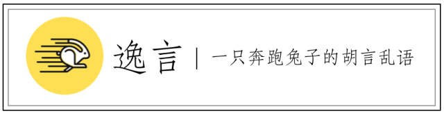

# 一篇文章教你分辨领域服务与应用服务

**标签** | 领域驱动设计

**作者** | 张逸

判断什么时候应该定义领域服务，什么时候应该定义应用服务，一个根本的判断依据是看**需要封装的职责是否与领域相关**。

### 横切关注点

在应用服务中，我们往往需要和如下逻辑进行协作：

- 消息验证
- 错误处理
- 监控
- 事务
- 认证与授权

在《领域驱动设计模式、原理与实践》一书中，将以上内容视为**基础架构问题**。这些关注点与具体的业务逻辑无关，且在整个系统中，可能会被诸多服务调用（以便于重用），因此可以认为这些关注点为**横切关注点**。

从AOP的角度看，所谓“横切关注点”就是那些在职责上是内聚的，但在使用上又会散布在所有对象层次中，且与所散布到的对象的核心功能毫无关系的关注点。与“横切关注点”对应的是“核心关注点”，就是与系统业务有关的领域逻辑。例如订单业务是核心关注点，插入订单时的事务管理则是横切关注点。

横切关注点与核心关注点是分离的，因此与具体的业务无关。于是，我们可以得到应用服务设计的第一条原则：**与横切关注点协作的服务应被定义为应用服务**。

### Clean Architecture

如果参考Robert Martin的Clean Architecture以及Cockburn的六边形架构，我们可以将分层架构的应用层对应到Clean Architecture内核中的Use Case层，如下图所示：

据上图，Robert Martin认为Use Case层封装了“Application Business Rules”。我们在分析建模时，一个Use Case往往代表一个完整的业务场景。

对外部的客户而言，DDD的应用层代表了与客户协作的应用服务，接口表达的其实是业务的含义。DDD分层架构的主要目的是要将业务复杂度与技术复杂度分离，应用层扮演的正是这样的一条分界线。从设计模式的角度讲，应用层的应用服务就是一个Facade：对外，它提供代表Use   Case的整体应用；对内，它负责整合领域层的领域逻辑与其他基础架构层面的横切关注点。应用服务封装的业务含义，其实仅仅是一个转手的买卖，并不真正具有领域逻辑。因此可以得到应用服务设计的第二条准则：**不包含领域逻辑的业务服务应被定义为应用服务**。

### 与领域的交互

第二条设计准则容易造成困惑。虽然单个领域行为确定无误地属于领域逻辑，然而将多个领域行为组合起来的协调行为，算不算是领域逻辑呢？例如对于“下订单”用例而言，如果我们在各自的领域对象中定义了如下行为：

- 验证订单是否有效
- 提交订单
- 移除购物车中已购商品
- 发送邮件通知买家

这些行为的组合正好满足了“下订单”这个完整用例的需求，同时也为了保证客户调用的简便性，我们需要对这四个领域行为进行封装。由于这些行为可能牵涉到不同的领域对象，因此只能定义为服务。那么，这个服务应该是应用服务，还是领域服务？

《领域驱动设计模式、原理与实践》一书将这种封装认为是**与领域的交互**。该书作者给出了自己的一个判断标准：

> 决定一系列交互是否属于领域的一种方式是提出“这种情况总是会出现吗？”或者“这些步骤无法分开吗？”的问题。如果答案是肯定的，那么这看起来就是一个领域策略，因为那些步骤总是必须一起发生。然而，如果那些步骤可以用若干方式重新组合，那么可能它就不是一个领域概念。

但我认为这种判断标准并不准确，至少并非充分必要条件。也就是说，可以分开的领域行为组合在一起未必一定就是应用服务；反过来，一个应用服务封装的领域行为组合也未必一定具有高内聚性。

如果这个判断标准不成立，在牵涉到领域逻辑的协调与交互时，领域逻辑与应用服务的边界就变得非常模糊了。一种观点是在微服务架构中，由于一个Bounded   Context的粒度变得越来越小，且代表了跨进程的物理边界，使得区分领域服务与应用服务变得不再那么重要了。换言之，因为微服务的粒度较小，又有着严格的边界控制，业务复杂度与技术复杂度二者的混合产生的负面影响也变得越来越小。

然而，我们不能轻言妥协。只要在微服务边界内依然采用了DDD设计过程，则提炼出一个专门的应用层仍有必要。结合我对DDD的认识，我觉得可以**给应用服务做如下边界定义**：

- 与横切关注点进行协作的只能是应用服务
- 若应用服务要与领域交互，则尽可能将与横切关注点无关的纯领域行为往领域服务下推

基于这个定义，以前面的“下订单”用例为例，对这四个领域行为的封装就应该放在领域服务中（关于邮件通知功能是否属于领域服务，后面有深入讨论）。倘若封装在领域服务中的整体逻辑还需要事务管理，又或者在执行下订单任务之前，需要进行身份认证与授权，则需要将这些逻辑的整合放到应用服务中。

### 纠结的横切关注点

假设这个定义是切实可行的，可以作为判断一个服务是否为应用服务的标准，则需要先明确什么是“横切关注点”。前面已经明确给出了“横切关注点”的定义，且说明它应该与业务逻辑无关。但是在判断横切关注点以及整合横切关注点时，除了前面提到的事务、监控、身份验证与授权没有争议之外，DDD社区对如下关注点普遍存在困惑与纠结。

#### 日志

毫无疑问，日志属于横切关注点的范畴。然而，倘若将日志功能仅仅放在应用层，又可能无法准确详细地记录操作行为与错误信息。很多语言都提供了基础的日志框架，将日志混杂在领域对象中，会影响领域的纯粹性，也带来了系统与日志框架的耦合，除非采用AOP的方式。目前看来，这是一种编码取舍，即倾向于代码的纯粹性，还是代码的高质量。我个人还是更看重代码的质量，尤其是丰富的日志内容还有助于运维时的排错，因此建议将对日志共的调用放在领域服务中，算是上述应用服务边界定义的特例。

当然，这个划分并非排他性的。在应用服务中，同样需要调用日志功能，这是记录的信息与粒度与领域服务不尽相同罢了。

#### 验证

如果是验证外部客户传递过来的消息，例如对RESTful服务的Request请求的验证，则该验证功能属于横切关注点，对它的调用就应该放在应用服务边界。如果验证逻辑属于领域范畴，例如验证订单有效性，这种验证体现的是一种业务规则，则验证逻辑的实现就应该放在领域层，对验证逻辑的调用也应该属于领域对象，包括领域服务。

#### 分布式通信

微服务缩小了架构设计上的物理边界，使得分布式通信变得更为常见。对于分布式通信的实现毫无疑问属于基础设置层，但在很多情况下，在当前领域中，需要通过分布式通信去访问别的领域提供的服务接口。例如针对“下订单用例”，假设订单、购物车、库存属于不同的微服务，那么在验证订单有效性时，就需要分布式调用库存提供的服务；在提交了订单后，需要分布式调用购物车提供的服务。

这种调用属于对横切关注点的调用吗？**显然不是。**因为从抽象层面讲，这个调用其实是一个业务行为；从实现层面讲，又属于基础设施的技术内容。因此，正确的做法是在领域层定义一个抽象的服务接口，然后通过依赖注入的方式注入到领域服务中。微服务框架Spring Cloud的Feign就支持这种形式的协作。

针对这种分布式通信，Martin Fowler的建议是将消息协议的转换部分（包括验证）放在Gateway模块，而将对外部服务的调用放在Http Client模块中，如下图所示：

从分层的角度讲，Gateway与HTTP Client两个模块都应该属于基础设施层，但代表外部服务业务的接口，应该定义在领域层中。

#### 异常处理

与领域逻辑有关的错误与异常，应该以自定义异常形式表达业务含义，并被定义在领域层。此外，如果该异常表达了业务含义，那么在领域层中，可以将异常定义为Checked   Exception，以保证业务的健壮性。由于该异常与业务有关，即使被定义在方法接口中，也不存在异常对接口的污染，即可以将异常视为接口契约的一部分。但是，在领域服务中，不应该将与业务无关的Checked  Exception定义在领域服务的方法中，否则就会导致业务逻辑（领域）与技术实现（基础设施）的混合。

在应用层中，应尽可能保证应用服务的通用性，因而需要在应用服务中将与业务有关的自定义异常转换成标准格式的异常，例如统一定义为ApplicationException，然后在message或cause中包含具体的业务含义。因此，针对异常处理，只有这部分与业务无关的处理与转换功能，才属于横切关注点的范畴，并放在应用层中，其余异常处理逻辑都属于领域层。

#### 通知

通知关注点包括邮件通知、短信通知等功能。对于通知服务的实现，由于需要用到邮件或短信网关等具体技术，因此实现细节属于基础设施层。但是，对通知功能的调用，究竟算不算领域行为，却存在着争议。

由于身份验证服务确定属于应用服务，因此我们可以对比身份验证服务与通知服务，或许能从二者的区别中发现蛛丝马迹。分为如下三个角度去对比：

- DDD的设计角度：通知服务属于Support SubDomain，而身份验证服务则属于Generic SubDomain。
- 微服务的设计角度：在微服务架构中，通知服务与身份验证服务相同，都属于Infrastructure   Service的范畴。从这个角度讲，似乎应该将通知功能视为关注点。不同之处在于，身份验证服务通常会在服务网关中被调用，且实现方式都是被定义为一个filter，放到对Request进行处理的管道上。通知服务则不同，总是与具体业务绑定在一起，只是它的应用范围更加广泛，不特定在某个具体的业务。
- 用例的设计角度：我们通常将身份验证视为主用例的包含用例（include use case），而将通知服务视为主用例的扩展用例（extend use case）。

显然，通知服务与身份验证服务都具有一定的通用性，但本质上又存在一定的区别。

此外，客户对通知服务的调用可能还存在变化，例如针对不同的业务场景，有的需要邮件通知，有的需要短信通知，有的需要组合两种形式。因此，通知服务体现了某种似是而非的朦胧感：

- 与领域相关，但并非核心领域
- 实现可能存在变化
- 往往被实现为单独的服务
- 通知服务自身可能与主业务强相关

因为这一点朦胧感，我们不能武断地认为对通知服务的调用一定应该放在领域服务或应用服务。我个人倾向于**将调用通知服务的逻辑放在应用服务中，除非通知服务自身可能与主业务强相关**。例如在“下订单”用例中，假设通知逻辑为：当订单总额达到实现设置的阈值时，应采用邮件通知和短信通知两种形式通知买家发货，否则仅采用邮件通知。这时，通知服务自己形成了业务逻辑，且与下订单主业务直接相关，那么，对通知服务的调用就应该被定义在领域服务中。