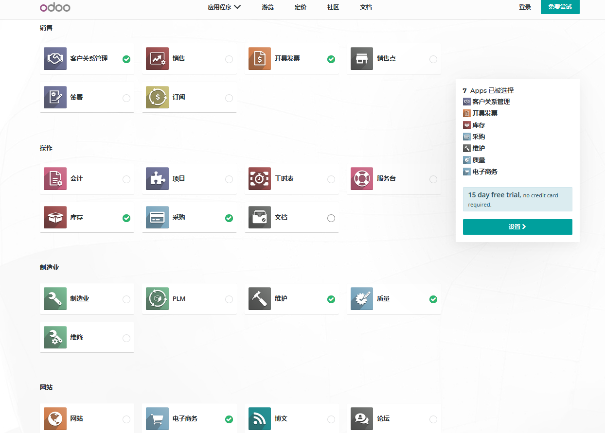
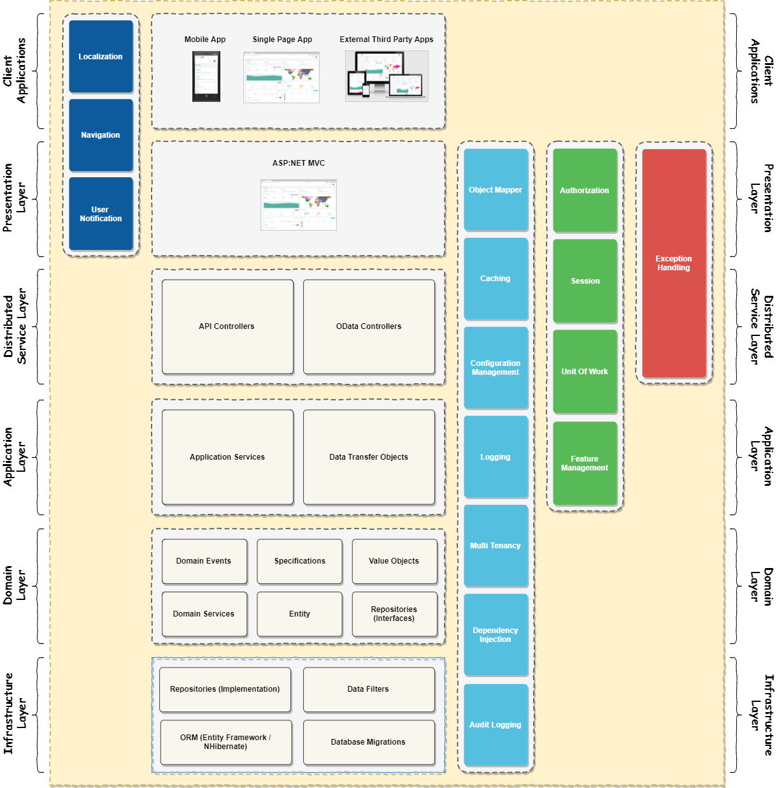
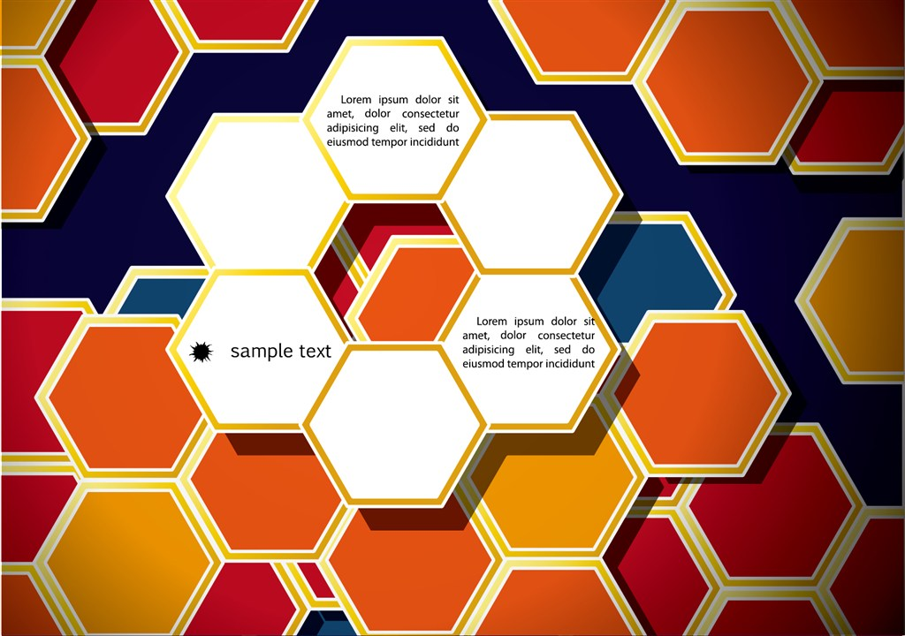

## 现阶段的ERP-CMS

###  ERP-CMS

### SAP的R3模型计划

##### R3

### Odoo -基于Python的ERP-CMS

### Odoo -可供拆分，勾选，面向微服务粒度化的，基于Python的ERP-CMS

## 领域驱动的【核心-领域】

###  领域-子域-上下文

#####  电商领域模型

##### ERP周边

##### 敏捷项目 上下文管理

##### 分离领域

### DDD模型
###### 传统DDD

##### 支持API的六边形

##### 支持SOA的六边形

##### CQRS

##### 事件驱动六边形

##### 领域事件调度

### 聚合

****

### 界面

###	应用-调用领域

##### 微服务 -分而必合

##### 系统领域-模块化【酒店模型】

### DDD模型

###### 传统DDD

### DDD 汉堡

### ABP--DDD

### 蜂巢

##### 初

##### 中

##### 最终

