### 领域-子域-上下文

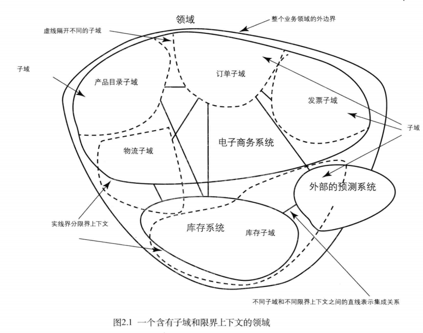

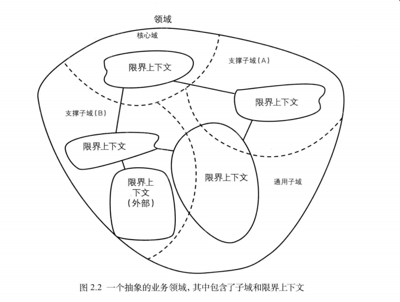

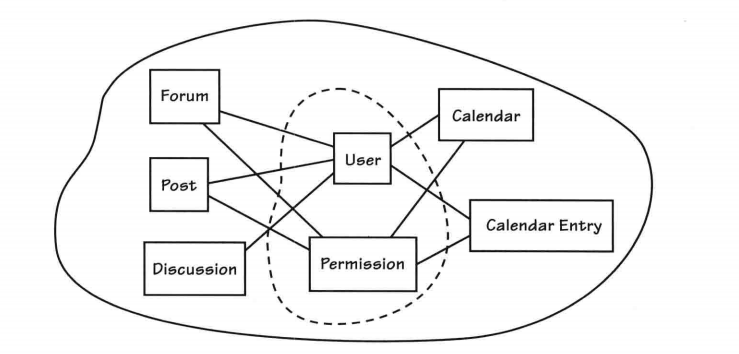

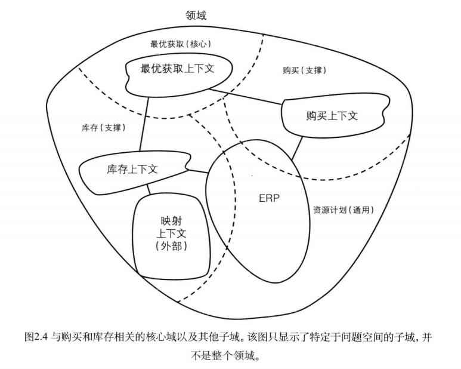

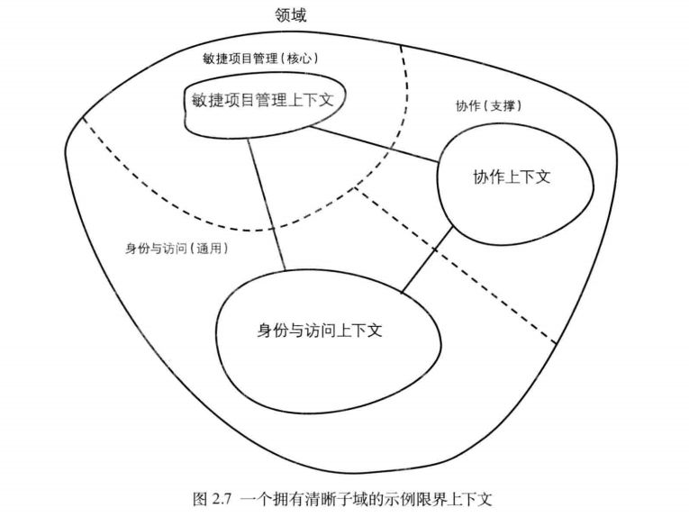

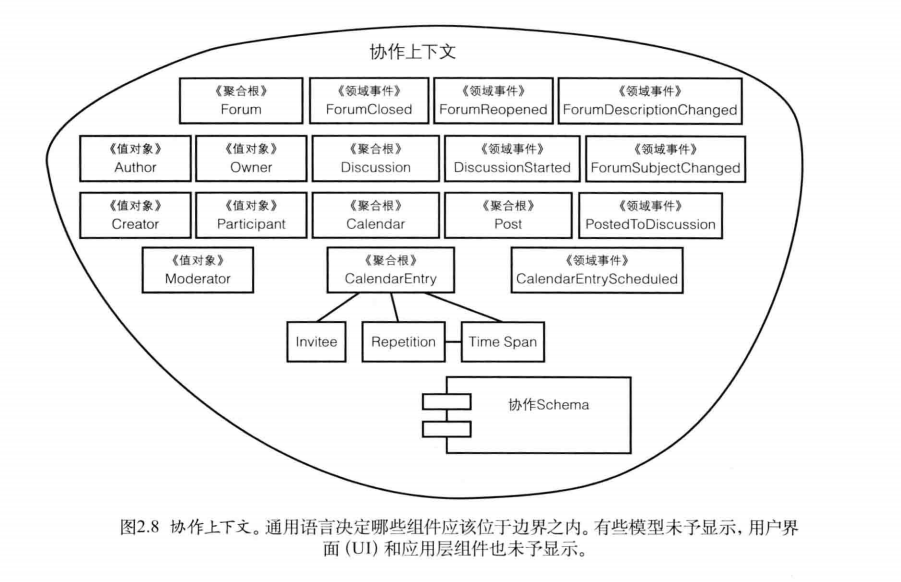

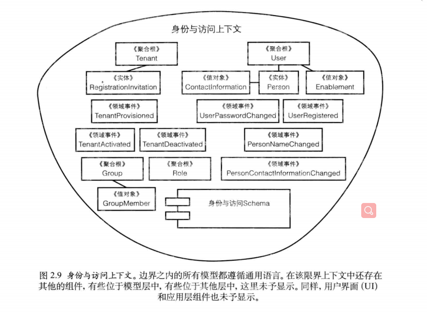

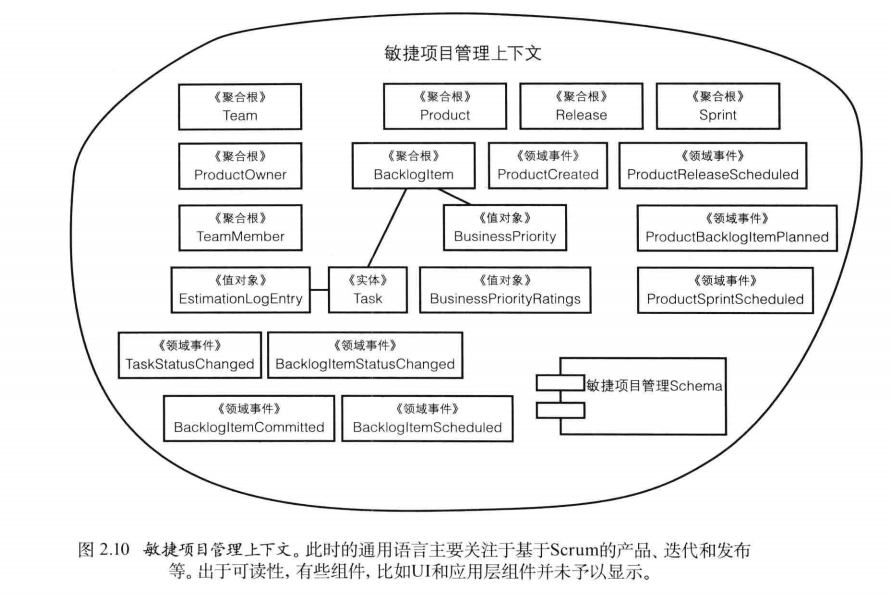

##### 分离领域

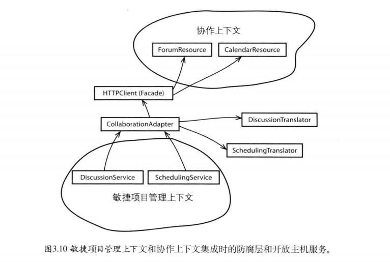
### DDD
###### 传统DDD

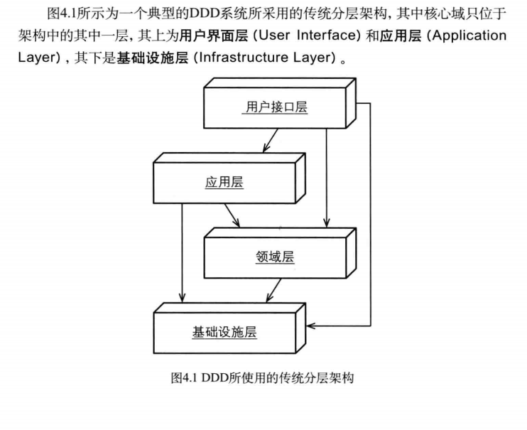

##### 支持API的六边形

##### 支持SOA的六边形

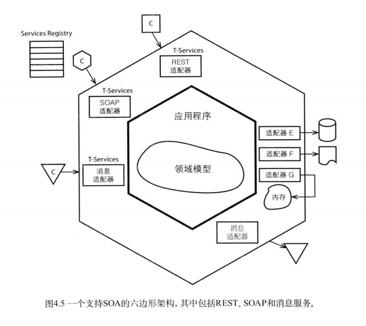

##### CQRS

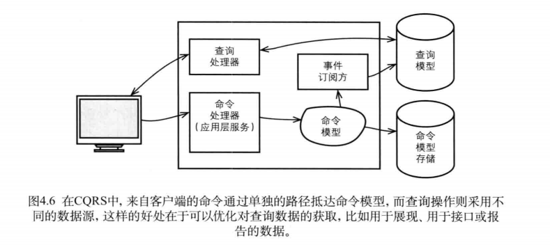

##### 事件驱动六边形

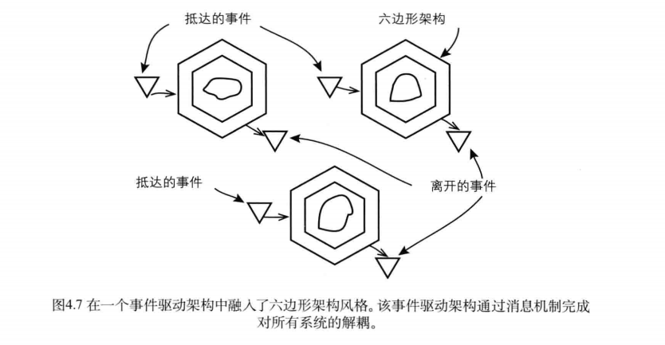

##### 领域事件调度

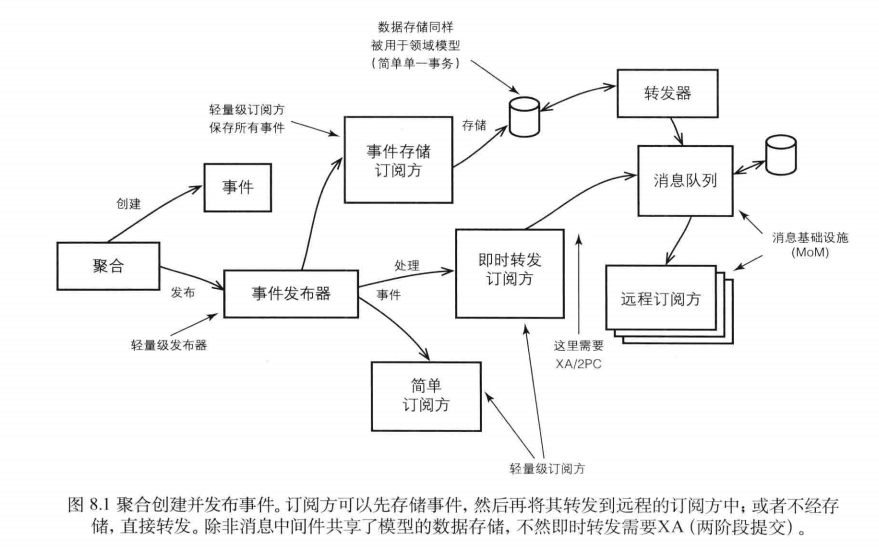

### 聚合

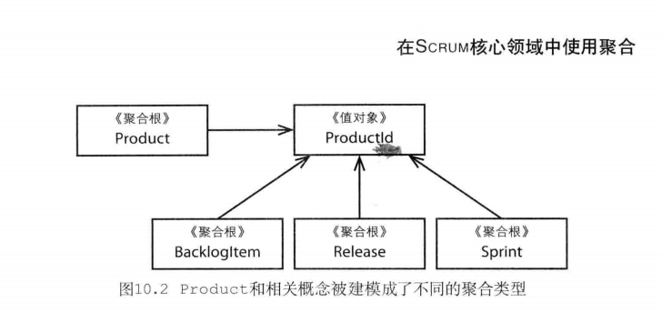****

### 界面

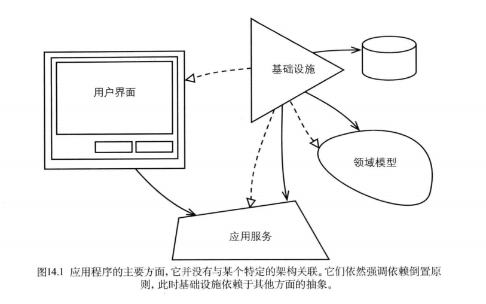

###	应用-调用领域

##### 微服务 -分而必合

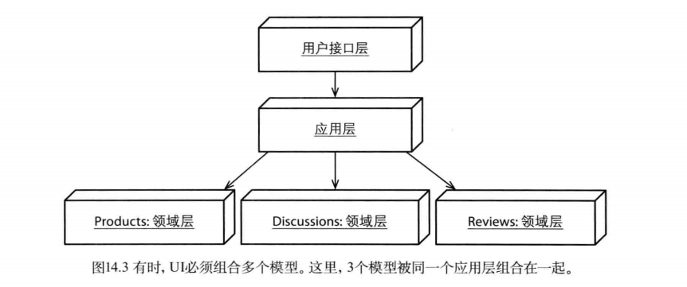