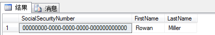
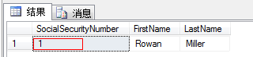
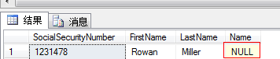

在EF中，我们建立数据模型的时候，可以给属性配置数据生成选项DatabaseGenerated，它后有三个枚举值：Identity、None和Computed。

Identity：自增长

None：不处理

Computed：表示这一列是计算列。

在EF中，如果主键是int类型，Code First生成数据库的时候会自动设置该列为自增长。但如果主键是Guid类型，我们就要手动的去设置了。

对于下面的模型，如果我们没有设置自增长，数据库中会以0来填充

[](javascript:void(0);)

```
 public class Person
    {
        [Key]
        public Guid SocialSecurityNumber { get; set; }
        public string FirstName { get; set; }
        public string LastName { get; set; }
    }
```

[](javascript:void(0);)

[](javascript:void(0);)

```
            var person = new Person
            {
                FirstName = "Rowan",
                LastName = "Miller",
            };
            using (var context = new BreakAwayContext())
            {
                context.People.Add(person);
                context.SaveChanges();
            }
```

[](javascript:void(0);)



插入第二条记录的时候就会报错了。所以，下面的模型设置才是正确的。

[](javascript:void(0);)

```
 public class Person
    {
        [Key,DatabaseGenerated(DatabaseGeneratedOption.Identity)]
        public Guid SocialSecurityNumber { get; set; }
        public string FirstName { get; set; }
        public string LastName { get; set; }
    }
```

[](javascript:void(0);)

现在我们来看看有些情况配置为None也是有用的。修改一下上面的模型。

[](javascript:void(0);)

```
public class Person
    {
        [Key]
        public int SocialSecurityNumber { get; set; }
        public string FirstName { get; set; }
        public string LastName { get; set; }
    }
```

[](javascript:void(0);)

我们再插入一条记录看看

[](javascript:void(0);)

```
   var person = new Person
            {
                FirstName = "Rowan",
                LastName = "Miller",
                SocialSecurityNumber = 12345678
            };

            using (var context = new BreakAwayContext())
            {
                context.People.Add(person);
                context.SaveChanges();
            }
```

[](javascript:void(0);)



在数据库中存储的是1，并不是我们所想要的12345678.这是为什么呢？

因为主键是SocialSecurityNumber是Int类型，Code First在数据库中对该列作自增长处理。这时，我们想再插入自定义的SocialSecurityNumber就不行了。

所以当我们想这样做时，就应该把SocialSecurityNumber的自增长配置为None.

[](javascript:void(0);)

```
 public class Person
    {
        [Key, DatabaseGenerated(DatabaseGeneratedOption.None)]
        public int SocialSecurityNumber { get; set; }
        public string FirstName { get; set; }
        public string LastName { get; set; }
    }
```

[](javascript:void(0);)

 如果对属性标识为Computed，EF会认为该列是通过其它列计算得出的，不会将其持久化到数据库中。

[](javascript:void(0);)

```
  public class Person
    {
        [Key, DatabaseGenerated(DatabaseGeneratedOption.None)]
        public int SocialSecurityNumber { get; set; }
        public string FirstName { get; set; }
        public string LastName { get; set; }
        [DatabaseGenerated(DatabaseGeneratedOption.Computed)]
        public string Name { get; set; }
    }
```

[](javascript:void(0);)

[](javascript:void(0);)

```
var person = new Person
            {
                FirstName = "Rowan",
                LastName = "Miller",
                SocialSecurityNumber = 1231478,
                Name = "Rowan Miller",
            };

            using (var context = new BreakAwayContext())
            {
                context.People.Add(person);
                context.SaveChanges();
            }
```

[](javascript:void(0);)

查看数据库，我们看到Name并没有存储任何值。



 

如果我的文章对你有帮助，就点一下推荐吧.(*^__^*)


标签: [Entity Framework](https://www.cnblogs.com/Gyoung/tag/Entity Framework/)