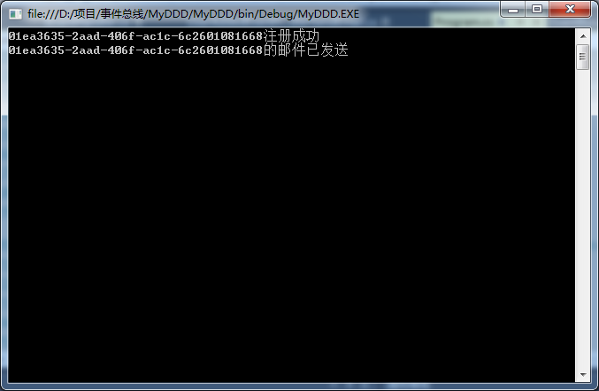

- [博客园](https://www.cnblogs.com/)
- [首页](https://www.cnblogs.com/tiancai/)
- [新随笔](https://i.cnblogs.com/EditPosts.aspx?opt=1)
- [联系](https://msg.cnblogs.com/send/甜菜波波)
- [订阅](https://www.cnblogs.com/tiancai/rss) 
- [管理](https://i.cnblogs.com/)

 随笔 - 658   文章 - 76   评论 - 32 

#  			[领域事件和事件总线](https://www.cnblogs.com/tiancai/p/7266858.html) 		


- 何为领域驱动设计？

2004年著名建模专家Eric  Evans发表了他最具影响力的书籍:《Domain-Driven Design: Tackling Complexity in the  Heart of Software》(中文译名：领域驱动设计：软件核心复杂性应对之道)，书中提出了领域驱动设计(简称 DDD)的概念。

　　领域驱动设计事实上是针对OOAD的一个扩展和延伸，DDD基于面向对象分析与设计技术，对技术架构进行了分层规划，同时对每个类进行了策略和类型的划分。

　　领域模型是领域驱动的核心。采用DDD的设计思想，业务逻辑不再集中在几个大型的类上，而是由大量相对小的领域对象(类)组成，这些类具备自己的状态和行为，每个类是相对完整的独立体，并与现实领域的业务对象映射。领域模型就是由这样许多的细粒度的类组成。基于领域驱动的设计，保证了系统的可维护性、扩展性和复用性，在处理复杂业务逻辑方面有着先天的优势。

**摘自：http://kb.cnblogs.com/page/112298/**

- 领域模型的种类？

1. **失血模型：**模型仅仅包含数据的定义和getter/setter方法，业务逻辑和应用逻辑都放到服务层中。这种类在Java中叫POJO，在.NET中叫POCO。
2. **贫血模型：**贫血模型中包含了一些业务逻辑，但**不包含依赖持久层的业务逻辑**。这部分依赖于持久层的业务逻辑将会放到服务层中。可以看出，贫血模型中的领域对象是不依赖于持久层的。
3. **充血模型：**充血模型中包含了所有的业务逻辑，**包括依赖于持久层的业务逻辑**。所以，使用充血模型的领域层是依赖于持久层，简单表示就是 UI层->服务层->领域层<->持久层。
4. **胀血模型：**胀血模型就是把和业务逻辑不想关的其他应用逻辑（如授权、事务等）都放到领域模型中。我感觉胀血模型反而是另外一种的失血模型，因为服务层消失了，领域层干了服务层的事，到头来还是什么都没变。

- 领域事件和事件总线


- **总管对象（事件总线）   EventBus**

主要职责是管理领域模型的所有事件，通过Dictionary<Type,List<object>> _dicEventHandler=new Dictionary<Type, List<object>>();主要包括

- Subscribe订阅相关的领域对象事件
- Publish 触发所有在事件总线上的领域对象事件句柄

[](javascript:void(0);)


```
using System;
using System.Collections.Generic;
using System.Linq;
using System.Text;
using System.Threading.Tasks;

namespace MyDDD
{
    /// <summary>
    /// 事件总线
    /// </summary>
    public class EventBus
    {
        /// <summary>
        /// 事件总线对象
        /// </summary>
        private static EventBus _eventBus=null;

        /// <summary>
        /// 领域模型事件句柄字典，用于存储领域模型的句柄
        /// </summary>
        private static  Dictionary<Type,List<object>> _dicEventHandler=new Dictionary<Type, List<object>>();

        /// <summary>
        /// 附加领域模型处理句柄时，锁住
        /// </summary>
        private readonly object _syncObject = new object();

        /// <summary>
        /// 单例事件总线
        /// </summary>
        public static EventBus Instance
        {
            get
            {
                return _eventBus ?? (_eventBus=new EventBus());
            }
        }

        private readonly Func<object, object, bool> _eventHandlerEquals = (o1, o2) =>
        {
            return true;
        };

        #region 订阅事件

        public void Subscribe<TEvent>(IEventHandler<TEvent> eventHandler) where TEvent : IEvent
        {
            //同步锁
            lock (_syncObject)
            {
                //获取领域模型的类型
                var eventType = typeof (TEvent);
                //如果此领域类型在事件总线中已注册过
                if (_dicEventHandler.ContainsKey(eventType))
                {
                    var handlers = _dicEventHandler[eventType];
                    if (handlers != null)
                    {
                        handlers.Add(eventHandler);
                    }
                    else
                    {
                        handlers=new List<object>
                        {
                            eventHandler
                        };
                    }
                }
                else
                {
                    _dicEventHandler.Add(eventType, new List<object> { eventHandler });
                }
            }
        }

        #endregion

        #region 宣布事件

        public void Publish<TEvent>(TEvent tEvent, Action<TEvent, bool, Exception> callback)  where TEvent:IEvent
        {
            var eventType = typeof (TEvent);
            if (_dicEventHandler.ContainsKey(eventType) && _dicEventHandler[eventType] != null &&
                _dicEventHandler[eventType].Count > 0)
            {
                var handlers = _dicEventHandler[eventType];
                try
                {
                    foreach (var handler in handlers)
                    {
                        var eventHandler = handler as IEventHandler<TEvent>;
                        eventHandler.Handle(tEvent);
                        callback(tEvent, true, null);
                    }
                }
                catch (Exception ex)
                {
                    callback(tEvent, false, ex);
                }
            }
            else
            {
                callback(tEvent, false,null);
            }
        }

        #endregion

    }
}
```


[](javascript:void(0);)

 

 

- **领域对象**

领域对象通过实现IEvent接口，标记此领域对象可以往事件总线中订阅与自己相关的领域对象事件。

**用户注册领域对象**

[](javascript:void(0);)


```
using System;
using System.Collections.Generic;
using System.Linq;
using System.Text;
using System.Threading.Tasks;

namespace MyDDD
{
    /// <summary>
    /// 领域模型对象
    /// </summary>
    public class UserGenerator:IEvent
    {
        /// <summary>
        /// 用户Id
        /// </summary>
        public Guid UserId { get; set; }
    }
}
```


[](javascript:void(0);)

- **领域对象事件句柄**

领域对象事件句柄是领域对象发生变化时，通知EventBus触发所有的事件句柄

 

```
        public void Publish<TEvent>(TEvent tEvent, Action<TEvent, bool, Exception> callback)  where TEvent:IEvent
        用户注册发送Email的事件句柄
```

[](javascript:void(0);)


```
using System;
using System.Collections.Generic;
using System.Linq;
using System.Text;
using System.Threading.Tasks;

namespace MyDDD
{
    /// <summary>
    /// 
    /// </summary>
    public class UserAddedEventHandlerSendEmail : IEventHandler<UserGenerator>
    {

        public void Handle(UserGenerator tEvent)
        {
            Console.WriteLine(string.Format("{0}的邮件已发送", tEvent.UserId));
        }
    }
}
```


[](javascript:void(0);)

 

```
例子说明：当用户注册完成后，通知EventBus,由EventBus触发相应操作，发送Email或者其他操作。
        这样的好处用户注册是主业务，其他属于拓展，增加或减少需求，只需要往EventBus上订阅或取消事件即可。
```

[](javascript:void(0);)


```
using System;
using System.Collections.Generic;
using System.Linq;
using System.Text;
using System.Threading.Tasks;

namespace MyDDD
{
    class Program
    {
        static void Main(string[] args)
        {
            EventBus.Instance.Subscribe(new UserAddedEventHandlerSendEmail());
            var userGenerator = new UserGenerator{UserId = Guid.NewGuid()};
            Console.WriteLine("{0}注册成功",userGenerator.UserId);
            EventBus.Instance.Publish(userGenerator, CallBack);
            Console.ReadKey();
        }

        public static void CallBack(UserGenerator userGenerator, bool result, Exception ex)
        {
        }
    }
}
```


[](javascript:void(0);)



```
 
```

 

 


分类: [设计模式](https://www.cnblogs.com/tiancai/category/714178.html)

标签: [设计模式](https://www.cnblogs.com/tiancai/tag/设计模式/)

​         [好文要顶](javascript:void(0);)             [关注我](javascript:void(0);)     [收藏该文](javascript:void(0);)     [](javascript:void(0);)     [](javascript:void(0);) 


​             [甜菜波波](http://home.cnblogs.com/u/tiancai/)
​             [关注 - 122](http://home.cnblogs.com/u/tiancai/followees)
​             [粉丝 - 55](http://home.cnblogs.com/u/tiancai/followers)         


​                 [+加关注](javascript:void(0);)     

​         0     

​         0     


​     


[« ](https://www.cnblogs.com/tiancai/p/7234859.html) 上一篇：[Server.MapPath 的使用方法](https://www.cnblogs.com/tiancai/p/7234859.html)
[» ](https://www.cnblogs.com/tiancai/p/7266889.html) 下一篇：[事件总线EventBus](https://www.cnblogs.com/tiancai/p/7266889.html)