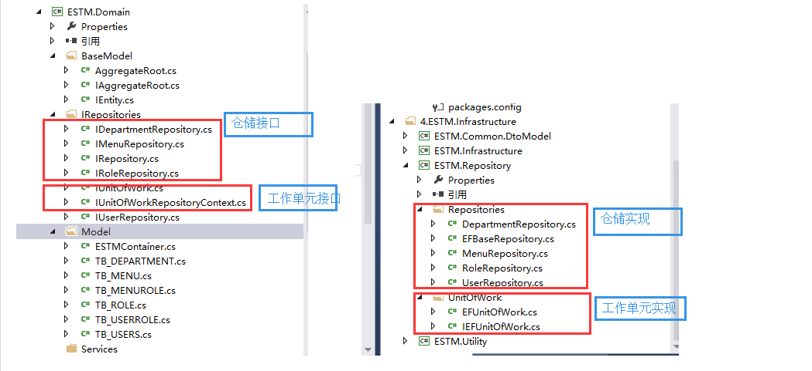
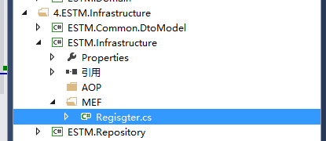
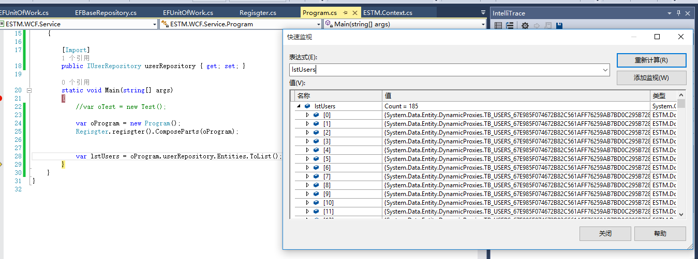

​                      				

 				 									 				

- [首页](http://blog.jobbole.com/)
- [最新文章](http://blog.jobbole.com/all-posts/)
- [IT 职场](http://blog.jobbole.com/category/career/)
- [前端](http://web.jobbole.com)  
- [后端](http://blog.jobbole.com/99309/#)  
- [移动端](http://blog.jobbole.com/99309/#)  
- [数据库](http://blog.jobbole.com/tag/database/)
- [运维](http://blog.jobbole.com/99309/#)  
- [其他技术](http://blog.jobbole.com/99309/#)  

 [伯乐在线](http://www.jobbole.com) > [首页](http://blog.jobbole.com) > [所有文章](http://blog.jobbole.com/all-posts/) > [开发](http://blog.jobbole.com/category/programmer/) > DDD领域驱动设计初探（2）：仓储Repository（上）

# DDD领域驱动设计初探（2）：仓储Repository（上）

​              2016/04/07 ·  [开发](http://blog.jobbole.com/category/programmer/)                                          · [ 1 评论 ](http://blog.jobbole.com/99309/#article-comment)                                         ·  [.Net](http://blog.jobbole.com/tag/net/), [DDD](http://blog.jobbole.com/tag/ddd/)              

原文出处： [懒得安分](http://www.cnblogs.com/landeanfen/p/4834730.html)   

前言：上篇介绍了DDD设计Demo里面的聚合划分以及实体和聚合根的设计，这章继续来说说DDD里面最具争议的话题之一的仓储Repository，为什么Repository会有这么大的争议，博主认为主要原因无非以下两点：一是Repository的真实意图没有理解清楚，导致设计的紊乱，随着项目的横向和纵向扩展，到最后越来越难维护；二是赶时髦的为了“模式”而“模式”，仓储并非适用于所有项目，这就像没有任何一种架构能解决所有的设计难题一样。本篇通过这个设计的Demo来谈谈博主对仓储的理解，有不对的地方还望园友们斧正！

## 一、仓储的定义

仓储，顾名思义，存储数据的仓库。那么有人就疑惑了，既然我们有了数据库来存取数据，为什么还要弄一个仓储的概念，其实博主觉得这是一个考虑层面不同的问题，数据库主要用于存取数据，而仓储作用之一是用于数据的持久化。从架构层面来说，仓储用于连接领域层和基础结构层，领域层通过仓储访问存储机制，而不用过于关心存储机制的具体细节。按照DDD设计原则，仓储的作用对象的领域模型的聚合根，也就是说每一个聚合都有一个单独的仓储。可能这样说大家未必能理解，相信看了仓储的代码设计，大家能有一个更加透彻的认识。

## 二、使用仓储的意义

**1、站在领域层更过关心领域逻辑的层面，上面说了，仓储作为领域层和基础结构层的连接组件，使得领域层不必过多的关注存储细节。在设计时，将仓储接口放在领域层，而将仓储的具体实现放在基础结构层，领域层通过接口访问数据存储，而不必过多的关注仓储存储数据的细节（也就是说领域层不必关心你用EntityFrameWork还是NHibernate来存储数据），这样使得领域层将更多的关注点放在领域逻辑上面。**

**2、站在架构的层面，仓储解耦了领域层和ORM之间的联系，这一点也就是很多人设计仓储模式的原因，比如我们要更换ORM框架，我们只需要改变仓储的实现即可，对于领域层和仓储的接口基本不需要做任何改变。**

## 三、代码示例

### 1、解决方案结构图

 

上面说了，仓储的设计是接口和实现分离的，于是，我们的仓储接口和工作单元接口全部放在领域层，在基础结构层新建了一个仓储的实现类库ESTM.Repository，这个类库需要添加领域层的引用，实现领域层的仓储接口和工作单元接口。所以，通过上图可以看到领域层的IRepositories里面的仓储接口和基础结构层ESTM.Repository项目下的Repositories里面的仓储实现是一一对应的。下面我们来看看具体的代码设计。其实园子里已有很多经典的仓储设计，为了更好地说明仓储的作用，博主还是来班门弄斧下了~~

### 2、仓储接口

C#

　　 /// 
    /// 仓储接口，定义公共的泛型GRUD
    /// 
    /// 泛型聚合根，因为在DDD里面仓储只能对聚合根做操作
    public interface IRepositorywhere TEntity : AggregateRoot
    {
        #region 属性
        IQueryable Entities { get; }
        #endregion

​        #region 公共方法
​        int Insert(TEntity entity);

​        int Insert(IEnumerable entities);

​        int Delete(object id);

​        int Delete(TEntity entity);

​        int Delete(IEnumerable entities);

​        int Update(TEntity entity);

​        TEntity GetByKey(object key);
​        #endregion
​    }

​    /// 
​    /// 部门聚合根的仓储接口
​    /// 
​    public interface IDepartmentRepository:IRepository
​    {

​    }

​    /// 
​    /// 菜单这个聚合根的仓储接口
​    /// 
​    public interface IMenuRepository:IRepository
​    {
​        IEnumerable GetMenusByRole(TB_ROLE oRole);
​    }

​    /// 
​    /// 角色这个聚合根的仓储接口
​    /// 
​    public interface IRoleRepository:IRepository
​    {
​    }

​    /// 
​    /// 用户这个聚合根的仓储接口
​    /// 
​    public interface IUserRepository:IRepository
​    {
​        IEnumerable GetUsersByRole(TB_ROLE oRole);
​    }

| 123456789101112131415161718192021222324252627282930313233343536373839404142434445464748495051525354555657 | ///     /// 仓储接口，定义公共的泛型GRUD    ///     /// 泛型聚合根，因为在DDD里面仓储只能对聚合根做操作    public interface IRepositorywhere TEntity : AggregateRoot    {        #region 属性        IQueryable Entities { get; }        #endregion         #region 公共方法        int Insert(TEntity entity);         int Insert(IEnumerable entities);         int Delete(object id);         int Delete(TEntity entity);         int Delete(IEnumerable entities);         int Update(TEntity entity);         TEntity GetByKey(object key);        #endregion    }     ///     /// 部门聚合根的仓储接口    ///     public interface IDepartmentRepository:IRepository    {     }     ///     /// 菜单这个聚合根的仓储接口    ///     public interface IMenuRepository:IRepository    {        IEnumerable GetMenusByRole(TB_ROLE oRole);    }     ///     /// 角色这个聚合根的仓储接口    ///     public interface IRoleRepository:IRepository    {    }     ///     /// 用户这个聚合根的仓储接口    ///     public interface IUserRepository:IRepository    {        IEnumerable GetUsersByRole(TB_ROLE oRole);    } |
| ------------------------------------------------------------ | ------------------------------------------------------------ |
|                                                              |                                                              |

除了IRepository这个泛型接口，其他4个仓储接口都是针对聚合建立的接口， 上章[ C#进阶系列——DDD领域驱动设计初探（一）：聚合 ](http://blog.jobbole.com/99298/)介绍了聚合的划分，这里的仓储接口就是基于此建立。IUserRepository接口实现了IRepository接口，并把对应的聚合根传入泛型，这里正好应征了上章聚合根的设计。

### 3、仓储实现类

C#

　　//仓储的泛型实现类     public class EFBaseRepository : IRepositorywhere TEntity : AggregateRoot     {         [Import(typeof(IEFUnitOfWork))]         private IEFUnitOfWork UnitOfWork { get; set; }          public EFBaseRepository()         {　　　　　　  //注册MEF             Regisgter.regisgter().ComposeParts(this);         }          public IQueryable Entities         {             get { return UnitOfWork.context.Set(); }         }          public int Insert(TEntity entity)         {             UnitOfWork.RegisterNew(entity);             return UnitOfWork.Commit();         }          public int Insert(IEnumerable entities)         {             foreach (var obj in entities)             {                 UnitOfWork.RegisterNew(obj);             }             return UnitOfWork.Commit();         }          public int Delete(object id)         {             var obj = UnitOfWork.context.Set().Find(id);             if (obj == null)             {                 return 0;             }             UnitOfWork.RegisterDeleted(obj);             return UnitOfWork.Commit();         }          public int Delete(TEntity entity)         {             UnitOfWork.RegisterDeleted(entity);             return UnitOfWork.Commit();         }          public int Delete(IEnumerable entities)         {             foreach (var entity in entities)             {                 UnitOfWork.RegisterDeleted(entity);             }             return UnitOfWork.Commit();         }          public int Update(TEntity entity)         {             UnitOfWork.RegisterModified(entity);             return UnitOfWork.Commit();         }          public TEntity GetByKey(object key)         {             return UnitOfWork.context.Set().Find(key);         }     }

| 1234567891011121314151617181920212223242526272829303132333435363738394041424344454647484950515253545556575859606162636465666768 | //仓储的泛型实现类    public class EFBaseRepository : IRepositorywhere TEntity : AggregateRoot    {        [Import(typeof(IEFUnitOfWork))]        private IEFUnitOfWork UnitOfWork { get; set; }         public EFBaseRepository()        {　　　　　　  //注册MEF            Regisgter.regisgter().ComposeParts(this);        }         public IQueryable Entities        {            get { return UnitOfWork.context.Set(); }        }         public int Insert(TEntity entity)        {            UnitOfWork.RegisterNew(entity);            return UnitOfWork.Commit();        }         public int Insert(IEnumerable entities)        {            foreach (var obj in entities)            {                UnitOfWork.RegisterNew(obj);            }            return UnitOfWork.Commit();        }         public int Delete(object id)        {            var obj = UnitOfWork.context.Set().Find(id);            if (obj == null)            {                return 0;            }            UnitOfWork.RegisterDeleted(obj);            return UnitOfWork.Commit();        }         public int Delete(TEntity entity)        {            UnitOfWork.RegisterDeleted(entity);            return UnitOfWork.Commit();        }         public int Delete(IEnumerable entities)        {            foreach (var entity in entities)            {                UnitOfWork.RegisterDeleted(entity);            }            return UnitOfWork.Commit();        }         public int Update(TEntity entity)        {            UnitOfWork.RegisterModified(entity);            return UnitOfWork.Commit();        }         public TEntity GetByKey(object key)        {            return UnitOfWork.context.Set().Find(key);        }    } |
| ------------------------------------------------------------ | ------------------------------------------------------------ |
|                                                              |                                                              |

仓储的泛型实现类里面通过MEF导入工作单元，工作单元里面拥有连接数据库的上下文对象。

C#

　　[Export(typeof(IDepartmentRepository))]     public class DepartmentRepository : EFBaseRepository,IDepartmentRepository     {     }      [Export(typeof(IMenuRepository))]     public class MenuRepository:EFBaseRepository,IMenuRepository     {         public IEnumerable GetMenusByRole(TB_ROLE oRole)         {             throw new Exception();         }     }      [Export(typeof(IRoleRepository))]     public class RoleRepository:EFBaseRepository,IRoleRepository     {      }      [Export(typeof(IUserRepository))]     public class UserRepository:EFBaseRepository,IUserRepository     {         public IEnumerable GetUsersByRole(TB_ROLE oRole)         {             throw new NotImplementedException();         }     }

| 12345678910111213141516171819202122232425262728 | [Export(typeof(IDepartmentRepository))]    public class DepartmentRepository : EFBaseRepository,IDepartmentRepository    {    }     [Export(typeof(IMenuRepository))]    public class MenuRepository:EFBaseRepository,IMenuRepository    {        public IEnumerable GetMenusByRole(TB_ROLE oRole)        {            throw new Exception();        }    }     [Export(typeof(IRoleRepository))]    public class RoleRepository:EFBaseRepository,IRoleRepository    {     }     [Export(typeof(IUserRepository))]    public class UserRepository:EFBaseRepository,IUserRepository    {        public IEnumerable GetUsersByRole(TB_ROLE oRole)        {            throw new NotImplementedException();        }    } |
| ----------------------------------------------- | ------------------------------------------------------------ |
|                                                 |                                                              |

仓储是4个具体实现类里面也可以通过基类里面导入的工作单元对象UnitOfWork去操作数据库。

### 4、工作单元接口

C#

　　 //工作单元基类接口     public interface IUnitOfWork     {          bool IsCommitted { get; set; }           int Commit();          void Rollback();     }     //仓储上下文工作单元接口，使用这个的一般情况是多个仓储之间存在事务性的操作，用于标记聚合根的增删改状态     public interface IUnitOfWorkRepositoryContext:IUnitOfWork,IDisposable     {         ///          /// 将聚合根的状态标记为新建，但EF上下文此时并未提交         ///          ///          ///          void RegisterNew(TEntity obj)             where TEntity : AggregateRoot;          ///          /// 将聚合根的状态标记为修改，但EF上下文此时并未提交         ///          ///          ///          void RegisterModified(TEntity obj)             where TEntity : AggregateRoot;          ///          /// 将聚合根的状态标记为删除，但EF上下文此时并未提交         ///          ///          ///          void RegisterDeleted(TEntity obj)             where TEntity : AggregateRoot;     }

| 123456789101112131415161718192021222324252627282930313233343536 | //工作单元基类接口    public interface IUnitOfWork    {         bool IsCommitted { get; set; }          int Commit();         void Rollback();    }    //仓储上下文工作单元接口，使用这个的一般情况是多个仓储之间存在事务性的操作，用于标记聚合根的增删改状态    public interface IUnitOfWorkRepositoryContext:IUnitOfWork,IDisposable    {        ///         /// 将聚合根的状态标记为新建，但EF上下文此时并未提交        ///         ///         ///         void RegisterNew(TEntity obj)            where TEntity : AggregateRoot;         ///         /// 将聚合根的状态标记为修改，但EF上下文此时并未提交        ///         ///         ///         void RegisterModified(TEntity obj)            where TEntity : AggregateRoot;         ///         /// 将聚合根的状态标记为删除，但EF上下文此时并未提交        ///         ///         ///         void RegisterDeleted(TEntity obj)            where TEntity : AggregateRoot;    } |
| ------------------------------------------------------------ | ------------------------------------------------------------ |
|                                                              |                                                              |

看到这两个接口可能有人就有疑惑了，为什么要设计两个接口，直接合并一个不行么？这个工作单元的设计思路来源dax.net的系列文章，再次表示感谢！的确，刚开始，博主也有这种疑惑，仔细思考才知道，应该是出于事件机制来设计的，实现IUnitOfWorkRepositoryContext这个接口的都是针对仓储设计的工作单元，而实现IUnitOfWork这个接口除了仓储的设计，可能还有其他情况，比如事件机制。

### 5、工作单元实现类

C#

​    //表示EF的工作单元接口，因为DbContext是EF的对象     public interface IEFUnitOfWork : IUnitOfWorkRepositoryContext     {         DbContext context { get; }     }

| 12345 | //表示EF的工作单元接口，因为DbContext是EF的对象    public interface IEFUnitOfWork : IUnitOfWorkRepositoryContext    {        DbContext context { get; }    } |
| ----- | ------------------------------------------------------------ |
|       |                                                              |

**为什么要在这里还设计一层接口？因为博主觉得，工作单元要引入EF的Context对象，同理，如果你用的NH，那么这里应该是引入Session对象**。

C#

/// 
    /// 工作单实现类
    /// 
    [Export(typeof(IEFUnitOfWork))]
    public class EFUnitOfWork : IEFUnitOfWork
    {
        #region 属性
        //通过工作单元向外暴露的EF上下文对象
        public DbContext context { get { return EFContext; } }

​        [Import(typeof(DbContext))]
​        public DbContext EFContext { get; set; } 
​        #endregion

​        #region 构造函数
​        public EFUnitOfWork()
​        { 
​            //注册MEF
​            Regisgter.regisgter().ComposeParts(this);
​        }
​        #endregion

​        #region IUnitOfWorkRepositoryContext接口
​        public void RegisterNew(TEntity obj) where TEntity : AggregateRoot
​        {
​            var state = context.Entry(obj).State;
​            if (state == EntityState.Detached)
​            {
​                context.Entry(obj).State = EntityState.Added;
​            }
​            IsCommitted = false;
​        }

​        public void RegisterModified(TEntity obj) where TEntity : AggregateRoot
​        {
​            if (context.Entry(obj).State == EntityState.Detached)
​            {
​                context.Set().Attach(obj);
​            }
​            context.Entry(obj).State = EntityState.Modified;
​            IsCommitted = false;
​        }

​        public void RegisterDeleted(TEntity obj) where TEntity : AggregateRoot
​        {
​            context.Entry(obj).State = EntityState.Deleted;
​            IsCommitted = false;
​        } 
​        #endregion

​        #region IUnitOfWork接口

​        public bool IsCommitted { get; set; }

​        public int Commit()
​        {
​            if (IsCommitted)
​            {
​                return 0;
​            }
​            try
​            {
​                int result = context.SaveChanges();
​                IsCommitted = true;
​                return result;
​            }
​            catch (DbUpdateException e)
​            {

​                throw e;
​            }
​        }

​        public void Rollback()
​        {
​            IsCommitted = false;
​        } 
​        #endregion

​        #region IDisposable接口
​        public void Dispose()
​        {
​            if (!IsCommitted)
​            {
​                Commit();
​            }
​            context.Dispose();
​        } 
​        #endregion
​    }

| 123456789101112131415161718192021222324252627282930313233343536373839404142434445464748495051525354555657585960616263646566676869707172737475767778798081828384858687888990 | ///     /// 工作单实现类    ///     [Export(typeof(IEFUnitOfWork))]    public class EFUnitOfWork : IEFUnitOfWork    {        #region 属性        //通过工作单元向外暴露的EF上下文对象        public DbContext context { get { return EFContext; } }         [Import(typeof(DbContext))]        public DbContext EFContext { get; set; }         #endregion         #region 构造函数        public EFUnitOfWork()        {             //注册MEF            Regisgter.regisgter().ComposeParts(this);        }        #endregion         #region IUnitOfWorkRepositoryContext接口        public void RegisterNew(TEntity obj) where TEntity : AggregateRoot        {            var state = context.Entry(obj).State;            if (state == EntityState.Detached)            {                context.Entry(obj).State = EntityState.Added;            }            IsCommitted = false;        }         public void RegisterModified(TEntity obj) where TEntity : AggregateRoot        {            if (context.Entry(obj).State == EntityState.Detached)            {                context.Set().Attach(obj);            }            context.Entry(obj).State = EntityState.Modified;            IsCommitted = false;        }         public void RegisterDeleted(TEntity obj) where TEntity : AggregateRoot        {            context.Entry(obj).State = EntityState.Deleted;            IsCommitted = false;        }         #endregion         #region IUnitOfWork接口         public bool IsCommitted { get; set; }         public int Commit()        {            if (IsCommitted)            {                return 0;            }            try            {                int result = context.SaveChanges();                IsCommitted = true;                return result;            }            catch (DbUpdateException e)            {                 throw e;            }        }         public void Rollback()        {            IsCommitted = false;        }         #endregion         #region IDisposable接口        public void Dispose()        {            if (!IsCommitted)            {                Commit();            }            context.Dispose();        }         #endregion    } |
| ------------------------------------------------------------ | ------------------------------------------------------------ |
|                                                              |                                                              |

**工作单元EFUnitOfWork上面注册了MEF的Export，是为了供仓储的实现基类里面Import，同理，这里有一点需要注意的，这里要想导入DbContext，那么EF的上下文对象就要Export**。

C#

​    [Export(typeof(DbContext))]     public partial class ESTMContainer:DbContext     {     }

| 1234 | [Export(typeof(DbContext))]    public partial class ESTMContainer:DbContext    {    } |
| ---- | ------------------------------------------------------------ |
|      |                                                              |

这里用了万能的部分类partial，还记得上章说到的领域Model么，也是在edmx的基础上通过部分类在定义的。同样，在edmx的下面肯定有一个EF自动生成的上下文对象，如下：

C#

　　public partial class ESTMContainer : DbContext     {         public ESTMContainer()             : base("name=ESTMContainer")         {         }          protected override void OnModelCreating(DbModelBuilder modelBuilder)         {             throw new UnintentionalCodeFirstException();         }          public DbSet TB_DEPARTMENT { get; set; }         public DbSet TB_MENU { get; set; }         public DbSet TB_MENUROLE { get; set; }         public DbSet TB_ROLE { get; set; }         public DbSet TB_USERROLE { get; set; }         public DbSet TB_USERS { get; set; }     }

| 12345678910111213141516171819 | public partial class ESTMContainer : DbContext    {        public ESTMContainer()            : base("name=ESTMContainer")        {        }         protected override void OnModelCreating(DbModelBuilder modelBuilder)        {            throw new UnintentionalCodeFirstException();        }         public DbSet TB_DEPARTMENT { get; set; }        public DbSet TB_MENU { get; set; }        public DbSet TB_MENUROLE { get; set; }        public DbSet TB_ROLE { get; set; }        public DbSet TB_USERROLE { get; set; }        public DbSet TB_USERS { get; set; }    } |
| ----------------------------- | ------------------------------------------------------------ |
|                               |                                                              |

上文中多个地方用到了注册MEF的方法

C#

Regisgter.regisgter().ComposeParts(this);

| 1    | Regisgter.regisgter().ComposeParts(this); |
| ---- | ----------------------------------------- |
|      |                                           |

是因为我们在基础结构层里面定义了注册方法

C#

namespace ESTM.Infrastructure.MEF {     public class Regisgter     {         private static object  obj =new object();         private static CompositionContainer _container;         public static CompositionContainer regisgter()         {             lock (obj)             {                 try                 {                     if (_container != null)                     {                         return _container;                     }                     AggregateCatalog aggregateCatalog = new AggregateCatalog();                     string path = AppDomain.CurrentDomain.BaseDirectory;                     var thisAssembly = new DirectoryCatalog(path, "*.dll");                     if (thisAssembly.Count() == 0)                     {                         path = path + "bin\";                         thisAssembly = new DirectoryCatalog(path, "*.dll");                     }                     aggregateCatalog.Catalogs.Add(thisAssembly);                     _container = new CompositionContainer(aggregateCatalog);                     return _container;                 }                 catch (Exception ex)                 {                     return null;                 }             }         }     } }

| 123456789101112131415161718192021222324252627282930313233343536 | namespace ESTM.Infrastructure.MEF{    public class Regisgter    {        private static object  obj =new object();        private static CompositionContainer _container;        public static CompositionContainer regisgter()        {            lock (obj)            {                try                {                    if (_container != null)                    {                        return _container;                    }                    AggregateCatalog aggregateCatalog = new AggregateCatalog();                    string path = AppDomain.CurrentDomain.BaseDirectory;                    var thisAssembly = new DirectoryCatalog(path, "*.dll");                    if (thisAssembly.Count() == 0)                    {                        path = path + "bin\";                        thisAssembly = new DirectoryCatalog(path, "*.dll");                    }                    aggregateCatalog.Catalogs.Add(thisAssembly);                    _container = new CompositionContainer(aggregateCatalog);                    return _container;                }                catch (Exception ex)                {                    return null;                }            }        }    }} |
| ------------------------------------------------------------ | ------------------------------------------------------------ |
|                                                              |                                                              |

### 6、Demo测试

为了测试我们搭的框架能运行通过，我们在应用层里面写一个测试方法。正常情况下，应用层ESTM.WCF.Service项目只需要添加ESTM.Domain项目的引用，那么在应用层里面如何找到仓储的实现呢？**还是我们万能的MEF，通过IOC依赖注入的方式，应用层不必添加仓储实现层的引用，通过MEF将仓储实现注入到应用层里面，但前提是应用层的bin目录下面要有仓储实现层生成的dll，需要设置ESTM.Repository项目的生成目录为ESTM.WCF.Service项目的bin目录。这个问题在C#进阶系列——MEF实现设计上的“松耦合”（终结篇：面向接口编程）这篇里面介绍过**。

还是来看看测试代码

C#

namespace ESTM.WCF.Service {     class Program     {          [Import]         public IUserRepository userRepository { get; set; }          static void Main(string[] args)         {             var oProgram = new Program();             Regisgter.regisgter().ComposeParts(oProgram);              var lstUsers = oProgram.userRepository.Entities.ToList();         }     } }

| 1234567891011121314151617 | namespace ESTM.WCF.Service{    class Program    {         [Import]        public IUserRepository userRepository { get; set; }         static void Main(string[] args)        {            var oProgram = new Program();            Regisgter.regisgter().ComposeParts(oProgram);             var lstUsers = oProgram.userRepository.Entities.ToList();        }    }} |
| ------------------------- | ------------------------------------------------------------ |
|                           |                                                              |

运行得到结果：

 

### 7、总结

至此，我们框架仓储的大致设计就完了，我们回过头来看看这样设计的优势所在：

（1）仓储接口层和实现层分离，使得领域模型更加纯净，领域模型只关注仓储的接口，而不用关注数据存储的具体细节，使得领域模型将更多的精力放在领域业务上面。

（2）应用层只需要引用领域层，只需要调用领域层里面的仓储接口就能得到想要的数据，而不用添加仓储具体实现的引用，这也正好符合项目解耦的设计。

（3）更换ORM方便。项目现在用的是EF，若日后需要更换成NH，只需要再实现一套仓储和上下文即可。这里需要说明一点，由于整个框架使用EF的model   First，为了直接使用EF的model，我们把edmx定义在了领域层里面，其实这样是不合理的，但是我们为了使用简单，直接用了partial定义领域模型的行为，如果要更好的使用DDD的设计，EF现在的Code   First是最好的方式，领域层里面只定义领域模型和关注领域逻辑，EF的CRUD放在基础结构层，切换ORM就真的只需要重新实现一套仓储即可，这样的设计才是博主真正想要的效果，奈何时间和经历有限，敬请谅解。以后如果有时间博主会分享一个完整设计的DDD。

DDD领域驱动设计初探系列文章：