# [ASP.NET Core：使用EntityFrameworkCore操作MySql来丰富仓储模块](https://www.cnblogs.com/wangjieguang/p/EFCore-MySQL.html) 		


## 概述

[上一篇](http://www.cnblogs.com/wangjieguang/p/core-dapper-swagger.html)简单介绍了Dapper的基本用法，数据的存储为SqlServer。那么这一篇就记录一下使用EFCore来操作MySql的一些方式，这种模式比较适合那种一个项目中需要操作多种数据库的模式。不过因为微软官方并没有提供其驱动，所以我们需要借助MySql官方提供的驱动进行基本的增删改查操作。这样一来我们也可以将数据库迁移到Linux服务器上了，是不是很激动。当然了，Sql  Server Love Linux！大家同样是有目共睹，SQL Server 2017  Preview版本也已经支持在Linux上部署，但是当我看到需要至少3.25G的内存的时候，我是有点小情绪的，有要了解的话大家可以移步[这里](https://docs.microsoft.com/zh-cn/sql/linux/sql-server-linux-setup)，很期待微软下一步会有什么样的大动作！好了，正文开始。

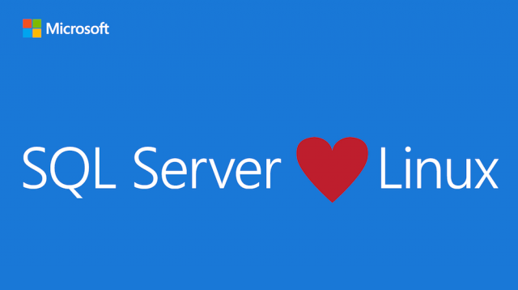

##  一、在Windows上安装并配置MySql

1、先到[官网](https://dev.mysql.com/downloads/windows/installer/)上下载最新的发行版本5.7.18（社区版），选择mysql-installer-community-5.7.18.1.msi，因为它已经包含了Server和Workbench。

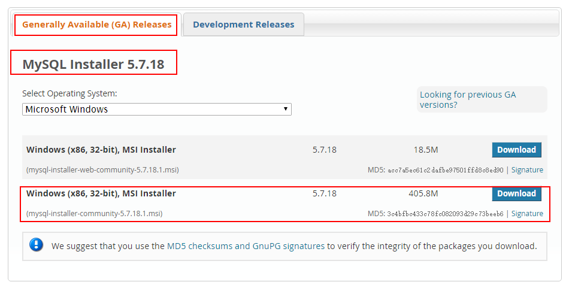

2、双击下载好的文件开始安装，这个版本的安装体验自我感觉已经比5.5的好了很多。如果嫌麻烦的话，你可以直接选择第一个选项“Developer   Default”——默认的开发环境来进行安装，非常省事。不过我是一个.Netor，有些内容并不是必须的，所以我选择“Customer”自定义来进行安装了，接着下一步、

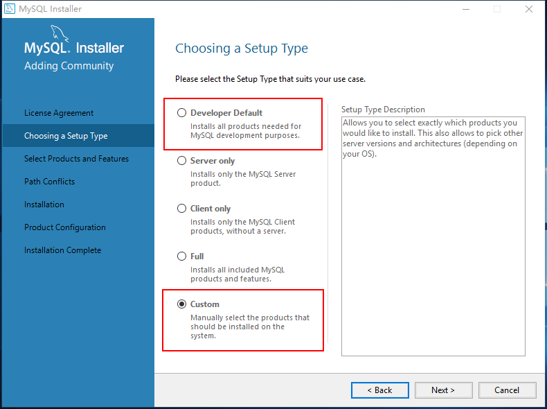

3、下面我列出来自定义选择的一些安装内容简介

| MySQL Server    | MySQL 服务器（必不可少，你懂的~）                           |
| --------------- | ----------------------------------------------------------- |
| MySQL Workbench | MySQL的数据库建模工具（类似于SQL Server Management Studio） |
| MySQL Notifier  | MySQL的DBA辅助工具（安装好之后右下角会有一个小托盘）        |
| Connector/ODBC  | 数据库与应用程序的互连标准                                  |
| Connnector/NET  | .NET程序的数据库驱动                                        |

其他一些高级功能比如MySQL Router，VS的可视化连接工具，Shell，文档介绍等等就暂时忽略，以后需要的话可以随时安装

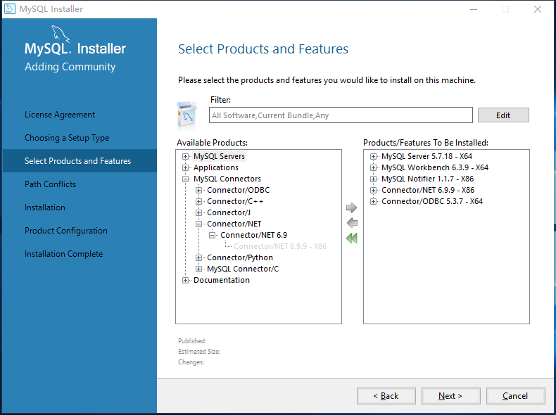

4、接下来选择一个安装路径，然后点击Execute进行安装即可

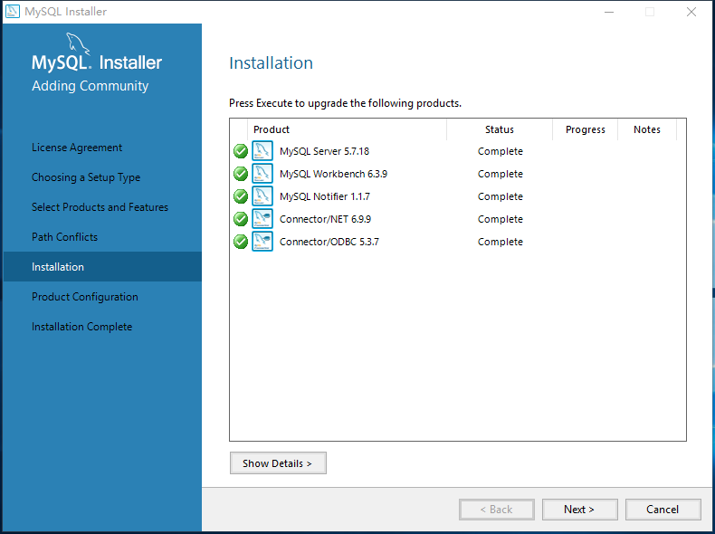

5、服务器配置类型选择开发环境“Development Machine”，端口默认3306，然后下一步

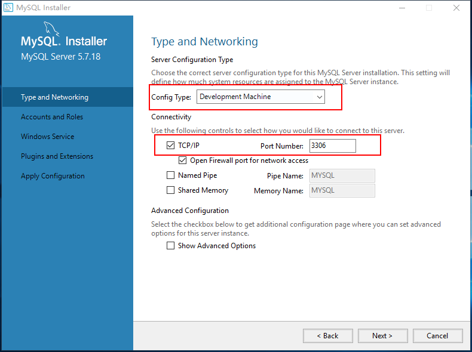

6、然后给Root账户设置一个密码。其他账户你可以选择暂时不添加，继续下一步

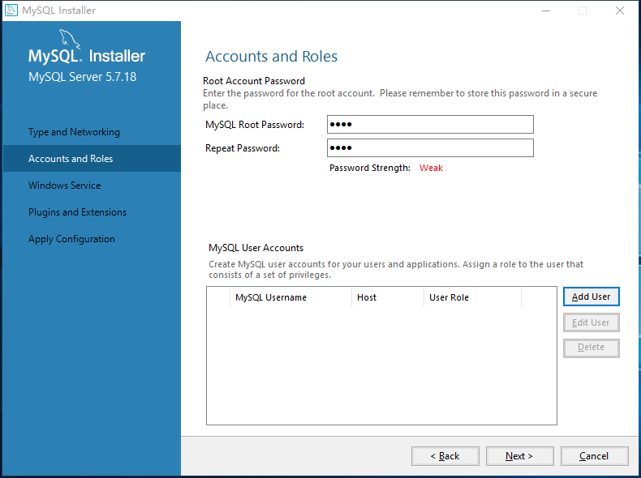

7、将MySQL配置成一个Windows服务，并设置为开机启动

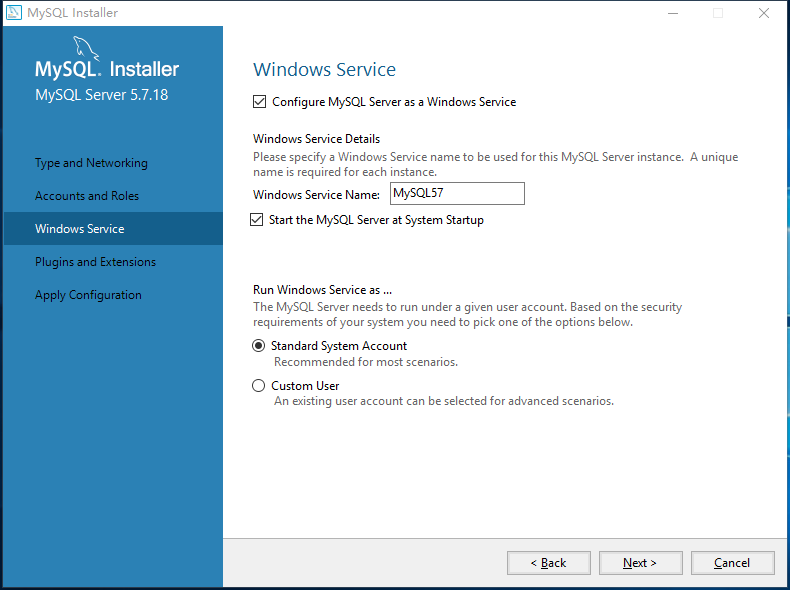

8、应用你的所有配置，并完成安装。整个过程耗时还是挺少的

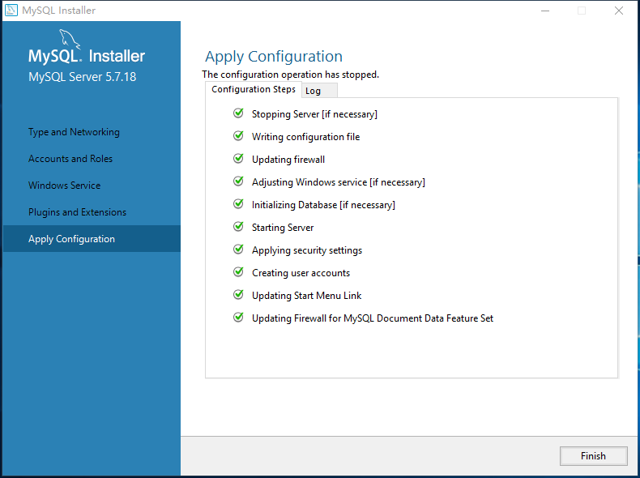

9、启动MySQL，输入你刚才设置的root账户的密码进行登陆。出现以下页面，说明已经大功告成。

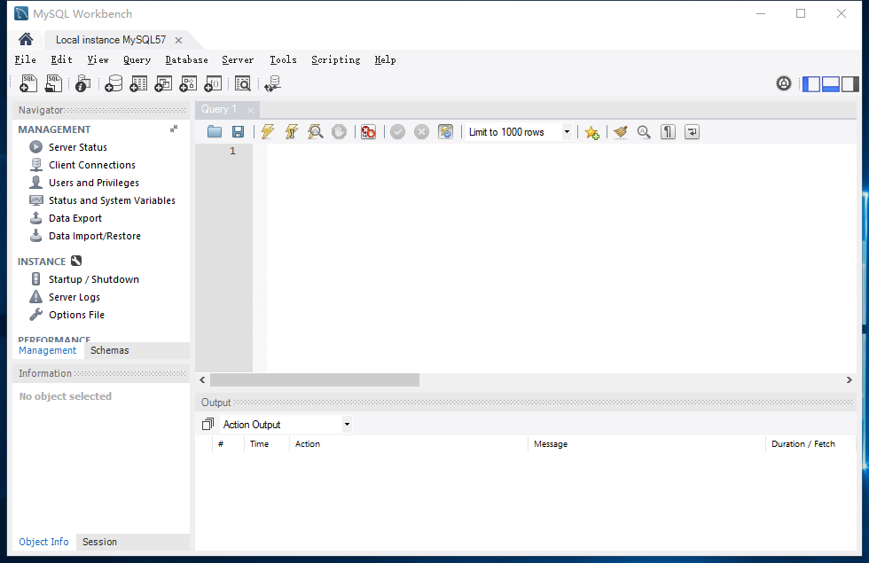

##  二、添加MySql.Data.EntityFrameworkCore到仓储模块

1、打开工具=》Nuget包管理器=》程序包管理控制台，输入以下命令进行包的安装，同时依赖也会跟着一起引入到项目中去

```
Install-Package MySql.Data.EntityFrameworkCore -Pre
```

几个注意点这里说明一下：

a）、通过Nuget包管理器界面进行安装的时候记得勾选“包括预发行版”，然后再进行搜索

b）、命令行记得带上“-Pre”，表示预发行版本

c）、安装的默认项目时选择仓储模块Light.Repository

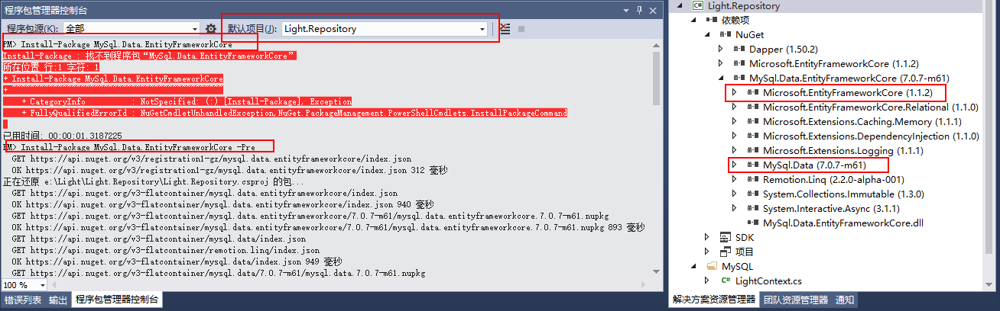

2、构建MySQL数据库上下文，注意红色字体的描述

[](javascript:void(0);)

```
    /// <summary>
    /// MySQL数据库访问上下文
    /// </summary>
    public class LightContext : DbContext
    {
        public LightContext(DbContextOptions<LightContext> options)
            : base(options)
        {
        }

        public DbSet<User> User { get; set; }
    }
```

[](javascript:void(0);)

[](javascript:void(0);)

```
    /// <summary>
    /// MySQL的数据库配置
    /// </summary>
    public class MySQLDataBaseConfig
    {
        /// <summary>
        /// 默认的MySQL的链接字符串
        /// </summary>
        private const string DefaultMySqlConnectionString = "server=localhost;userid=root;pwd=sasa;port=3306;database=light;";
        public static LightContext CreateContext(string mySqlConnectionString = null)
        {
            if (string.IsNullOrWhiteSpace(mySqlConnectionString))
            {
                mySqlConnectionString = DefaultMySqlConnectionString;
            }
            var optionBuilder = new DbContextOptionsBuilder<LightContext>();
            optionBuilder.UseMySQL(mySqlConnectionString);
            var context = new LightContext(optionBuilder.Options);
            context.Database.EnsureCreated();//针对当前访问的上下文对象，如果数据库中存在该表，则不做修改；否则的话进行创建
            return context;
        }
    }
```

[](javascript:void(0);)

3、接下来就是用我们准备好的数据库上下文对用户进行简单的CRUD操作。因为得益于面向接口编程和DI的思想，只需要用EF的方式实现IUserRepository中定义的方法，然后将此注入仓储即可

[](javascript:void(0);)

```
    /// <summary>
    /// MySql中的用户仓储实现
    /// </summary>
    public class UserRepositoryMySql : IUserRepository
    {
        /// <summary>
        /// 创建一个用户
        /// </summary>
        /// <param name="entity">用户</param>
        /// <param name="connectionString">链接字符串</param>
        /// <returns></returns>
        public bool CreateEntity(User entity, string connectionString = null)
        {
            using (LightContext context = MySQLDataBaseConfig.CreateContext(connectionString))
            {
                context.User.Add(entity);
                return context.SaveChanges() > 0;
            }
        }

        /// <summary>
        /// 根据主键Id删除一个用户
        /// </summary>
        /// <param name="id">主键Id</param>
        /// <param name="connectionString">链接字符串</param>
        /// <returns></returns>
        public bool DeleteEntityById(int id, string connectionString = null)
        {
            using (LightContext context = MySQLDataBaseConfig.CreateContext(connectionString))
            {
                context.User.Remove(context.Find<User>(id));
                return context.SaveChanges() > 0;
            }
        }

        /// <summary>
        /// 获取所有用户
        /// </summary>
        /// <param name="connectionString">链接字符串</param>
        /// <returns></returns>
        public IEnumerable<User> RetriveAllEntity(string connectionString = null)
        {
            using (LightContext context = MySQLDataBaseConfig.CreateContext(connectionString))
            {
                List<User> allUsers = new List<User>();
                allUsers.AddRange(context.User);
                return allUsers;
            }
        }

        /// <summary>
        /// 根据主键Id获取一个用户
        /// </summary>
        /// <param name="id">主键Id</param>
        /// <param name="connectionString">链接字符串</param>
        /// <returns></returns>
        public User RetriveOneEntityById(int id, string connectionString = null)
        {
            using (LightContext context = MySQLDataBaseConfig.CreateContext(connectionString))
            {
                return context.Find<User>(id);
            }
        }

        /// <summary>
        /// 修改一个用户
        /// </summary>
        /// <param name="entity">要修改的用户</param>
        /// <param name="connectionString">链接字符串</param>
        /// <returns></returns>
        public bool UpdateEntity(User entity, string connectionString = null)
        {
            using (LightContext context = MySQLDataBaseConfig.CreateContext(connectionString))
            {
                context.Update<User>(entity);
                return context.SaveChanges() > 0;
            }
        }
    }
```

[](javascript:void(0);)

[](javascript:void(0);)

```
    /// <summary>
    /// 注入仓储层
    /// </summary>
    public class RepositoryInjection
    {
        public static void ConfigureRepository(IServiceCollection services)
        {
            //services.AddSingleton<IUserRepository, UserRepository>();
            services.AddSingleton<IUserRepository, UserRepositoryMySql>();
        }
    }
```

[](javascript:void(0);)

4、至此，你上层的所有代码不用进行任何的变动，系统便从SqlServer切换到了MySql上。然后试着用API插入一个用户信息看看，是不是User表自动创建，并且产生了一条记录。

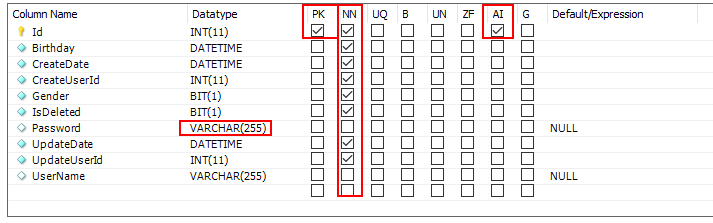

其实查看表结构不难发现，EF会默认将属性名为Id的int型作为主键，并且设置为自增。字符串string类型的话默认可空且长度为255，其他则非空。那么我们是否可以修改默认的表结构呢，答案肯定是：可以的

## 三、配置上下文中的数据库对象

 1、在LightContext中重写模型绑定的方法OnModelCreating，然后设置对应实体属性的规则，这种方式叫做Fluent API

[](javascript:void(0);)

```
protected override void OnModelCreating(ModelBuilder modelBuilder)
{
      modelBuilder.Entity<User>(m =>
      {
           m.Property(n => n.UserName).HasMaxLength(50);//设置用户名最大长度为50个字符
           m.Property(n => n.Password).HasMaxLength(20).IsRequired();//设置密码不可空且最大20个字符
      });
      base.OnModelCreating(modelBuilder);
}
```

[](javascript:void(0);)

2、本来想用Microsoft.EntityFrameworkCore.Tools结合dotnet ef相关命令直接进行更新数据库，但最后失败了

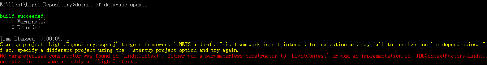

大致意思是说.NETStandard类库不适用此CLI，除非换成启动项目。然后查了下，官方也给出了解释

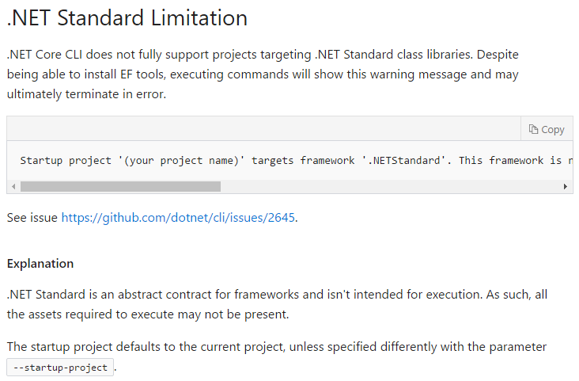

3、所以我这边偷了一个懒，直接删除刚刚生成的表，然后重新运行项目，这相当于重建了数据库表。接着查询下MySQL中User表的新结构，看看是不是已经发生了变化

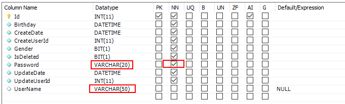

## 四：总结

其实EF Core还有更多高级的用法，实体模型间的关系，数据库的迁移等等，需要我们更加深入的学习和实践。除了官方文档外，这里安利一个挺不错的学习网站：[learnentityframeworkcore](http://www.learnentityframeworkcore.com/)，那么就到这里了，共同进步！

服务、思考、安全


标签: [EntityFrameworkCore](https://www.cnblogs.com/wangjieguang/tag/EntityFrameworkCore/), [MySQL](https://www.cnblogs.com/wangjieguang/tag/MySQL/)