#  			[向github上提交自己的project](https://www.cnblogs.com/fourmi/p/9776797.html) 		

参考博客：https://blog.csdn.net/m0_37725003/article/details/80904824

step I: 创建自己的github账户(username：fourmi1995 password:ga*s****jun***i*123 (fourmi2017@gmail.com))

step II: 创建一个新的项目，填写项目名称,描述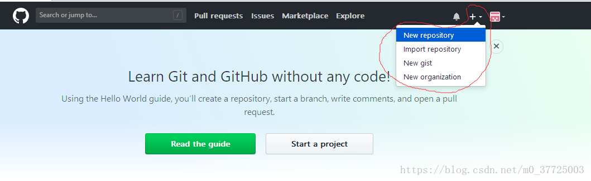

 

 

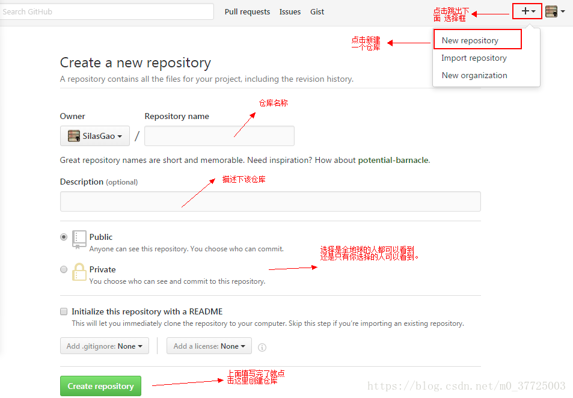

 

step III: 跳转界面如下，红色框网址需要记住

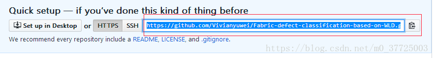

step IV: ubuntu上安装git  sudo apt-get install git 参考：https://blog.csdn.net/qq282330332/article/details/51855252

step V: CTRL+ALT+T 打开命令窗口 ，定位的待传项目所在位置

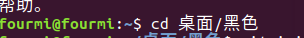

step VI: 输入命令 git init (在当前项目的目录中生成本地的git管理)

  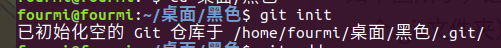

step VII: 输入命令 git add .     这个是将项目上所有的文件添加到仓库中的意思，如果想添加某个特定的文件，只需把.换成这个特定的文件名即可。

step VIII: 输入命令  git commit -m "黑色金属数据集"    表示你对这次提交的注释，双引号里面的内容可以根据个人的需要进行修改。

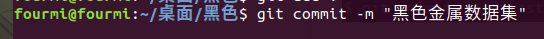

出现如下内容，则需要根据提示输入自己的帐号或名称

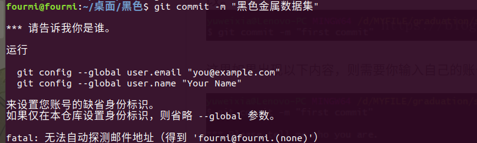

根据提示输入后，在输入命令 git commit -m "黑色金属数据集" 时就会成功。如下

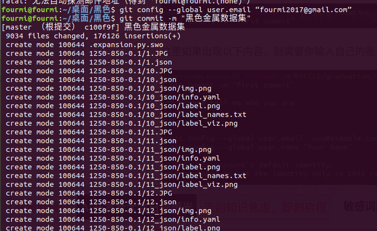

step IX: git remote add origin https://自己的仓库url地址（上面有说到） 将本地的仓库关联到github上

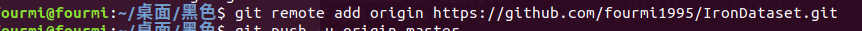

 

step X: 输入git push -u origin master，这是把代码上传到github仓库的意思。

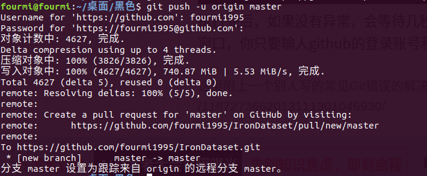

 

 

报错：

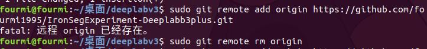

fatal: 远程origin 已经存在

解决方案：删除远程配置。

sudo git remote rm origin

取消一个目录的git初始化

sudo rm -rf .git

标签: [github](https://www.cnblogs.com/fourmi/tag/github/)