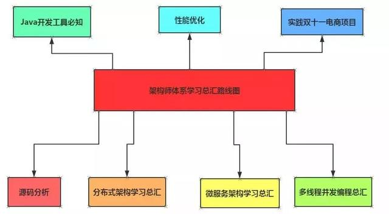
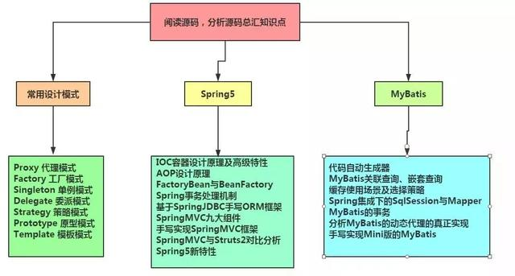
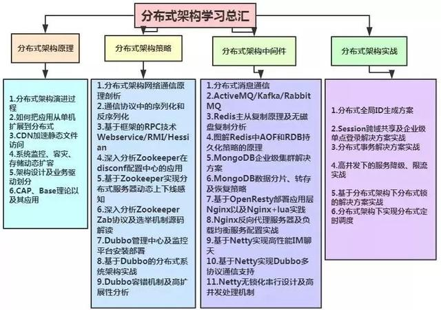
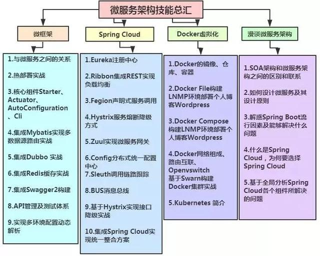
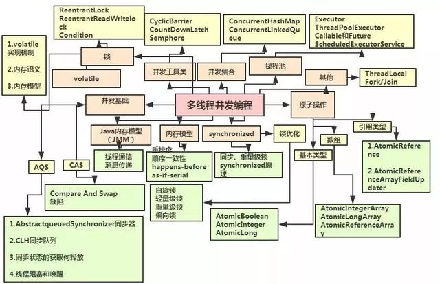
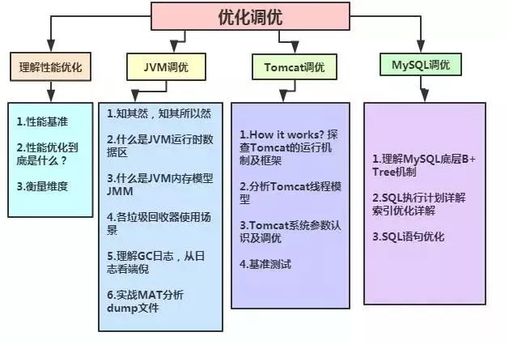
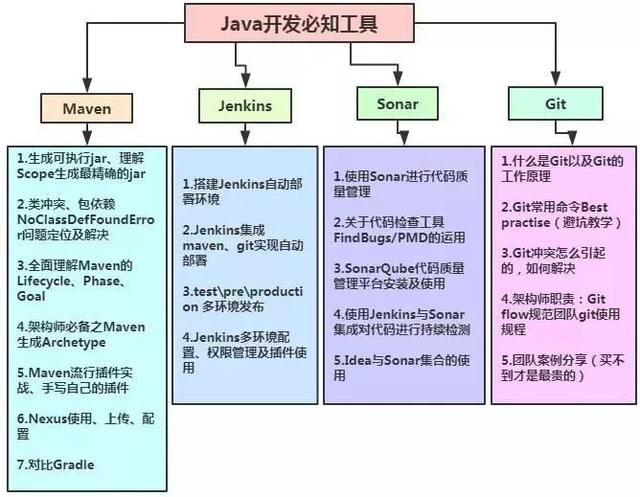
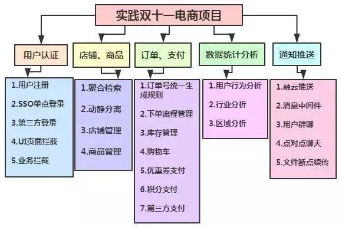

##                          十几位资深架构师，整理了最新架构师学习体系，分享给大家......                                                                             原

​                              

大树将军007

​                             发布于 03/04 22:22

字数 2028

阅读 113

收藏 0

点赞 0

[ 评论 0](https://my.oschina.net/u/3985214/blog/3017883#comments)

​                                 [Xing](https://my.oschina.net/u/3985214?q=Xing)[Java](https://my.oschina.net/u/3985214?q=Java)[Sonar](https://my.oschina.net/u/3985214?q=Sonar)[Jenkins](https://my.oschina.net/u/3985214?q=Jenkins)[MyBatis](https://my.oschina.net/u/3985214?q=MyBatis)                            

[开发十年，就只剩下这套架构体系了！ >>> ](https://my.oschina.net/u/3985214/blog/3018099?tdsourcetag=s_pcqq_aiomsg)  

> ​    不管是开发、测试、运维，每个技术人员心里都有一个成为技术大牛的梦，毕竟“梦想总是要有的，万一实现了呢”！正是对技术梦的追求，促使我们不断地努力和提升自己。然而“梦想是美好的，现实却是残酷的”，很多同学在实际工作后就会发现，梦想是成为大牛，但做的事情看起来跟大牛都不沾边，   

 


 

 

 

 

**例如：**

```
程序员说“天天写业务代码还加班，如何才能成为技术大牛”
测试说“每天都有执行不完的测试用例”
运维说“扛机器接网线敲shell命令，这不是我想要的运维人生”
```

**提升技术的误区：**

有人认为想成为技术大牛最简单直接、快速有效的方式是“拜团队技术大牛为师”，让他们平时给你开小灶，给你分配一些有难度的任务。

有这种想法是错误的，主要有这几个原因：

1、首先，大牛是很忙的，一个团队里面，如果大牛平时经常给你开小灶，难免会引起其他团队成员的疑惑，我个人认为如果团队里的大牛如果真正有心的话，多给团队培训是最好的。然而做过培训的都知道，准备一场培训是很耗费时间的，课件和材料至少2个小时（还不能是碎片时间），讲解1个小时，大牛们一个月做一次培训已经是很高频了。

2、大牛不多，不太可能每个团队都有技术大牛，只能说团队里面会有比你水平高的人，即使他每天给你开小灶，最终你也只能提升到他的水平；而如果是跨团队的技术大牛，由于工作安排和分配的原因，直接请教和辅导的机会是比较少的，单凭参加几次大牛的培训，是不太可能就成为技术大牛的。

**学习方式**

如何想办法真正的提升自己：more and more

做的更多，做的比你主管安排给你的任务更多。熟悉更多业务，不管是不是你负责的；熟悉更多代码，不管是不是你写的

**这样做有很多好处，举几个简单的例子：**

1：需求分析的时候更加准确，能够在需求阶段就识别风险、影响、难点

2：问题处理的时候更加快速，因为相关的业务和代码都熟悉，能够快速的判断问题可能的原因并进行排查处理

3：方案设计的时候考虑更加周全，由于有对全局业务的理解，能够设计出更好的方案

4：找到正确的学习路线


# 一、构成架构师的技能体系

 



 

 

 

 


# 二、阅读源码，分析源码知识点总汇

 



 

 

 

 

源码分析专题详细介绍了源码中所用到的经典设计思想及常用设计模式，先打好内功基础，了解大牛是如何写代码的，从而吸收大牛的代码功力。

结合Spring5和MyBatis源码，带你理解作者框架思维，帮助大家寻找分析源码的切入点，在思想上来一次巨大的升华。


# 三、分布式架构技能学习

有了大牛的代码功底之后，接下来可以更好地学习分布式架构技术。

分布式架构的好处和优点---->必然性，适应市场需求，能够去找一些更大的平台发展，提升自己的综合技术能力和薪资。

从分布式架构原理，到分布式架构策略，再到分布式架构中间件，最后会有分布式架构实战，让程序员可以在技术深度和技术广度上得到飞跃的提升，成为互联网行业所需要的T型人才。

 



 

 

 

 


# 四、微服务架构技能总汇

随着业务的发展，代码量的膨胀和团队成员的增加，传统单体式架构的弊端越来越凸显，严重制约了业务的快速创新和敏捷交付。为了解决传统单体架构面临的挑战，先后演进出了SOA服务化架构、RPC框架、分布式服务框架，最后就是当今非常流行的微服务架构。微服务化架构并非银弹，它的实施本身就会面临很多陷阱和挑战，涉及到设计、开发、测试、部署、运行和运维等各个方面，一旦使用不当，则会导致整个微服务架构改造的效果大打折扣，甚至失败。

 



 

 

 

 


# 五、并发编程

从Java基础接触多线程，到分布式架构环境下的高并发访问，并发编程充分利用好各个服务器处理器，以最高的效率处理各个任务协同有序工作。透彻理解锁的应用

 



 

 

 


# 六、优化调优

大家都知道，这个一直是让程序员比较头疼的问题。当系统架构变得复杂而庞大之后，xing能方面就会下降，如果想成为一名优秀的架构师，xing能优化就是你必须思考的问题。

 



**加QQ群：948368769，免费领取图上的资料**

**群内已经将知识体系整理好（源码，笔记，PPT，学习视频）进群免费领取。**

 

 

 


# 七、Java开发必知工具

一名优秀的架构师必须有适合自己的兵器，也就是工欲善其事必先利其器，不管是小白，还是资深开发，都需要先选择好的工具。工程化专题的学习能帮助你和团队提升开发效率，让自己有更多时间来思考。

Git：可以更好地管理你和你团队的代码。

Maven：可以更好地管理jar包和项目的构建等。

Jenkins：可以更好地持续编译，集成，发布你的项目。

Sonar：一个开源的代码质量分析平台，便于管理代码的质量，可检查出项目代码的漏洞和潜在的逻辑问题(提升代码的质量，更加高效地提升开发效率)。

 



 

**加QQ群：948368769，免费领取图上的资料**

**群内已经将知识体系整理好（源码，笔记，PPT，学习视频）进群免费领取。**

 

 


# 八、实践一个双十一电商项目

电商项目目的是把所学的分布式，微服务，性能调优等知识运用起来，只有在项目中你才能巩固知识，提升自己。实践电商项目会利用云服务器搭建真实的开发和部署环境，让你从零到项目实战，体验真实的企业级项目开发过程，让你具备独立开发和搭建分布架构系统的能力。

 



 

 

 

 


# 总结

要想有机会，首先你得从人群中冒出来，要想冒出来，你就必须做到与众不同，要做到与众不同，你就要做得更多！

成为技术大牛梦想虽然很美好，但是要付出很多，不管是Do more还是Do better还是Do  exercise，都需要花费时间和精力，这个过程中可能很苦逼，也可能很枯燥，这里我想特别强调一下：前面我讲的都是一些方法论的东西，但真正起决定作用的，其实还是我们对技术的热情和兴趣！