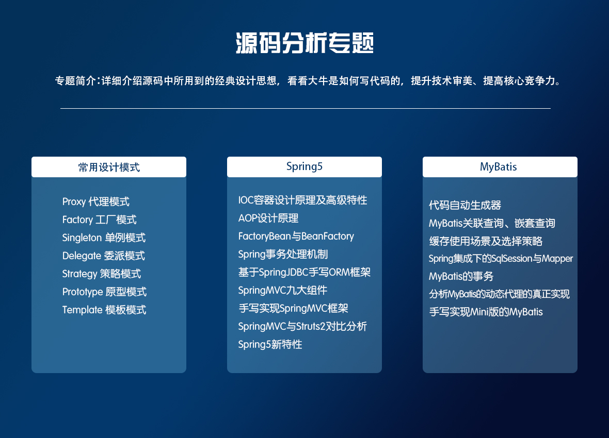
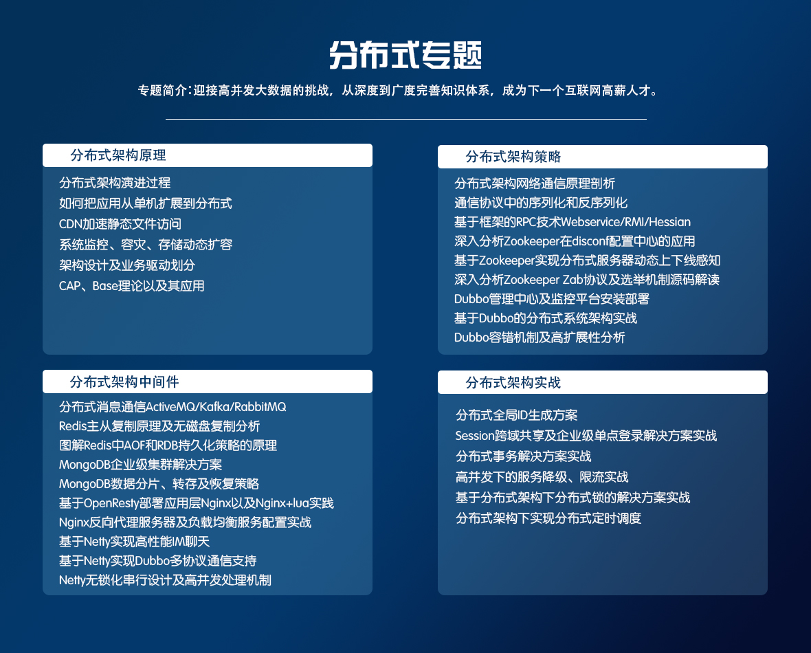
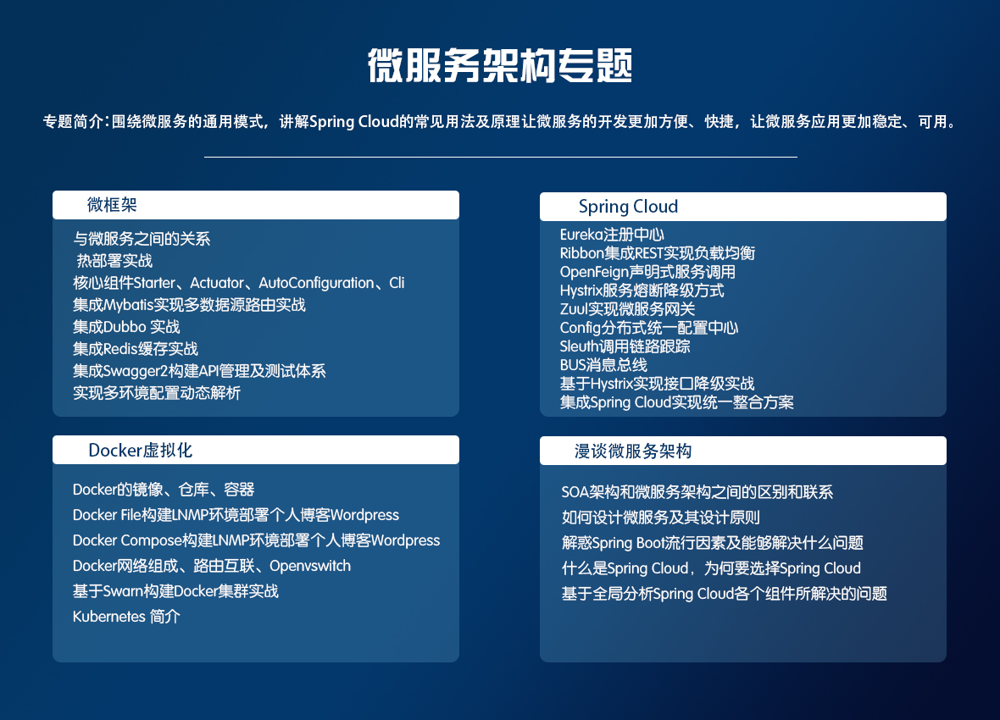
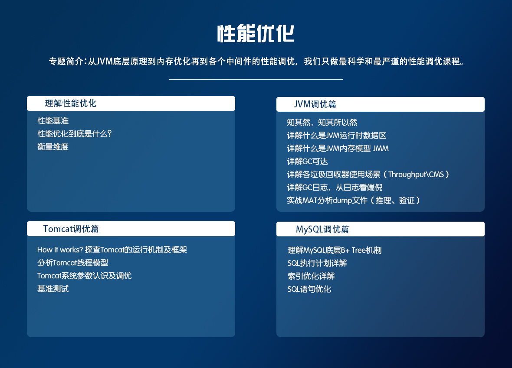
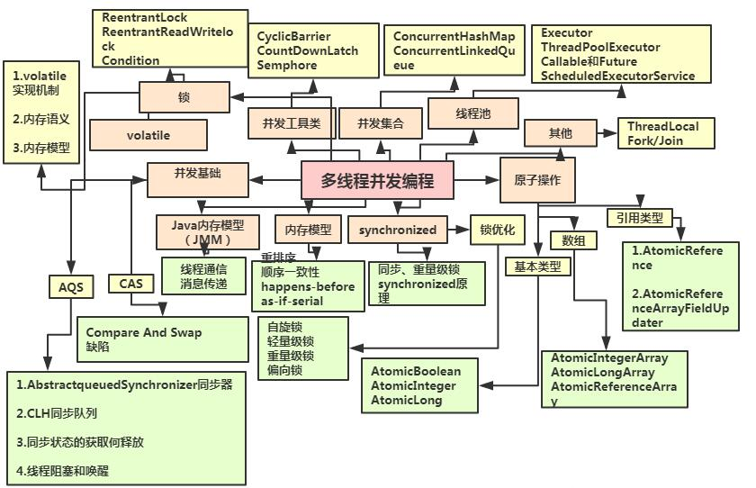
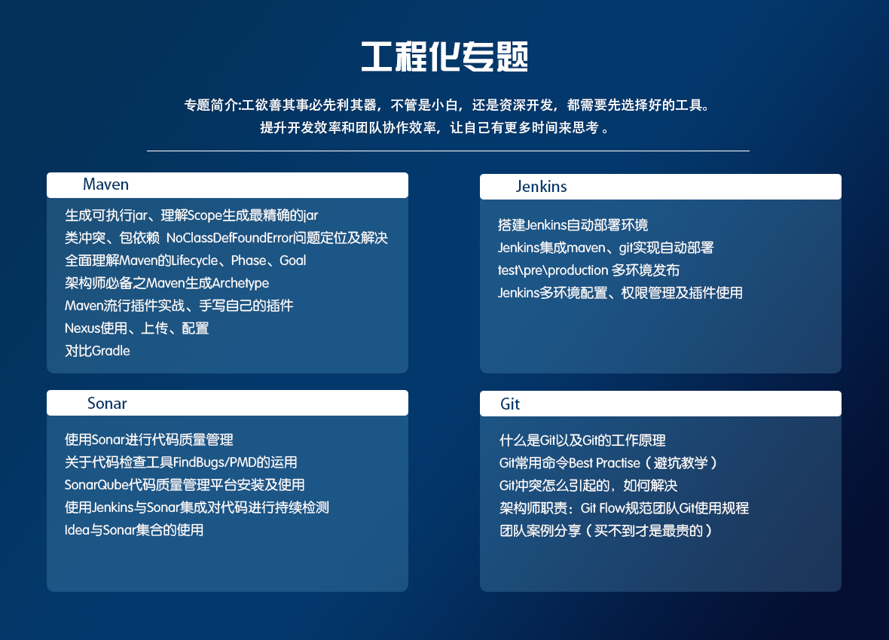
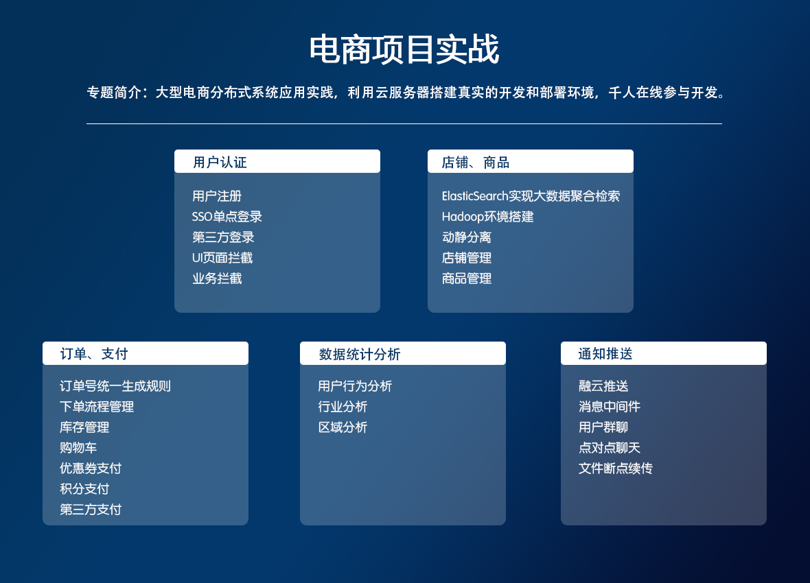

##                          开发十年，就只剩下这套架构体系了！                                                                             原                                                                                             

​                              

大树将军007

发布于 03/05 14:22

字数 1398

阅读 17916

收藏 24

点赞 9

[ 评论 1](https://my.oschina.net/u/3985214/blog/3018099?tdsourcetag=s_pcqq_aiomsg#comments)

​                                 [Java](https://my.oschina.net/u/3985214?q=Java)[MySQL](https://my.oschina.net/u/3985214?q=MySQL)[Tomcat](https://my.oschina.net/u/3985214?q=Tomcat)                            

[开发十年，就只剩下这套架构体系了！ >>> ](https://my.oschina.net/u/3985214/blog/3018099?tdsourcetag=s_pcqq_aiomsg)  

> 蓦然回首自己做开发已经十年了，这十年中我获得了很多，技术能力、培训、出国、大公司的经历，还有很多很好的朋友。但再仔细一想，这十年中我至少浪费了五年时间，这五年可以足够让自己成长为一个优秀的程序员，可惜我错过了，我用这五年时间和很多程序员一样在困惑和迷茫中找不到出路！

路其实一直都在那里，只是我们看不到而已！

以前我一直被公司和技术牵着走，并不是自己在选择技术，而是不自觉地被推到了这个位置上。想想有多少人对于自己将来要从事的职业和技术类型进行过深入思考和比较呢？当我跳出编码后，我开始思考和程序及程序员职业生涯相关的问题，最后发现，影响我们走入今天的困局的竟然是一些我们常常挂在嘴边的话。

　　今天，就为大家整理一份目前互联网公司最主流的技术选型：

**阅读源码**

程序员每天都和代码打交道。经过数年的基础教育和职业培训，大部分程序员都会「写」代码，或者至少会抄代码和改代码。但是，会读代码的并不在多数，会读代码又真正读懂一些大项目的源码的，少之又少。这也造成了很多错误看源码的方式。

那要如何正确的分析源码呢？

**分布式架构**

随着我们的业务量越来越大和越重要，单体的架构模式已经无法对应大规模的应用场景，而且系统中决不能存在单点故障导致整体不可用，所以只有垂直或是水平拆分业务系统，使其形成一个分布式的架构，利用分布式架构来冗余系统消除单点的故障，从而提高整个系统的可用性。同时分布式系统的模块重用度更高，速度更快，扩展性更高是大型的项目必不可少的环节。

**微服务**
 关于微服务架构的取舍
 1、在合适的项目，合适的团队，采用微服务架构收益会大于成本。
 2、微服务架构有很多吸引人的地方，但在拥抱微服务之前，也需要认清它所带来的挑战。
 3、需要避免为了“微服务”而“微服务”。
 4、微服务架构引入策略 – 对传统企业而言，开始时可以考虑引入部分合适的微服务架构原则对已有系统进行改造或新建微服务应用，逐步探索及积累微服务架构经验，而非全盘实施微服务架构。

**性能优化**

我们不仅仅对项目要运筹帷幄，还要能解决一切性能问题。只有深入学习JVM底层原理，Mysql底层优化以及Tomcat调优，才能达到知其然，知其所以然的效果。除了性能优化之外，也能提供通用的常见思路以及方案选型的考虑点，帮助大家培养在方案选型时的意识、思维以及做各种权衡的能力。

**并发编程**

主要培养编程者深入了解最底层的运作原理，加强编程者逻辑思维，这样才能写出高效、安全、可靠的多线程并发程序。

**开发工具**

通过一小段描述信息来管理项目的构建，报告和文档的软件项目管理工具。用于监控持续重复的工作，旨在提供一个开放易用的软件平台，使软件的持续集成变成可能。 可以有效、高速的处理从很小到非常大的项目版本管理

**项目实战**

要想立足于互联网公司，且能在互联网浪潮中不被淹没，对于项目的开发实战演练是不必可少的技能，也是对自身能力的一个衡量，有多少的量对等于获得多少的回报。看似简单的一个项目需求图谱，其中的底层原理，实现原理又能知道多少？

## **以上这些技术如何学习呢？有没有免费资料？**

对Java技术，架构技术感兴趣的朋友，欢迎加QQ群：[**855840589**](https://jq.qq.com/?_wv=1027&k=57mfMvt)，一起学习，相互讨论。

群内已经有小伙伴将知识体系整理好（源码，PPT，学习视频等资料）欢迎加群免费领取。

扫码或者点击QQ群：[855840589](https://jq.qq.com/?_wv=1027&k=57mfMvt)，免费领取资料讨论学习 

分享给喜欢Java，喜欢编程，有梦想成为架构师的程序员们，希望能够帮助到你们。

**分享这份后端技术图给大家，希望对大家有所帮助，架构师很漫长，一起共勉吧！**