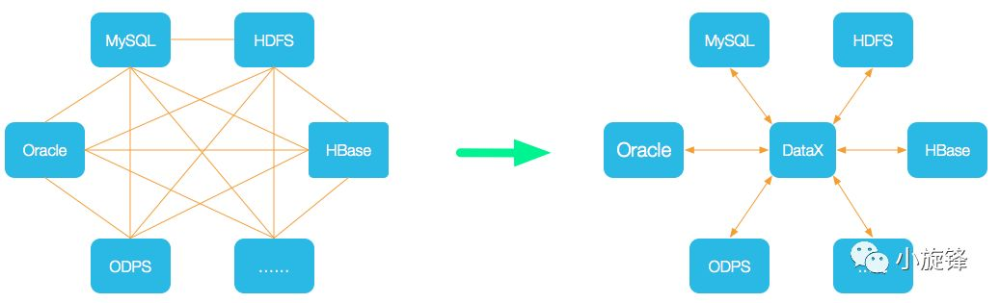
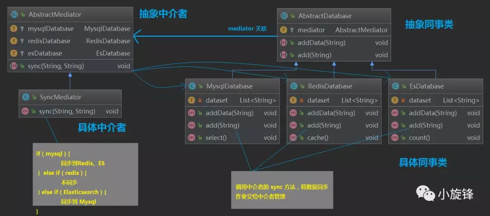

##                                                                设计模式 | 中介者模式及典型应用                                                                                  

​                                                             原创：                                                                                                              小旋锋                                                                                                                                                                                                                          [                         小旋锋                      ](javascript:void(0);)                                                                   *2018-10-26*                      

本文的主要内容：

- 介绍中介者模式

- 数据同步示例

- 中介者模式总结

- 源码分析中介者模式的典型应用

- - Java Timer 中的中介者模式

### 中介者模式

世界上存在着各种各样的数据库，不同数据库有各自的应用场景，对于同一份数据，最开始可能使用关系型数据库（如MySQL）进行存储查询，使用Redis作为缓存数据库，当数据量较大时使用MySQL进行查询可能较慢，所以需要将数据同步到Elasticsearch或者列式数据库如Hbase中进行大数据查询。

**如何设计数据同步方案**是一个重要的问题。数据源众多，目标端也众多，设计得不好可能 "牵一发而动全身"。

如果我们这样设计：每个数据源直接同步数据到目标端数据库的，如果数据库有 N 个，那么最多可能的同步作业将达到 `N * N` 个，当修改了其中一个数据库的某些配置，可能需要修改另外的 `N - 1` 个数据库的同步作业。

现在介绍另一种方案，DataX  是阿里巴巴集团内被广泛使用的离线数据同步工具/平台，实现包括  MySQL、Oracle、SqlServer、Postgre、HDFS、Hive、ADS、HBase、TableStore(OTS)、MaxCompute(ODPS)、DRDS  等各种异构数据源之间高效的数据同步功能。

DataX

DataX 其实相当于一个中介，从数据源读取数据，写入到目标端，数据源不再需要维护到目标端的同步作业，只需要与 DataX 通信即可。DataX 体现了中介者模式的思想。

**中介者模式(Mediator Pattern)**：用一个中介对象（中介者）来封装一系列的对象交互，中介者使各对象不需要显式地相互引用，从而使其耦合松散，而且可以独立地改变它们之间的交互。中介者模式又称为调停者模式，它是一种对象行为型模式。

#### 角色

**Mediator（抽象中介者）**：它定义一个接口，该接口用于与各同事对象之间进行通信。

**ConcreteMediator（具体中介者）**：它是抽象中介者的子类，通过协调各个同事对象来实现协作行为，它维持了对各个同事对象的引用。

**Colleague（抽象同事类）**：它定义各个同事类公有的方法，并声明了一些抽象方法来供子类实现，同时它维持了一个对抽象中介者类的引用，其子类可以通过该引用来与中介者通信。

**ConcreteColleague（具体同事类）**：它是抽象同事类的子类；每一个同事对象在需要和其他同事对象通信时，先与中介者通信，通过中介者来间接完成与其他同事类的通信；在具体同事类中实现了在抽象同事类中声明的抽象方法。

中介者模式的核心在于中介者类的引入，在中介者模式中，**中介者类承担了两方面的职责**：

- **中转作用（结构性）**：通过中介者提供的中转作用，各个同事对象就不再需要显式引用其他同事，当需要和其他同事进行通信时，可通过中介者来实现间接调用。该中转作用属于中介者在结构上的支持。
- **协调作用（行为性）**：中介者可以更进一步的对同事之间的关系进行封装，同事可以一致的和中介者进行交互，而不需要指明中介者需要具体怎么做，中介者根据封装在自身内部的协调逻辑，对同事的请求进行进一步处理，将同事成员之间的关系行为进行分离和封装。

### 示例

我们来实现一个简化版的数据同步方案，有三种数据库 Mysql、Redis、Elasticsearch，其中的 Mysql 作为主数据库，当增加一条数据时**需要**同步到另外两个数据库中；Redis 作为缓存数据库，当增加一条数据时**不需要**同步到另外另个数据库；而 Elasticsearch 作为大数据查询数据库，有一个统计功能，当增加一条数据时**只需要**同步到 Mysql，所以它们之间的关系图如下所示。

简化的数据同步需求

首先我们来实现第一种**不使用**中介者模式的数据同步方案，各数据源维护各自的同步作业。

抽象数据库

```
public abstract class AbstractDatabase {
    public abstract void add(String data);

    public abstract void addData(String data);
}
```

具体数据库 Mysql，维护同步到 Redis和Elasticsearch 的同步作业

```
public class MysqlDatabase extends AbstractDatabase {
    private List<String> dataset = new ArrayList<String>();
    @Setter
    private RedisDatabase redisDatabase;
    @Setter
    private EsDatabase esDatabase;

    @Override
    public void addData(String data) {
        System.out.println("Mysql 添加数据：" + data);
        this.dataset.add(data);
    }

    @Override
    public void add(String data) {
        addData(data);
        this.redisDatabase.addData(data);   // 维护同步到Redis的同步作业
        this.esDatabase.addData(data);  // 维护同步到Elasticsearch的同步作业
    }

    public void select() {
        System.out.println("- Mysql 查询，数据：" + this.dataset.toString());
    }
}
```

具体数据库 Redis，不需要同步到其它数据库

```
public class RedisDatabase extends AbstractDatabase {
    private List<String> dataset = new LinkedList<String>();

    @Override
    public void addData(String data) {
        System.out.println("Redis 添加数据：" + data);
        this.dataset.add(data);
    }

    @Override
    public void add(String data) {
        addData(data); // 不同步到其它数据库
    }

    public void cache() {
        System.out.println("- Redis 缓存的数据：" + this.dataset.toString());
    }
}
```

Elasticsearch ，只需要同步到Mysql

```
public class EsDatabase extends AbstractDatabase {
    private List<String> dataset = new CopyOnWriteArrayList<String>();
    @Setter
    private MysqlDatabase mysqlDatabase;
    @Override
    public void addData(String data) {
        System.out.println("ES 添加数据：" + data);
        this.dataset.add(data);
    }

    @Override
    public void add(String data) {
        addData(data);
        this.mysqlDatabase.addData(data);   // 维护同步到MySQL的同步作业
    }

    public void count() {
        int count = this.dataset.size();
        System.out.println("- Elasticsearch 统计，目前有 " + count + " 条数据，数据：" + this.dataset.toString());
    }
}
```

测试客户端，分别往三个数据库中加入一些数据查看同步效果

```
public class Client {
    public static void main(String[] args) {
        MysqlDatabase mysqlDatabase = new MysqlDatabase();
        RedisDatabase redisDatabase = new RedisDatabase();
        EsDatabase esDatabase = new EsDatabase();

        mysqlDatabase.setRedisDatabase(redisDatabase);
        mysqlDatabase.setEsDatabase(esDatabase);
        esDatabase.setMysqlDatabase(mysqlDatabase);

        System.out.println("\n---------mysql 添加数据 1，将同步到Redis和ES中-----------");
        mysqlDatabase.add("1");

        mysqlDatabase.select();
        redisDatabase.cache();
        esDatabase.count();

        System.out.println("\n---------Redis添加数据 2，将不同步到其它数据库-----------");
        redisDatabase.add("2");

        mysqlDatabase.select();
        redisDatabase.cache();
        esDatabase.count();

        System.out.println("\n---------ES 添加数据 3，只同步到 Mysql-----------");
        esDatabase.add("3");

        mysqlDatabase.select();
        redisDatabase.cache();
        esDatabase.count();
    }
}
```

输出结果

```
---------mysql 添加数据 1，将同步到Redis和ES中-----------
Mysql 添加数据：1
Redis 添加数据：1
ES 添加数据：1
- Mysql 查询，数据：[1]
- Redis 缓存的数据：[1]
- Elasticsearch 统计，目前有 1 条数据，数据：[1]

---------Redis添加数据 2，将不同步到其它数据库-----------
Redis 添加数据：2
- Mysql 查询，数据：[1]
- Redis 缓存的数据：[1, 2]
- Elasticsearch 统计，目前有 1 条数据，数据：[1]

---------ES 添加数据 3，只同步到 Mysql-----------
ES 添加数据：3
Mysql 添加数据：3
- Mysql 查询，数据：[1, 3]
- Redis 缓存的数据：[1, 2]
- Elasticsearch 统计，目前有 2 条数据，数据：[1, 3]
```

其实这样已经实现了我们的需求，但是**存在一些问题**：

- **系统结构复杂且耦合度高**。数据源需要维护目标端数据库的引用，以便完成数据同步
- **组件的可重用性差**。由于每一个数据源和目标端之间具有很强的关联，若没有目标端的支持，这个组件很难被另一个系统或模块重用
- **系统的可扩展性差**：如果需要增加、修改或删除其中一个数据库、将导致多个类的源代码需要修改，这违反了 "开闭原则"，可扩展性和灵活性欠佳。

我们**使用中介者模式来重构**，将数据同步的功能迁移到中介者中，由中介者来管理数据同步作业

首先还是抽象数据库类（抽象同事类），维护了一个中介者

```
public abstract class AbstractDatabase {
    public static final String MYSQL = "mysql";
    public static final String REDIS = "redis";
    public static final String ELASTICSEARCH = "elasticsearch";

    protected AbstractMediator mediator;    // 中介者

    public AbstractDatabase(AbstractMediator mediator) {
        this.mediator = mediator;
    }

    public abstract void addData(String data);

    public abstract void add(String data);
}
```

Mysql 数据库（具体同事类）

```
public class MysqlDatabase extends AbstractDatabase {
    private List<String> dataset = new ArrayList<String>();

    public MysqlDatabase(AbstractMediator mediator) {
        super(mediator);
    }

    @Override
    public void addData(String data) {
        System.out.println("Mysql 添加数据：" + data);
        this.dataset.add(data);
    }

    @Override
    public void add(String data) {
        addData(data);
        this.mediator.sync(AbstractDatabase.MYSQL, data); // 数据同步作业交给中介者管理
    }

    public void select() {
        System.out.println("Mysql 查询，数据：" + this.dataset.toString());
    }
}
```

Redis 数据库（具体同事类）

```
public class RedisDatabase extends AbstractDatabase {
    private List<String> dataset = new LinkedList<String>();

    public RedisDatabase(AbstractMediator mediator) {
        super(mediator);
    }

    @Override
    public void addData(String data) {
        System.out.println("Redis 添加数据：" + data);
        this.dataset.add(data);
    }

    @Override
    public void add(String data) {
        addData(data);
        this.mediator.sync(AbstractDatabase.REDIS, data);    // 数据同步作业交给中介者管理
    }

    public void cache() {
        System.out.println("Redis 缓存的数据：" + this.dataset.toString());
    }
}
```

Elasticsearch（具体同事类）

```
public class EsDatabase extends AbstractDatabase {
    private List<String> dataset = new CopyOnWriteArrayList<String>();

    public EsDatabase(AbstractMediator mediator) {
        super(mediator);
    }

    @Override
    public void addData(String data) {
        System.out.println("ES 添加数据：" + data);
        this.dataset.add(data);
    }

    @Override
    public void add(String data) {
        addData(data);
        this.mediator.sync(AbstractDatabase.ELASTICSEARCH, data);    // 数据同步作业交给中介者管理
    }

    public void count() {
        int count = this.dataset.size();
        System.out.println("Elasticsearch 统计，目前有 " + count + " 条数据，数据：" + this.dataset.toString());
    }
}
```

抽象中介者

```
@Data
public abstract class AbstractMediator {
    protected MysqlDatabase mysqlDatabase;
    protected RedisDatabase redisDatabase;
    protected EsDatabase esDatabase;

    public abstract void sync(String databaseName, String data);
}
```

具体中介者

```
public class SyncMediator extends AbstractMediator {
    @Override
    public void sync(String databaseName, String data) {
        if (AbstractDatabase.MYSQL.equals(databaseName)) {
            // mysql 同步到 redis 和 Elasticsearch
            this.redisDatabase.addData(data);
            this.esDatabase.addData(data);
        } else if (AbstractDatabase.REDIS.equals(databaseName)) {
            // redis 缓存同步，不需要同步到其他数据库
        } else if (AbstractDatabase.ELASTICSEARCH.equals(databaseName)) {
            // Elasticsearch 同步到 Mysql
            this.mysqlDatabase.addData(data);
        }
    }
}
```

测试客户端

```
public class Client {
    public static void main(String[] args) {
        AbstractMediator syncMediator = new SyncMediator();
        MysqlDatabase mysqlDatabase = new MysqlDatabase(syncMediator);
        RedisDatabase redisDatabase = new RedisDatabase(syncMediator);
        EsDatabase esDatabase = new EsDatabase(syncMediator);

        syncMediator.setMysqlDatabase(mysqlDatabase);
        syncMediator.setRedisDatabase(redisDatabase);
        syncMediator.setEsDatabase(esDatabase);

        System.out.println("\n---------mysql 添加数据 1，将同步到Redis和ES中-----------");
        mysqlDatabase.add("1");
        mysqlDatabase.select();
        redisDatabase.cache();
        esDatabase.count();

        System.out.println("\n---------Redis添加数据 2，将不同步到其它数据库-----------");
        redisDatabase.add("2");
        mysqlDatabase.select();
        redisDatabase.cache();
        esDatabase.count();

        System.out.println("\n---------ES 添加数据 3，只同步到 Mysql-----------");
        esDatabase.add("3");
        mysqlDatabase.select();
        redisDatabase.cache();
        esDatabase.count();
    }
}
```

输出结果，与预期一致

```
---------mysql 添加数据 1，将同步到Redis和ES中-----------
Mysql 添加数据：1
Redis 添加数据：1
ES 添加数据：1
- Mysql 查询，数据：[1]
- Redis 缓存的数据：[1]
- Elasticsearch 统计，目前有 1 条数据，数据：[1]

---------Redis添加数据 2，将不同步到其它数据库-----------
Redis 添加数据：2
- Mysql 查询，数据：[1]
- Redis 缓存的数据：[1, 2]
- Elasticsearch 统计，目前有 1 条数据，数据：[1]

---------ES 添加数据 3，只同步到 Mysql-----------
ES 添加数据：3
Mysql 添加数据：3
- Mysql 查询，数据：[1, 3]
- Redis 缓存的数据：[1, 2]
- Elasticsearch 统计，目前有 2 条数据，数据：[1, 3]
```

画出类图如下

示例.中介者模式

### 中介者模式总结

#### 中介者模式的主要优点

- 中介者模式**简化了对象之间的交互**，它用中介者和同事的一对多交互代替了原来同事之间的多对多交互，一对多关系更容易理解、维护和扩展，将原本难以理解的网状结构转换成相对简单的星型结构。
- 中介者模式可**将各同事对象解耦**。中介者有利于各同事之间的松耦合，我们可以独立的改变和复用每一个同事和中介者，增加新的中介者和新的同事类都比较方便，更好地符合 "开闭原则"。
- 可以**减少子类生成**，中介者将原本分布于多个对象间的行为集中在一起，改变这些行为只需生成新的中介者子类即可，这使各个同事类可被重用，无须对同事类进行扩展。

#### 中介者模式的主要缺点

- 在**具体中介者类中包含了大量同事之间的交互细节**，可能会导致具体中介者类非常复杂，使得系统难以维护。（也就是把具体同事类之间的交互复杂性集中到了中介者类中，结果中介者成了最复杂的类）

#### 适用场景

- 系统中对象之间存在复杂的引用关系，系统结构混乱且难以理解。
- 一个对象由于引用了其他很多对象并且直接和这些对象通信，导致难以复用该对象。
- 想通过一个中间类来封装多个类中的行为，而又不想生成太多的子类。可以通过引入中介者类来实现，在中介者中定义对象交互的公共行为，如果需要改变行为则可以增加新的具体中介者类。

### 中介者模式的典型应用

#### Java Timer 中的中介者模式

敲一个 `java.util.Timer` 的Demo

两个任务类

```
public class MyOneTask extends TimerTask {
    private static int num = 0;
    @Override
    public void run() {
        System.out.println("I'm MyOneTask " + ++num);
    }
}

public class MyTwoTask extends TimerTask {
    private static int num = 1000;
    @Override
    public void run() {
        System.out.println("I'm MyTwoTask " + num--);
    }
}
```

客户端测试，3秒后开始执行，循环周期为 1秒

```
public class TimerTest {
    public static void main(String[] args) {
        // 注意：多线程并行处理定时任务时，Timer运行多个TimeTask时，只要其中之一没有捕获抛出的异常，
        // 其它任务便会自动终止运行，使用ScheduledExecutorService则没有这个问题
        Timer timer = new Timer();
        timer.schedule(new MyOneTask(), 3000, 1000); // 3秒后开始运行，循环周期为 1秒
        timer.schedule(new MyTwoTask(), 3000, 1000);
    }
}
```

输出

```
I'm MyOneTask 1
I'm MyTwoTask 1000
I'm MyTwoTask 999
I'm MyOneTask 2
I'm MyOneTask 3
I'm MyTwoTask 998
I'm MyTwoTask 997
I'm MyOneTask 4
I'm MyOneTask 5
I'm MyTwoTask 996
I'm MyTwoTask 995
I'm MyOneTask 6
...
```

`Timer` 的部分关键源码如下

```
public class Timer {

    private final TaskQueue queue = new TaskQueue();
    private final TimerThread thread = new TimerThread(queue);

    public void schedule(TimerTask task, long delay) {
        if (delay < 0)
            throw new IllegalArgumentException("Negative delay.");
        sched(task, System.currentTimeMillis()+delay, 0);
    }

    public void schedule(TimerTask task, Date time) {
        sched(task, time.getTime(), 0);
    }

    private void sched(TimerTask task, long time, long period) {
        if (time < 0)
            throw new IllegalArgumentException("Illegal execution time.");

        if (Math.abs(period) > (Long.MAX_VALUE >> 1))
            period >>= 1;

        // 获取任务队列的锁(同一个线程多次获取这个锁并不会被阻塞,不同线程获取时才可能被阻塞)
        synchronized(queue) {
            // 如果定时调度线程已经终止了,则抛出异常结束
            if (!thread.newTasksMayBeScheduled)
                throw new IllegalStateException("Timer already cancelled.");

            // 再获取定时任务对象的锁(为什么还要再加这个锁呢?想不清)
            synchronized(task.lock) {
                // 判断线程的状态,防止多线程同时调度到一个任务时多次被加入任务队列
                if (task.state != TimerTask.VIRGIN)
                    throw new IllegalStateException(
                        "Task already scheduled or cancelled");
                // 初始化定时任务的下次执行时间
                task.nextExecutionTime = time;
                // 重复执行的间隔时间
                task.period = period;
                // 将定时任务的状态由TimerTask.VIRGIN(一个定时任务的初始化状态)设置为TimerTask.SCHEDULED
                task.state = TimerTask.SCHEDULED;
            }

            // 将任务加入任务队列
            queue.add(task);
            // 如果当前加入的任务是需要第一个被执行的(也就是他的下一次执行时间离现在最近)
            // 则唤醒等待queue的线程(对应到上面提到的queue.wait())
            if (queue.getMin() == task)
                queue.notify();
        }
    }

    // cancel会等到所有定时任务执行完后立刻终止定时线程
    public void cancel() {
        synchronized(queue) {
            thread.newTasksMayBeScheduled = false;
            queue.clear();
            queue.notify();  // In case queue was already empty.
        }
    }
    // ...
}
```

`Timer` 中在 `schedulexxx` 方法中通过 `TaskQueue` 协调各种 `TimerTask` 定时任务，`Timer` 是中介者，`TimerTask` 是抽象同事类，而我们自己写的任务则是具体同事类

`TimerThread` 是 `Timer` 中定时调度线程类的定义，这个类会做为一个线程一直运行来执行 `Timer` 中任务队列中的任务。

`Timer` 这个中介者的功能就是**定时调度我们写的各种任务**，将任务添加到 `TaskQueue` 任务队列中，给 `TimerThread` 执行，让任务与执行线程解耦

#### 其他的中介者模式应用

- `java.util.concurrent.Executor#execute` 和 `java.util.concurrent.ExecutorService#submit` 与 `Timer#schedule` 类似
- MVC模式中，Controller 是中介者，根据 View 层的请求来操作 Model 层

> 参考：   
> 刘伟：设计模式Java版   
> 慕课网java设计模式精讲 Debug 方式+内存分析    
> java.util系列源码解读之Timer定时器

### 后记

欢迎评论、转发、分享，您的支持是我最大的动力

点击【阅读原文】即可访问我的个人博客：http://laijianfeng.org

长按关注【小旋锋】微信公众号

#### 推荐阅读

[设计模式 | 组合模式及典型应用](https://mp.weixin.qq.com/s?__biz=MzI1NDU0MTE1NA==&mid=2247483742&idx=1&sn=436670dc4793c6c9e7207ca6222e062c&chksm=e9c2ed53deb56445c7fb1aef89ab80b23bab96e6f9993618c98e1746209eec05f36b231cfaa8&scene=21#wechat_redirect)    
[设计模式 | 模板方法模式及典型应用](https://mp.weixin.qq.com/s?__biz=MzI1NDU0MTE1NA==&mid=2247483747&idx=1&sn=aa494215a2933e2424a6daa03587e478&chksm=e9c2ed6edeb564783b9acd9f5372a08d53d04b001ca362c9213c4379bc7e1bff363e4ad01e3c&scene=21#wechat_redirect)    
[设计模式 | 迭代器模式及典型应用](https://mp.weixin.qq.com/s?__biz=MzI1NDU0MTE1NA==&mid=2247483752&idx=1&sn=7880679f18b5727ea64cd05c06817c35&chksm=e9c2ed65deb56473da688784c4562995c24daf4b13425d0d4d080208728b86525f6600127925&scene=21#wechat_redirect)     
[设计模式 | 策略模式及典型应用](https://mp.weixin.qq.com/s?__biz=MzI1NDU0MTE1NA==&mid=2247483757&idx=1&sn=9f6b63370e7b41190c325f72286eab2d&chksm=e9c2ed60deb56476f2092558d61f3e91f833f80796c93b54c067baecd1512d6749f9bd278974&scene=21#wechat_redirect)   
[设计模式之观察者模式及典型应用](https://mp.weixin.qq.com/s?__biz=MzI1NDU0MTE1NA==&mid=2247483762&idx=1&sn=2ac98e9e5583f24edab96c380dfdd65e&chksm=e9c2ed7fdeb5646983c44a78c988e11dc6d00c6b08bb4140e3a730bcee681dfe95d7ba1ea7b9&scene=21#wechat_redirect)   
[设计模式 | 备忘录模式及典型应用](https://mp.weixin.qq.com/s?__biz=MzI1NDU0MTE1NA==&mid=2247483767&idx=1&sn=e7b1ed97976967e6fd55ea311555aeab&chksm=e9c2ed7adeb5646c54f88237d34c9ad16fcc8bdb584448fe2052297af9f219d1fd4de8a06d83&scene=21#wechat_redirect)


​          [阅读原文](https://mp.weixin.qq.com/s?__biz=MzI1NDU0MTE1NA==&mid=2247483773&idx=1&sn=489a21c65eaf41c263cceb41eaea6c76&scene=19##)                                       

​               


微信扫一扫
关注该公众号