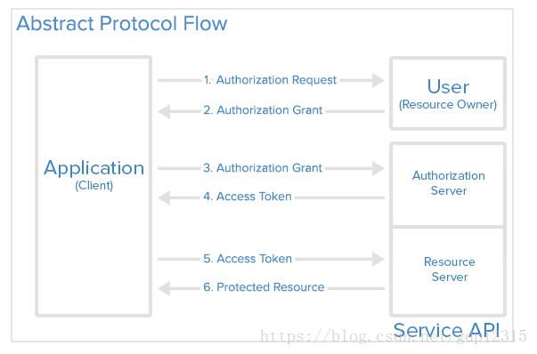
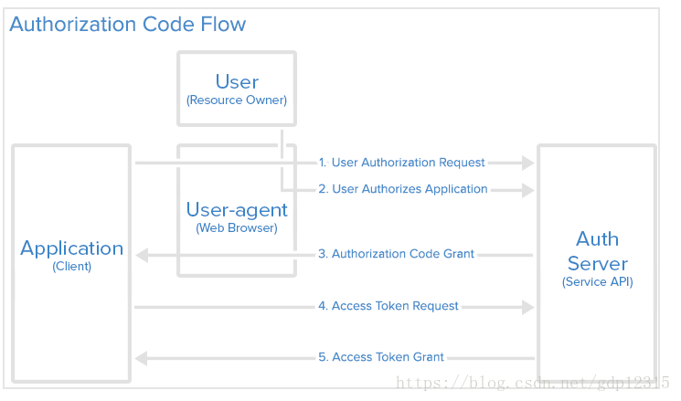

 					                   					 				

# 4种认证（authentication）或授权（authorization）方式

​	版权声明：本文为博主原创文章，未经博主允许不得转载。					

https://blog.csdn.net/gdp12315/article/details/79905424				

```
Authentication vs. authorization
It is easy to confuse authentication with another element of the security plan: authorization. While authentication verifies the user’s identity, authorization verifies that the user in question has the correct permissions and rights to access the requested resource. As you can see, the two work together. Authentication occurs first, then authorization.
```

authentication 认证访问者是谁 
 authorization 访问权限

authentication  一般包含两个步骤，第一步，用户需要安装服务提供的授权证书，或者用户需要使用API服务中已经存储的某个账户，也可以创建一个；第二步，每次发送请求到API服务时需要带上证书，因为RESTful  API 是不会记录客户端与服务端的会话，无状态限制。

有些认证技术还涉注册，客户端需要安装证书，并且按需要安装用户个人的证书，客户端需要将客户端的证书和用户证书一起携带发送请求。

## Basic Authentication

HTTP Basic authentication is described in RFC 2617. It’s a simple  username/password scheme.  将用户名与密码进行Base64转码，但这种转码是可逆的。某些爬虫工具可能会获取这些请求信息，直接获取用户的账号和密码，如果采用HTTPS方式发送请求，每次请求和响应会被SSL加密，爬虫无法获取这些信息。另一个问题，由于API通常不能信任用户使用的客户端，如果用户在多个设备（平板、电脑、手机）中登录了这个API服务，其中一个设备出现安全问题，需要修改密码，那么其他设备也需要重新登录才行。为了解决第二个问题，需要对每个设备给予不同的证书。

## OAuth

OAuth 是一种授权框架，能够让应用通过HTTP 服务获取有限的访问，访问用户账号信息，例如Facebook, GitHub,  DigitalOcean都采用该技术。它可以委托认证服务授权第三方应用访问自己的账号信息。OAuth2 相比OAuth  1，可以在PC端、移动端设备上使用。

OAuth 定义了四种角色： 

    1. 资源所属者，User, 拥有该资源的人，拥有Application所访问资源的权限。 

        2. 客户端， Application, 需要访问用户账号信息的应用 

        3. 资源服务器， API 

        4. 授权服务器, API

OAuth 抽象版流程图 
 

在应用（Application/Client）使用OAuth前需要在Service API 注册该应用。需要在Service中提交应用的信息：名称、网站、授权后的跳转URL。

当应用注册后，Service会发布“client credentials”客户端证书，包括client identifier 和  client secret. Client ID 是公开的字符串，提供ServiceAPI标识该应用，并且用来构建呈现给用户的授权URLs。  Client  Secret用来认证Application向ServiceAPI的发起访问用户账号信息的请求，需要确保Application与API之间的隐私。

Authorization Grant (权限授予方式) 在上图的第一步中有权限授予操作。OAuth2 提供四种授予权限的方式，根据不用场景使用： 

    1. Authorization Code： 在服务端应用采用 

        2. Implicit: 移动端APP，Web应用 

        3. Resource Owner Password Credentials:  在可信任的应用中使用 

        4. Client Credential：应用访问API采用的

Authorization Code Flow 
 

第一步，用户 访问授权请求的链接，例如

<https://cloud.digitalocean.com/v1/oauth/authorize?response_type=code&client_id=CLIENT_ID&redirect_uri=CALLBACK_URL&scope=read> 
 链接包含五个信息：

- API 授权点
- client_id: client_id, 
- redirect_uri=CALLBACK_URL
- response_type=code, 指定应用的授权的方式，采用authorization code grant 方式
- scope=read. 指定访问的等级

第二步，授权应用后，会获取authorization code 
 第三步，根据code换取 token

## Token Authentication

## JWT  <https://jwt.io/introduction/>

JWT( JSON Web Token), 是一种以Base64编码json对象的token，加密，紧凑且自成一体（self-contained），用于在网络中两个节点之间传递信息。开源标准（[RFC 7519](https://tools.ietf.org/html/rfc7519)）

JWT由三个部分组成： 
 \1. Header， 定义加密算法类型（例如：HS256）、定义类型（JWT） 
 \2. Payload， 定义token携带的主要信息 
 \3. Signature， 创建token的签名，

```
HMACSHA256(
  base64UrlEncode(header) + "." +
  base64UrlEncode(payload),
  secret)
```

# OpenID

参考： 
 <https://oauth.net/articles/authentication/> 
 <https://www.digitalocean.com/community/tutorials/an-introduction-to-oauth-2> 
 《RESTful Web API》