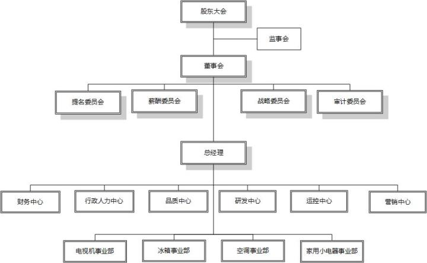

# 如何理解组织结构

[老徐说HR](https://www.zhihu.com/people/LXHRtalk)

公众号LXHRtalk，长期招咨询顾问

https://zhuanlan.zhihu.com/p/24327171

初级的人力资源管理人员由于对管理的参与深度不够（包括对业务流程和价值链的理解不够）以及对组织架构的知识有限，往往只能担任绘图员的工作，而不能参与编制组织架构或者对现有组织架构提出建设性、专业性的意见。

撰写本文是基于现代企业的基本管理逻辑以及本人的一些心得与同仁分享和探讨组织结构的知识和要点。由于组织结构本身涉及的内容很多，本文仅论述一些基本定义和概念，在之后的几期文章中将会组织结构的类型、要素、原则和设计等进行更深入的探讨。

\1.      什么是组织结构

组织结构的定义五花八门，深奥晦涩的、离经叛道的不一而足，根据我的经验，以下两个定义还是比较经典地诠释了组织结构的内涵：

定义一：“组织结构是组织的全体成员**为实现组织目标**，**在管理工作中进行分工协作**，在职务范围、责任、权利等方面所形成的结构体系。组织结构是组织在**职、责、权**方面的动态结构体系，**其本质是为实现组织战略目标而采取的一种分工协作体系，组织结构必须随着组织的重大战略调整而调整**。”

定义二：“组织结构，是指企业按照国家有关法律法规、股东（大）会决议和企业章程，结合本企业实际，明确**股东（大）会、董事会、监事会**、**经理层和企业内部各层级机构**设置、职责权限、人员编制、工作程序和相关要求的制度安排。” 

\2.      如何理解组织结构的定义？

关键词一：为实现组织目标

有了目标和理想的一群人形成了一个相对稳定的组织。进行企业组织结构的设置，自然就必须围绕着这群人的目标和理想或者说是愿景，而组织的愿景就像在广阔的地面画了一个圈——我们就在这里活动，我们专注于做这类型的产品和业务。举个例子，福特的愿景是“我要为大众生产一种汽车，它的价格如此之低，不会有人因为薪水不高而无法拥有它，人们可以和家人一起在上帝赐予的广阔无垠的大自然里陶醉于快乐的时光”，表明了福特专注于制造价格大众化的汽车，不会去投资房地产等其他产业，而且首要关注的是如何提升技术和生产效率，降低成本。所以围绕汽车制造和成本降低，福特的组织结构会包含研发、生产、销售、物流和其他辅助管理职能（如采购、财务、人力资源等），并把资源倾向于技术研发、工艺优化上，达成“为人们提供价格低廉的汽车”的目标。

关键词二：分工协作

为了提高组织效率和专业化管理，组织需要将组织任务、目标进行分工。根据分工的类别又可形成部门。下图是一般的分工方法（类别）形成的部门。

编号

分工类别

定义

例子

1

操作专业化

按操作技术进行部门划分

钳工班、车工班、铣工班等

2

职能专业化

按职能进行分工，是最常用的部门划分方式

研发部、生产部、销售部、财务部等

3

过程专业化

按产品的生产、顾客服务等过程进行部门划分 

如售前技术支持、销售（售中）、客服（售后）

4

产品专业化

按生产的产品类型进行部门划分

如美的风扇事业部、生活电器事业部、饮水设备事业部等

5

地区专业化

按地域进行部门划分，通常用于营销工作

如华东区销售部、华南区销售部等

6

顾客专业化

按顾客类型进行部门划分

如大客户部、零售服务部等

单看组织结构图，分工非常容易理解，但却看不见协作关系，甚至会误认为各部门之间是割裂的。事实上，只有在正确的组织机构设置下，才能保证围绕核心价值链的业务流程的顺畅运行，协作也就在流程的驱动下顺理成章了。反之，组织设置不合理造成职能重叠、不清或者存在间隙，部门间壁垒和障碍除了合作精神不够以外，更多的就是部门保护、回避责任的恶果了。  

关键词三：各层级机构

第二个定义更多描述的是组织中各类权力的关系，所谓所有权、管理权、监督权和经营权之间的关系，而代表以上权利的组织分别是股东会、董事会、监事会以及以总经理为核心的高层团队，这部分组织的结构通常被称作治理结构，无非是现代企业总结出的经验将所有权与经营权剥离，将管理权与经营权区分，将监督权与管理权分离，使得一个公司股东会、董事会、监视会形成稳定的三角制衡体制，最终目的是使得职业经理人在明确的授权、清晰的战略、有效的监督情况下，确保股东权益不受损害并实现增值和最大化。小型的、非公共公司或初创企业由于成本、效率以及其他原因，在治理结构上没有上述那么繁缛，但基本的治理内容还是存在的，只是做了合并的兼任。诸如董事长兼总经理等。

由此，我们通常看到的组织结构是董事会、总经理、分管副总、各部门。下图是典型的制造业的组织结构图。在初创和发展初阶段，大多数企业组织结构图所画的董事会基本是由股东本人以及一些智囊或者高管组成的团队。而并未将所有权、管理权以及经营权进行剥离，由此，也就不需要自己监督自己的监事会了。这样的设置，在企业初期往往是高效的和低成本的。

当然，我们还会看到具有更全面的治理结构的组织结构图，如下图。

此阶段的企业董事会已经具备了大多数应有的功能。根据董事会成立的目的——确保股东资产保值增值，董事会的主要职能是经营决策和监控，激励管理层、帮助管理层经营、防止管理层腐败，所以董事会通常下设诸如审计委员会、薪酬委员会、提名/治理委员会及战略投资和风险管控委员会，分工执行董事会职责。

从上述可看出，组织结构无非是一个明确角色、权力、职责分工、归属关系以及资源配置的书面描绘，绘制的原则是围绕确保的组织愿景与目标能够有序、高效达成，最终使得股东利益最大化。

发布于 2016-12-12

「随意」

还没有人赞赏，快来当第一个赞赏的人吧！

人力资源管理

组织与机构