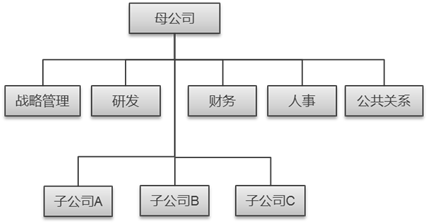
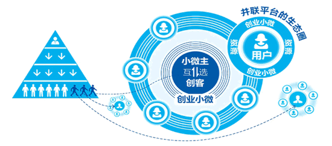

# 深度解析组织架构的模式下篇

[老徐说HR](https://www.zhihu.com/people/LXHRtalk)

公众号LXHRtalk，长期招咨询顾问

在本文上篇中我们阐述了组织结构的实质以及一个组织在婴儿期、成长期的组织结构的特点，以及成熟期矩阵式管理的特点；本文将重点阐述处于成熟期的组织以及再兴期（创新型）组织的结构特点。

成熟期——控股型组织结构

控股型组织结构是通过企业之间控股、参股，形成由母公司、子公司和关联公司的企业集团。各分部具有独立的法人资格，是总部下属的子公司，也是分权的一种组织形式。主要适用于具有以下特征的企业：

ž   规模大

ž   产业多元化

在这一时期，为寻求更大更快速的发展，企业最主要手段是通过收购与兼并扩大企业规模，进入其他以前未涉及的领域。企业内部环境为规模大，资金充足，具备大量专业人才。此时，企业形成集团公司，下辖多个参股公司。集团总部需深入研究各产业的客户特征、外部环境，结合内部环境形成战略后，根据战略和各子公司的业务特点，对子公司采用不同的管理模式：

ž   财务管理模式。集团总部只对子公司的财务目标做出要求，对子公司授予整体战略和运营的权力。总部一般只设置财务、法律和投资者关系等部门。财务管理模式偏向分权，适用于业务多元化且相关性相小的集团控股型公司。

ž    战略管理模式。集团总部为子公司设立战略方向，旨在协调发展公司的业务组合，对子公司授予在公司的战略指导下，自主运营的权力。总部一般设置战略、法律、财务部门，并适当设置有共享服务。战略管理模式介于集权与分权之间，适用于业务多元化且具有相关性的集团控股型公司。

ž    操作管理模式。集团总部广泛而频繁地参与到子公司的运营中，使各子公司经营行为按照统一的标准操作，使公司整体协调成长。总部一般设置与子公司运营的关键部门相同的部门。操作管理模式偏向集权，适用于业务高度相关且有协同效应的集团控股型公司。连锁店、便利店等公司一般采取这种模式。例如苏宁总部设立了营销、市场、连锁店、人事、财务、行政、信息等14个专业化管理职能与各地子公司设立的部门层层对口，决策层的决策意图和工作指令层层下传，各子公司执行标准化作业。

再兴期——组织再造（创新型组织）

创新型组织是改变企业在工业时代构建的组织模式，充分利用信息技术和现代管理理念，建立的符合信息时代的组织模式。创新型组织的特征是：

ž   扁平组织，组织层次减少，管理幅度扩大。

ž   除了注重规模经济和范围经济（专业化和多样化），还利用信息化技术，注重企业外部资源的整合。

在这一时期，组织结构庞大复杂，官僚主义盛行，并伴随着创新能力的丧失。因为职业经理人（中层）基本是风险规避型（害怕因错误判断项目的前景而导致的失败严重影响自己的职业前景），在筛选项目的时候，总是偏向选择市场需求看起来最有保障的项目经修饰后再上报高层。或即使有小部分职业经理人乐于冒险，但是如果这不符合组织内的员工获得成功的模式，这些受到良好培训的员工仍旧会对此视而不见，或不大情愿地稍作配合。此时，善于发现组织弊端的领导人会进行组织再造，使企业重新焕发生机。通常的方法有裁减人员消肿，减少层级以快速传递信息和进行决策。

我们留意到，在经过成熟期成长为非常巨型的公司后，在互联网概念大趋势的今天，传统企业纷纷投入到转型中，想借助互联网企业使企业再次焕发生机，走向另一个高峰。比如说，业内争议较大的海尔的组织转型，大家比较耳熟能详的是“人单合一”、“自主经营体”、“小微企业”等词语，印象中海尔的转型就是扁平化、把海尔变成一个平台，平台上有很多小微主（即创业者），每个小微主根据自己发现的市场需求，争取获得资金研发生产销售后，交一定比例给海尔，剩余的就是自己的分红。即完全舍弃原有的组织模式，彻底打破原有的传统科层制。其实不然，由下图看到，海尔的原有科层制结构仍在，只是海尔提供了一个平台（也算是一个孵化的机构），让有自主创业意愿的员工走出原来的稳定机构，充分理解客户的需求后，作为接口人，接入世界一流资源，将世界变成海尔的研发部和人力资源部，然后研发生产销售符合客户个性化需求的产品。而传统的科层制组织仍有效运作规模化生产产品供给传统渠道，如超市、家电零售商、专卖店等。

在经过营业额、利润对比竞争对手增长幅度不高、海尔员工抱怨不断、业内人士一致不看好等长时间非议后，美的也开始了这种模式的改革。毕竟，这是在孵化一个新生事物。这个新生事物符合信息化时代的趋势，如果能妥善地处理好内部出现的所有矛盾和问题，这将带领海尔走向另一个辉煌。

另外，我觉得比较有趣的现象是传统大型企业纷纷学习互联网企业的时候，互联网的老大们（腾讯、阿里巴巴）在经过多次组织变革后，现今的组织架构是传统的组织模式——事业部制。所以，无论信息技术对现代社会带来了多大影响，经过长时间验证的组织模式仍然是企业的最佳选择。

在本文结尾的部分，我还是想强调，无论处于何种阶段的组织，选择何种类型的组织结构，都不能丧失或者说迷失了为了企业的战略和愿景的达成的初衷，并应该在组织的结构设计时关注内外部环境和资源，以及组织的效率、管控的风险、和组织结构的阶段性可持续和前瞻性，毕竟，尽管持续变化是这个世界的本质，但没有相对的一定阶段的组织结构稳定性和过于频繁的颠覆性变革对一个组织也是有很大伤害的。

发布于 2017-06-09

「真诚赞赏，手留余香」

还没有人赞赏，快来当第一个赞赏的人吧！

组织架构

创业者