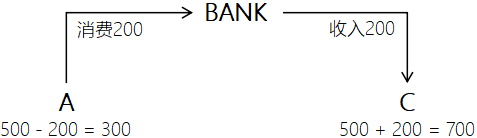
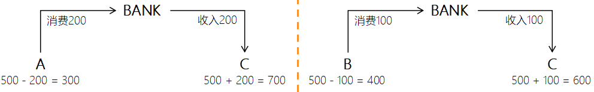
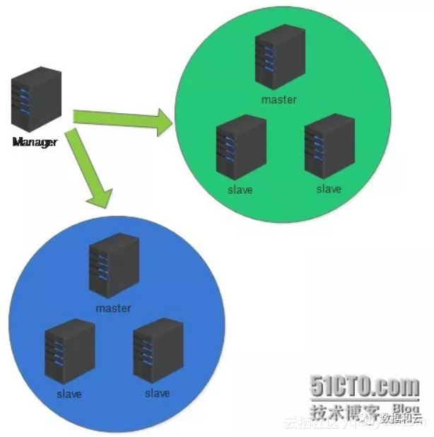

##        MySQL知识体系——事务                                                                                                                                                                 

 

(https://my.oschina.net/zbnb/blog/3030853#comments)

​                                 [MySQL](https://my.oschina.net/zbnb?q=MySQL)[InnoDB](https://my.oschina.net/zbnb?q=InnoDB)                            

[开发十年，就只剩下这套架构体系了！ >>> ](https://my.oschina.net/u/3985214/blog/3018099?tdsourcetag=s_pcqq_aiomsg)  


# ACID（事务的四大特性）

​    四个特性中，最重要的就是**一致性**。由原子性，隔离性，持久性来保证。

​    （以下描述用例：用户A、B、C分别在银行拥有500元存款）


##     原子性（Atomicity）

​        事务是一个不可分割的工作单元，事务中的操作要么全部COMMIT提交成功，要么全部失败ROLLBACK回滚。

​        *原子性由 Undo log 保证。Undo Log 会保存每次变更之前的记录，从而在发生错误时进行回滚。*

​        

​        *操作1：A消费200*

​        *操作2：C收入200*

​        *1/2两个操作任何一个失败，数据都将回到操作前的状态，即A（500）C（500）*


##     一致性（Consistency）

​        数据库总是从一个一致性的状态转换到另一个一致性的状态。

​        

​        *操作前：A（500）C（500）*

​        *操作后：A（300）C（700）*

​        *可以理解为：原子性以“操作”为对象，一致性以“数据库状态（即数据）”为对象*


##     隔离性（Isolation）

​        一个事务所做的修改在最终提交以前，对其他事务是不可见的。

​        *隔离性由 MVCC 和 Lock 保证（后面会说明）。*

​        

​        *事务1：A向C转账200*

​        *事务2：B向C转账100*

​        *1/2两个事务在提交之前，相互看不到对方的操作，即事务1看不到事务2中对C存款的修改，同时事务2也一样看不到事务1的操作*


##     持久性（Durability）

​        事务一旦被提交，它对数据库中数据的改变就是永久性的，接下来即使数据库发生故障也不应该对其有任何影响。

​        *持久性由 Redo Log 保证。每次真正修改数据之前，都会将记录写到 Redo Log 中，只有 Redo Log 写入成功，才会真正的写入到存储中，如果提交之前发生意外如断电，可以通过 Redo Log 恢复记录。*


# 事务的并发问题


##     脏读

​        事务A读取了事务B更新但未提交的数据，然后B回滚操作，那么A读取到的数据是脏数据。


##     不可重复读

​        事务A多次读取同一数据，事务B在事务A多次读取的过程中，对数据作了更新并提交，导致事务A多次读取同一数据的结果不一致。


##     幻读

​        事务A读取了一些数据，但是事务B在事务A读取完数据后，插入/删除了一条新的记录，然后事务A再次读取数据时发现多/少了，就好像发生了幻觉一样。

​        小结：不可重复读的和幻读很容易混淆，不可重复读侧重于修改，幻读侧重于新增或删除。解决不可重复读的问题只需锁住满足条件的行，解决幻读需要锁表。


# 事务的隔离级别


##     read-uncommitted（RU）**（未提交读）**

　　在read-uncommitted级别，事务中的修改，即使没有提交，对其他事务也都是可见的。事务可以读取未提交的数据，这也被称为脏读（Dirty   Read）。这个级别会导致很多问题，从性能上来说，read-uncommitted不会比其他的级别好太多，但却缺乏其他级别的很多好处，除非真的有非常必要的理由，在实际应用中一般很少使用。

​        对每个更新语句的行记录进行加锁，而不是对整个事务进行加锁，所以会发生脏读。而 RC 和 RR 会对整个事务加锁。


##     read-committed（RC）**（提交读）**

　　大多数数据库系统的默认隔离级别都是read-committed（但MySQL不是）。read-committed满足前面提到的隔离性的简单定义：一个事务开始时，只能"看见"已经提交的事务所做的修改。换句话说，一个事务从开始直到提交之前，所做的任何修改对其他事务都是不可见的。这个级别有时候叫做不可重复读（nonrepeatble  read），因为两次执行同样的查询，可能会得到不一样的结果。

​        每次执行 SQL 语句都会生成一个新的 Read View，每次读到的都是不同的，所以会发生不可重复读。而 RR 的事务从始至终都是使用同一个 Read View。


##     repeatable-read（RR）**（可重复读）**

　　repeatable-read解决了脏读的问题。该隔离级别保证了在同一个事务中多次读取同样记录结果是一致的。但是理论上，可重复读隔离级别还是无法解决另外一个幻读（Phantom   Read）的问题。所谓幻读，指的是当某个事务在读取某个范围内的记录时，另一个事务又在该范围内插入了新的记录，当之前的事务再次读取该范围的记录时，会产生幻行（Phantom  Row）。InnoDB和XtraDB存储引擎通过多版本并发控制（MVCC，Multiversion Concurrency Control）解决了幻读的问题。

​        MySQL默认的事务处理级别是“REPEATABLE-READ”，也就是可重复读，*SELECT @@global.tx_isolation;*


##     serializable**（可串行化）**

　　serializable是最高的隔离级别。它通过强制事务串行执行，避免了前面说的幻读的问题。简单来说，serializable会在读取每一行数据都加锁，所以可能导致大量的超时和锁争用问题。实际应用中也很少用到这个隔离级别，只有在非常需要确保数据的一致性而且可以接受没有并发的情况下，才考虑采用该级别。

​        每种隔离级别都可以解决不同的并发问题（蓝色标注“√”代表存在并发问题）：

​        


# MVCC（Multi-Version Concurrency Control 多版本并发控制）

​    MVCC的本质，是多版本共存。

​    不同的数据库实现MVCC的方式是不一样的，因为MVCC没有一个统一的实现标准。在这我们只讨论 InnoDB 的实现方式。


## InnoDB实现

​    InnoDB的聚集索引有 3 个隐藏字段，分别是：

1. **DB_ROW_ID** 行ID，主键（RowID）
2. **DATA_TRX_ID** 事务的ID号，用来表示指针以实现快照读。对应于系统版本号（MVCC 核心）
3. **DATA_ROLL_PTR** 滚动指针，Undo Log 的指针（隔离核心）

​    还有一个**DELETE BIT** 位，作为索引删除标记（当删除时，不会立即删除，而是打标记，然后异步删除）

​    InnoDB事务以**排它锁**（悲观锁的一种实现）的方式修改原始数据，把修改前的数据存放于 Undo Log，通过回滚指针与数据关联，如果修改成功，什么都不做，如果修改失败，则将数据从 Undo Log 中恢复。

​    下面是对数据进行UPDATE操作的示意图：

​    

​    在可重读Repeatable reads事务隔离级别下： 

- SELECT时，读取创建版本号<=当前事务版本号，删除版本号为空或>当前事务版本号。 
- INSERT时，保存当前事务版本号为行的创建版本号。 
- DELETE时，保存当前事务版本号为行的删除版本号。 
- UPDATE时，插入一条新纪录，保存当前事务版本号为行创建版本号，同时保存当前事务版本号到原来删除的行。 

​    通过MVCC，虽然每行记录都需要额外的存储空间，更多的行检查工作以及一些额外的维护工作，但可以减少锁的使用，大多数读操作都不用加锁，读数据操作很简单，性能很好，并且也能保证只会读取到符合标准的行，也只锁住必要行。


### 共享锁和排他锁

​    共享锁（S）：允许一个事务去读一行，阻止其他事务获得相同的数据集的排他锁。即被锁对象可以被任何事务读，但是拒绝写。

​    排他锁（X）：允许获得排他锁的事务更新数据，但是阻止其他事务获得相同数据集的共享锁和排他锁。即被锁对象只能被锁的持有者修改，其他事务不可读和写。

​    共享锁和排他锁都是是悲观锁不同的实现，都属于悲观锁的范畴。在InnoDB中，UPDATE/INSERT/DELETE操作都会自动加排他锁，普通的SELECT语句不会加任何锁，如果想加锁，可以使用下面方式：

```
SELECT * FROM table_name WHERE id = 1 LOCK IN SHARE MODE; -- 显式加共享锁
SELECT * FROM table_name WHERE id = 1 FOR UPDATE; -- 显式加排他锁
```

​    有人认为InnoDB是**乐观锁**的方式实现了MVCC，现在看来这一说法可能是片面的。对于保证一致性，MVCC是理想化的乐观锁解决方案，但是MySQL的业务场景非常复杂，同时乐观锁也并不是一定优于悲观锁，比如在写操作的时候采用乐观锁（如版本号机制），其效率未必优于使用排他锁实现。


# 总结

​     对于MySQL事务的认识，可以让开发者在工作中避免很多深藏不露的BUG，同时也可以灵活运用数据库的设计思想，解决实际遇到的问题。通过InnoDB对于MVCC思想的实践，可以知道，许多技术、思想、机制等等并不一定非要有个优劣排名，适合的才是最好的，正如JVM的分代垃圾回收，对于不同的内存区域，采用适合的GC机制。

**May you find the future that suits you best.**

​     

​                                                     © 著作权归作者所有                                             

​                                                     

​                                                      举报                     

​                                                  上一篇：                         [MySQL知识体系——索引](https://my.oschina.net/zbnb/blog/3032005)                     

​                         下一篇：                         [MySQL知识体系——存储引擎](https://my.oschina.net/zbnb/blog/3030725)                                              

​                              

### [杨彬Lennon](https://my.oschina.net/zbnb)

粉丝 4

博文 6

码字总数 11317

作品 0

 昌平

 程序员 

​                                                             


​                                     

​                         

青铜到王者，快速提升你 MySQL 数据库的段位！

新的一周，老张（superZS）再次与大家见面，我们又要面临快速的生活节奏而令人厌恶的工作！现在大多数人选择放松自己的方式就是玩游戏，最为突出的可能就要属手游"王者荣耀"。 据说这款游戏上...

superZS

2017/07/25

 0

 0

​                             [                                                              ](http://blog.51cto.com/sumongodb/1950839)                         

青铜到王者，看看你的MySQL数据库是什么段位，如何提升？

新的一周，老张（superZS）与大家见面，我们又要面临快速的生活节奏而令人厌恶的工作！现在大多数人选择放松自己的方式就是玩游戏，最为突出的可能就要属手游"王者荣耀"。 据说这款游戏上到7...

技术小能手

2018/06/07

 0

 0

​                             [                                                              ](https://yq.aliyun.com/articles/600321)                         

史上最简单的 MySQL 教程（三十九）「事务（下）」

温馨提示：在「事务（上）」中，我们已经了解了如何在 MySQL 中开启事务，以及事务的一些基本操作。在本文中，我们将进一步学习事务的知识，包括事务原理、自动事务、回滚点和事务特性等。 ...

qq_35246620

2017/11/18

 0

 0

​                             [                                                              ](http://blog.csdn.net/qq_35246620/article/details/78566894)                         

MySQL InnoDB存储引擎的事务隔离级别

我们知道，在关系数据库标准中有四个事务隔离级别： 未提交读(Read Uncommitted)：允许脏读，也就是可能读取到其他会话中未提交事务修改的数据 提交读(Read Committed)：只能读取到已经提交的...

miyae

2014/03/25

 0

 0

深入理解MySQL――锁、事务与并发控制  这才是正确的！

本文对锁、事务、并发控制做一个总结，看了网上很多文章，描述非常不准确。如有与您观点不一致，欢迎有理有据的拍砖！ mysql服务器逻辑架构 每个连接都会在mysql服务端产生一个线程（内部通过...

java高级架构牛人

2018/04/24

 0

 0

​                                      

​    