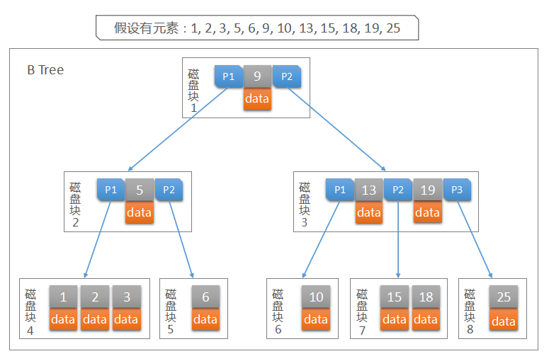
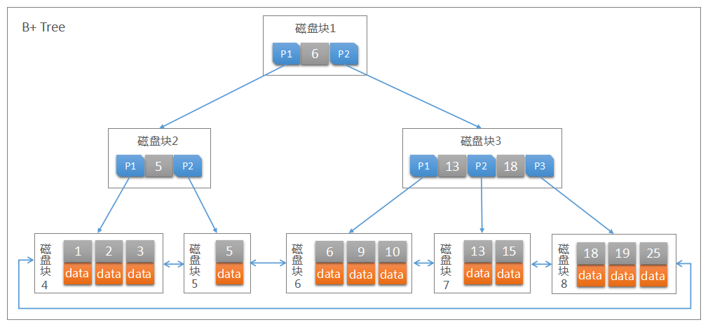

##                          MySQL知识体系——索引                                                                             原                                                                             荐                                                                     

​                              

杨彬Lennon

​                             发布于 前天 17:10

字数 3706

阅读 546

收藏 19

点赞 1

[ 评论 0](https://my.oschina.net/zbnb/blog/3032005#comments)

​                                 [B+Tree](https://my.oschina.net/zbnb?q=B+Tree)[tableFilter](https://my.oschina.net/zbnb?q=tableFilter)[MySQL](https://my.oschina.net/zbnb?q=MySQL)[InnoDB](https://my.oschina.net/zbnb?q=InnoDB)[BTree](https://my.oschina.net/zbnb?q=BTree)                            

[开发十年，就只剩下这套架构体系了！ >>> ](https://my.oschina.net/u/3985214/blog/3018099?tdsourcetag=s_pcqq_aiomsg)  

​    本文直切主题，针对InnoDB引擎描述索引及优化策略。在开始之前，需要读者了解：1）二叉查找树（包括2-3查找树、红黑树等数据结构）2）MySQL的InnoDB引擎基础知识


# 索引初探

​    要了解索引，当然要了解其数据结构。树有很多应用，流行的用法之一是包括UNIX和DOS在内的许多常用操作系统中的目录结构，二叉查找树又是Java中两种集合类TreeSet和TreeMap实现的基础。那么对于数据库，I/O是其性能瓶颈所在，减少树的深度是直接有效的，BTree和B+Tree应运而生。


## BTree和B+Tree（Balance-Tree，多路搜索树，非二叉）


###     **BTree**

​        BTree是一种查找树，如同二叉查找树，红黑树等，都是为提高查找效率而产生的，BTree也是如此，可以把它看做二叉查找树的优化升级。二叉查找树的特点是每个非叶节点都最多只有两个子节点，但是当数据量非常大时，二叉查找树的深度过深，搜索算法自根节点向下搜索时，需要访问的节点也就变的相当多。如果这些节点存储在外存储器（磁盘）中，每访问一个节点，相当于就是进行了一次I/O操作，随着树高度的增加，频繁的I/O操作一定会降低查询的效率。BTree改二叉为多叉，每个节点存储更多的指针信息，以此达到减少树的深度、降低I/O操作数。

​        使用BTree结构可以显著减少定位记录时所经历的中间过程，从而加快存取速度。


####     **定义（对于一个m阶BTree）**

- 根节点至少有两个子节点（除非根结点为[叶节点](https://baike.baidu.com/item/%E5%8F%B6%E5%AD%90%E8%8A%82%E7%82%B9)）
- 每个节点有m-1个[关键字](https://baike.baidu.com/item/%E5%85%B3%E9%94%AE%E5%AD%97)，并且以升序排列
- 位于 m-1和m [关键字](https://baike.baidu.com/item/%E5%85%B3%E9%94%AE%E5%AD%97)的子节点的值位于 m-1和m [关键字](https://baike.baidu.com/item/%E5%85%B3%E9%94%AE%E5%AD%97)对应的值之间
- 其它节点至少有m/2个子节点


####     **特性**

- 关键字集合分布在整棵树中；
- 任何一个[关键字](https://baike.baidu.com/item/%E5%85%B3%E9%94%AE%E5%AD%97)出现且只出现在一个节点中；
- 搜索有可能在非[叶](https://baike.baidu.com/item/%E5%8F%B6%E5%AD%90%E7%BB%93%E7%82%B9)节[点](https://baike.baidu.com/item/%E5%8F%B6%E5%AD%90%E7%BB%93%E7%82%B9)结束；
- 其搜索性能等价于在关键字全集内做一次[二分查找](https://baike.baidu.com/item/%E4%BA%8C%E5%88%86%E6%9F%A5%E6%89%BE)；
- 自动层次控制。


###     **B+Tree**

  

​        InnoDB  存储引擎在绝大多数情况下使用B+Tree建立索引，B+Tree也是关系型数据库中最为常用和有效的索引结构，但是B+Tree索引并不能找到一个给定键对应的具体值，它只能找到数据行对应的页，然后正如上一节所提到的，数据库把整个页读入到内存中，并在内存中查找具体的数据行。


####     **定义（****其定义基本与 BTree同，除了：****）**

- 所有叶节点之间都有一个链指针；
- 所有关键字都在叶子结点出现；
- 非叶子节点只存储键值信息，数据记录都存放在叶节点中。


####     **特性**

- 单节点可以存储更多的元素，使得查询磁盘IO次数更少，更加高效的单元素查找；
- 所有查询都要查找到叶子节点，查询性能稳定；
- 叶子节点会包含所有的关键字，以及指向数据记录的指针，并且叶子节点本身是根据关键字的大小从小到大顺序链接，范围查找性能更优。


####     **区别**

​        B+Tree是BTree的一种变形树，它与BTree的差异在于：

- B+Tree只有达到叶子结点才命中（BTree可以在非叶子结点命中），其性能也等价于在关键字全集做一次二分查找；
- BTree树每个叶子节点都有双向指针；
- BTree分支节点和叶节点均保存记录的关键码和记录的指针；B+Tree分支节点只保存记录关键码的复制，无记录指针。所有记录都集中在叶节点一层，并且叶节点可以构成一维线性表，便于连续访问和范围查询。



 


## 聚集索引和辅助索引

​    数据库中的 B+Tree索引可以分为聚集索引（clustered index）和辅助索引（secondary index），它们之间的最大区别就是，聚集索引中存放着一条行记录的全部信息，而辅助索引中只包含索引列和一个用于查找对应行记录的“书签”。即在数据库的聚集索引中，叶子节点直接包含卫星数据。在辅助索引（NonClustered Index）中，叶节点带有指向卫星数据的指针。


### **聚集索引**

​    InnoDB使用了聚集索引存储数据。

​    与非聚集索引的区别则是，聚集索引既存储了索引，也存储了行值。当一个表有一个聚集索引，它的数据是存储在索引的叶子页（leaf pages）上的。因此可以说InnoDB是基于索引的表。

​    当我们使用聚集索引对表中的数据进行检索时，可以直接获得聚集索引所对应的整条行记录数据所在的页，不需要进行第二次操作。


### **索引的建立规则**

- 如果一个主键被定义了，那么这个主键就是作为聚集索引
- 如果没有主键被定义，那么该表的第一个唯一非空索引被作为聚集索引
- 如果没有主键也没有合适的唯一索引，那么InnoDB内部会生成一个隐藏的主键作为聚集索引，这个隐藏的主键是一个6个字节的列，改列的值会随着数据的插入自增


### **辅助索引**

​    辅助索引，也叫做非聚集索引，叶节点不包含行的全部数据。除了包含[关键字](https://baike.baidu.com/item/%E5%85%B3%E9%94%AE%E5%AD%97)外，还包含了一个标记，这个标记用来告诉InnoDB引擎从哪里可以找到与索引相对应的行数据。由于InnoDB引擎是索引组织表，因此，这个标记就是相应的行数据的聚集索引[关键字](https://baike.baidu.com/item/%E5%85%B3%E9%94%AE%E5%AD%97)。 

​    辅助索引的存在并不影响数据在聚集索引中的组织，因此一个表可以有多个辅助索引。

​    使用辅助索引查找一条表记录的过程：通过辅助索引查找到对应的[关键字](https://baike.baidu.com/item/%E5%85%B3%E9%94%AE%E5%AD%97)，最后在聚集索引中使用[关键字](https://baike.baidu.com/item/%E5%85%B3%E9%94%AE%E5%AD%97)获取对应的行记录，这也是通常情况下行记录的查找方式。


# 使用建议


## 聚集索引的优先选择列

1. 含有大量非重复值的列
2. 使用 between，>或<返回一个范围值的列
3. 需要经常排序的列，列顺序和最常用的排序一致
4. 返回大量结果集的查询
5. 经常被 join 的列


## 不建议的聚集索引列

1. 修改频繁的列
2. 低选择性的列，如性别
3. 新增内容太过离散随机的列


## 规范与建议

1. 命名规则：表名_字段名
2. 需要加索引的字段，要在where条件中
3. 如果where条件中是**OR**关系，加索引不起作用
4. 能用小类型别用大类型字段
5. 索引 key_len 长度过大，也会影响 SQL 性能。所以尽量不默认 null，会占用字节、索引长度。
6. 常用的字段放在前面；选择性高的字段放在前面
7. 对较长的字符数据类型的字段建索引，优先考虑前缀索引，如 index(url(64))
8. 只创建需要的索引，避免冗余索引，如：index(a,b)，index(a)
9. 使用**联合索引**，以避免**回表**，达到**覆盖索引**
10. 联合索引遵循**最左原则**
11. 索引不可滥用，索引会占用存储空间并且增加数据更新操作的复杂度，降低CUD(create/update/delate)效率


###     **回表**

​        先了解一个概念，MySQL对 WHERE 中条件的处理，根据索引使用情况分成三种：index key, index filter, table filter

​        \1. index key

​            用于确定SQL查询在索引中的连续范围(起始范围+结束范围)的查询条件，被称之为Index  Key。由于一个范围，至少包含一个起始与一个终止，因此Index Key也被拆分为Index First Key和Index Last  Key，分别用于定位索引查找的起始，以及索引查询的终止条件。

​        \2. index filter

​            在使用 index key 确定了起始范围和介绍范围之后，在此范围之内，还有一些记录不符合 WHERE 条件，如果这些条件可以使用索引进行过滤，那么就是 index filter。

​        \3. table filter

​            WHERE 中的条件不能使用索引进行处理的，只能访问table，进行条件过滤了。

​        从普通索引查出主键索引，然后查询出数据的过程叫做回表。回表一次就会执行一次查询，所以避免回表是减少数据库压力、提高效率的有效手段。在InnoDB中，使用**联合索引**配合主键索引可以直接返回结果而不需要回表查询。


###     **联合索引（复合索引）与前缀索引（最左原则）**

​        Mysql从左到右的使用索引中的字段，一个查询可以只使用索引中的一部份，但只能是最左侧部分。例如索引是**(a,b,c)**，可以支持 **a** | **a,b** | **a,b,c** 3种组合进行查找，但不支持 **b,c** 进行查找。这是最左原则的第一层意思：**联合索引的多个字段中，只有当查询条件为联合索引的第一个字段时，索引才会有效。**

​        条件 WHERE a LIKE 'perfix%'; 索引也会有效。这是最左原则的第二层意思：**根据字段值最左若干个字符进行的模糊查询，索引有效。**


###     **覆盖索引**

​            覆盖索引是对联合索引的合理利用。

​            比如 SELECT **a, b** FROM table WHERE **a** = 'wangnima'; ，如果我们已经创建了**(a)或(a,b)**的联合索引，那么这条语句会直接从索引返回而不会发生回表。即创建索引的字段覆盖了查询字段。

​            如果执行 SELECT **c** FROM table WHERE **a** = 'wangnima';  ，就会发生回表，因为我们的辅助索引树中，没有字段 **c** 的数据，需要拿到主键索引的关键字，去主键索引中回表查询。

​            但是需要注意的是，索引虽好不可滥用。


###     索引下推（Index Condition Pushdown (ICP)）

​        结合在 **回表** 概念中引出的三种索引使用情况（index key, index filter, table filter），ICP 技术，就是 index filter 技术。MySQL的架构分为**服务器层**和**引擎层**。

​        **官方解释**（<https://dev.mysql.com/doc/refman/5.6/en/index-condition-pushdown-optimization.html>）

​            索引条件下推（ICP）是对MySQL使用索引从表中检索行的情况的优化。如果没有ICP，存储引擎将遍历索引以定位基表中的行，并将它们返回到MySQL**服务器**，该服务器将计算基表行的where条件。在启用ICP的情况下，如果部分where条件可以通过只使用索引中的列来计算，MySQL**服务器**会把where条件的这部分 **推入 存储引擎**。然后，**存储引擎**通过使用索引条目来评估所推送的索引条件，并且只有在满足该条件时才从表中读取行。ICP可以减少存储引擎必须访问基本表的次数和MySQL服务器必须访问存储引擎的次数。

​        根据官方的指导，我们来做个验证：

```
      EXPLAIN 
      SELECT * FROM people 
      WHERE zipcode='95054' 
      AND lastname LIKE '%lao%' 
      AND address LIKE '%Main Street%';
```

​            

​        官方解释：

[`       EXPLAIN`](https://dev.mysql.com/doc/refman/5.6/en/explain.html)使用“索引条件下推”时，输出显示 `Using index condition`在 `Extra`列中。

​            假设一个表包含有关人员及其地址的信息，并且该表的索引定义为 `INDEX (zipcode, lastname, firstname)`。如果我们知道一个人的`zipcode`价值但不确定姓氏，我们可以这样搜索：

```
      SELECT * FROM people
      WHERE zipcode='95054'
      AND lastname LIKE '%etrunia%'
      AND address LIKE '%Main Street%';
```

​            MySQL可以使用索引来扫描人 `zipcode='95054'`。第二部分（`lastname LIKE '%etrunia%'`）不能用于限制必须扫描的行数，因此如果没有Index Condition Pushdown，此查询必须为所有拥有的人检索完整的表行 `zipcode='95054'`。

​            使用索引条件下推，MySQL `lastname LIKE '%etrunia%'`在读取整个表行之前检查该 部分。这样可以避免读取与索引元组相对应的完整行，这些行匹配 `zipcode`条件而不是 `lastname`条件。

​            默认情况下启用索引条件下推。可以[`optimizer_switch`](https://dev.mysql.com/doc/refman/5.6/en/server-system-variables.html#sysvar_optimizer_switch)通过设置`index_condition_pushdown`标志来控制 系统变量 ：

```
     SET optimizer_switch = 'index_condition_pushdown=off';
     SET optimizer_switch = 'index_condition_pushdown=on';
```


# 实践

*注意语句中的“[ ··· ]”中括号指代变量，书写时记得去掉


## 普通索引

这是最基本的索引，它没有任何限制。它有以下几种创建方式：

\1. 创建索引

```
CREATE INDEX indexName ON mytable(username(length));
```

如果不是字符类型的字段，如int，则不要指定length；如果是CHAR，VARCHAR类型，length可以不指定，也可以小于字段实际长度；如果是BLOB和TEXT类型，必须指定 length。

\2. 修改表结构(添加索引)

```
ALTER table tableName ADD INDEX indexName(columnName)
```

\3. 创建表的时候直接指定

```
CREATE TABLE mytable(  
 
ID INT NOT NULL,   
 
username VARCHAR(16) NOT NULL,  
 
INDEX [indexName] (username(length))  
 
);
```


## 唯一索引

它与前面的普通索引类似，不同的就是：**索引列的值必须唯一，但允许有空值。如果是组合索引，则列值的组合必须唯一**。它有以下几种创建方式：

\1. 创建索引

```
CREATE UNIQUE INDEX indexName ON mytable(username(length))
```

\2. 修改表结构

```
ALTER table mytable ADD UNIQUE [indexName] (username(length))
```

\3. 创建表的时候直接指定

```
CREATE TABLE mytable(  
 
ID INT NOT NULL,   
 
username VARCHAR(16) NOT NULL,  
 
UNIQUE [indexName] (username(length))  
 
);
```

**删除索引的语法**

```
DROP INDEX [indexName] ON mytable;
```


# 总结 

​    合理利用索引对于提升数据库的性能、减轻数据库服务器的负担是最直接有效的手段。

​    其实，索引的本质就是通过缩小范围、把随机事件变成顺序事件来筛选出最终结果，同时可以总是用同一种查找方式来定位数据，这样就可以兼顾高效率和稳定性。