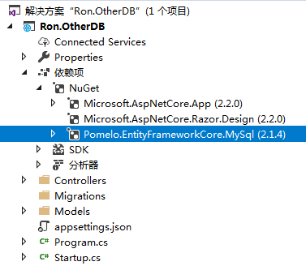
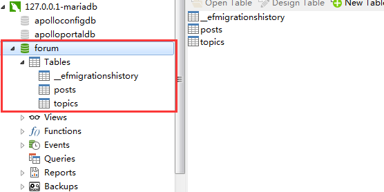
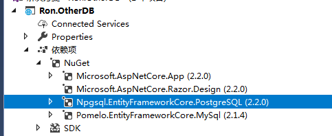
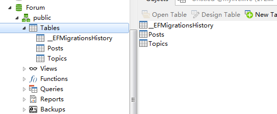
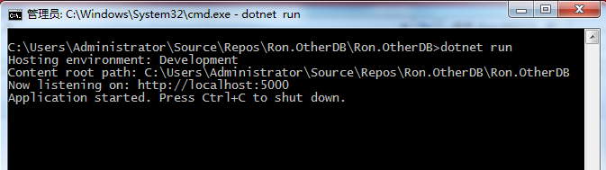
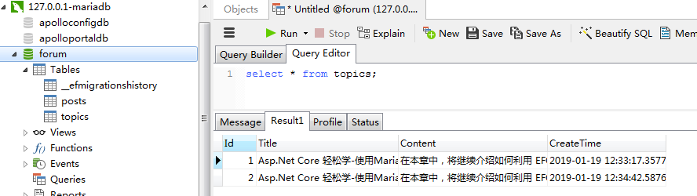
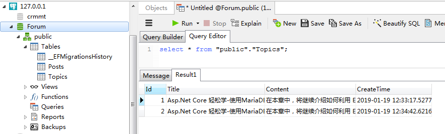

原文:

Asp.Net Core 轻松学-使用MariaDB/MySql/PostgreSQL和支持多个上下文对象


## 前言

> 在上一篇文章中(Asp.Net Core 轻松学-10分钟使用EFCore连接MSSQL数据库)[<https://www.cnblogs.com/viter/p/10243577.html>]，介绍了  EFCore 连接 MSSQL 的使用方法，在本章中，将继续介绍如何利用 EFCore 连接到 MariaDB/MySql 和  PostgreSQL 数据库，同时，在一个项目中，如何添加多个数据库上下文对象，并在业务中使用多个上下文对象，通过这两章的学习，你将掌握使用  EFCore 连接 MSSQL/MariaDB/MySql/PostgreSQL 的能力。在 .NETCore  的时代，由于其设计的独特性（区别于.NetFramework），使得我们非常容易的使用各种开源的、跨平台的产品和中间件，作为普通程序员，通过广泛参与和使用开源产品，是我们义不容辞的责任和义务，这种行为将进一步的扩大  .Net Core 的生态圈，进而影响整个开发行业。闲话说完，进入今天的正题，连接第三方数据库和支持多个上下文对象。

## 1. 使用 MariaDB/MySql 数据库

> MariaDB基于MySQL并遵循GPL v2授权使用的。 她是由以Monty Program  Ab为主要管理者的MariaDB社区开发的。MariaDB与另一分支MySQL最新版保持同步更新。在MariaDB工作与在MySQL下工作几乎一模一样，她们有相同的命令、界面，以及在MySQL中的库与API，所以MariaDB可以说是为替换MySQL量身定做的，所以它们之间是相通用（兼容），换用后连数据库都不必转换并可以获得MariaDB提供的许多更好的新特性。
>  以上介绍来自官方文档 <https://mariadb.com/kb/zh-cn/mariadb-mariadb/>

##### 1.1

> 首先创建一个 Asp.Net Core WebApi 2.2 的项目 Ron.OtherDB，并从 NuGet 仓库引用包  Pomelo.EntityFrameworkCore.MySql，我本地安装的数据库是 MariaDB，从介绍中得知，MariaDB 和  MySql 的使用方式几乎是完全一致的，所以这里使用 Pomelo.EntityFrameworkCore.MySql 连接 MariaDB  也是没有任何问题的

##### 1.2 项目结构和包引用如下



##### 1.3 编写业务实体

> 下面将编写两个业务实体 Topic/Post，在本章中，无论是连接 MariaDB/MySql 还是 PostgreSQL，都将使用这两个实体对象

```
    public class Topic
    {
        public int Id { get; set; }
        public string Title { get; set; }
        public string Content { get; set; }
        public DateTime CreateTime { get; set; }
        public ICollection<Post> Posts { get; set; }
    }

    public class Post
    {
        public int Id { get; set; }
        public int TopicId { get; set; }
        public string Content { get; set; }
        public DateTime CreateTime { get; set; }

        public Topic Topic { get; set; }
    }
```

##### 1.4 编写上下文对象

```
    public class MySqlForumContext : DbContext
    {
        public MySqlForumContext(DbContextOptions<MySqlForumContext> options) : base(options) { }

        public DbSet<Topic> Topics { get; set; }
        public DbSet<Post> Posts { get; set; }
    }
```

> 该上下文对象非常简单，只是声明了一个 MySqlForumContext 对象，然后继承自 DbContext ，并将 Topic 和  Post 实体对象映射到该上下文中，这个使用方式和之前的文章中连接 MSSQL 数据库的使用方式是完全一致的，这点非常难得，通过  EFCore，无论你连接到的是哪种类型的数据库，其 API 的使用方式几乎是没有什么不同的，可以让开发人员平滑的过渡。

##### 1.5 在 appsetting.json 中配置数据库连接字符串

```
{
  "Logging": {
    "LogLevel": {
      "Default": "Warning"
    }
  },
  "AllowedHosts": "*",
  "ConnectionStrings": {
    "Mysql.Forum": "server=127.0.0.1;port=3406;uid=root;pwd=root;database=Forum;"
  }
}
```

> 本来上面的连接字符串是无需指定端口的，但是因为使用 Pomelo.EntityFrameworkCore.MySql 组件连接 MySql 默认使用的端口是：3306，而我本机上指定端口为 3406，所以还是需要指定 port=3406。

##### 1.6 在 Startup.cs 中初始化上下文对象

```
        public void ConfigureServices(IServiceCollection services)
        {
            services.AddDbContext<MySqlForumContext>(options =>
            {
                var connectionString = this.Configuration["ConnectionStrings:Mysql.Forum"];
                options.UseMySql(connectionString);
            });
            ...
        }
```

##### 1.7 创建 Migrations 对象

- 在包管理器控制台输入以下命令，创建 Migrations 对象

> Add-Migration MySql.Forum.v1

- 继续在包管理器控制台中输入以下命令，该命令将会在数据库中创建实体业务对象 Topic/Post 映射的数据表

> Update-Databse

- 打开 MariaDB ，可以看到，数据库已经成功创建



> 非常完美，到这一步，你已经完成了使用 EFCore 连接到 MariaDB/MySql 数据库的过程，先不要急做各种 CURD  的操作，下面，我们继续在项目中使用 EFCore 连接 PostgreSQL 数据库，到最后我们再一起做一个 CURD 的 Demo

## 2. 使用 PostgreSQL 数据库

> PostgreSQL是一个功能强大的开源数据库系统。经过长达15年以上的积极开发和不断改进，PostgreSQL已在可靠性、稳定性、数据一致性等获得了业内极高的声誉。目前PostgreSQL可以运行在所有主流操作系统上，包括Linux、Unix（AIX、BSD、HP-UX、SGI  IRIX、Mac OS  X、Solaris和Tru64）和Windows。PostgreSQL是完全的事务安全性数据库，完整地支持外键、联合、视图、触发器和存储过程（并支持多种语言开发存储过程）。它支持了大多数的SQL:2008标准的数据类型，包括整型、数值值、布尔型、字节型、字符型、日期型、时间间隔型和时间型，它也支持存储二进制的大对像，包括图片、声音和视频。PostgreSQL对很多高级开发语言有原生的编程接口，如C/C++、Java、.Net、Perl、Python、Ruby、Tcl  和ODBC以及其他语言等，也包含各种文档

> 以上介绍来自 PostgreSQL 中文社区：<http://www.postgres.cn/v2/about，本人公司的主要业务也是基于> .NetCore+MySql+PostgreSQL，在使用 PostgreSQL 的过程中，发现 PostgreSQL 真的是一个非常强大的数据库，对我们的业务带来非常大的帮助，希望大家都能深入的了解和使用 PostgreSQL

##### 2.1 首先还是在项目中引用 Npgsql.EntityFrameworkCore.PostgreSQL 包



##### 2.2 编写上下文对象 NPgSqlForumContext

```
    public class NPgSqlForumContext : DbContext
    {
        public NPgSqlForumContext(DbContextOptions<NPgSqlForumContext> options) : base(options) { }

        public DbSet<Topic> Topics { get; set; }
        public DbSet<Post> Posts { get; set; }
    }
```

> 有没有发现，上下文对象 NPgSqlForumContext 的结构和上面的 MySqlForumContext 几乎是一模一样的

##### 2.3 在配置文件中增加 PostgreSQL 的连接字符串

```
{
  "Logging": {
    "LogLevel": {
      "Default": "Warning"
    }
  },
  "AllowedHosts": "*",
  "ConnectionStrings": {
    "Mysql.Forum": "server=127.0.0.1;port=3406;uid=root;pwd=root;database=Forum;",
    "Pgsql.Forum": "server=127.0.0.1;port=5432;uid=postgres;pwd=postgres;database=Forum;"
  }
}
```

> 注意：PostgreSQL 的侦听的默认端口是：5432

##### 2.4 在 Startup.cs 中初始化上下文对象

```
        public void ConfigureServices(IServiceCollection services)
        {
            // MariaDB/MySql 上下文初始化
            services.AddDbContext<MySqlForumContext>(options =>
            {
                var connectionString = this.Configuration["ConnectionStrings:Mysql.Forum"];
                options.UseMySql(connectionString);
            });

            // PostgreSQL 上下文初始化
            services.AddDbContext<NPgSqlForumContext>(options =>
            {
                var connectionString = this.Configuration["ConnectionStrings:Pgsql.Forum"];
                options.UseNpgsql(connectionString);
            });

            ...
        }
```

##### 2.5 创建 Migrations for PostgreSQL 对象

- 这里创建 Migrations 的方式和上面的创建 Migrations for MariaDB/MySql 的方式是一样的，在项目包管理器控制台中输入以下命令，创建 Migrations 对象后直接创建数据库

> Add-Migration PostgreSQL.Forum.v1 -Context NPgSqlForumContext
>  Update-Database -Context NpgSqlForumContext

== 注意：这里的创建数据库命令和上面创建 MariaDB/MySql 的命令有一点小小的不同 ==

> 因为我们现在是在一个项目里面使用多个上下文对象，在创建 Migrations 的时候， EF 会自动查找匹配的 Context  ，但是，由于使用了多个 Context，在执行命令时，必须指定 -Context NpgSqlForumContext，否则，将抛出 More  than one DbContext was found. Specify which one to use. Use the  '-Context' parameter for PowerShell commands and the '--context'  parameter for dotnet commands. 的异常。

- 打开 PostgreSQL 管理工具，发现数据库 forum 已经成功创建，表结构和 MariaDB/MySql 中创建的 forum 数据库表完全一致，使用的都是同一个实体业务对象 Topic/Post



> 到这里，我们已经完成了使用 EFCore 连接到 PostgreSQL 的过程，在 PostgreSQL 中，由于没有指定 Schema  ，所以默认数据表会被放在 Schema public 下面，有关更多 PostgreSQL 的 Schema  ，请移步官网进一步了解，如果希望在创建数据库的过程中指定 Schema ，可以在实体对象 Topic中应用特性 TableAttribute  进行标记即可，也可以手动修改 Migrations 文件，像下面这样

- 使用特性 TableAttribute 进行标记

```
    [Table("topic",Schema ="blogs")]
    public class Topic
    {
        public int Id { get; set; }
        public string Title { get; set; }
        public string Content { get; set; }
        public DateTime CreateTime { get; set; }
        public ICollection<Post> Posts { get; set; }
    }
```

- 手动修改 Migrations 文件 Migrations/20190119035709_PostgreSQL.Forum.v1.cs

```
//  代码片段，仅需要增加指定 schema:"blogs" 即可
            migrationBuilder.CreateTable(
                name: "Topics",
                schema: "blogs",
                columns: table => new
                {
                    Id = table.Column<int>(nullable: false)
                        .Annotation("Npgsql:ValueGenerationStrategy", NpgsqlValueGenerationStrategy.SerialColumn),
                    Title = table.Column<string>(nullable: true),
                    Content = table.Column<string>(nullable: true),
                    CreateTime = table.Column<DateTime>(nullable: false)
                },
                constraints: table =>
                {
                    table.PrimaryKey("PK_Topics", x => x.Id);
                });
```

## 3. 在项目中使用多个上下文

> 在 Ron.OtherDB 项目中，我们一共创建了两个 Context ，分别是 MySqlForumContext 和 NPgSqlForumContext，这两个 Context 可以在项目中一起使用，互不影响

##### 3.1 在 HomeController 注入两个 Context

```
        private MySqlForumContext mysqlContext;
        private NPgSqlForumContext pgsqlContext;
        public HomeController(MySqlForumContext mysqlContext, NPgSqlForumContext pgsqlContext)
        {
            this.mysqlContext = mysqlContext;
            this.pgsqlContext = pgsqlContext;
        }
``

>  注入的方式非常简单，和其它类型的注入使用方式没有区别，就是简单的在 HomeController 的构造函数中声明这两个 Context 对象即可

#####3.2 使用两个上下文对象进行 CURD 操作

>  下面将演示使用 MySqlForumContext 和 NPgSqlForumContext 进行简单的 CURD 操作，这个操作过程和上一篇的 MSSQL 几乎是完全相同的，代码比较简单，就直接贴上来了
[Route("api/[controller]"), ApiController]
public class HomeController : ControllerBase
{
    private MySqlForumContext mysqlContext;
    private NPgSqlForumContext pgsqlContext;
    public HomeController(MySqlForumContext mysqlContext, NPgSqlForumContext pgsqlContext)
    {
        this.mysqlContext = mysqlContext;
        this.pgsqlContext = pgsqlContext;
    }

    [HttpGet]
    public ActionResult Get()
    {
        // MySql
        var mysqlTopics = this.mysqlContext.Topics.ToList();

        // PgSql
        var pgsqlTopics = this.pgsqlContext.Topics.ToList();

        return new JsonResult(new { mysql = mysqlTopics, pgsql = pgsqlTopics });
    }

    [HttpPost]
    public async Task Post([FromBody] TopicViewModel model)
    {
        // MySql
        this.mysqlContext.Topics.Add(new Topic()
        {
            Content = model.Content,
            CreateTime = DateTime.Now,
            Title = model.Title
        });
        await this.mysqlContext.SaveChangesAsync();

        // PgSql
        this.pgsqlContext.Topics.Add(new Topic()
        {
            Content = model.Content,
            CreateTime = DateTime.Now,
            Title = model.Title
        });
        await this.pgsqlContext.SaveChangesAsync();
    }

    [HttpPut]
    public async Task Put([FromBody] TopicViewModel model)
    {
        // MySql
        var topic = this.mysqlContext.Topics.Where(f => f.Id == model.Id).FirstOrDefault();
        topic.Title = model.Title;
        topic.Content = model.Content;
        await this.mysqlContext.SaveChangesAsync();

        // PgSql
        var pgTopic = this.pgsqlContext.Topics.Where(f => f.Id == model.Id).FirstOrDefault();
        pgTopic.Title = model.Title;
        pgTopic.Content = model.Content;
        await this.pgsqlContext.SaveChangesAsync();
    }

    [HttpDelete("{id}")]
    public async Task Delete(int id)
    {
        // MySql
        var topic = this.mysqlContext.Topics.Where(f => f.Id == id).FirstOrDefault();
        this.mysqlContext.Topics.Remove(topic);
        await this.mysqlContext.SaveChangesAsync();

        // PgSql
        var pgTopic = this.pgsqlContext.Topics.Where(f => f.Id == id).FirstOrDefault();
        this.pgsqlContext.Topics.Remove(pgTopic);
        await this.pgsqlContext.SaveChangesAsync();
    }
}
```

\```

##### 3.3 打开控制台执行 dotnet run



##### 3.4 分别调用 <http://localhost:5000/api/home> 中的 GET/POST/PUT/DELETE 接口，可以看到，数据库中可以正常添加和修改数据

- MariaDB/MySql 数据库结果



- PostgreSQL 数据库结果



> 从结果中可以看到，代码执行正常完成，至此，本文完成

## 结束语

> 通过本文学习，我们掌握了以下能力

- 如何在 Asp.NetCore 中使用 EFCore 连接使用 MariaDB/MySql/PostgreSQL 数据库，
- 如何创建多个 Migrations 对象
- 如何在项目中使用多个不同的上下文对象

## 演示代码下载

<https://github.com/lianggx/EasyAspNetCoreDemo/tree/master/Ron.OtherDB>


分类: [.NET-.NET CORE](https://www.cnblogs.com/lonelyxmas/category/336234.html)

标签: [ASP.NET Core 基础教程](https://www.cnblogs.com/lonelyxmas/tag/ASP.NET Core 基础教程/)