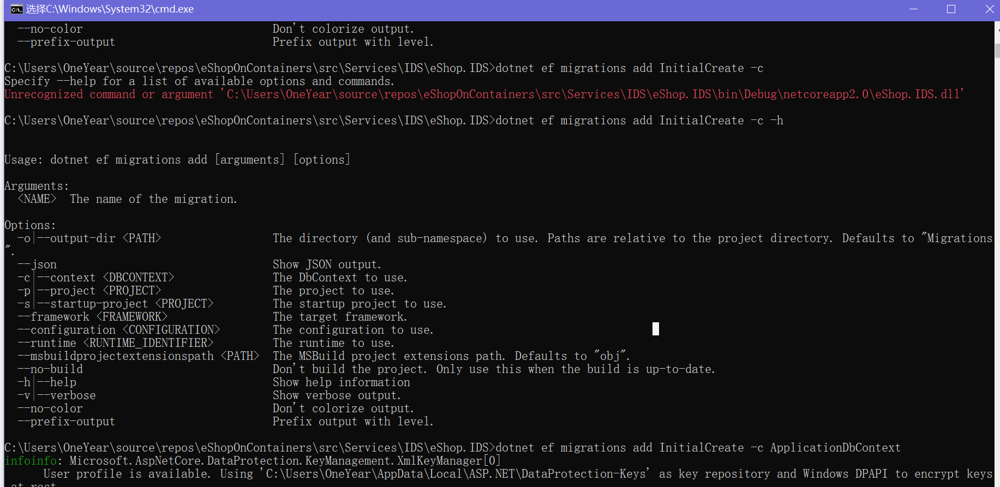

https://www.cnblogs.com/lonelyxmas/p/10298538.html

#  			[多个数据库 migration](https://www.cnblogs.com/hanstar/p/8149729.html) 		

More than one  DbContext was found. Specify which one to use. Use the '-Context'  parameter for PowerShell commands and the '--context' parameter for  dotnet commands.

 

​         [好文要顶](javascript:void(0);)             [关注我](javascript:void(0);)     [收藏该文](javascript:void(0);)     ;)     ;) 