## Redis为何这么快--关键在于它的数据结构                                                                             

https://my.oschina.net/u/3985214/blog/3027628#comments)

​                                 [SDS](https://my.oschina.net/u/3985214?q=SDS)[Redis](https://my.oschina.net/u/3985214?q=Redis)                            

[开发十年，就只剩下这套架构体系了！ >>> ](https://my.oschina.net/u/3985214/blog/3018099?tdsourcetag=s_pcqq_aiomsg)  

 本文内容思维导图如下：

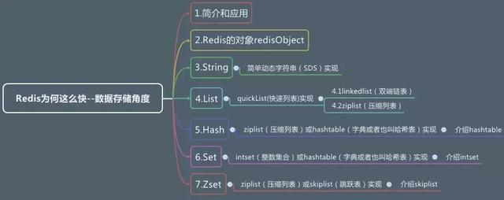

 

 

 

 

一、简介和应用

------

Redis是一个由ANSI C语言编写，性能优秀、支持网络、可持久化的K-K内存数据库，并提供多种语言的API。它常用的类型主要是 String、List、Hash、Set、ZSet 这5种

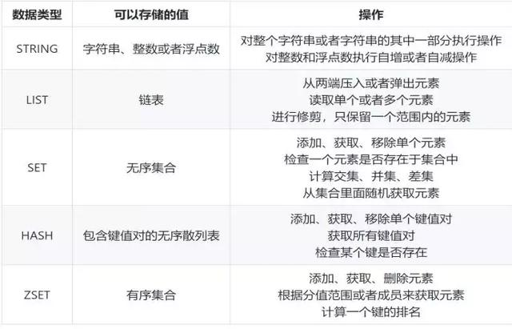

 

 

 

 

Redis在互联网公司一般有以下应用:

- String：缓存、限流、计数器、分布式锁、分布式Session
- Hash：存储用户信息、用户主页访问量、组合查询
- List：微博关注人时间轴列表、简单队列
- Set：赞、踩、标签、好友关系
- Zset：排行榜

再比如电商在大促销时，会用一些特殊的设计来保证系统稳定，扣减库存可以考虑如下设计：

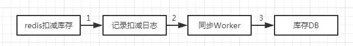

 

 

 

 

上图中，直接在Redis中扣减库存，记录日志后通过Worker同步到数据库，在设计同步Worker时需要考虑并发处理和重复处理的问题。

通过上面的应用场景可以看出Redis是非常高效和稳定的，那Redis底层是如何实现的呢？

 


 

 

 

 

 

**二、Redis的对象redisObject**

------

 

当我们执行set hello world命令时，会有以下数据模型：

 

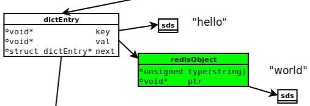

 

 

 

 

- **dictEntry：**Redis给每个key-value键值对分配一个dictEntry，里面有着key和val的指针，next指向下一个dictEntry形成链表，这个指针可以将多个哈希值相同的键值对链接在一起，**由此来解决哈希冲突问题(链地址法)。**
- **sds：**键key“hello”是以SDS（简单动态字符串）存储，后面详细介绍。
- **redisObject：**值val“world”存储在redisObject中。实际上，redis常用5中类型都是以redisObject来存储的；而redisObject中的type字段指明了Value对象的类型，ptr字段则指向对象所在的地址。

redisObject对象非常重要，Redis对象的类型、内部编码、内存回收、共享对象等功能，都需要redisObject支持。这样设计的好处是，可以针对不同的使用场景，**对5中常用类型设置多种不同的数据结构实现，从而优化对象在不同场景下的使用效率。**

无论是dictEntry对象，还是redisObject、SDS对象，都需要内存分配器（如jemalloc）分配内存进行存储。**jemalloc作为Redis的默认内存分配器，在减小内存碎片方面做的相对比较好。**比如jemalloc在64位系统中，将内存空间划分为小、大、巨大三个范围；每个范围内又划分了许多小的内存块单位；当Redis存储数据时，会选择大小最合适的内存块进行存储。

前面说过，Redis每个对象由一个redisObject结构表示，它的ptr指针指向底层实现的数据结构，而数据结构由encoding属性决定。比如我们执行以下命令得到存储“hello”对应的编码：

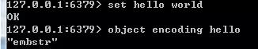

 

 

 

 

redis所有的数据结构类型如下（重要，后面会用）：

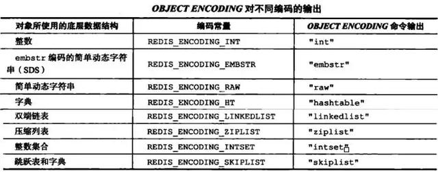

 

 

 

 

**三、String**

------

 

字符串对象的底层实现可以是int、raw、embstr（上面的表对应有名称介绍）。**embstr编码是通过调用一次内存分配函数来分配一块连续的空间，而raw需要调用两次。**

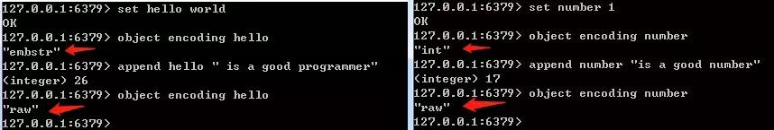

 

 

 

 

 int编码字符串对象和embstr编码字符串对象在一定条件下会转化为raw编码字符串对象。embstr：<=39字节的字符串。int：8个字节的长整型。raw：大于39个字节的字符串。

**简单动态字符串（SDS）**，这种结构更像C++的String或者Java的ArrayList<Character>，长度动态可变：

```
1struct sdshdr {
2    // buf 中已占用空间的长度
3    int len;
4    // buf 中剩余可用空间的长度
5    int free;
6    // 数据空间
7    char buf[]; // ’\0’空字符结尾
8};
```

 

- ​    get：sdsrange---O(n)
- set：sdscpy—O(n)
- create：sdsnew---O(1)
- len：sdslen---O(1)

**常数复杂度获取字符串长度**：因为SDS在len属性中记录了长度，所以获取一个SDS长度时间复杂度仅为O(1)。

**预空间分配**：如果对一个SDS进行修改，分为一下两种情况：

- SDS长度（len的值）小于1MB，那么程序将分配和len属性同样大小的未使用空间，这时free和len属性值相同。举个例子，SDS的len将变成15字节，则程序也会分配15字节的未使用空间，SDS的buf数组的实际长度变成15+15+1=31字节（额外一个字节用户保存空字符）。
- SDS长度（len的值）大于等于1MB，程序会分配1MB的未使用空间。比如进行修改之后，SDS的len变成30MB，那么它的实际长度是30MB+1MB+1byte。

**惰性释放空间**：当执行sdstrim（截取字符串）之后，SDS不会立马释放多出来的空间，如果下次再进行拼接字符串操作，且拼接的没有刚才释放的空间大，则那些未使用的空间就会排上用场。**通过惰性释放空间避免了特定情况下操作字符串的内存重新分配操作。**

**杜绝缓冲区溢出**：使用C字符串的操作时，如果字符串长度增加（如strcat操作）而忘记重新分配内存，很容易造成缓冲区的溢出；而SDS由于记录了长度，相应的操作在可能造成缓冲区溢出时会自动重新分配内存，杜绝了缓冲区溢出。

**四、List**

------

 

List对象的底层实现是quicklist（快速列表，是ziplist 压缩列表 和linkedlist 双端链表 的组合）。Redis中的列表支持两端插入和弹出，并可以获得指定位置（或范围）的元素，可以充当数组、队列、栈等。

```
1typedef struct listNode {
 2     // 前置节点
 3    struct listNode *prev;
 4    // 后置节点
 5    struct listNode *next;
 6    // 节点的值
 7    void *value;
 8 } listNode;
 9
10 typedef struct list {
11     // 表头节点
12    listNode *head;
13    // 表尾节点
14    listNode *tail;
15    // 节点值复制函数
16    void *(*dup)(void *ptr);
17    // 节点值释放函数
18    void (*free)(void *ptr);
19     // 节点值对比函数
20    int (*match)(void *ptr, void *key);
21     // 链表所包含的节点数量
22    unsigned long len;
23 } list;
```

 

-   rpush: listAddNodeHead ---O(1)
- lpush: listAddNodeTail ---O(1)
- push:listInsertNode ---O(1)
- index : listIndex ---O(N)
- pop:ListFirst/listLast ---O(1)
- llen:listLength ---O(N)

 

**4.1 linkedlist（双端链表）**

此结构比较像Java的LinkedList，有兴趣可以阅读一下源码。

 

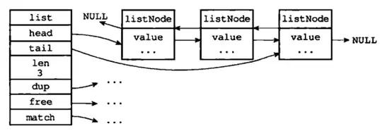

 

 

 

 

从图中可以看出Redis的linkedlist双端链表有以下特性：节点带有prev、next指针、head指针和tail指针，**获取前置节点、后置节点、表头节点和表尾节点的复杂度都是O（1）。len属性获取节点数量也为O（1）**。

与双端链表相比，压缩列表可以节省内存空间，但是进行修改或增删操作时，复杂度较高；因此当节点数量较少时，可以使用压缩列表；但是节点数量多时，还是使用双端链表划算。

 

**4.2 ziplist（压缩列表）**

当一个列表键只包含少量列表项，且是小整数值或长度比较短的字符串时，那么redis就使用ziplist（压缩列表）来做列表键的底层实现。

 

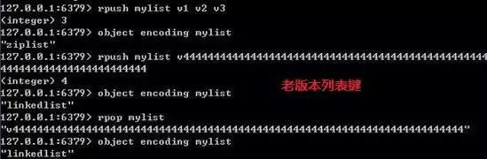

 

 

 

 

**ziplist是Redis为了节约内存而开发的**，是由一系列特殊编码的连续内存块(而不是像双端链表一样每个节点是指针)组成的顺序型数据结构；具体结构相对比较复杂，有兴趣读者可以看 Redis 哈希结构内存模型剖析。在新版本中**list链表使用 quicklist 代替了 ziplist和 linkedlist**：

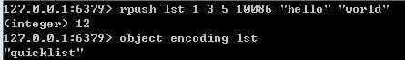

 

 

 

 

quickList 是 zipList 和 linkedList 的混合体。它将 linkedList 按段切分，每一段使用  zipList 来紧凑存储，多个 zipList 之间使用双向指针串接起来。因为链表的附加空间相对太高，prev 和 next 指针就要占去  16 个字节 (64bit 系统的指针是 8 个字节)，另外每个节点的内存都是单独分配，会加剧内存的碎片化，影响内存管理效率。

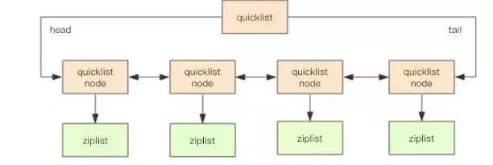

 

 

 

 

quicklist 默认的压缩深度是 0，也就是不压缩。**为了支持快速的 push/pop 操作，quicklist 的首尾两个 ziplist 不压缩**，此时深度就是 1。为了进一步节约空间，Redis 还会对 ziplist 进行压缩存储，使用 LZF 算法压缩。

 

**五、Hash**

------

 

Hash对象的底层实现可以是ziplist（压缩列表）或者hashtable（字典或者也叫哈希表）。


 

 

 

 

Hash对象只有同时满足下面两个条件时，才会使用ziplist（压缩列表）：1.哈希中元素数量小于512个；2.哈希中所有键值对的键和值字符串长度都小于64字节。

**hashtable哈希表可以实现O(1)复杂度的读写操作，因此效率很高**。源码如下**：**

```
1typedef struct dict {
 2    // 类型特定函数
 3    dictType *type;
 4     // 私有数据
 5    void *privdata;
 6     // 哈希表
 7    dictht ht[2];
 8    // rehash 索引
 9    // 当 rehash 不在进行时，值为 -1
10    int rehashidx; /* rehashing not in progress if rehashidx == -1 */
11     // 目前正在运行的安全迭代器的数量
12    int iterators; /* number of iterators currently running */
13 } dict;
14 typedef struct dictht {
15    // 哈希表数组
16    dictEntry **table;
17     // 哈希表大小
18    unsigned long size;
19    // 哈希表大小掩码，用于计算索引值
20    // 总是等于 size - 1
21    unsigned long sizemask;
22    // 该哈希表已有节点的数量
23    unsigned long used;
24} dictht;
25typedef struct dictEntry {
26    void *key;
27    union {void *val;uint64_t u64;int64_t s64;} v;
28    // 指向下个哈希表节点，形成链表
29    struct dictEntry *next;
30 } dictEntry;
31 typedef struct dictType {
32     // 计算哈希值的函数
33    unsigned int (*hashFunction)(const void *key);
34     // 复制键的函数
35    void *(*keyDup)(void *privdata, const void *key);
36     // 复制值的函数
37    void *(*valDup)(void *privdata, const void *obj);
38     // 对比键的函数
39    int (*keyCompare)(void *privdata, const void *key1, const void *key2);
40    // 销毁键的函数
41    void (*keyDestructor)(void *privdata, void *key);
42    // 销毁值的函数
43    void (*valDestructor)(void *privdata, void *obj);
44} dictType;
```

上面源码可以简化成如下结构：

 

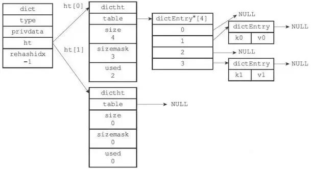

 

 

 

 

这个结构类似于JDK7以前的HashMap<String,Object>，当有两个或以上的键被分配到哈希数组的同一个索引上时，会产生哈希冲突。**Redis也使用链地址法来解决键冲突**。即每个哈希表节点都有一个next指针，多个哈希表节点用next指针构成一个单项链表，链地址法就是将相同hash值的对象组织成一个链表放在hash值对应的槽位。

Redis中的字典使用hashtable作为底层实现的话，每个字典会带有两个哈希表，一个平时使用，另一个仅在rehash（重新散列）时使用。随着对哈希表的操作，键会逐渐增多或减少。为了让哈希表的负载因子维持在一个合理范围内，Redis会对哈希表的大小进行扩展或收缩（rehash），也就是将**ht【0】里面所有的键值对分多次、渐进式的rehash到ht【1】里**。

**六、Set**

------

 

Set集合对象的底层实现可以是intset（整数集合）或者hashtable（字典或者也叫哈希表）。

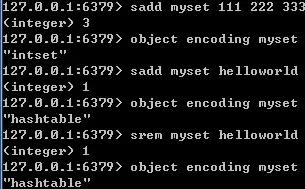

 

 

 

 

intset（整数集合）当一个集合只含有整数，并且元素不多时会使用intset（整数集合）作为Set集合对象的底层实现。

```
1typedef struct intset {
2    // 编码方式
3    uint32_t encoding;
4    // 集合包含的元素数量
5    uint32_t length;
6    // 保存元素的数组
7    int8_t contents[];
8} intset;
```

 

- sadd:intsetAdd---O(1)
- smembers:intsetGetO(1)---O(N)
- srem:intsetRemove---O(N)
- slen:intsetlen ---O(1)

**intset底层实现为有序，无重复数组保存集合元素**。 intset这个结构里的整数数组的类型可以是16位的，32位的，64位的。如果数组里所有的整数都是16位长度的，如果新加入一个32位的整数，那么整个16的数组将升级成一个32位的数组。**升级可以提升intset的灵活性，又可以节约内存**，但不可逆。

**7.ZSet**

------

 

ZSet有序集合对象底层实现可以是ziplist（压缩列表）或者skiplist（跳跃表）。

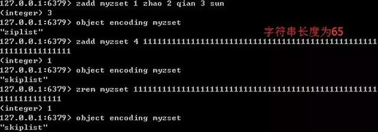

 

 

 

 

当一个有序集合的元素数量比较多或者成员是比较长的字符串时，Redis就使用skiplist（跳跃表）作为ZSet对象的底层实现。

```
1typedef struct zskiplist {
 2     // 表头节点和表尾节点
 3    struct zskiplistNode *header, *tail;
 4    // 表中节点的数量
 5    unsigned long length;
 6    // 表中层数最大的节点的层数
 7    int level;
 8 } zskiplist;
 9typedef struct zskiplistNode {
10    // 成员对象
11    robj *obj;
12    // 分值
13    double score;
14     // 后退指针
15    struct zskiplistNode *backward;
16    // 层
17    struct zskiplistLevel {
18        // 前进指针
19        struct zskiplistNode *forward;
20         // 跨度---前进指针所指向节点与当前节点的距离
21        unsigned int span;
22    } level[];
23} zskiplistNode;
```

 

zadd---zslinsert---平均O(logN), 最坏O(N)

zrem---zsldelete---平均O(logN), 最坏O(N)

zrank--zslGetRank---平均O(logN), 最坏O(N)

 

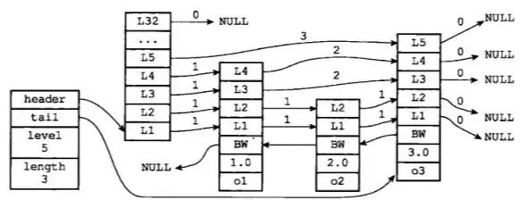

 

 

在此我向大家推荐一个架构学习交流qun。交流学习qun号：+q q-q u n：948 368 769  qun内已经有小伙伴将知识体系整理好（源码，笔记，PPT，学习视频）。里面会分享一些资深架构师录制的视频录像：有Spring，MyBatis，Netty源码分析，高并发、高性能、分布式、微服务架构的原理，JVM性能优化、分布式架构等这些成为架构师必备的知识体系。还能领取免费的学习资源，目前受益良多

 

skiplist的查找时间复杂度是LogN，可以和平衡二叉树相当，但实现起来又比它简单。**跳跃表(skiplist)是一种有序数据结构，它通过在某个节点中维持多个指向其他节点的指针，从而达到快速访问节点的目的。**