##  Docker介绍

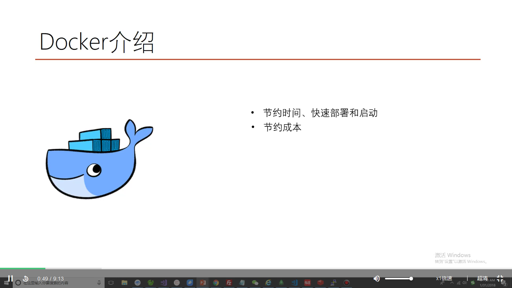


### 容器结合代码持续集成


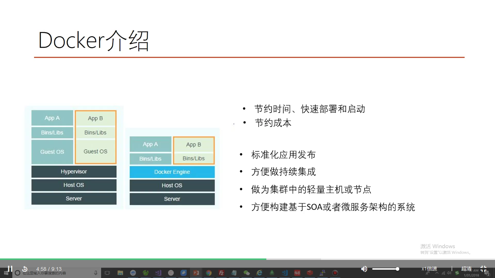


### 制作容器的镜像；来运行


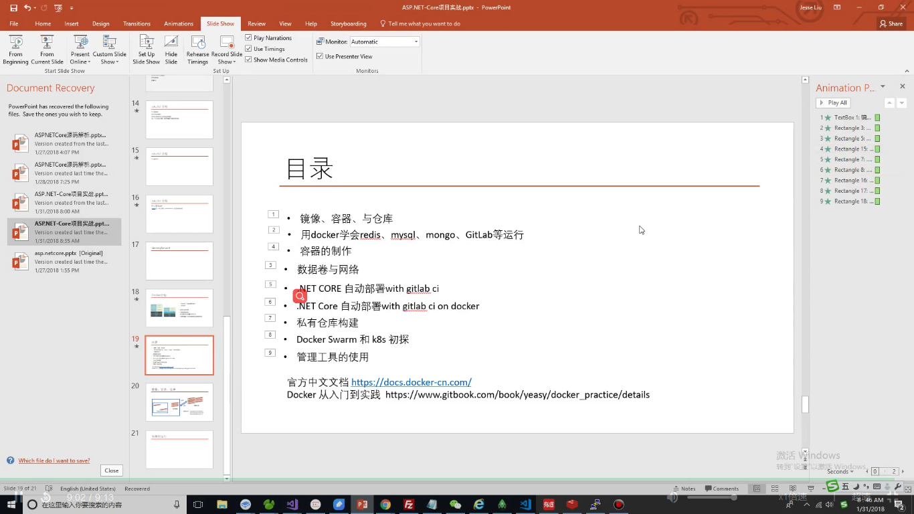


docker images

docker runm -d -p   


 

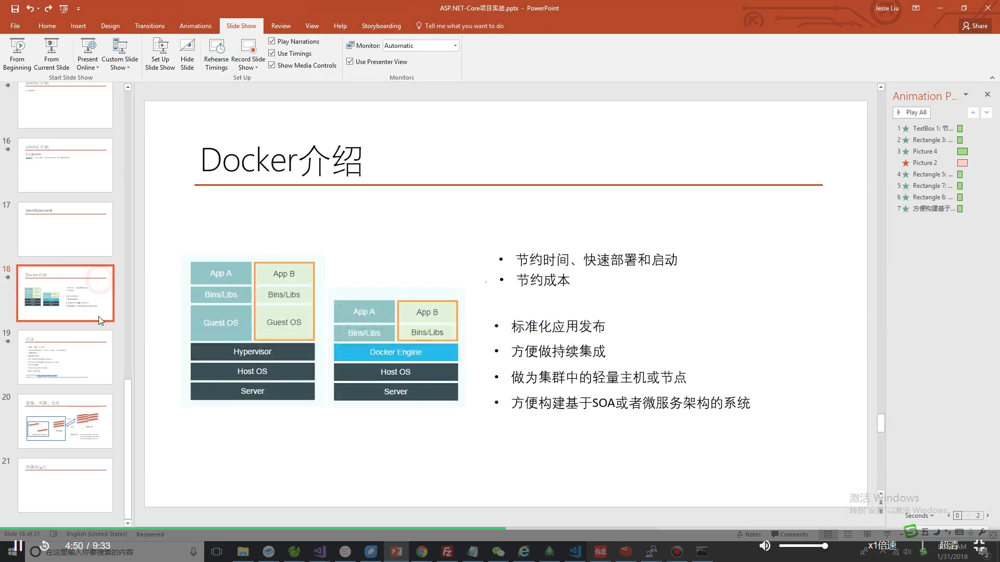


 ##  镜像	容器	仓库


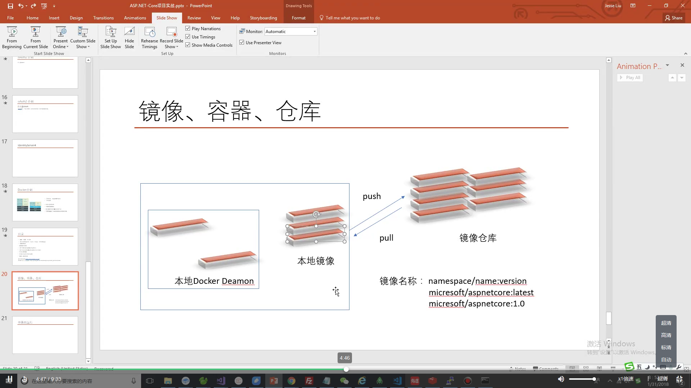


###  Docker Hub

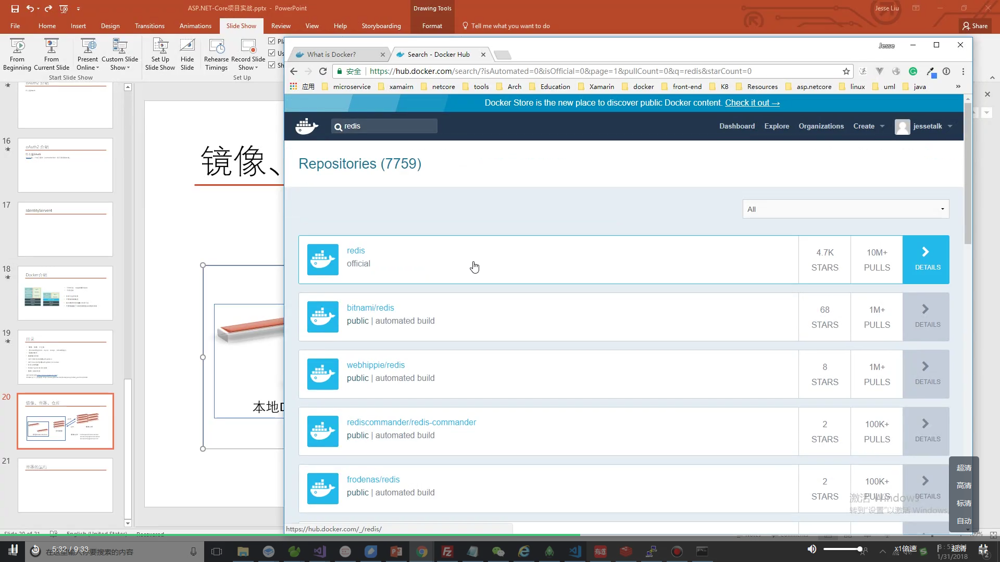


### Docker commands

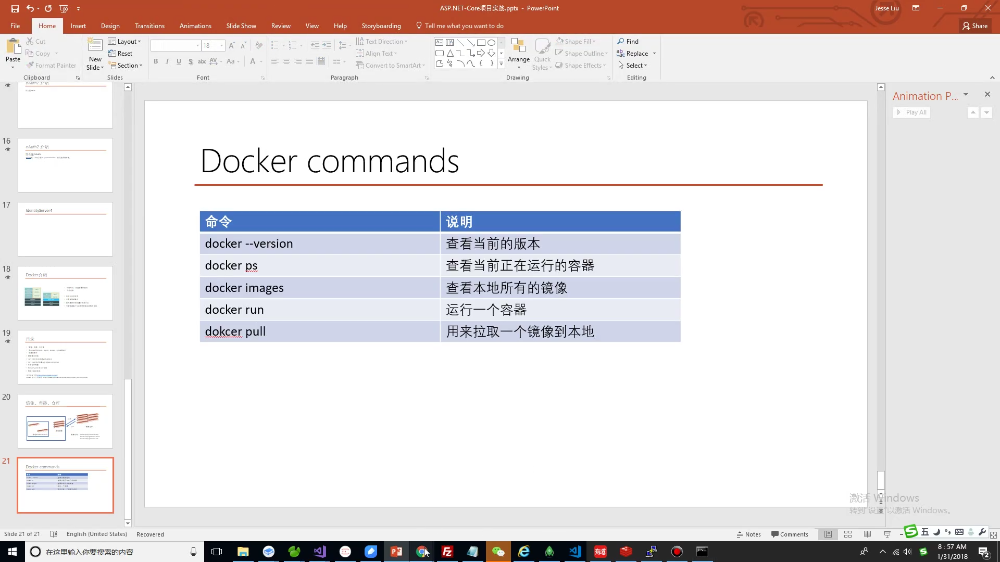


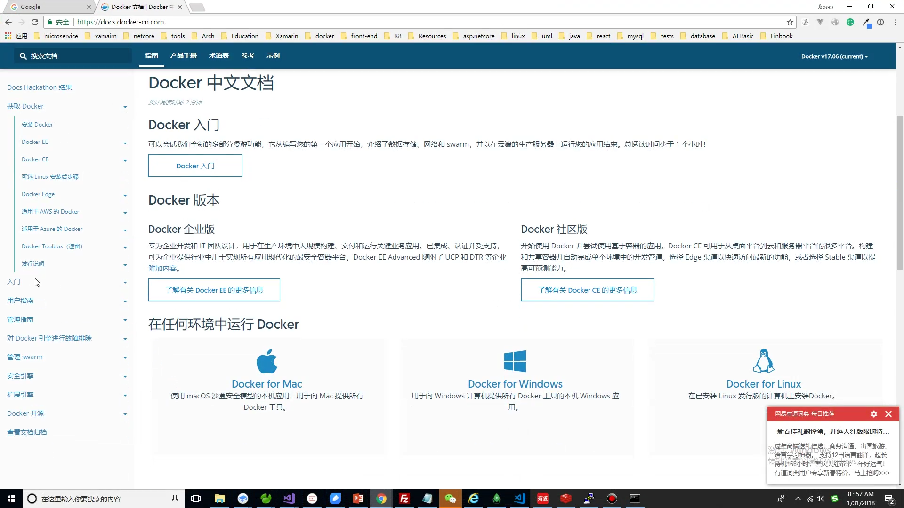


##  构建单机多容器运行环境


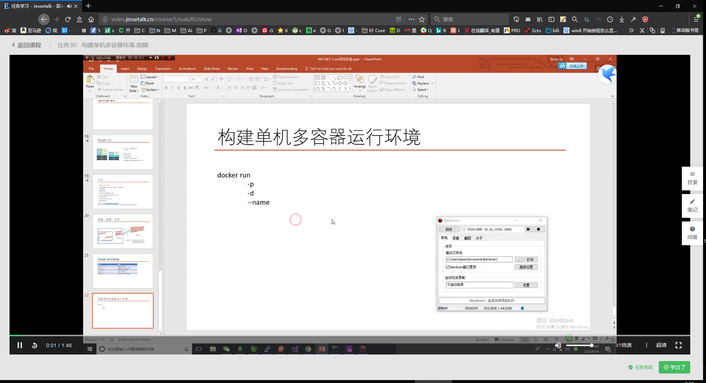


**Host**安装了引擎的主机


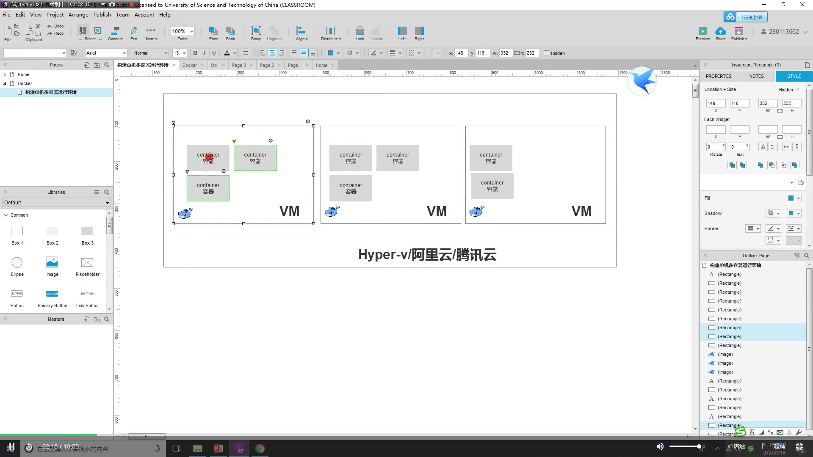


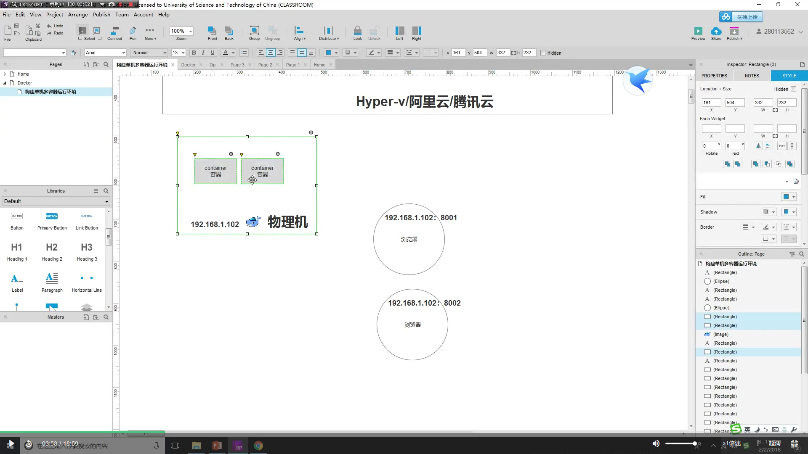


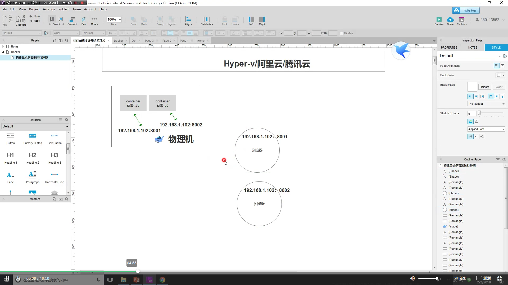


### 端口映射

 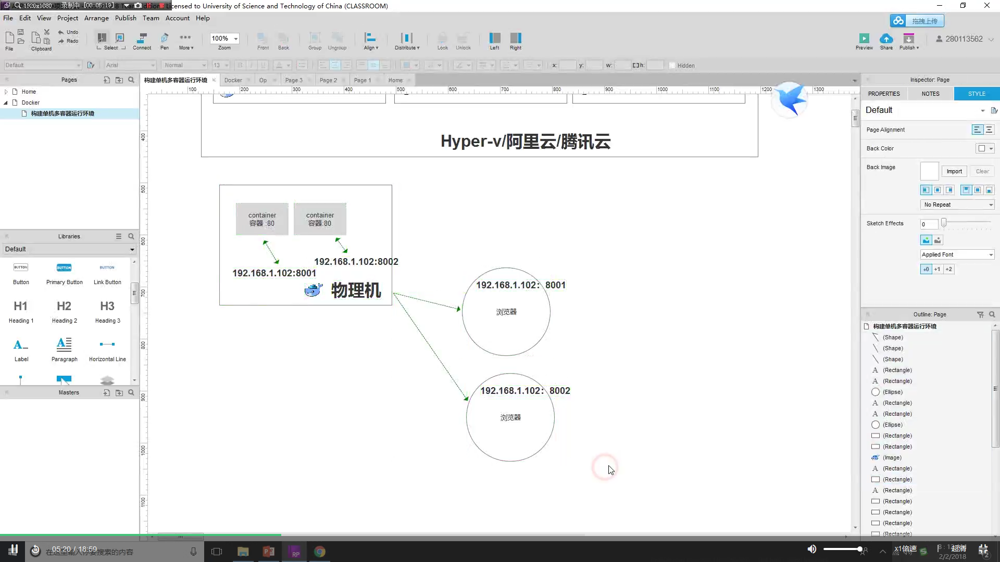


```powershell
docker run 8001:80 --hellomongo
```


### 单机架构

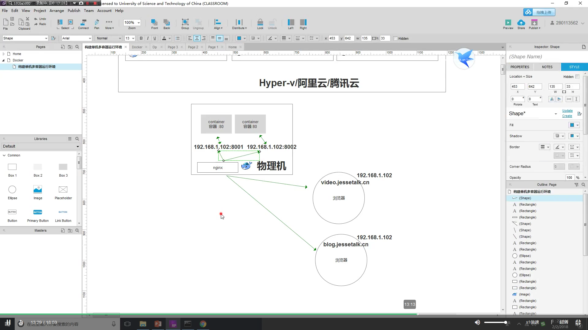

