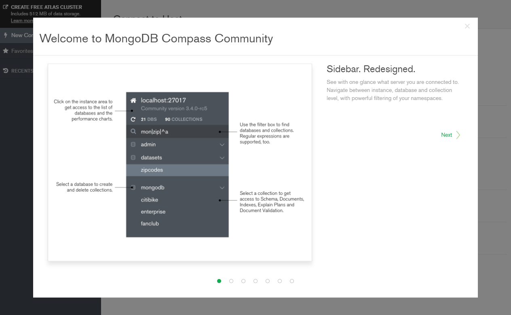
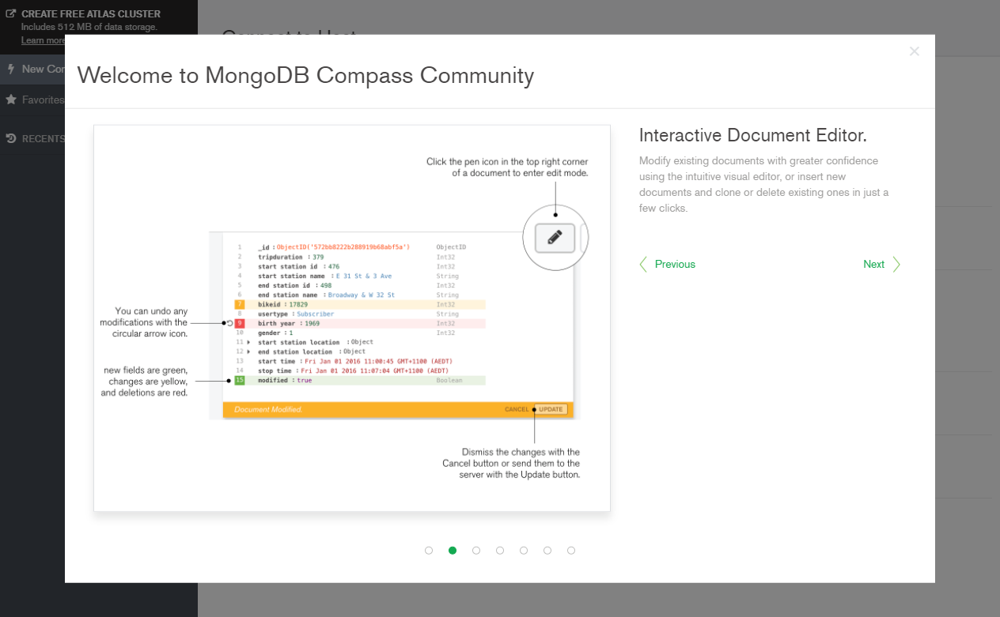
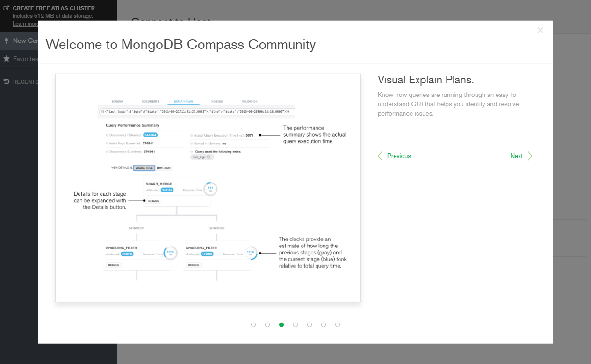
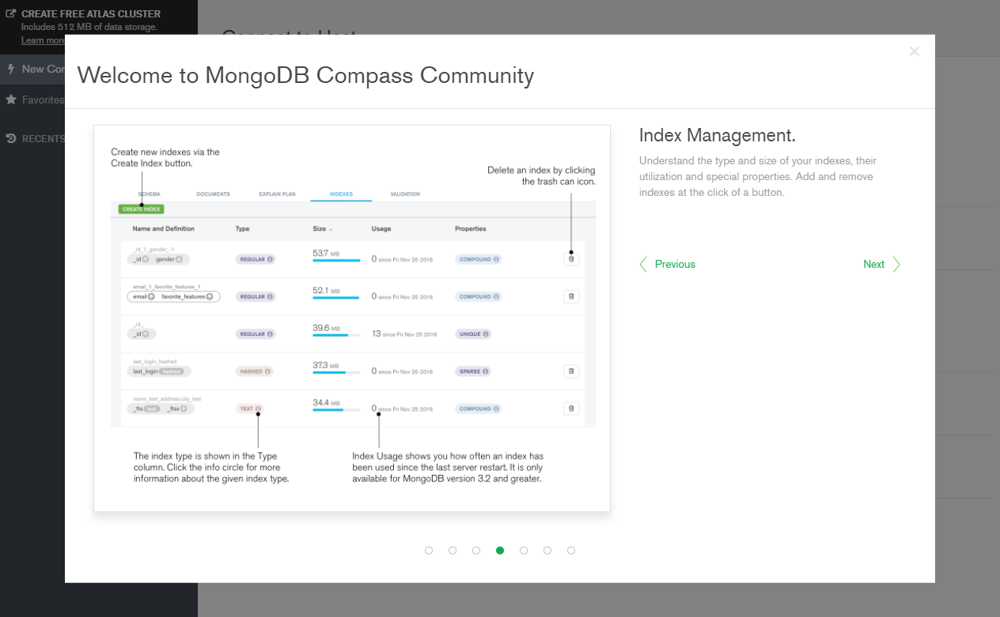
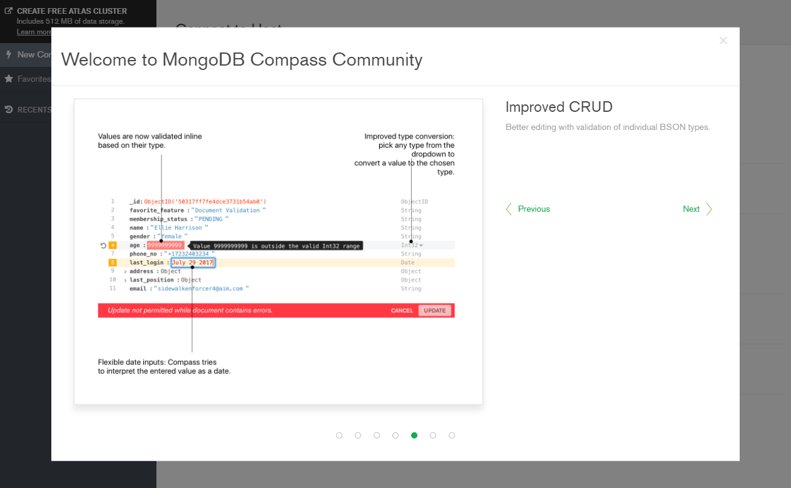
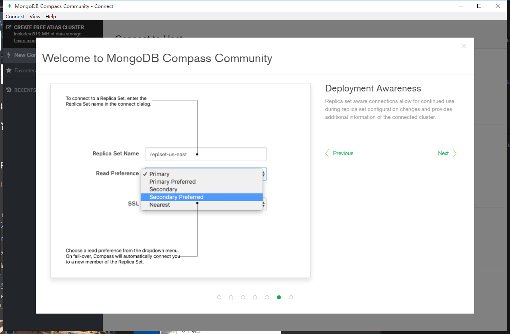
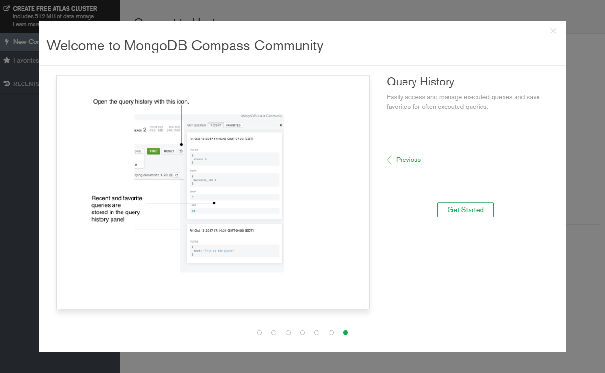

### Sidebar. Redesigned.

See with one glance what server you are connected to. Navigate between instance, database and collection level, with powerful filtering of your namespaces.

### Interactive Document Editor.

Modify existing documents with greater confidence using the intuitive visual editor, or insert new documents and clone or delete existing ones in just a few clicks.

### Visual Explain Plans.

Know how queries are running through an easy-to-understand GUI that helps you identify and resolve performance issues.

### Index Management.

Understand the type and size of your indexes, their utilization and special properties. Add and remove indexes at the click of a button.

### Improved CRUD

Better editing with validation of individual BSON types

### Deployment Awareness

Replica set aware connections allow for continued use during replica set configuration changes and provides additional information of the connected cluster.

### Query History

Easily access and manage executed queries and save favorites for often executed queries.

