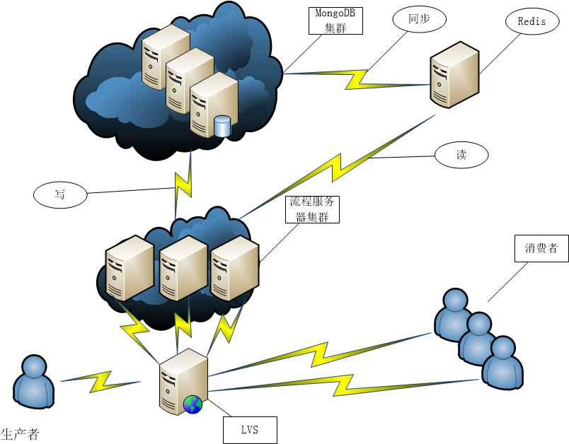
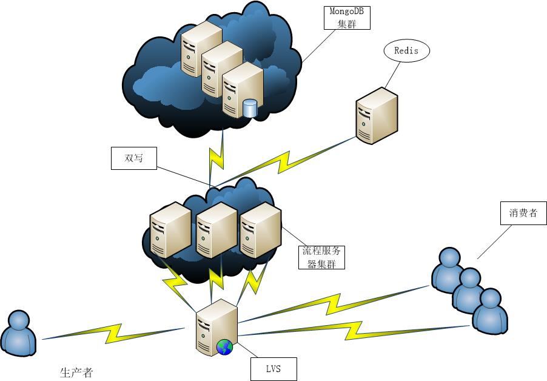

###	[redis和mongodb怎么结合](https://segmentfault.com/q/1010000005891539)

https://segmentfault.com/q/1010000005891539?_ea=956370

#####	mongodb可以对数据进行聚合，后台起cron

> 简单说，做缓存需要考虑几点：
> 1.缓存热点数据，针对自己的业务和数据结构特点，适当地选择或组合redis的数据结构进行存储。
> 2.缓存的更新和失效策略。
> 想不到了，以后再补充。
> 举个例子：mongodb＋redis
> mongodb可以对数据进行聚合，后台起cron，对数据每小时mapReduce一次，计算好的数据写到redis中保存（也可以直接输出到mongo collection中），前台查询redis 拿到聚合好的数据。

#####	对其一致性的不足进行补充

> mongodb的数据没有实时强一致性，某些场景下使用redis可以对其一致性的不足进行补充。
> 建议楼主将需要一致性的接口和不需要一致性的接口分开处理，前者使用redis来读取即可；但必须将关联的全部写mongodb操作都囊括进去。
> 具体实现方法各种各样，需要的话自己设计一个吧！

> 在某些很极端的场合在MongoDB前面再加一层Redis可能可以得到一定的收益，但是楼主是否考虑过自己的实际情况，是否真的到了需要在MongoDB前面加Redis的地步？要知道引入一项新技术，无论是维护成本还是开发成本，以及对开发人员的要求都会成倍增加。
> 比如原来可以直接从数据库读的东西，现在要考虑什么时候该从缓存读取，相应的就要考虑缓存如何刷新，脏数据该怎么办？这些问题说起来好像并不难，但不管什么问题放到高并发环境里就没有简单的问题。说句不中听的，楼主如果有足够的经验应付好上面这些问题，也就不会提现在这个问题了。幸运的是通常来说项目的并发还高不到需要两个一起用的地步，因为MongoDB已经有足够强的应付高并发的能力和水平扩展的能力。
> 所以抛开别人的意见不说，楼主自己应该想清楚这些问题：是什么驱使你把两项技术放在一起使用，你想从中得到什么好处？更重要的，如果只用其中一项技术，是不是也能解决问题？如果没有足够的证据说服自己，不妨实测一下用数据说话。

### 	[Redis+MongoDB 最佳实践 做到读写分离 -摘自网络](https://www.cnblogs.com/haoliansheng/p/4395640.html)

#####	方案1. (被否定)

 

加上Redis，做到MongoDB的读写分离，单一进程从MongoDB及时把任务同步到Redis中。

看起来很完美，但是上线后出现了各种各样的问题，列举一下：

1.Redis队列长度为多少合适？

2.同步进程根据优先级从MongoDB向Redis同步过程中，一次取多少任务合适？太大导致很多无谓的开销，太小又会频繁操作MongoDB

3.当某一个子任务处理较慢的时候，会导致MongoDB的前面优先级较高的任务没有结束，而优先级较低的确得不到处理，造成消费者空闲

 

#####	**最终方案：**

在生产者产生一个任务的同时，向Redis同步任务，Redis sort set(有序集合，保证优先级顺序不变)，消费者通过RPC调用时候，RPC服务器从Redis中取出任务，然后结束任务后从MongoDB中删除。

测试结果，Redis插入效率。Redis-benchmark 并发150,32byte一个任务,一共100W个，插入效率7.3W(不使用持久化)

在这之前我们的担心都是没必要的，Redis的性能非常的好。

目前此套系统可以胜任每天5KW量的任务，我相信可以更多。

