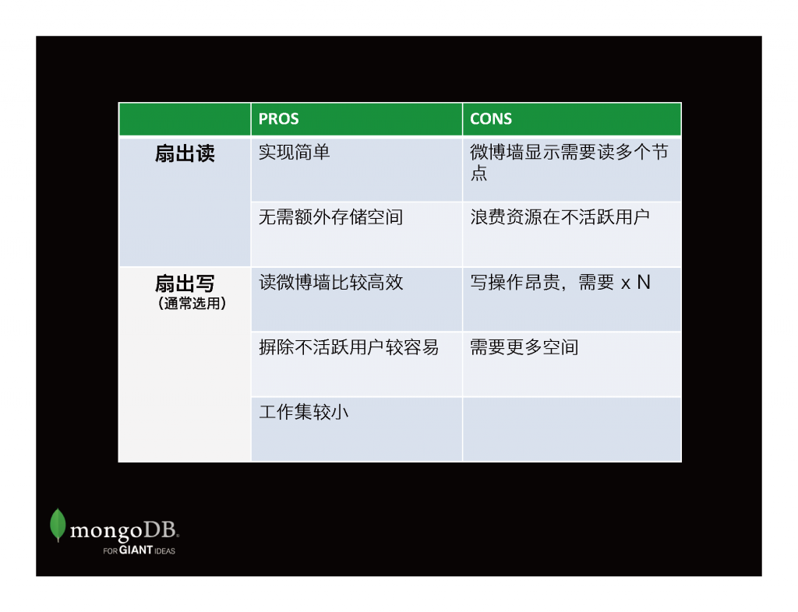
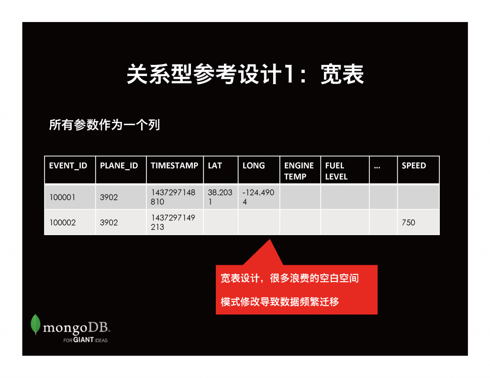
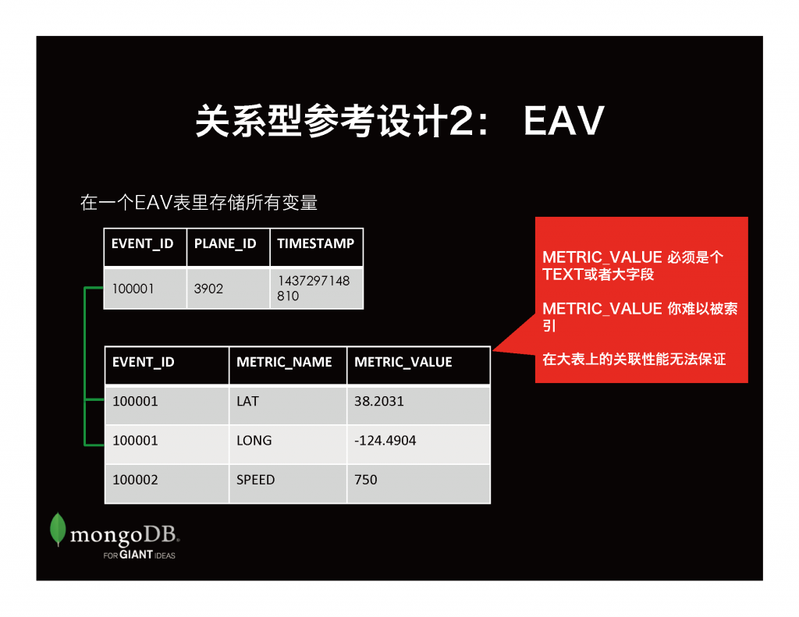
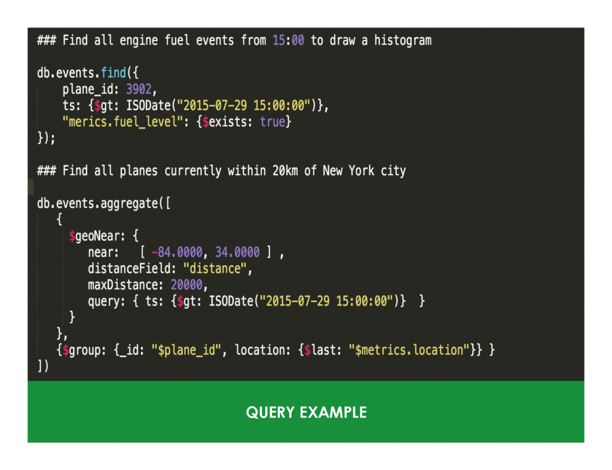
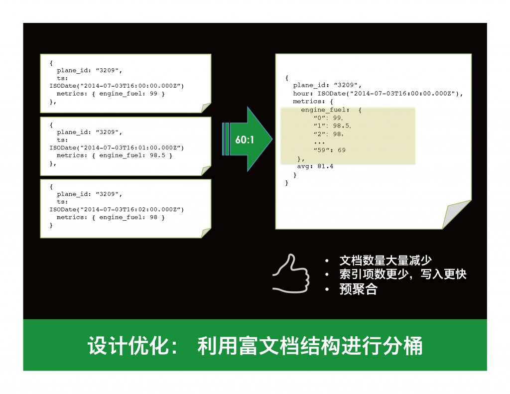
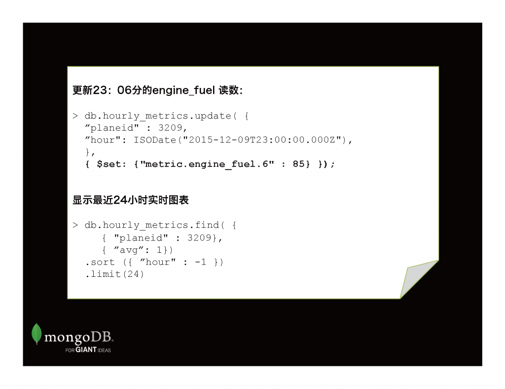
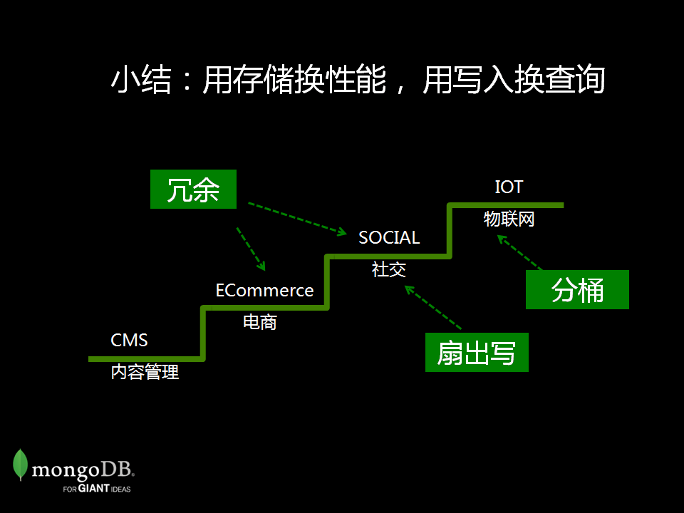

# MongoDB 进阶模式设计

 			[十二月 17, 2015](http://www.mongoing.com/mongodb-advanced-pattern-design)[TJ的博客](http://www.mongoing.com/tj)、[博客](http://www.mongoing.com/archives/category/blog)[TJ](http://www.mongoing.com/archives/author/user)					

12月12日上午，TJ在开源中国的年终盛典会上分享了文档模型设计的进阶技巧，就让我们来回顾一下吧: —————————————————————————————————————————————————————————-

从很久以前，我就开始接触开源产品：从最开始的使用、受益者到后来的贡献者，到现在的热情推广者。现在，我是MongoDB的技术顾问。我的职责是为MongoDB的客户和用户提供MongoDB使用的一些最佳实践，包括模式设计、性能优化和集群部署方案等方面。

今天的话题是进阶模式，所以我假设在坐各位至少是已经对MongoDB有了一些基本的了解。  不过每次总有一些同学以为这里有水果吃才坐进来的，所以在这里我简单介绍一下：MongoDB  不是芒果(mango)，它在拉丁文中的原意是巨大的意思。如果用一句话来概括的话，mongo是一个高可用、分布式、无模式的文档数据库。等一下，这里我故意用错了一个词：  不是无模式，而是“灵活模式”。 如果真的是无模式，今天我就不用站在这里了。没有模式何来模式设计之说。在你开始用mongo做一些  prototype的时候，确实不用考虑太多的模式。MongoDB内存数据库的一些特性，让你在前期不会遇到什么问题。但是一旦涉及到几千万几十亿的数据量，或者是数千数万的并发量，模式设计就是个你必须提前面对的问题。

在我们谈mongo的模式设计之前，我们很有必要来了解一下MongoDB的数据模型。大家都知道，无论你从哪个角度来看，MongoDB都是目前NoSQL，或者说非关系型的数据库中的领头羊。那么，mongo和传统关系数据库的最本质的区别在那里呢？我们说是它的文档模型。

关系模型和文档模型的区别在哪里？

- 关系模型需要你把一个数据对象，拆分成零部件，然后存到各个相应的表里，需要的是最后把它拼起来。举例子来说，假设我们要做一个CRM应用，那么要管理客户的基本信息，包括客户名字、地址、电话等。由于每个客户可能有多个电话，那么按照第三范式，我们会把电话号码用单独的一个表来存储，并在显示客户信息的时候通过关联把需要的信息取回来。
- 而MongoDB的文档模式，与这个模式大不相同。由于我们的存储单位是一个文档，可以支持数组和嵌套文档，所以很多时候你直接用一个这样的文档就可以涵盖这个客户相关的所有个人信息。关系型数据库的关联功能不一定就是它的优势，而是它能够工作的必要条件。  而在MongoDB里面，利用富文档的性质，很多时候，关联是个伪需求，可以通过合理建模来避免做关联。

虽然MongoDB的模型和关系型截然不同，但是关系型数据库的一些必不可少的功能如动态查询、二级索引、聚合等在MongoDB中也有非常完善的支持。

这里我介绍一下文档模型的优点：

- 读写效率高-由于文档模型把相关数据集中在一块，在普通机械盘上读数据的时候不用花太多时间去定位磁头，因此在IO性能上有先天独厚的优势；
- 可扩展能力强-关系型数据库很难做分布式的原因就是多节点海量数据关联有巨大的性能问题。如果不考虑关联，数据分区分库，水平扩展就比较简单；
- 动态模式-文档模型支持可变的数据模式，不要求每个文档都具有完全相同的结构。对很多异构数据场景支持非常好；
- 模型自然-文档模型最接近于我们熟悉的对象模型。从内存到存储，无需经过ORM的双向转换，性能上和理解上都很自然易懂。

那么我们如何考虑MongoDB 文档模式设计的基本策略呢？

- 其实很简单，我们一般建议的是先考虑内嵌， 直接按照你的对象模型来设计你的数据模型。如果你的对象模型数量不多，关系不是很复杂，那么恭喜你，可能直接一种对象对应一个集合就可以了。
- 内嵌是文档模型的特色，可以充分利用MongoDB的富文档功能来享受我们刚才谈到的一些文档模型的性能和扩展性等特性。一般的一对一、一对多关系，比如说一个人多个地址多个电话等等都可以放在一个文档里用内嵌来完成。
- 但是有一些时候，使用引用则难以避免。比如说，  一个明星的博客可能有几十万或者几百万的回复，这个时候如果把comments放到一个数组里，可能会超出16M的限制。这个时候你可以考虑使用引用的方式，在主表里存储一个id值，指向另一个表中的  id  值。使用引用要注意的就是：从性能上讲，一般我们可能需要两次以上才能把需要的数据取回来。更加重要的是：需要把数据存放到两个集合里，但是目前为止MongoDB并不支持跨表的事务性，所以对于强事务的应用场景要谨慎使用。

很多时候我们并不能很好地回答自己的问题，包括刚才的内嵌还是引用的问题。那么这个时候有必要了解一下，MongoDB模式设计的终极原则。MongoDB的模式设计和关系型大不相同，我们说MongoDB是为应用程序设计的，而不是为了存储优化的。如果可以达到最高性能的话，我们甚至可以做一些反范式的东西。  接下来我们来看几个比较具体的设计案例，了解一下MongoDB的模式设计思路：

我这里准备了4个比较经典的MongoDB案例，从CMS 内容管理到电商，社交到物联网。 由于时间原因我就从第二个开始。

在电商方面MongoDB的应用场景其实蛮多，比如说，大名鼎鼎的京东用mongo来存储过亿的商品信息，另外有一家著名的境外电商从头到尾用的都是MongoDB，包括订单管理等。这里我们就来看一下购物车这个场景。购物车的特点就是单个购物车数据项不会太大，一般来说不会超过100项目。双十一的时候淘宝的购物车里最多就只能放99件商品。在这里我要谢谢我的太太，是她让我知道了这个限制。另外一点就是购物车的数据可能需要过期删除。

我们说文档模型在这种场景会是个很好的选择：

大家看一下下面的参考数据模型，第一点注意我们可以使用MongoDB的TTL  索引来自动清理过期数据。TTL索引可以建立在任意一个时间字段上，在建立索引的时候可以指定文档在过多少时间后会被自动清理掉。第二个大家注意的是什么呢？在这里我们把商品的一些主要信息放到购物车里了，比如说  name,price, quantity，为什么？  读一次所有信息都拿到了：价格、数量等等，不需要再去查另一张表。这是一种比较常见的优化手段，用冗余的方式来提供读取性能。

接下来我们看一下使用这种模式的时候如何进行一些购物车的操作。比如说，如果我们想要往购物车里增加一个价值2元的面包，我们可以用下面的update语句。注意$push的用法。$push 类似于javascript的操作符，意思是往数组尾部增加一个元素。

如果需要更新购物车中某个产品的数量，你可以用update语句直接操作数组的某一个元素。在这里我们需要做的是更新item 4567的数量为5。 注意 items.$.quanity的使用，这里的$ 表示在查询条件里匹配上的数组元素的序数。

如果需要统计一下在购物车内某个商品的总数，可以使用MongoDB的聚合功能。聚合运算在MongoDB里面是对数据输入源进行一系列的运算。在这里我们做的就是几个步骤是：

1. $match: 在所有购物车中过滤掉其他商品，只选出id是8910的商品
2. $unwind: 把items 数组展开，每个数组元素变成一个文档
3. $group: 用聚合运算 $sum 把每一件商品的数量相加获得总和

下面我们来看一个社交网络的例子。社交app最关键的一些场景就是维护朋友关系以及朋友圈或微博墙等。

对于关系描述，使用文档模型的内嵌数组特性，我们可以很容易地把我关注的用户（following）和关注我的用户表示出来。下例表示TJ我的关注的用户是mandy和bert，而oscar和mandy则在关注我。这种模式是文档模型中最经典的。但是有一个潜在问题就是如果TJ我是一个明星，他们关注我的人可能有千万。一个千万级的数组会有两个问题：1）  有可能超出一个文档最大16M的硬性限制； 2） MongoDB数组太大会严重影响性能。

怎么办？我们可以建立一个专门的集合来描述关注关系。这里就是一个内嵌和引用的经典选择。我们希望用内嵌，但是如果数组维度太大，就需要考虑用另外一个集合的方式来表示一对多的关系（用户 1–N 关注者）

另外一个要注意的是**关注数**，我们在显示关注和粉丝数量的时候，不希望去跑一次count 查询再显示。因为count操作一般来说会比较占资源。通常的做法可以再用户对象里面加两个字段，一个是关注数一个是粉丝数。每次有人关注或者关注别人时候就更新一下。

下面我们来看看比较有趣的微博墙，或者微信朋友圈的实现有什么考量。

在实现微博墙的时候，有两种方式可以考虑：**扇出读** 或者是**扇出写**。

扇出读、扇出写的说法是基于社交网络的海量用户、海量数据的应用特征。这些大量的数据往往分布在各个分片服务器上。扇出读是一种比较常规的做法，就是当你需要去获得所有你关注用户的最新更新的时候，你就去到每一个你关注用户的数据区，把最新的一些数据取回来。因为需要去到不同的分片服务器去取，所以叫做扇出读。大家可以想象，这种扇出读的效率不会太高，基本上是最慢的那个服务器的响应时间决定了总体的响应时间。  当然，这种方式是比较简单的，不需要特殊处理。

扇出写，我称之为土豪玩法。具体来说就是当发布的时候，一条数据会写多次，直接写到每一个关注你的粉丝的墙上。这样做的好处是当你的粉丝读他自己的微博墙的时候，他只需要去一个地方就可以把所有最新的更新连续取回来。由于一个用户的数据可一般可以存储在同一台服务器上的同一个区域，通过这种方式可以实现快速的读取微博墙数据。  代价当然也是很明显： 你的写入需求会被放大几十几百倍，存储也是相应的扩大几十几百倍。这个绝对不是关系型数据库的玩法，但是在MongoD  模式设计，这个很正常。只要保证性能，什么事情都做得出来。

下面这个例子，首先是mandy在发消息的时候会写（push）到我的墙上（timeline）来。如果mandy有50个关注者，那么这个写就会有50次，每个关注者一次。

第二条语句就是我打开微博的时候，一条语句，一个地方就可以找到所有我朋友发的状态更新。注意：这里还使用了bucket，这是另外一个控制文档内数组元素个数的有效方法。比如说我们定义bucket  大小是1000的话，超过1000 就把新的数据插入到下一个文档并对bucket 序数递增。

好了，最后我们来看一下物联网的应用场景：

各位还有多少人仍然记得MH370，去年在印度洋消失的客机？在该事故之后，许多人都在疑惑：在当今的技术水平下，为什么我们不能跟踪如此庞大的一个东西？

让我们来看看如果要监控飞机数据有什么样的挑战。飞机上面的数据源众多，光收集位置信息，就需要多个系统协作完成， 如ADS-C， EUROCONTROL等等。此外，收集的数据也是各种各样：位置是2D、速度是数值、引擎参数则是多维度的。

另一个挑战就是海量数据。一个三小时的航班，每分钟采集一次，少说点，每次100条数据，那就是每秒1万8千个数据点。按每天100，000航班，一天的数据算下来有18亿条，1.8TB  左右的数据， 21,000 的QPS。 从哪个角度来看，这都是个经典的大数据问题。

这个问题在关系型数据库解决的话，比较幼稚的方法就是设计一个超宽的表。所有需要采集的每一个值就是一个列。这种设计的问题比较明显：

1. 容易造成空白浪费，不是每一条记录都包含所有字段值
2. 可能会经常需要改数据库模式。对于海量数据，改一次模式代价巨大。

另一种改良方案是用EAV 设计模式。就是采用一个主表和一个属性值表。在属性值表里存放所有的参数键值对。这样做的好处自然是灵活性：增加新的参数时无需修改模式。但是问题同样存在：用来存储值的那列`METRIC_VALUE`的字节大小必须定义成所有值的最大值 才可以放下所有的参数值。这个可能带来空间浪费，但是更严重的问题是：将不太可能在此字段上建索引，进而影响一些场景的使用。

下面我们来看看文档模型怎么做： 这里对于location 、speed  等不同数据类型的字段，在文档模型下可以直接支持。下面的两个文档，第一个文档和第二个文档可以同属一个集合，但是可以有完全不同的字段。  MongoDB对异构数据的支持在这样的场景下有得天独厚的优势。如果我们希望对某一个metric如location建立索引，我们也可以使用mongoDB的稀疏索引  (Sparse  Index)仅对有location字段的文档建索引，在不造成索引空间浪费的前提下提高检索效率。当需要增加新的字段的时候，也不需要对模式做任何修改，可以直接就在应用中的JSON模型里添加需要的字段（elevation)。

在IOT这个场景里，我们可以使用一个叫做分桶的设计方式来进行几十倍的性能增长。具体来说就是把采集的数据按小时为一个桶，把每小时的数据聚合到一个文档里。如下面所示，每分钟的值用子文档的一个字段来表示。这样做的好处就是大量减少文档的数量，相应的索引数量也会减少，总体写入IO将会大幅度降低并得到性能提升。

 

使用这种方式我们还可以把一些统计需要的数值，如每小时的平均值预先就作为一个字段存进去，需要的时候不用现场计算，只要从文档里读出来即可。

小结一下，冗余、扇出写、分桶，这些都是mongodb 的一些常用优化手段。 大家可以看到，通过减少额外查询或者关联的需求，通过使用冗余、额外存储的非常规方式，我们希望做到的是性能上的最高提升。

MongoDB 中国团队正在扩张中。希望和一流的、创新的数据库团队一起工作吗？加入我们吧，我们在寻找有开发架构或者数据库相关经验的大牛们加入我们的技术顾问阵营。有兴趣？加微信 tjtang826 私聊吧！

 			

## 关于TJ

 			MongoDB高级架构师			[ 				查看所有由TJ发表的文章 →			](http://www.mongoing.com/archives/author/user) 		