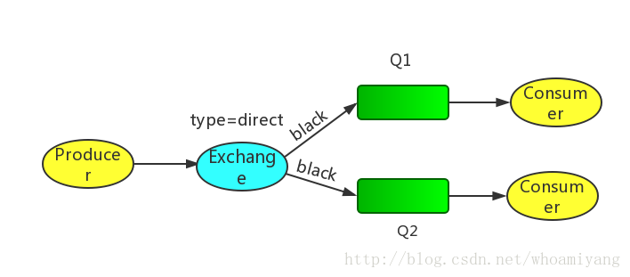
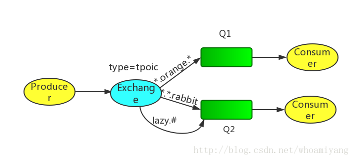

### 5.分发到多个Consumer

#### 5.1Exchange 类型

##### 

Exchange分发消息时根据类型的不同分发策略有区别，目前共四种类型：direct、fanout、topic、headers 。headers 匹配 AMQP 消息的 header 而不是路由键，此外 headers 交换器和 direct 交换器完全一致，但性能差很多，目前几乎用不到了，所以直接看另外三种类型：

作者：预流

链接：https://www.jianshu.com/p/79ca08116d57/

来源：简书

简书著作权归作者所有，任何形式的转载都请联系作者获得授权并注明出处。


|          | Exchange规则                                                 |
| -------- | ------------------------------------------------------------ |
| 类型名称 | 类型描述                                                     |
| fanout   | 把所有发送到该Exchange的消息路由到所有与它绑定的Queue中      |
| direct   | Routing Key==Binding Key                                     |
| topic    | 我这里自己总结的简称模糊匹配                                 |
| headers  | Exchange不依赖于routing key与binding key的匹配规则来路由消息，而是根据发送的消息内容中的headers属性进行匹配。 |


先来温习以下交换机路由的几种类型:

#####  Direct Exchange:直接匹配,

通过Exchange名称+RountingKey来发送与接收消息. 

##### Fanout Exchange:广播订阅,

向所有的消费者发布消息,但是只有消费者将队列绑定到该路由器才能收到消息,忽略Routing Key. 

##### Topic Exchange：主题匹配订阅

这里的主题指的是RoutingKey,RoutingKey可以采用通配符,如:*或#，RoutingKey命名采用.来分隔多个词,只有消息这将队列绑定到该路由器且指定RoutingKey符合匹配规则时才能收到消息; 

##### Headers Exchange:消息头订阅,

消息发布前,为消息定义一个或多个键值对的消息头,然后消费者接收消息同时需要定义类似的键值对请求头:(如:x-mactch=all或者x_match=any)，只有请求头与消息头匹配,才能接收消息,忽略RoutingKey. 

默认的exchange:如果用空字符串去声明一个exchange，那么系统就会使用”amq.direct”这个exchange，我们创建一个queue时,默认的都会有一个和新建queue同名的routingKey绑定到这个默认的exchange上去

```
channel.BasicPublish("", "TaskQueue", properties, bytes);
```

- 1

因为在第一个参数选择了默认的exchange，而我们申明的队列叫TaskQueue，所以默认的，它在新建一个也叫TaskQueue的routingKey，并绑定在默认的exchange上，导致了我们可以在第二个参数routingKey中写TaskQueue，这样它就会找到定义的同名的queue，并把消息[放进去](https://www.baidu.com/s?wd=%E6%94%BE%E8%BF%9B%E5%8E%BB&tn=24004469_oem_dg&rsv_dl=gh_pl_sl_csd)。 
**如果有两个接收程序都是用了同一个的queue和相同的routingKey去绑定direct exchange的话，分发的行为是负载均衡的，也就是说第一个是程序1收到，第二个是程序2收到，以此类推。** 
**如果有两个接收程序用了各自的queue，但使用相同的routingKey去绑定direct exchange的话，分发的行为是复制的，也就是说每个程序都会收到这个消息的副本。行为相当于fanout类型的exchange。** 
下面详细来说:

#### 5.2 Bindings 绑定

绑定其实就是关联了exchange和queue，或者这么说:queue对exchange的内容感兴趣,exchange要把它的Message deliver到queue。

#### 5.3Direct exchange

Driect exchange的路由算法非常简单:通过bindingkey的完全匹配，可以用下图来说明. 
 
Exchange和两个队列绑定在一起,Q1的bindingkey是orange，Q2的binding key是black和green. 
当Producer publish key是orange时,exchange会把它放到Q1上,如果是black或green就会到Q2上,其余的Message被丢弃.

#### 5.4 Multiple bindings

多个queue绑定同一个key也是可以的,对于下图的例子,Q1和Q2都绑定了black,对于routing key是black的Message，会被deliver到Q1和Q2，其余的Message都会被丢弃. 


#### 5.5 Topic exchange

对于Message的routing_key是有限制的，不能使任意的。格式是以点号“.”分割的字符表。比如：”stock.usd.nyse”, “nyse.vmw”, “quick.orange.rabbit”。你可以放任意的key在routing_key中，当然最长不能超过255 bytes。 
对于routing_key，有两个特殊字符

- *(星号)代表任意一个单词
- \#(hash)0个或多个单词 
   
  Producer发送消息时需要设置routing_key，routing_key包含三个单词和连个点号o,第一个key描述了celerity(灵巧),第二个是color(色彩),第三个是物种: 
  在这里我们创建了两个绑定： Q1 的binding key 是”.orange.“； Q2 是 “..rabbit” 和 “lazy.#”：
  - Q1感兴趣所有orange颜色的动物
  - Q2感兴趣所有rabbits和所有的lazy的. 
    例子:rounting_key 为 “quick.orange.rabbit”将会发送到Q1和Q2中 
    rounting_key 为”lazy.orange.rabbit.hujj.ddd”会被投递到Q2中,#匹配0个或多个单词。


### Exchange type四大类型：

##### Direct Exchange


​       direct类型的Exchange路由规则也很简单，它会把消息路由到那些binding key与routing key完全匹配的Queue中。（在实际使用RabbitMQ的过程中并没有binding key这个参数，只有routing key）

> 消息中的路由键（routing key）如果和 Binding 中的 binding key 一致， 交换器就将消息发到对应的队列中。路由键与队列名完全匹配，如果一个队列绑定到交换机要求路由键为“dog”，则只转发 routing key 标记为“dog”的消息，不会转发“dog.puppy”，也不会转发“dog.guard”等等。它是完全匹配、单播的模式。
>
> 作者：预流
>
> 链接：https://www.jianshu.com/p/79ca08116d57/
>
> 来源：简书
>
> 简书著作权归作者所有，任何形式的转载都请联系作者获得授权并注明出处。

所有发送到Direct Exchange的消息被转发到具有指定RouteKey的Queue。

Direct模式,可以使用rabbitMQ自带的Exchange：default Exchange 。所以不需要将Exchange进行任何绑定(binding)操作 。消息传递时，RouteKey必须完全匹配，才会被队列接收，否则该消息会被抛弃。


##### Fanout Exchange


  fanout类型不处理路由键，只需要简单的将队列绑定到交换机上；一个发送到交换机的消息都会被转发到与该交换机绑定的所有队列上

>  每个发到 fanout 类型交换器的消息都会分到所有绑定的队列上去。fanout 交换器不处理路由键，只是简单的将队列绑定到交换器上，每个发送到交换器的消息都会被转发到与该交换器绑定的所有队列上。很像子网广播，每台子网内的主机都获得了一份复制的消息。fanout 类型转发消息是最快的。
>
> 作者：预流
>
> 链接：https://www.jianshu.com/p/79ca08116d57/
>
> 来源：简书
>
> 简书著作权归作者所有，任何形式的转载都请联系作者获得授权并注明出处。


所有发送到Fanout Exchange的消息都会被转发到与该Exchange 绑定(Binding)的所有Queue上。

Fanout Exchange 不需要处理RouteKey 。只需要简单的将队列绑定到exchange 上。这样发送到exchange的消息都会被转发到与该交换机绑定的所有队列上。类似子网广播，每台子网内的主机都获得了一份复制的消息。

所以，Fanout Exchange 转发消息是最快的。

为了演示效果，定义了两个队列，分别为hello1，hello2，每个队列都拥有一个消费者。


##### Topic Exchange


 topic类型的Exchange在匹配规则上进行了扩展，它与direct类型的Exchage相似，也是将消息路由到binding key与routing key相匹配的Queue中，但direct是完全匹配，而通过topic可以进行模糊匹配，绝大数业务逻辑采用的就是这种类型。

> topic 交换器通过模式匹配分配消息的路由键属性，将路由键和某个模式进行匹配，此时队列需要绑定到一个模式上。它将路由键和绑定键的字符串切分成单词，这些单词之间用点隔开。它同样也会识别两个通配符：符号“#”和符号“*”。#匹配0个或多个单词，*匹配不多不少一个单词。
>

所有发送到Topic Exchange的消息被转发到能和Topic匹配的Queue上，

Exchange  将路由进行模糊匹配。可以使用通配符进行模糊匹配，符号“#”匹配一个或多个词，符号“*”匹配不多不少一个词。因此“XiaoChen.#”能够匹配到“XiaoChen.pets.cat”，但是“XiaoChen.*”  只会匹配到“XiaoChen.money”。


----


### [Exchange Types](https://blog.csdn.net/whycold/article/details/41119807)

RabbitMQ常用的Exchange Type有fanout、direct、topic、headers这四种（AMQP规范里还提到两种Exchange Type，分别为system与自定义，这里不予以描述），下面分别进行介绍。

### fanout

fanout类型的Exchange路由规则非常简单，它会把所有发送到该Exchange的消息路由到所有与它绑定的Queue中。
[](http://ostest.qiniudn.com/wordpress/wp-content/uploads/2014/02/2014-2-21-9-54-26.png)
上图中，生产者（P）发送到Exchange（X）的所有消息都会路由到图中的两个Queue，并最终被两个消费者（C1与C2）消费。

### direct

direct类型的Exchange路由规则也很简单，它会把消息路由到那些binding key与routing key完全匹配的Queue中。
[](http://ostest.qiniudn.com/wordpress/wp-content/uploads/2014/02/2014-2-21-9-55-20.png)
以上图的配置为例，我们以routingKey=”error”发送消息到Exchange，则消息会路由到Queue1（amqp.gen-S9b…，这是由RabbitMQ自动生成的Queue名称）和Queue2（amqp.gen-Agl…）；如果我们以routingKey=”info”或routingKey=”warning”来发送消息，则消息只会路由到Queue2。如果我们以其他routingKey发送消息，则消息不会路由到这两个Queue中。

### topic

前面讲到direct类型的Exchange路由规则是完全匹配binding key与routing key，但这种严格的匹配方式在很多情况下不能满足实际业务需求。topic类型的Exchange在匹配规则上进行了扩展，它与direct类型的Exchage相似，也是将消息路由到binding key与routing key相匹配的Queue中，但这里的匹配规则有些不同，它约定：

- routing key为一个句点号“. ”分隔的字符串（我们将被句点号“. ”分隔开的每一段独立的字符串称为一个单词），如“stock.usd.nyse”、“nyse.vmw”、“quick.orange.rabbit”
- binding key与routing key一样也是句点号“. ”分隔的字符串
- binding key中可以存在两种特殊字符“*”与“#”，用于做模糊匹配，其中“*”用于匹配一个单词，“#”用于匹配多个单词（可以是零个）

[](http://ostest.qiniudn.com/wordpress/wp-content/uploads/2014/02/2014-2-21-9-57-37.png)
以上图中的配置为例，routingKey=”quick.orange.rabbit”的消息会同时路由到Q1与Q2，routingKey=”lazy.orange.fox”的消息会路由到Q1与Q2，routingKey=”lazy.brown.fox”的消息会路由到Q2，routingKey=”lazy.pink.rabbit”的消息会路由到Q2（只会投递给Q2一次，虽然这个routingKey与Q2的两个bindingKey都匹配）；routingKey=”quick.brown.fox”、routingKey=”orange”、routingKey=”quick.orange.male.rabbit”的消息将会被丢弃，因为它们没有匹配任何bindingKey。

### headers

headers类型的Exchange不依赖于routing key与binding key的匹配规则来路由消息，而是根据发送的消息内容中的headers属性进行匹配。
在绑定Queue与Exchange时指定一组键值对；当消息发送到Exchange时，RabbitMQ会取到该消息的headers（也是一个键值对的形式），对比其中的键值对是否完全匹配Queue与Exchange绑定时指定的键值对；如果完全匹配则消息会路由到该Queue，否则不会路由到该Queue。
该类型的Exchange没有用到过（不过也应该很有[用武之地](https://www.baidu.com/s?wd=%E7%94%A8%E6%AD%A6%E4%B9%8B%E5%9C%B0&tn=24004469_oem_dg&rsv_dl=gh_pl_sl_csd)），所以不做介绍。

