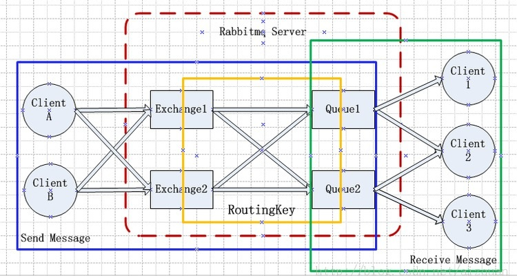
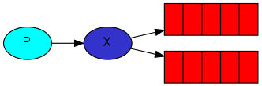
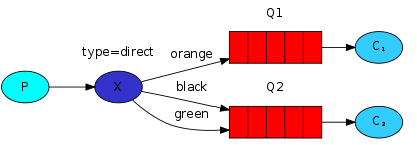
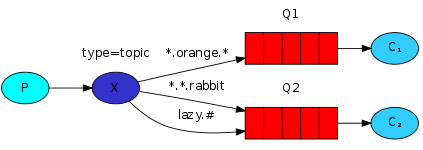
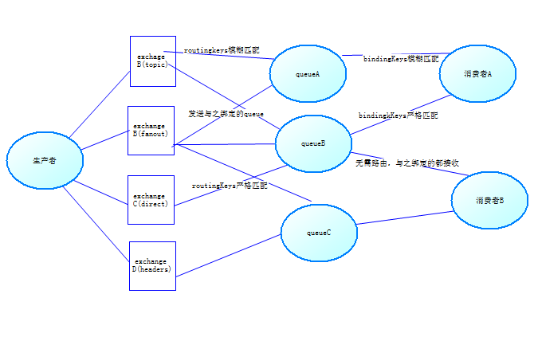

## **RabbitMQ持久化**

在RabbitMQ中存在四种交换机，

一是直连交换机（Direct Exchange），二是广播交换机（Fantout Exchange），

三是主体交换机（Topic Exchange），四是头交换机（Header Exchange），

每种交换机都有其对应场景，后面会一一讲到。

任何处理消息的开源库都离不开两个角色，一是生产者（Producer），二是消费者（Consumer），消息从生产者到达消费者需经过三个阶段也就是

我们需要知道的三个概念，一是交换机，二是队列，三是绑定，初次见此三者概念感觉很高大上是不是，其实不过是高度抽象了而已，同时看到很多博客上对此三者解释的还是非常深刻，我这里就不过多细说。我们先看别人博客上对整个RabbitMQ架构用图来进行标识，然后对照我对交换机、队列、绑定一言以蔽之进行如下概括您就明白他们具体是干什么了。

> 交换机是生产者发布消息的入口点，队列是消费者获取消息的容器，绑定是将交换机连接到队列的规则

概念说明: 

Broker:它提供一种传输服务,它的角色就是维护一条从生产者到消费者的路线，保证数据能按照指定的方式进行传输, 

Exchange：消息交换机,它指定消息按什么规则,路由到哪个队列。 

Queue:消息的载体,每个消息都会被投到一个或多个队列。 

Binding:绑定，它的作用就是把exchange和queue按照路由规则绑定起来. 

Routing Key:路由关键字,exchange根据这个关键字进行消息投递。 

vhost:虚拟主机,一个broker里可以有多个vhost，用作不同用户的权限分离。 

Producer:消息生产者,就是投递消息的程序. 

Consumer:消息消费者,就是接受消息的程序. 

Channel:消息通道,在客户端的每个连接里,可建立多个channel.

> Channel可以理解为建立在生产者/消费者和RabbitMQ[服务器](https://www.baidu.com/s?wd=%E6%9C%8D%E5%8A%A1%E5%99%A8&tn=24004469_oem_dg&rsv_dl=gh_pl_sl_csd)之间的TCP连接上的虚拟连接，一个TCP连接上可以建立多个Channel。 RabbitMQ服务器的Exchange对象可以理解为生产者发送消息的邮局，消息队列可以理解为消费者的邮箱。Exchange对象根据它定义的规则和消息包含的routing key以及header信息将消息转发到消息队列。
>

前面我们可以看到生产者将消息投递到Queue中，实际上这在RabbitMQ中这种事情永远都不会发生。实际的情况是，生产者将消息发送到Exchange（交换器），由Exchange将消息路由到一个或多个Queue中（或者丢弃）

AMQP协议中的核心思想就是生产者和消费者隔离，生产者从不直接将消息发送给队列。生产者通常不知道是否一个消息会被发送到队列中，只是将消息发送到一个交换机。先由Exchange来接收，然后Exchange按照特定的策略转发到Queue进行存储。同理，消费者也是如此。Exchange  就类似于一个交换机，转发各个消息分发到相应的队列中。

### 三种**模式**

RabbitMQ从**信息接收者角度**可以看做三种**模式,一对一,一对多(此一对多并不是发布订阅，而是每条信息只有一个接收者)**和**发布订阅。**其中一对一是**简单队列模式**，一对多是Worker模式，而发布订阅包括发布订阅模式，路由模式和通配符模式，为什么说发布订阅模式包含三种模式呢，其实发布订阅，路由，通配符三种模式都是使用只是交换机(Exchange)类型不一致

##### 简单队列 	一对一

可以看到RabbitMQ使用了IConnectionFactory,IConnection和IModel来创建链接和通信管道,IConnection实例对象只负责与Rabbit的连接,而发送接收这些实际操作全部由会话通道进行,

　　而后使用QueneDeclare方法进行创建消息队列,创建完成后可以在RabbitMQ的管理工具中看到此队列，QueneDelare方法需要一个消息队列名称的必须参数.后面那些参数则代表缓存,参数等信息.

　　最后使用BasicPublish来发送消息,在一对一中**routingKey**必须和 **queueName**一致

在接收者中是定义一个EventingBasicConsumer对象的消费者(接收者),这个消费者与会话对象关联,

　　然后定义接收事件,输出从消息队列中接收的数据,

　　最后使用会话对象的BasicConsume方法来启动消费者监听.消费者的定义也是如此简单.

　　不过注意一点,可以看到在接收者代码中也有声明队列的方法,其实这句代码可以去掉,但是如果去掉的话接收者在程序启动时监听队列,而此时这个队列还未存在,所以会出异常,所以往往会在消费者中也添加一个声明队列方法

##### Worker模式	一对多

在Rabbit中存在两种消息确认模式,

　　　　**自动确认**:只要消息从队列获取,无论消费者获取到消息后是否成功消费,都认为是消息成功消费,也就是说上面第二个接收者其实已经消费了它所接收的数据

　　　　**手动确认**:消费从队列中获取消息后,服务器会将该消息处于不可用状态,等待消费者反馈

　　也就是说我们只要将消息确认模式改为手动即可,改为手动确认方式只需改两处,1.开启监听时将**autoAck**参数改为false,2.消息消费成功后返回确认

##### Exchange模式(发布订阅模式,路由模式,通配符模式)

## Exchange模式

RabbitMQ提供了四种Exchange模式：direct,fanout,topic,header 。但是 header模式在实际使用中较少，所以这里只介绍前三种模式。

> Exchange不是消费者关心的，所以消费者的代码完全不用变，用上面的消费者就行了。

　　    

发布订阅模式

　　   

路由模式        

　　   通配符模式

 **.**[Exchange](https://www.baidu.com/s?wd=Exchange&tn=24004469_oem_dg&rsv_dl=gh_pl_sl_csd)**交换机**

  exchange在rabbitmq中充当交换机的角色，当然也可以形象的理解为rabbitmq的过滤器；

### rabbitmq应用图示：

**为了区分我们把交换机和队列绑定时传的参数叫binding key，**

**把发送消息时带的这个参数叫routing key**

也是将消息路由到binding key与routing key相匹配的Queue中

