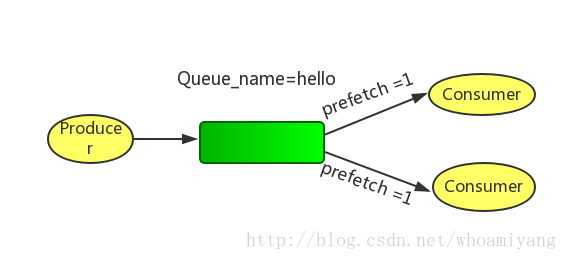

### [任务分发机制](https://blog.csdn.net/maihilton/article/details/80928661)

#### 2.1Round-robin dispathching循环分发

RabbbitMQ的分发机制非常适合扩展,而且它是专门为并发程序设计的,如果现在load加重,那么只需要创建更多的Consumer来进行任务处理。

#### 2.2Message acknowledgment消息确认

为了保证数据不被丢失,RabbitMQ支持消息确认机制,为了保证数据能被正确处理而不仅仅是被Consumer收到,那么我们不能采用no-ack，而应该是在处理完数据之后发送ack. 
在处理完数据之后发送ack,就是告诉RabbitMQ数据已经被接收,处理完成,RabbitMQ可以安全的删除它了. 
如果Consumer退出了但是没有发送ack,那么RabbitMQ就会把这个Message发送到下一个Consumer，这样就保证在Consumer异常退出情况下数据也不会丢失. 
RabbitMQ它没有用到超时机制.RabbitMQ仅仅通过Consumer的连接中断来确认该Message并没有正确处理，也就是说RabbitMQ给了Consumer足够长的时间做数据处理。 
如果忘记ack,那么当Consumer退出时,Mesage会重新分发,然后RabbitMQ会占用越来越多的内存.

### 3.Message durability消息持久化

要持久化队列queue的持久化需要在声明时指定durable=True; 
**这里要注意,队列的名字一定要是Broker中不存在的,不然不能改变此队列的任何属性.** 
队列和交换机有一个创建时候指定的标志durable,durable的唯一含义就是具有这个标志的队列和交换机会在重启之后重新建立,它不表示说在队列中的消息会在重启后恢复 
消息持久化包括3部分 
\1. exchange持久化,在声明时指定durable => true

```
hannel.ExchangeDeclare(ExchangeName, "direct", durable: true, autoDelete: false, arguments: null);//声明消息队列，且为可持久化的
```

- 1

2.queue持久化,在声明时指定durable => true

```
channel.QueueDeclare(QueueName, durable: true, exclusive: false, autoDelete: false, arguments: null);//声明消息队列，且为可持久化的
```

- 1

3.消息持久化,在投递时指定delivery_mode => 2(1是非持久化).

```
channel.basicPublish("", queueName, MessageProperties.PERSISTENT_TEXT_PLAIN, msg.getBytes());  
```

- 1

如果exchange和queue都是持久化的,那么它们之间的binding也是持久化的,如果exchange和queue两者之间有一个持久化，一个非持久化,则不允许建立绑定. 
**注意**：一旦创建了队列和交换机,就不能修改其标志了,例如,创建了一个non-durable的队列,然后想把它改变成durable的,唯一的办法就是删除这个队列然后重现创建。

### 4.Fair dispath 公平分发

你可能也注意到了,分发机制不是那么优雅,默认状态下,RabbitMQ将第n个Message分发给第n个Consumer。n是取余后的,它不管Consumer是否还有unacked Message，只是按照这个默认的机制进行分发. 
那么如果有个Consumer工作比较重,那么就会导致有的Consumer基本没事可做,有的Consumer却毫无休息的机会,那么,Rabbit是如何处理这种问题呢? 
 
通过basic.qos方法设置prefetch_count=1，这样RabbitMQ就会使得每个Consumer在同一个时间点最多处理一个Message，换句话说,在接收到该Consumer的ack前,它不会将新的Message分发给它

```
channel.basic_qos(prefetch_count=1) 
```

- 1

**注意，这种方法可能会导致queue满。当然，这种情况下你可能需要添加更多的Consumer，或者创建更多的virtualHost来细化你的设计。**


---

### Message acknowledgment

在实际应用中，可能会发生消费者收到Queue中的消息，但没有处理完成就宕机（或出现其他意外）的情况，这种情况下就可能会导致消息丢失。为了避免这种情况发生，我们可以要求消费者在消费完消息后发送一个回执给RabbitMQ，RabbitMQ收到消息回执（Message acknowledgment）后才将该消息从Queue中移除；如果RabbitMQ没有收到回执并检测到消费者的RabbitMQ连接断开，则RabbitMQ会将该消息发送给其他消费者（如果存在多个消费者）进行处理。这里不存在timeout概念，一个消费者处理消息时间再长也不会导致该消息被发送给其他消费者，除非它的RabbitMQ连接断开。
这里会产生另外一个问题，如果我们的开发人员在处理完业务逻辑后，忘记发送回执给RabbitMQ，这将会导致严重的bug——Queue中堆积的消息会越来越多；消费者重启后会重复消费这些消息并重复执行业务逻辑…

另外pub message是没有ack的。

### Message durability

如果我们希望即使在RabbitMQ服务重启的情况下，也不会丢失消息，我们可以将Queue与Message都设置为可持久化的（durable），这样可以保证绝大部分情况下我们的RabbitMQ消息不会丢失。但依然解决不了小概率丢失事件的发生（比如RabbitMQ服务器已经接收到生产者的消息，但还没来得及持久化该消息时RabbitMQ服务器就断电了），如果我们需要对这种小概率事件也要管理起来，那么我们要用到事务。由于这里仅为RabbitMQ的简单介绍，所以这里将不讲解RabbitMQ相关的事务。

### Prefetch count

前面我们讲到如果有多个消费者同时订阅同一个Queue中的消息，Queue中的消息会被平摊给多个消费者。这时如果每个消息的处理时间不同，就有可能会导致某些消费者一直在忙，而另外一些消费者很快就处理完手头工作并一直空闲的情况。我们可以通过设置prefetchCount来限制Queue每次发送给每个消费者的消息数，比如我们设置prefetchCount=1，则Queue每次给每个消费者发送一条消息；消费者处理完这条消息后Queue会再给该消费者发送一条消息。


----

### Exchange

在上一节我们看到生产者将消息投递到Queue中，实际上这在RabbitMQ中这种事情永远都不会发生。实际的情况是，生产者将消息发送到Exchange（交换器，下图中的X），由Exchange将消息路由到一个或多个Queue中（或者丢弃）。
[](http://ostest.qiniudn.com/wordpress/wp-content/uploads/2014/02/2014-2-21-9-51-03.png)
Exchange是按照什么逻辑将消息路由到Queue的？这个将在Binding一节介绍。
RabbitMQ中的Exchange有四种类型，不同的类型有着不同的路由策略，这将在Exchange Types一节介绍。

### routing key

生产者在将消息发送给Exchange的时候，一般会指定一个routing key，来指定这个消息的路由规则，而这个routing key需要与Exchange Type及binding key联合使用才能最终生效。
在Exchange Type与binding key固定的情况下（在正常使用时一般这些内容都是固定配置好的），我们的生产者就可以在发送消息给Exchange时，通过指定routing key来决定消息流向哪里。
RabbitMQ为routing key设定的长度限制为255 bytes。

### Binding

RabbitMQ中通过Binding将Exchange与Queue关联起来，这样RabbitMQ就知道如何正确地将消息路由到指定的Queue了。


### Binding key

在绑定（Binding）Exchange与Queue的同时，一般会指定一个binding key；消费者将消息发送给Exchange时，一般会指定一个routing key；当binding key与routing key相匹配时，消息将会被路由到对应的Queue中。这个将在Exchange Types章节会列举实际的例子加以说明。
在绑定多个Queue到同一个Exchange的时候，这些Binding允许使用相同的binding key。
binding key 并不是在所有情况下都生效，它依赖于Exchange Type，比如fanout类型的Exchange就会无视binding key，而是将消息路由到所有绑定到该Exchange的Queue。


