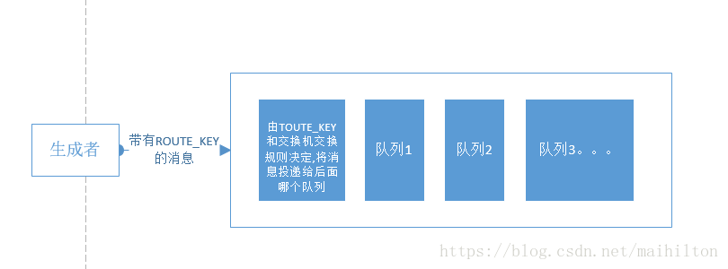

##  [工作原理](https://blog.csdn.net/maihilton/article/details/80928661)


### Binding

所谓绑定就是将一个特定的 Exchange 和一个特定的 Queue 绑定起来。Exchange 和Queue的绑定可以是多对多的关系。

###  virtual host

在rabbitmq server上可以创建多个虚拟的message broker，又叫做virtual hosts (vhosts)。每一个vhost本质上是一个mini-rabbitmq server，分别管理各自的exchange，和bindings。vhost相当于物理的server，可以为不同app提供边界隔离，使得应用安全的运行在不同的vhost实例上，相互之间不会干扰。producer和consumer连接rabbit server需要指定一个vhost。

##  通信过程

假设P1和C1注册了相同的Broker，Exchange和Queue。P1发送的消息最终会被C1消费。基本的通信流程大概如下所示：

- P1生产消息，发送给服务器端的Exchange
- Exchange收到消息，根据ROUTINKEY，将消息转发给匹配的Queue1
- Queue1收到消息，将消息发送给订阅者C1
- C1收到消息，发送ACK给队列确认收到消息
- Queue1收到ACK，删除队列中缓存的此条消息

Consumer收到消息时需要**显式的向rabbit broker发送basic.ack消息或者consumer订阅消息时设置auto_ack参数为true**。在通信过程中，队列对ACK的处理有以下几种情况：

- 如果consumer接收了消息，发送ack,rabbitmq会删除队列中这个消息，发送另一条消息给consumer。
- 如果cosumer接受了消息, 但在发送ack之前断开连接，rabbitmq会认为这条消息没有被deliver,在consumer在次连接的时候，这条消息会被redeliver。
- 如果consumer接受了消息，但是程序中有bug,忘记了ack,rabbitmq不会重复发送消息。
- rabbitmq2.0.0和之后的版本支持consumer reject某条（类）消息，可以通过设置requeue参数中的reject为true达到目地，那么rabbitmq将会把消息发送给下一个注册的consumer。

## Meta Data

RabbitMQ内部主要包含以下四种Meta Data：

- vhost meta data：为RabbitMQ内部的Queue, Exchange, Binding提供命名空间级别的隔离
- exchange meta data：记录Exchange的名称、类型、属性等
- binding meta data：表示Routing Key和Queue之间的绑定关系，即描述如何将消息路由到队列Queue中
- queue meta data: 记录队列的名称及其属性

**单个节点的RabbitMQ会将这些meta data保存到内存中，同时对于那些属性为持久化的信息，例如durable的Exchange、Queue等持久化到硬盘上，持久化到硬盘上的Exchange和Queue可以在RabbitMQ节点重启后被重新创建。**

当以集群形式部署RabbitMQ的多个节点时，RabbitMQ集群需要新的meta data来保存集群的信息。RabbitMQ集群有以下
##### S两种模式：

- 普通模式：在这种模式下，对于集群中rabbit1和rabbit2两个节点，一个消息只会存在于其中某个节点上的Queue上。rabbit1和rabbit2这两个节点仅仅是拥有相同的meta data，即队列的结构和属性。当consumer连接rabbi2消费rabbit1上的消息时，RabbitMQ会在这两个节点上进行消息传输，将rabbit1上的消息传输到rabbit2上。在该模式下consumer和producer应该尽量连接每个节点，在多个节点建立物理队列，这样也起到了线性扩展的作用。但是在这种模式下要考虑一种情况，某个节点挂掉时其上面还有没有被消费的消息：如果队列和消息都做了持久化，只有该节点恢复时，消息才可以继续被消费；如果队列和消息没有持久化的话，就会丢失消息。
- 镜像模式：就是把队列做成镜像队列，存在于多个节点上，在该模式下，消息会在节点的镜像队列间做同步，这样可以实现RabbitMQ高可用，但会降低系统性能，特别是镜像队列数量较多，大量消息进入和同步时会占用集群内部大量带宽。因此镜像模式使用于对可靠性要求比较高的场景。

接下来看一下镜像队列的声明，可以通过rabbitmqctl命令或在RabbitMQ Management WebUI中通过创建Policies的方式来声明镜像队列。例如：

```
rabbitmqctl set_policy ha-all "^ha\." '{"ha-mode":"all"}'
1
```

上面这个命令配置了策略，所有名称以ha.开始的队列，都会在集群的所有节点上成为镜像队列。这里使用的ha模式是all，另外还有exactly, nodes两种模式，分别可以指定具体的镜像节点数量，镜像节点名称，可以参考Highly Available (Mirrored) Queues，这里不再展开。

通过上面对RabbitMQ基础知识的一个简单的回顾，在使用RabbitMQ需要考虑一下几点：

- Queue和Message是否要做持久化
- 在使用RabbitMQ的集群时是否要使用镜像队列

可以参考：<https://www.jianshu.com/p/5319b06f2e80>


-----


### 6.消息序列化

RabbitMQ使用ProtoBuf序列化消息,它可作为RabbitMQ的Message的数据格式进行传输,由于是结构化的数据,这样就极大的方便了Consumer的数据高效处理,当然也可以使用XML，与XML相比,ProtoBuf有以下优势: 
1.简单 
2.size小了3-10倍 
3.速度快了20-100倍 
4.易于编程 
6.减少了语义的歧义. 
，ProtoBuf具有速度和空间的优势，使得它现在应用非常广泛

### 7. 工作原理





核心官网有介绍，说的connecnton,channel之类的，到底怎么样，who care？　

总体来看，我们关注业务实现是：

1）消息怎么投递的。2）消费者怎么消费消息。3）消息是否是可靠投递。

4）消息投递方式。5）消息的生命周期。6）消息队列生命周期

**3.2  消息是怎么投递的？（记住一点，生产者消息投递都是面向交换机的）**

**R**abbitMQ 是面向交换机投递消息的。交换机可能绑定有许多队列，交换机如何将消息投递给这些队列呢？

首先说一下面向交换机的设计的优势：

1）这明显借助了数据链路层那个交换机的设计思想。除了层级分明以外，还能从分提高链路利用率（可能有点抽像）。　　　　　　　　　　　　　　　　　　　　

2）从代码层面来看：如果没有交换机，你至少得维护一个十分庞大的路由表，然后从路由表正确投递消息，有了交互机，这里路由表就会被拆分到多个交换机里面，效果不必多说。　　　　　　　　　　　　　　　　　　　   

3）然后就是高度的解耦，不同的交换机可有不同的路由规则，要是没有交换机。。。。。。

在RabbitMQ，交换机有4种投递方式，就是枚举类BuiltinExchangeType的4个枚举变量：

DIRECT:会将所有消息先取消息的ROUTE_KEY，然后投递到与ROUTE_KEY绑定的队列里面（if(msg.routekey.equals(queue.routekey))）。

FANOUT:此种模式下，根本不检查消息的ROUTE_KEY,直接投送到交换机所拥有的所有队列里面。

TOPIC,HEADERS自行看一下官网怎么说的，不想码字了^_^||

总结起来就一个函数就把消息发出去了:channel.basicPublish(excange_name,route_key,false,bs,"test".getBytes());可以去官网查一下这个API

**3.3 消费者怎么消费消息（记住一点，消费者消费消息是面向消息队列的，这与生成者有点不一样）**

还不是就是TCP长连接心跳的那些事，就是这么一个API：channel.basicConsume(QUEUE_AUTODELETE, true, consumer);consumer是Consumer类的一个实例，你直接去处理回调接口就ok了

**3.4 消息传递是否可靠**

很明显是可靠的，除非你将消息队列，声明成非持久模式，这事你又重启了机器。这会丢失消息的。还有就是他有应答机制，你可以通过设置消费者消费消息的模式，去手动应答。channel.basicConsume（？，autoACk,?）的autoAck参数设置

**3.5 消息的生命周期**

一旦受到消费者应答，标识消息已被消费，则消息被回收掉。

**3.6 队列生命周期**

channel.queueDeclare(QUEUE_NAME,false,false,true,null);

第二个参数设置为true，会将消息持久化到磁盘，第四个参数设置为true表示没有消息并且没有连接则删除改队列，详情可以查一下API