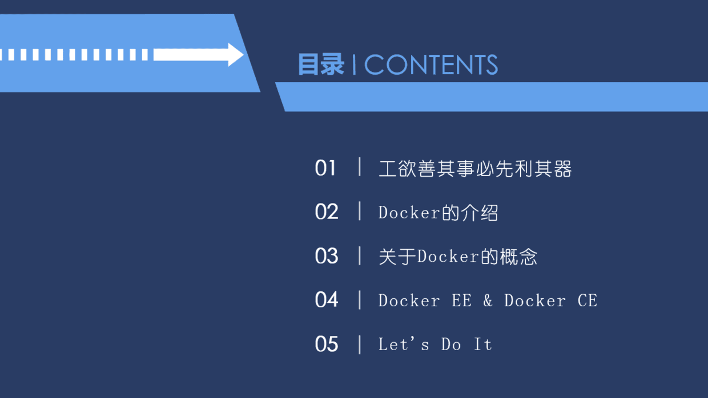

Docker&Ubuntu从入门到实战

# [角落的白板报](https://www.cnblogs.com/wer-ltm/)

## 52ABP:基于DDD强大稳定的WEB应用框架!

# [[52ABP实战课程系列\]Docker&Ubuntu从入门到实战开课啦~](https://www.cnblogs.com/wer-ltm/p/8143251.html) 		

> 任何的课程都逃不开理论的支持

久等了各位，在Asp.NET Core2.0 项目实战入门视频课程结束后，根据发起的投票信息。Docker 排在首位。按照结果，我们开始进行Docker视频课程的录制。

在课程开始之前，我给大家准备了课件信息。和一些需要提前掌握的理论知识和概念。

# 适合您吗？

您如果想了解Docker，想利用Docker进行开发，那么本系列课程就比较适合你了。
 我会讲解如何Docker和Ubuntu实战练习Docker和管理该程序的整个生命周期。

# 大纲

- Docker的介绍

- Ubuntu下安装Docker

- 快速体验Docker 

  - 利用Docker搭建个人博客
  - 利用Docker搭建开源版本控制利器-GitLab的搭建

- Docker 必须掌握的知识 

  - Docker的三大基础组件
  - 常用的Docker操作命令

- Docker 的容器管理

- Docker的镜像管理

- Docker &Ubuntu 部署ASP.NET CORE项目(52ABP.SCHOOL)

  # 课件

下面开始全是图的部分，最后附上课件的下载地址。
 
 
 
 
 
 
 
 
 
 
 
 
 

更多内容请下载课件~
 地址地址：<https://files.cnblogs.com/files/wer-ltm/Docker%26Ubuntu%E4%BB%8E%E5%85%A5%E9%97%A8%E5%88%B0%E5%AE%9E%E6%88%98%E8%AF%BE%E7%A8%8BV1.0.pdf>

**课程还在录制中，请关注公众号获取最新消息~**

**相关文章和课程**

最近我录制的.net core 入门已经发布有兴趣的可以去了解。

[Asp.NET Core2.0 项目实战入门视频课程_完整版](https://mp.weixin.qq.com/s?__biz=MzI1OTQzNTc0MQ==&mid=2247483729&idx=1&sn=d449e05bfb88f5b32bfbfcbe857a887e&chksm=ea79bce3dd0e35f53c7b8a3fc8acfd11302c8da60aeafda882047b048efede26ec01dd428701#rd)

**欢迎关注角落的白板报**

我建立了一个群：104390185（收费） 主要服务于ABP框架。 [点我加群（收费）](https://jq.qq.com/?_wv=1027&k=45B1eAG)。

【52ABP .NET CORE 实战群】：633751348 (免费) [点我加群（免费）](https://jq.qq.com/?_wv=1027&k=5pWtBvu)。

​            作者：[角落的白板笔](http://www.cnblogs.com/wer-ltm)（[角落的白板报](http://www.cnblogs.com/wer-ltm)） 
​                          出处：<http://www.cnblogs.com/wer-ltm> 
本作品由[角落的白板报](http://www.cnblogs.com/wer-ltm/) 创作，采用[知识共享署名-非商业性使用-禁止演绎 2.5 中国大陆许可协议](http://creativecommons.org/licenses/by-nc-nd/2.5/cn/)进行许可。
 欢迎转载，但任何转载必须保留完整文章，在显要地方显示署名以及原文链接。如您有任何疑问或者授权方面的协商，请 [加群沟通留言](https://jq.qq.com/?_wv=1027&k=45B1eAG)。              