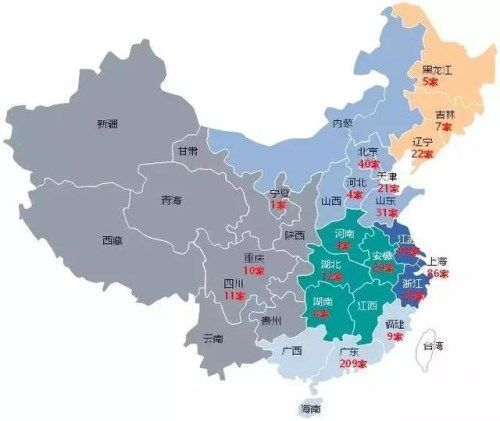
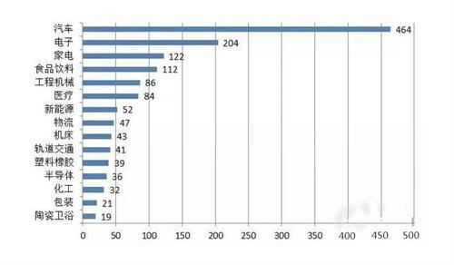

# 从系统集成商分布看我国工业机器人发展

[广州富烨自动化科技有限公司](https://www.zhihu.com/org/yan-zhou-fu-ye-zi-dong-hua-ke-ji-you-xian-gong-si)

随着国内工业化进程的加快，促使我国工业机器人市场蒸蒸日上，工业机器人系统集成商数量急速扩张。

**国内机器人系统集成商地区分布**

企业集中于长三角、珠三角地区。610家工业机器人系统集成商区域集中度较高，长三角（上海、江苏、浙江）、珠三角（广东）为两大集聚区域，两地区企业合计占比近七成。其中34.3%集中在广东省，31.8%集中在江浙沪地区，10.7%集中在京津冀地区，非常吻合工业机器人区域分布特点。

国内工业机器人集成商分布

**国内机器人系统集成商行业覆盖情况**

464家覆盖汽车行业，占比85.8%；204家覆盖电子行业，占比37.7%；122家覆盖家电行业，占比26.6%；112家覆盖食品饮料行业，占比20.7%。

国内工业机器人集成商行业分布

从上文我们可以看出，国内机器人系统集成商在不断增长，行业覆盖也越来越广，这是否代表着我国工业机器人发展越来越好？

近年来，国产工业机器人的主要应用于弧焊、电焊、喷涂、搬运与上下料以及加工等方面。随着工业机器人技术的成熟，其生产效率以及产品质量也得到了很好的提升。工业机器人应用市场需求量逐年递增，但国产机器人需求量不增反降。

究其原因，若想提高国产机器人的市场竞争力，一方面要扩大国产机器人产量，提高国内机器人企业的产能；另一方面，要推动国产机器人关键零部件的国产化，提高关键零部件生产能力，满足国产机器人产能扩张的需要。如何解决好这些问题成为各集成商取胜的关键。

我国工业机器人与美、日、欧等发达国家相比差距仍然明显，尤其是高端工业机器人核心部件和核心技术还需要进一步形成具有较大行业影响力的自有品牌。

作为系统集成商中的一员，富烨自动化会努力提升技术实力，成为行业优秀品牌领跑者，为带动我国工业机器人发展添砖加瓦。

发布于 2018-10-10

工业机器人

机器人

系统集成

### 推荐阅读