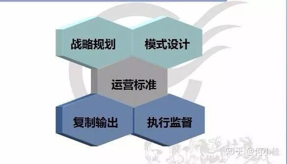
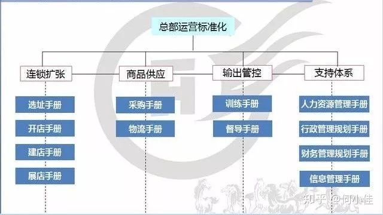
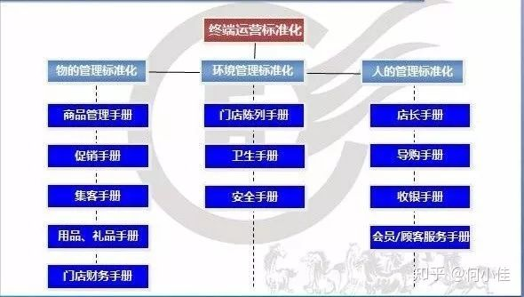
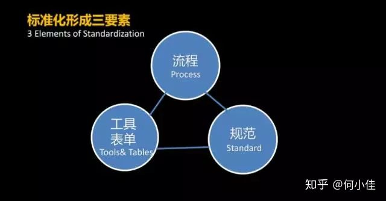
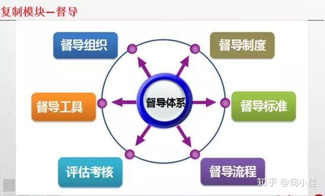
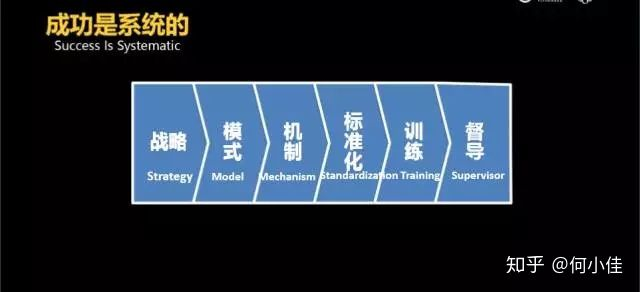

# 连锁系统里存在着三大方面的模块

[何小佳](https://www.zhihu.com/people/he-xiao-jia-26)

全国各地的开课，全国各地的飞。

它们分别是：**战略、模式、系统**。战略决定生死，是企业发展方向，对企业具有至关重要的指引作用；模式决定速度，是企业实现目标的工具，为企业提供具体可行的一套市场策略；系统决定份额，企业打造一套完善的运营系统，通过有效的运营、快速的素质、到位的监督实现企业的运营管理，从而为企业的战略和模式，提供实践基础。

**关于连锁体系的关键模块，可以拆分如下图**

其中，运营标准、复制输出和执行监督，即为企业整个运转的系统。战略、模式与系统，共同构成了三位一体的连锁体系。战略是方向，模式是工具，而系统则是工具的打造。如果说前两个方面解决了企业向何处走、选择哪条路走的问题，那么接下来最关键是要行动。只有按照既定的方针立即行动起来，才能够更快更稳地到达目的地。因此，对于企业来说，行动力的强弱至关重要。系统决定份额，是因为系统决定了企业的整个运转规模、效应。连锁体系的系统打造主要包括三个方面：运营标准、复制输出与执行监督。

**运营标准——**连锁的魅力在于它能整合各方面的资源，通过快速复制实现企业的迅速扩张，而企业的复制需要一个最基本的标准，首先就是运营标准。运营标准化系统打造之前，企业需要对自身的企业价值链进行分析。企业价值链主要包括商品供应链（采购、开发与生产、管理、物流配送等）、市场链（营销策划、推广、促销以及顾客服务等）以及连锁扩张链（选址、开店等）三大基础活动，同时还包括公司基础设施、品牌信息管理、行政后勤管理、财务及人力资源等支持活动，这两方面的结合构成整个企业的运营标准系统的基础。  

对于企业价值链的分析与梳理，是企业建立总部及分部运营标准化版块的基础。在此基础之上，我们通过三个方面的要素来构建企业的运营系统：流程、规范、表单。

**复制输出——**我们的企业如何进行制度管理与执行到位？我们的团队如何进行复制与扩充？我们的企业文化如何复制传播到所有员工？复制与输出对于企业系统标准化的执行，具有非同一般的作用。它最关键的地方在于能够将企业的每一条标准，通过培训或贯彻，变成企业所有人员的具体行动。

连锁复制之所以能成为企业经营管理的重要方向，是因为它具有最大的一个特点：低成本与大批量。用最低的成本获取最高的效益，复制输出是企业在组织管理方面迅速实现效益转变的核心所在。对于那些在全世界各地都拥有着自己门店的连锁巨头而言，如何在如此广大的范围内统一所有员工的行为，保证其产品与服务的标准，关键就在于系统标准化与复制输出。全世界的肯德基都提供相同的产品，消费者都可以享受到相似的微笑服务，这就是复制输出的强大力量。

将涉及到企业运营的方方面面都制定下来流程，设定好规范，形成具体可参考的系统标准，然后通过复制输出，将所有这些流程与规范快速传递到所有人，并变成实际的行动。这个过程，就是连锁体系中关键的系统过程建设。

当然，在复制输出过程中最重要的一点，是关于复制程度的问题。在复制过程中，往往很容易走形，倘若不能坚定地继承最开始所设定的系统标准，那么复制就将变得有名无实。因此，标准化的复制很重要。然而，正是因为标准化的要求，当我们在碰到不同的情况、文化背景时，是否还需要一成不变地坚持？这是涉及复制形还是复制神的问题。

**执行监督——**所有的制度与流程，最后都需要落到实处；所有的成果与效益，都来源于实实在在的执行。有目标，有制度，有执行，才能保证最后有结果。

我们如何知道企业的所有制度与职能要求，最后都得以最妥善的执行，并达到我们想要的结果？

执行，同时需要监督。

督导的重要性在连锁运营中是非常重要的环节，它为企业的制度和标准化执行，提供最切实的保障。然而，执行督导，首先需要有一套完整而有效的督导系统。企业需要具有这种强烈的督导意识，并且能够确保督导工作切实地进行，有标准可以考察。

一方面是督导的标准，另一方面是督导的指导行为。督导不仅需要发觉具体过程中的执行标准问题，而且在发现问题的同时需要给予督导的对象以指导，从而确保企业的系统标准化制度，能真正落实到位。

通过打造运营标准来制定一个执行参考规范，通过复制输出将管理规范与理念复制到所有员工身上，最后通过执行督导来确保所有的标准规范都能落到实处，连锁体系的系统运营，将就此形成一个系统的运转流程。系统的有效运转，为企业所选择的经营模式的实现提供具体指导与行动，从而保证企业战略得以实现。

战略、模式、系统三方面的有机结合与运转，共同构成了三位一体的连锁体系。

发布于 2018-08-31

连锁

模块