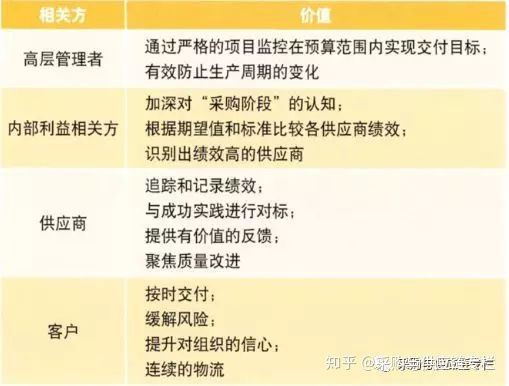
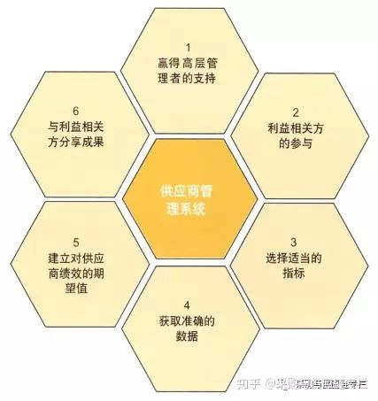

# 供应商管理的六大成功要素 | 参考

[采购与供应链专栏](https://www.zhihu.com/people/scmxuexi)

专注于采购与供应链管理领域，不断探索采购与供应链物流管理技术、工具、方法和趋势。

**引言**

在如今不断变化的商业环境中，竞争异常激烈。不同规模和水平的企业都在竭力向顾客证实自身能够在规定的时间和预算范围内满足顾客的要求。这促使很多企业着手制定侧重于提升质量和缩短周期时间的策略。在竞争激烈的时代，企业对供应商的依赖程度

不断加强，日益重视供应商管理，供应商管理对于企业发展和加强供应商合作关系具有重要意义。

**供应商管理系统的价值**

供应商管理十分重要，因为它可以促进质量改进，减少周期时间，提高有效性和节约成本，并帮助组织在规定的时间和预算范围内满足顾客要求。实施供应商管理可以为各个相关方带来价值，具体如表1所示。

**六大成功要素**

成功的供应商管理系统（SMS）主要包括六大要素——赢得高层管理者的支持、利益相关方的参与、选择适当的指标、获取准确的数据、建立对供应商绩效的期望值、与利益相关方分享成果。图1展示了成功的SMS框架。

**1）赢得高层管理者的支持**

主动实施SMS意味着组织已朝着正确的方向迈进。不同组织实施SMS的方法各不相同，如果高层管理者了解SMS的业务实例、并给予切实支持，成功的可能性会更大。高层管理者必须明白不是所有改进都可以用财务手段来衡量的。很多改进（比如供应商关系的改进）是定性的，具有很大的价值，并有可能节约大量的成本。然而，纯粹依赖定性收益未必能获得支持和预算资金。因此，有必要证实SMS符合组织的战略目标、并详细量化预期收益。可以计算出投资回报率来量化收益，这涉及估算供应商的失效成本，包括劣质成本（如缺陷或延迟交付等）。只有量化供应商对组织运营的影响，才能评估SMS可能降低的成本。

组织还需要考虑SMS将如何对员工、供应商、企业前景和客户产生影响。非财务方面的影响包括：提升士气，降低风险，减轻挫折感，提升满意度。

**2）利益相关方的参与除了高层管理者的支持，实施SMS还需要利益相关方的支持。**

利益相关方的早期参与有助于项目取得成功，而且必须在策划供应商管理项目之前就实行合理的利益相关方分析。利益相关方参与项目时，要了解他们各自的特定需求。

供应商、员工、包括客户等相关方在供应商管理项目早期阶段参与的好处包括：

——带来一系列有助于制定解决方案的想法、经验和专业知识；

——降低发生潜在矛盾的可能性，从而加大可持续改进方案的潜力；

——在项目早期，指导利益相关方掌握供应商管理方法；

——利益相关方的参与可确保供应商管理项目符合组织业务目标。

通过让利益相关方全面参与项目，有助于提升士气，让每个人都了解项目进展情况。利益相关方的有效参与是保证项目实施成功的最佳方式。

**3）选择适当的指标**

企业必须确保选择适当的指标，以便确定一系列完整的绩效测量指标。企业面临的挑战在于选择的指标不仅要符合预算目标，而且要符合利益相关方要求。通过举办论坛和促进利益相关方之间的对

话，可帮助组织识别关键绩效指标（KPI），这有助于确保所选的指标符合业务目标，并达到预期的绩效要求。

组织需要确定相关指标以及应用方式，来评估供应商对业务目标的贡献度。良好绩效测量指标的标志在于其能够预警潜在问题并帮助解决问题。

组织是希望测量定量指标（比如交付情况、缺陷量），还是定性指标（比如客户服务的响应性）？大多数企业关注定量指标，原因是这些指标相对来说更容易追踪，而且大多数企业已经开发出获取该类型数据的电子系统。但这并不是说人们不应追踪定性指标，不过定性指标更为复杂，组织需要投入更多的精力来防止供应商单纯地依据主观信息制定决策。大部分企业试图采取双管齐下的方式，既采用定量指标也采用定性指标，因为这样能减少评估过程中的主观性风险。无论企业选择何种类型的监控和追踪指标，汇集所有指标也很重要，个人和组织可以了解供应商的绩效情况。

在决定追踪哪些指标时，组织需要考虑以下的要素：

——供应商无法符合要求的领域有哪些？

——过程中的环节是否正受到供应商不符合项的严重影响？

——供应商是否在收到订单之后采取特定行动？

——组织过程中是否存在一些环节，由于供应商带来的劣质成本（COPQ）而消耗过多时间和精力？

——供应商是否符合组织的要求？如果不符合，组织会采取何种措施？运作的总成本共为多少？

——指标测量结果能否为组织带来显著的价值？

**4）获取准确的数据**

从综合指标来看，如今组织必须面对的挑战是如何合理而系统地收集数据。在审查数据来源时需要考虑以下几点：

——当前是否存在收集数据的合理手段？

——当前数据来源的准确性如何？

——数据来源的可靠性如何？

——多长时间收集一次数据？

虽然绩效管理系统能作为业务测评手段，但其往往忽略了收集关键绩效指标。这样致使有些企业采用人工收集过程数据，导致数据记录错误以及信息不完善。由于不全面的记录信息，导致分析结果不当。

尽可能多地获取定量数据以防止完全依赖主观信息来制定供应商决策，这是很重要的。获取准确的数据信息是成功的SMS的必要条件，组织必须具备能力来比较实际绩效和要求达到期望绩效值之间的差距。

获取准确的数据信息，并快速输入到SMS，促使组织可以实现以下目标：

——识别和解决分歧；

——量化出现的差错；

——采用规范化的方法将采购源集中在最佳供应商那里；

——确保供应商符合组织的预期要求；

——了解供应商及其能力；

——具备采取积极举措应对市场竞争或变革的能力；

——与供应商建立互利关系。

**5）建立对供应商绩效的期望值**

下一步是制定供应商绩效期望值，从而确定组织所期望的供应商绩效标准。这些工作并不容易完成，所有利益相关方都有必要参与其中。考虑组织自身要求并按照标准给供应商评分是成功实施SMS的必要内容。

利益相关方提出对供应商绩效的要求时，项目经理有责任确保利益相关方的目标符合实际情况，并确保SMS能够满足组织的总体目标——供应商管理项目为组织带来增值效益。

在制定对供应商绩效的期望值时，组织需要考虑以下因素：

——确保利益相关方对绩效的期望值达成共识，而且期望值代表了顾客满意度；

——与供应商共同协作，来确定期望的供应商绩效标准；

——评审顾客要求和期望；

——期望目标切实可行，同时确保供应商管理项目为组织增值；

——供应商绩效的期望值对供应商来说应当是可以实现的，但不能太容易实现以至于无法给供应商带来一定的挑战性，也不能太难以实现而让供应商气馁，它应当是合理的；

——应当明确界定和具体化绩效期望值；

——组织应能够评估和区别不同的供应商绩效水平。

在供应商评估过程启动之前，组织有必要与供应商进行沟通。组织最好能够在整个阶段都与供应商保持沟通，从而确保供应商明了组织对其的质量期望水平和具体的要求。不要假设供应商已经了解了组织的重点事项，应该主动让供应商知道组织对他们的期望以及如何对他们进行评价。与外部供应商沟通的方式有很多，比如：在网站上公布所需信息、印发描述组织对供应商的期望和评价准则的指南或手册、追踪关键绩效指标、与供应商进行面对面的会谈。

除了向外部供应商沟通和传达对其的期望和要求之外，组织还有必要在内部利益相关方中展开交流。在组织着手推出SMS时，把供应商管理项目的收益跟利益相关方共同认识到的问题与挑战相连接起来，将有助于提升SMS。在项目团队着手实施SMS时，外部和内部利益相关方的共同参与十分重要。  

**6）与利益相关方分享成果**

与内部利益相关方及外部供应商沟通和交流成果，是获取和追踪供应商测量指标的最重要环节。如果没能与内部利益相关方（尤其是高层管理者）持续开展绩效改进和成本节约方面的沟通，那么对SMS的支持力量就会被削弱。

SMS促使组织对供应商进行优胜劣汰。组织追踪供应商测量指标过程中，数据分析十分关键。必须报告分析结果，并分享组织制定的有效供应商选择决策所取得的成果。全面完善的SMS能提供一切必要的工具和方法来监控和管理供应商的资质、纠正措施、不符合项以及其他与供应商相关的过程。此外，通过分析和利用数据制定决策有助于减少主观性，促进组织在评估供应商时综合考虑所有相关指标。实施有效的供应商管理有助于提升组织质量水平，从而使组织依据对供应商能力和绩效水平的良好认知来为顾客提供更可靠的产品。

供应商属于组织运营的延伸部分。因此，应该让供应商全面参与SMS，以帮助他们实现卓越质量。在组织监测供应商绩效和持续追踪质量水平的过程中，必须与供应商保持沟通，并向他们提供反馈。这将会促进供应商了解组织的要求，识别需要改进的地方，预见风险。此外，组织向供应商传达有价值的数据和信息，可以促使他们把供应商管理视作其质量系统的重要部分。还应对促进组织与供应商有效沟通的过程设立测量指标，明确指标的意义，促进优化供应商绩效，从而进一步改善组织与供应商的关系。

**结论**

越来越多的组织在供应商管理项目中投入大量精力，因为他们认识到这样做能带来显著的回报，包括提高效率、节约成本和改进质量。实施供应商管理系统能够帮助组织关注那些实施持续改进的供应商，从而确保组织在共赢的战略模式下进行运作。通过应用上述供应商管理系统的最佳模式，组织的供应商质量一定会得到极大的改进，组织自身的竞争力也会得到提高。

*转载于《上海质量》2013年第五期*

发布于 2018-06-12

供应商管理

供应链

### 推荐阅读