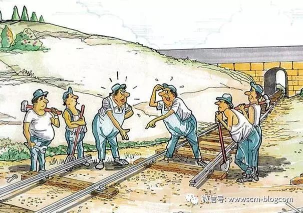

[刘宝红](https://www.zhihu.com/people/liu-bao-hong-21)

畅销书作者，供应链管理

摘自供应链管理销量第一的《采购与供应链管理：一个实践者的角度》（第2版），刘宝红著。

**供应链管理是对从供应商到客户的产品流、信息流和资金流的集成管理。**咨询公司、IT解决方案提供者等还不时加上“无缝”两个字，就是对三流的无缝集成管理，就好像一切都已安排妥当，只要按一下电钮，从设计到采购到生产到销售，就会一气呵成，一蹴而就。**但现实是，我们离集成还很远，不管是那些财富五百强还是街头的小卖部，供应链大都是千疮百孔，“无缝”二字更多的是咨询公司招揽生意的噱头。** 

举个生产商的例子。办事处的客户服务人员在支持客户，要知道总部的货什么时候才能到本地，否则交货迟到，挨批小事，如果导致客户流水线停产，连杀三次头都不为过。总部在向供应商催货，供应商的交期取决于下一级供应商的交期，而且也受别的零部件影响，因为他们不只给这生产商生产一种零件。既使是按期交货，产品也可能被别的更大、更重要的客户抢走。结果呢，整个公司，上至总部，下至当地客户服务中心，没法给客户确切的交货时间。货好不容易上了路，用的是加急发送，24小时送达，结果运输环节出了差错，在路上忽悠了三天才到。这期间，分部与总部、运输公司的电子邮件发了几十个，电话一通接一通，上下乱成一团糟。

这例子看上去面熟，是吗？因为它在我们的生活中一次又一次地上演，无非时间、地点、行业等不同罢了。问题不是理论有多难：不管是库存、生产还是运输，单个问题都好解决。问题是这么多环节掺杂在一起，就很难准确地知道外购件什么时候到、产品什么时候出、出多少、合格还是次品、发给哪个分销中心、发多少、什么时候发。反映到供应链上，就是产品流、信息流缺乏透明度，需要系统、流程来帮助做出决策、沟通信息。

这还没完。整个供应链上，从下级供应商到供应商、再到生产商，从总部到办事处再到客户，以及同一个公司的不同部门，大家都有不同的利益诉求。不同的利益诉求会驱动局部优化的行为，而局部优化往往是以牺牲全局优化为代价的，最后又影响到局部优化。比如作为客户，你自然希望供应商备货越多越好（客户的局部优化）；但备货太多，增加了供应商的成本，从而增加整条供应链的成本（牺牲全局优化）；供应商成本过高，要么在降低质量、服务，要么转嫁给客户，最后还是客户受影响（影响客户的局部优化）。

**所谓供应链集成，就是从供应链的角度着眼这些问题，优化供应链的产品流、信息流和资金流，让供应链的总成本更低、速度更快、服务水平更高，从而提高供应链的竞争水平，在链与链的竞争中胜出。**

那么，究竟如何集成供应链？**这里要解决两个问题：关系和连接。**关系是理顺供应链上公司与公司、部门与部门、人与人之间的关系，让他们愿意协作，用全局优化代替局部优化；连接是通过流程建设与信息系统，对接公司与公司、部门与部门的流程与系统，让公司与公司、部门与部门、员工与员工之间协作更容易，提高供应链的效率。关系是解决愿不愿意做的问题，连接是解决能不能有效地做的问题。

关系问题就如上图中修铁路的例子。两组人员都修好了各自的铁轨，但两段铁轨没法对接到一起。从每组的立场出发，这项目是成功的；但从全局角度看，这项目是失败的。用一句话总结，就是“手术很成功，病人却死了”。问题的根源不是难，而是不愿意，即两组人员不愿意沟通，做好铁轨的对接。那解决方案呢，就得在绩效考核上做文章：你不但要修好自己的铁轨，而且要保证与对方的对接；只有对接了，你才能够领走你的工程款。当把这些写到两组人的绩效合同里后，相信两组人每修一段，都会互相通气，确保大家都在按正确的方向修。

**关系的核心是解决愿不愿意协作的问题。**与供应链的关键伙伴签订长期合作协议、给不同部门设立统一的指标、给员工具体的绩效考核目标等，都是在解决愿不愿意的问题。组织调整，例如打建集成供应链，让采购、运营、物流、计划、客服等职能统一汇报到同一个总监，也是在解决关系问题，打通这些职能之间的壁垒。这种组织调整放到公司层面，就是公司的兼并、整合或剥离。例如当通过市场机制建立长期协作关系的成本很高时，公司就会采取竖向集成，通过兼并来解决问题；而公司过于庞大，山头林立，通过内部机制协调分公司、子公司的成本太高时，公司就会采取剥离机制，把一些分公司、子公司分割出来，借助市场机制来管理。比如通用汽车剥离零部件生产，成立独立公司德尔福，除了资产运作的原因外（剥离重资产运作，提高母公司的投资回报率，以提高股价），也有绩效管理上的考量——相比外来供应商，内部供应商的按时交货率、质量、成本、服务等往往乏善可陈。

愿不愿意协作的问题解决了，下一步就是解决能不能有效协作的问题。这主要是个技术问题。从流程角度讲，就是有没有基本的流程、基本流程是不是通畅；从系统角度讲，就是有没有基本的信息系统、信息系统是否对接。本土企业高速发展了二三十年后，业务年年增，天天忙于打仗、救火，没有时间搞建设，比如理顺基本流程、实施信息系统等。流程有，但满是补丁，效率低下；系统也有，而且很多——总公司、分公司、各部门都有自己的系统，但互不搭接，形成一个个信息孤岛，信息流不通畅。这都影响了部门跟部门、员工与员工的有效连接，让他们想协作，也很难协作；想集成，也没法集成。

上世纪90年代后期，华为导入IBM的集成供应链，以及围绕集成供应链流程实施、改进ERP，就是解决连接层面的问题，把公司的各个职能更好地整合到一起。这为华为的进一步发展打下坚实基础，帮助公司从百亿级跨入千亿级。但十几年以后，公司的业务更加多元化，由原来的电信设备（小批量、长周期、项目驱动）跨入手机终端行业（大批量、生命周期短、价格竞争激烈），而且进入芯片设计行业，原有的流程、系统围绕电信设备行业打建，为适应不同的业务，需要进一步梳理。而且当营收跨过2000亿元大关后，公司的规模更大、复杂度更高，部门协作、供应链协同的挑战更大，华为开始重新审视端对端的流程，算是对十几年前的集成供应链的延续，从根本上讲，都是在解决连接的问题。

再回到上面的催货例子来谈连接问题。从子供应商到供应商到生产商，从生产商总部到办事处到客户，很多公司的沟通都是Email。往往一个料催下来，几十个Email，抄送几十个人，大多在ERP外操作，而且Email里的信息与ERP里的八成对不上。公司内部如此，公司与公司之间的系统就更难对接。比如在北美，一般的货运公司大都会有在线查询系统，以跟踪货物，但这样的系统与生产商、零售商等的系统，往往不能对接。双方的沟通还得依赖Email或电话。除了信息系统问题外，职责划分更是混乱。办事处着急催货，往往是同一个料，向不同的部门、不同级别的人催，结果是很多人都在跟进同一个料，重复操作。有的情况下，办事处越过总部，直接跟供应商催料。我知道一个公司，都十几亿美金的规模了，各分部在总部设有常驻人员，就是为保证自己的催料。流程之混乱，可想而知。

总括上述的关系和连接问题，**关系是解决原不愿意协作的问题，着眼合作伙伴层面（公司与公司、部门与部门、员工与员工）；连接是解决能不能有效协作的问题，着眼订单层面，即围绕订单的产品流、信息流和资金流是否通畅。**合作伙伴之间的关系，需要有能力的人来解决；订单层面的问题，需要信息化和流程优化来解决。对于一些本土企业来说，这两块都不具备，所以整个供应链的效率就很低。例如我的一些客户中，很多规模都是几十亿、成百亿，每年向供应商的采购额都在几十亿人民币，有些战略供应商也是成百亿的规模，而管理这些供应商的是些采购员，平均大学毕业就两三年。这么年轻的采购员，根本就不是大供应商的对手，没法跟供应商的高层有效对话，建立、改善供应商关系；也没能力有效制衡设计、计划、销售等内部客户，形成公司层面的合力与供应商协作。内部关系、外部关系都不顺畅，供应链的协作、集成就谈不上。在订单层面，有些公司连基本的ERP都没有，几亿、几十亿的采购额，几千、几万个料号，都在Excel上做，动辄得几十个、成百个采购员，人均采购额大致只有硅谷同类企业的10%左右，效率之低下，可想而知。关系层面的问题解决不了，对内摆不平内部客户关系，没法系统管理需求；对外摆不平供应商关系，没法系统管理供应，很多关系层面的问题，最后都转化到订单层面，整个采购部门，大半人在路上，催料，采购做地跟销售一样苦。而订单层面的连接问题没有信息系统解决方案，采购就不得不做很多系统能做的事，比如生成订单、发送订单、确认价格、交期、数量等，消耗了大部分精力，导致分配给关系层面的时间更少，关系层面的事就做地更差，形成恶性循环。这可以说是很多本土企业的现状。

另外，不管是理顺关系还是优化连接，从根本上讲，都是促进公司与公司、部门与部门、员工与员工之间的协作、协同与集成，必须得从公司内部做起。如果一个公司没法解决部门与部门、员工与员工之间的集成，就很难谈起公司与公司之间的集成，即理顺公司之间的关系、对接公司之间的系统和流程。供应链的集成看上去是很大、很空的概念，但操作起来，一定要自下而上，从员工与员工、部门与部门的协作开始，而不是相反。经常看到一些文章，说的是公司层面的宏伟战略，高谈阔论，其实都是假大空。

**刘宝红 | Bob Liu** 

**畅销书作者，供应链管理专栏创始人（http://www.scm-blog.com）最新专著《供应链的三道防线：需求预测、库存计划和供应链执行》聚焦专业能力提升，在京东、当当等网站正式发行。**

**更多文章阅读**

[供应链管理系列——刘宝红培训简介](https://link.zhihu.com/?target=https%3A//weibo.com/ttarticle/p/show%3Fid%3D2309404227884846857222%26is_all%3D1%23_0)

编辑于 2018-04-19

供应链管理

### 文章被以下专栏收录

- 

- ## [供应链管理专栏](https://zhuanlan.zhihu.com/c_111290080)

- 2005年，我创办了“供应链管理专栏”（www.scm-blog.com），坚持原创，探讨、传播供应链管理的基本实践，年访问量数百万人次，写了十几年，现在有五六百篇文章。后来我陆续写了三本书，《采购与供应链管理：一个实践者的角度》先后几十次印刷，连续4年居供应链管理门类畅销榜首，深受广大采购与供应链管理专业人士喜爱。《供应链管理：高成本、高库存、重资产的解决方案》自2016年5月出版以来，就与上一本专著一道，长期占据供应链管理畅销榜前两位。明年我计划出第四本书，敬请关注。

- 

### 推荐阅读

# 全球供应链管理三法则 与18条原理 | 收藏知识

采购与供应链专栏

# 把自己做成大客户，驱动供应商快速响应

刘宝红发表于供应链管理...

# 库存是个能力问题，优化能力来优化库存

刘宝红发表于供应链管理...

# 你到底适不适合干供应链管理？（下）

古陆健发表于KOO供应...

## 还没有评论

评论由作者筛选后显示