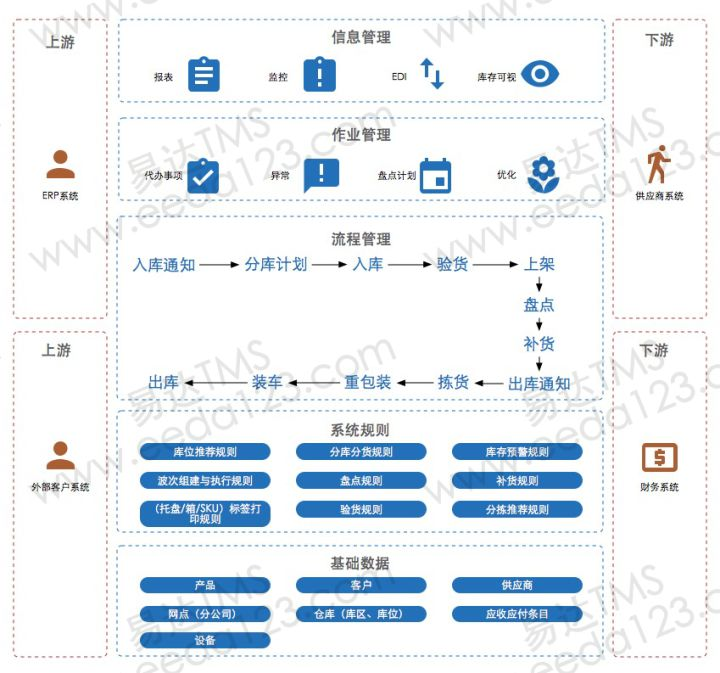

作者：刘宇

链接：https://www.zhihu.com/question/37341460/answer/81515821

来源：知乎

著作权归作者所有。商业转载请联系作者获得授权，非商业转载请注明出处。

1. 上游客户是谁？贸易商，分销商，制造商？是否涉及进出口？
2. 产品的主要属性是什么？重货，泡货，易耗，快销，温度，湿度？
3. 产品对仓库的要求是什么？防潮，冷藏，防静电，堆垛层数？

4. 仓库硬件及设备需要什么？货架，叉车，托盘，RF扫描枪，标签打印机
5. WMS是自己的管理系统还是开放给客户使用，这个涉及到你自己内部纯管理还是做平台的问题；
6. WMS是否需要考虑多网点控制，全省，全国，全世界？
7. WMS的主流程是否清晰，每个节点的作业流程和操作人员定义是否清晰？
8. 针对不同的客户，不同性质的货品是否有对应的操作流程
9. 库存可视化：实时监控库存，针对不同的作业状况的KPI可以做到哪几样？
10. EDI：跟上下游的系统是否可以无纸化对接，数据文件的导入导出是否方便
11. 现场照片处理：现场单据签收，货损现场上传到系统中，解决事后扯皮问题

最后，奉上以前给客户做的一张WMS架构图，拿走不谢:)




---


设计WMS时，从技术角度来看，个人认为需着重以下方面。
1、根据侧重点选择技术背景：用户交互使用Winform Or Web，平台选用Linux Or Windows，数据库选择Oracle Or SQL or Plsql。
2、模块化：既要让业务模块化，也要使用合适的设计方案，让代码模块化。优良的设计是稳定、易读、易拓展的前提。
3、精炼的代码：如果少了重构的思想，再坚固的碗，也不过是装着满碗馊饭。
4、成熟的接口方案：WMS与WCS、ERP、MES均有接口，合适的接口可以保障系统的稳定运行。
5、易于使用的界面交互：这个做得差，会被人戳脊梁骨的。
6、丰富的报表记录：最好是所有操作及异常均留下记录，以备纠错。
7、历史数据迁移：提升WMS的业务效率。

作者：玻璃心

链接：https://www.zhihu.com/question/37341460/answer/115457380

来源：知乎

著作权归作者所有。商业转载请联系作者获得授权，非商业转载请注明出处。


---


```
能避免用鼠标操作的 尽量避免用鼠标 。。。。
```

---


作者：蓝海汇

链接：https://www.zhihu.com/question/37341460/answer/528631933

来源：知乎

著作权归作者所有。商业转载请联系作者获得授权，非商业转载请注明出处。

1.首先弄清仓库需求 :前期的需求确定 制定文档、进度安排、最终完成时间,中途的需求变更 ,后期的系统维护 都要考虑 提前规划,

2.wms提供的接口是否满足仓库需求, 

3.oms(订单管理系统) 是否能够提供对应wms接口的数据

\- --简单描述:最终使用的是wcf的方式 ,oms(oms中的操作以及部分定时任务)触发 服务,wcf将服务获得的信息 通过wms接口传递 数据到wms. (解决 并发 以及数据能实时传递的问题).

 **注意:**细节方面 比如:wms接口提供的数据的完整性,即是否满足仓库需要 ,

​          wms接口调试:中英编码,加密,乱码等问题.

​          文档规范 :wms接口文档的完整性以及实时更新 (对接公司 开发提供),

​          双方人员的沟通问题: 强烈建议 同一地点一起开发沟通.

\--------------------- 

**业务系统设计的流程**

业务系统从无到有的设计，是有一套标准范式可以遵循的。

实际上，随便一套《软件工程学》教程，讲述的都是业务系统的设计，但是软件工程已经不满足当前时代对专业人员的培养和要求。

互联网时代下的软件设计，已经被拆分成多个细分职能：产品经理参与制定业务，设计应用功能；工程师负责技术架构，编码实施；而在传统软件工程中，这两项职能由一个角色承担。

如今的现实情况是：软件设计人员更多的参与到了业务决策制定，软件研发人员越来越远离业务，只聚焦于技术。

即便如此，软件设计中的经典思路、方法论是没有改变的。业务系统的产品经理，必须理解软件工程学中的部分核心要素，才能真正设计出靠谱的系统。

一般来讲，一套业务系统从0到1的构建，需要经历如下环节

**01 业务方案设计**

PM和业务负责人一起梳理、制定业务流程、制度、机制，理解业务的问题点，并确定软件系统解决方案。

**02 系统整体方案设计**

PM结合业务诉求与目标，完成系统概要设计，包括界定业务、系统的边界，系统功能的抽象和演进蓝图，整体应用架构的设计，如何与公司已有系统拼接、交互。

**03 系统细节方案设计**

PM完成细节方案的所有设计，包括建模、角色、界面、权限等。

其中建模是最难的部分，建模好坏决定了系统未来的灵活性、可扩展性。建模要求对业务的全面理解，极强的抽象归纳能力。

**04 实施验收**

PM对最终项目落地负责，系统上线后要展开持续的迭代优化，深度参与产品运营，数据分析等。

如果是从无到有设计系统，以上环节必须全面贯彻，尤其是架构设计和模型设计，是重中之重。


[http://weixin.qq.com/r/-ThLU47EfNMDrcow923v](https://link.zhihu.com/?target=http%3A//weixin.qq.com/r/-ThLU47EfNMDrcow923v) (二维码自动识别)


---

仓储管理软件。主要用于库内的生产作业。wms一方面有数据记录功能，承载着供应链中信息流的作用，所以要注重信息流的连贯性和作业场景的逻辑性。

```
作业方式也不同，在设计时首先应该保证逻辑不矛盾，其次应该充分考虑现场的作业场景以及用户人群。

更低扁平==系统知识逻辑
```

````
胖兔
胖兔
云布创始人/24年米兰球迷/武侠迷
充分考虑现场操作的傻瓜式
````


---

合主流的仓储物流公司的标准作业流程，包括区域规划、标准作业设备配备（作业设备以及网络化设备）、人员岗位配置以及作业手法指导等，尽量做到心中有数；
2、必须进行实地考察，每个公司的管理办法以及老板喜好不同；
3、充分考虑各种作业流程的便捷性，比如入库员能够通过扫码直接知道大致该入哪个库位，出库员能够马上知道要出的货物最早批次在哪个库位，低储或者高储自动报警，库管员直接用手持终端可以快速盘点等。
4、预留端口可以在未来可以和财务软件对接；
5、系统里面走的每个流程都能形成闭环；
暂时只想到这么多，待续.

作者：刘震撼

链接：https://www.zhihu.com/question/37341460/answer/74501284

来源：知乎

著作权归作者所有。商业转载请联系作者获得授权，非商业转载请注明出处。


---


对自身的商业规划及品类分解、商品规划等等，都作出相应的安排。物流将基于商业的特性作出应对，但是也需要从物流的特性（操作设备、建筑物设施、存储方式等等）反馈到业务运营部门进行协调。
所以这些大型的公司将基于自身商务的特点，定制化WMS（基于一个版本）在此之上进行开发，成本较高。

通用性WMS也由不同的厂商根据相同行业的发展，进行WMS的产品规划设计，从而实现基本满足特定行业需求。
3PL，第三方物流应用的WMS就又不一样了，通常会基于他们呢服务的行业进行开发。

所以，最后我的观点是，通用WMS公司都有自己特别擅长的行业，3PL也是一样。如有有人说他们的产品什么行业都适合，也就是说他们什么行业都做的不精。

作者：汪锋

链接：https://www.zhihu.com/question/37341460/answer/101573734

来源：知乎

著作权归作者所有。商业转载请联系作者获得授权，非商业转载请注明出处。

```
WMS的整体设计要考虑：1、作业流程，很多的是设计到作业层面；2、查询和管理部分，仓库的管理中如对库存的查询，货物周转率周转天数的查询等以及费用的统计。
```


··

````
实用性强

made4net公司的wms是个不错的选择。
````


