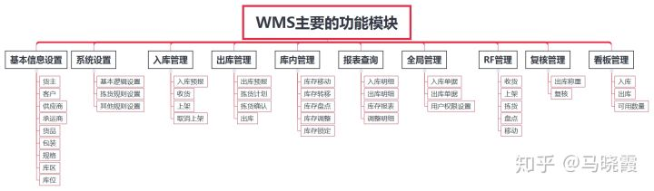

# 一张图概括WMS的基本功能模块

[马晓霞](https://www.zhihu.com/people/kui-qing-35-99)

whereas I was blind, now I see.

用一张图来概括WMS仓储管理系统的基本功能模块

许多传统的行业的仓库顺应潮流在如火如荼的进行仓储信息化的建设，WMS仓储管理系统的运用只是万里长征的第一步，WMS的基本功能模块都差不多，许多软件提供商会提供一些增值服务，如何选择一款契合自己的WMS系统，还是需要慎重考虑的，综合考虑自己的预算、和未来发展以及产品的性价比，在选择WMS系统方面，本着不要最好的而是选择最合适的原则多比较几家公司，选出适合的好用的。

发布于 2018-09-17

科技

WMS（仓库管理系统）