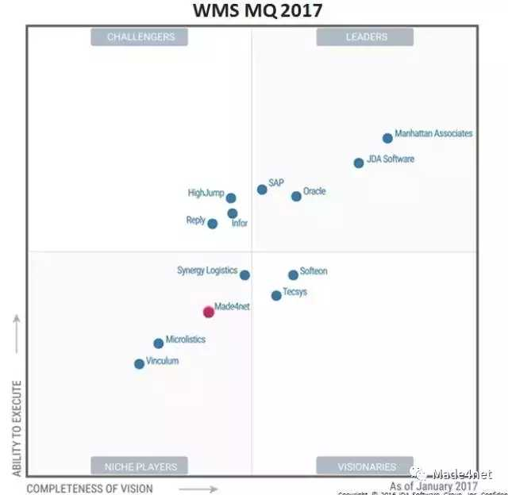

---


---

# 求推荐比较好的WMS(仓储管理系统)？


https://www.zhihu.com/question/27400704/answer/36492617


---


---

https://www.zhihu.com/question/27400704/answer/36492617


---


[](https://www.zhihu.com/people/le-su-ke-ji)

[乐速科技](https://www.zhihu.com/people/le-su-ke-ji)

物流信息化

WMS系统是一款基于供应链环节中储存活动的信息系统。WMS系统通过入库业务、出库业务、仓间调拨、库内管理、虚仓管理等功能，对批次管理、物料对应、库存盘点、质检管理、即时库存管理等功能综合运用的管理系统，可以有效控制并跟踪仓库业务的物流全过程。WMS系统已经实现和上游的ERP系统、订单系统、报单系统等系统进行对接，也和下游的TMS系统、DMS系统以及其他物流快递公司以及其他系统进行对接，实现供应链中仓储信息的有效管理。

````
试一下搜索仓秘书
````


-----


[](https://www.zhihu.com/people/loken)

[loken](https://www.zhihu.com/people/loken)

顾问


WMS只管数量，不管金额
WMS管库位，比ERP更灵活适用情况，用手工台账管理非常困难：仓库面积达到1000平以上单据量业务量大货物品种多体积小准确性和工作效率，此消彼长，上了WMS并一定能提高工作效率，但是一定能提高准确性


---

[](https://www.zhihu.com/people/sapzhong-ke-hua-zhi)

[SAP中科华智](https://www.zhihu.com/people/sapzhong-ke-hua-zhi)

中科华智-企业信息化专家

如果对接SAP那没有比中科华智WMS更好的软件了 

---


[](https://www.zhihu.com/people/kenleoo)

[医疗信息化管理](https://www.zhihu.com/people/kenleoo)

多领域移动物流供应链管理软件

**智能WMS系统**是一款标准化、智能化过程导向管理的仓库管理软件，它结合了众多知名企业的实际情况和管理经验，能够准确、高效地管理跟踪客户订单、采购订单、以及仓库的综合管理。使用后，仓库管理模式发生了彻底的转变。从传统的“结果导向”转变成“过程导向”；从“数据录入”转变成“数据采集”，同时兼容原有的“数据录入”方式；从“人工找货”转变成了“导向查找取货”；同时引入了“监控平台”让管理更加高效、快捷。条码管理实质是过程管理，过程精细可控，结果自然正确无误。1.提高仓储作业效率系统提示库位信息，智能拣货据库存预警自动补货管理系统提示上架库位支持变动盘点、循环盘点、抽检、巡查等.....2.仓储管理与作业模式的变革仓库管理实现可视化让仓库管理清晰、规范信息化作业，减少人力依赖无纸化办公、提升整体生产力3.提升作业人员绩效全程作业记录，包括拣货、装箱、收发货、上架、补货、盘点等.....自动计算人员作业汇总信息对接仓库看板系统实时展示4.提升库存准确性提升发货准确性提升收货准确性减少库存的非正常损失无线射频设备及扫描设备系统对接与扩展业务管理系统（ERP）运输管理系统（TMS）计费管理系统（BMS）成本管理系统（CMS）MHE接口系统RF系统以大科技**智能WMS系统**均可与以上系统进行对接。 

----


[](https://www.zhihu.com/people/4pnt)

[小小猫](https://www.zhihu.com/people/4pnt)

四方网络科技（简称：4PNT）是国内领先的电子商务与物流软件及云服务提供商。

 					仓库管理系统 					

仓储管理涵盖了多种类型仓库，从仓库经营模式划分来看可适用于普通仓、VMI仓、保税仓，从仓库所有权划分来看可适用于第三方仓库、自有仓库。

既能承接业务委托管理中心下达的仓储任务，又能独立管理仓储委托，集中管理入库、出库、盘点、增值服务等仓储类操作。

支持分布式多仓库同时运营管理，可多维度实时了解库存分布。

精细化的仓库作业管理，可根据需要配置仓库作业流程，满足复杂和简单的作业需求。

支持一维条码、二维条码、串码的管理，支持自动化物流设备辅助作业。

支持多次收货、多次发货的操作，应对异常货物的特殊处理。

提供灵活可配的上架策略、拣货策略、波次策略，进一步提升仓库作业效率，支持平库、立体库、高架库等多形态仓库的管理。

[发布于 2016-09-20](https://www.zhihu.com/question/27400704/answer/122860326)


---


[四方网络](https://www.zhihu.com/org/si-fang-wang-luo)

 官网www.4pnt.com

不推荐，只是介绍，可以关注下4pnt网络科技的WMS系统 是SAAS模式下的仓储管理系统				
仓储管理涵盖了多种类型仓库，从仓库经营模式划分来看可适用于普通仓、VMI仓、保税仓，从仓库所有权划分来看可适用于第三方仓库、自有仓库。
既能承接业务委托管理中心下达的仓储任务，又能独立管理仓储委托，集中管理入库、出库、盘点、增值服务等仓储类操作。
支持分布式多仓库同时运营管理，可多维度实时了解库存分布。
精细化的仓库作业管理，可根据需要配置仓库作业流程，满足复杂和简单的作业需求。
支持一维条码、二维条码、串码的管理，支持自动化物流设备辅助作业。
支持多次收货、多次发货的操作，应对异常货物的特殊处理。
提供灵活可配的上架策略、拣货策略、波次策略，进一步提升仓库作业效率，支持平库、立体库、高架库等多形态仓库的管理。


----


作者：寸青人

链接：https://www.zhihu.com/question/27400704/answer/291632486

来源：知乎

著作权归作者所有。商业转载请联系作者获得授权，非商业转载请注明出处。

**WMS供应商分类:**

整个WMS市场分为五种类型的供应商，其中有三类供应商都包括在这次的魔力象限中(后两种是“独立WMS组件供应商“和“材料处理设备/自动化(MHE)供应商“，不做详细介绍)：

**专业的WMS系统供应商：**这些供应商是主要或完全专注于WMS套件的独立软件供应商(ISV)，尽管他们可能提供一些额外的功能。 此类别中的供应商包括**Made4net**，Microlistics，Reply，Softeon，Synergy Logistics，Tecsys和Vinculum。

**应用程序系统供应商：**这些供应商在大多数拥有极为广泛的软件系统类别，例如后台财务，人力资本管理，客户关系管理，产品生命周期管理[PLM]和供应链管理[SCM]。 Infor，Oracle和SAP被认为是这个类型的供应商。

**供应链管理系统供应商：**这些供应商主要提供专注于供应链管理领域的解决方案，包括像物流这样的各个供应链细分领域的功能，但不包括诸如财务或人力资本管理功能。虽然这些供应商可能提供各种SCM解决方案，但它们不一定提供集成平台。 此类别中的供应商包括JDA软件，曼哈顿以及(在较小程度上)HighJump。

以下是Gartner公司根据前瞻性(横轴)和执行能力(纵轴)，做的一个供应商分布和趋势分析图：



Made4net公司的WMS也是比较专业的，可以供市场选择。而且他们的TMS也是国内目前比较需求的产品：线路优化模块。

[发布于 2018-01-08]()


---


作者：寸青人

链接：https://www.zhihu.com/question/27400704/answer/291632486

来源：知乎

著作权归作者所有。商业转载请联系作者获得授权，非商业转载请注明出处。

**WMS供应商分类:**

整个WMS市场分为五种类型的供应商，其中有三类供应商都包括在这次的魔力象限中(后两种是“独立WMS组件供应商“和“材料处理设备/自动化(MHE)供应商“，不做详细介绍)：

**专业的WMS系统供应商：**这些供应商是主要或完全专注于WMS套件的独立软件供应商(ISV)，尽管他们可能提供一些额外的功能。 此类别中的供应商包括**Made4net**，Microlistics，Reply，Softeon，Synergy Logistics，Tecsys和Vinculum。

**应用程序系统供应商：**这些供应商在大多数拥有极为广泛的软件系统类别，例如后台财务，人力资本管理，客户关系管理，产品生命周期管理[PLM]和供应链管理[SCM]。 Infor，Oracle和SAP被认为是这个类型的供应商。

**供应链管理系统供应商：**这些供应商主要提供专注于供应链管理领域的解决方案，包括像物流这样的各个供应链细分领域的功能，但不包括诸如财务或人力资本管理功能。虽然这些供应商可能提供各种SCM解决方案，但它们不一定提供集成平台。 此类别中的供应商包括JDA软件，曼哈顿以及(在较小程度上)HighJump。

以下是Gartner公司根据前瞻性(横轴)和执行能力(纵轴)，做的一个供应商分布和趋势分析图：


Made4net公司的WMS也是比较专业的，可以供市场选择。而且他们的TMS也是国内目前比较需求的产品：线路优化模块。

[发布于 2018-01-08]()