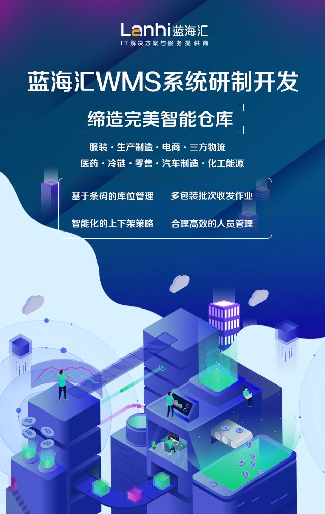

[蓝海汇](https://www.zhihu.com/org/lan-hai-hui-82)

已认证的官方帐号

毛遂自荐，如有任何问题，您可以对我们进行咨询~欢迎~

**蓝海汇WMS系统**

**我们提供定制化服务**

**介绍**

**应用云上托管**

提供云上自动部署和运维能力，解决手工部署效率低、错误率高、升级困难、业务中断、监控定位难等应用运维问题，适用于政企IT系统及互联网类应用

**优势**

- 自动化部署
  通过模板化、可视化的应用编排，实现一键式自动部署
- 不断服升级
  提供滚动升级/灰度升级能力，保障业务升级不中断
- 自动化运维
  提供应用拓扑、监控、告警、日志、调用链等能力

**我们的客户覆盖9大行业：**

服装-生产制造-电商-三方物流-医药-冷链-零售-汽车制造-化工能源

**合作案例：**

目前已为海尔、中车、饮乐多、中铁等大中小型企业进行服务。

**工业信息化范围包含：**

[蓝智云MES系统](https://link.zhihu.com/?target=http%3A//mes.lanhaihui.net/mes_pass.html)
优化管理智造模式 多层全体系交互平台

[蓝智云WMS系统](https://link.zhihu.com/?target=http%3A//mes.lanhaihui.net/wms_saas.html)
优化调度仓库管理 精准高效同步预警

[蓝智云ERP系统](https://link.zhihu.com/?target=http%3A//mes.lanhaihui.net/erp_saas.html)
生产管理透明化 流程管理最优化

[编辑于 2018-11-10](https://www.zhihu.com/question/27400704/answer/528628430)