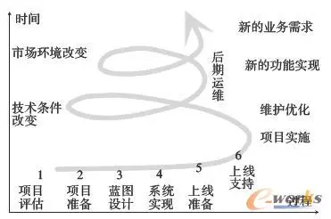

##             ERP项目后期运维怎么办？                

​         [                         ERP之家                      ](javascript:void(0);)                     *6天前*                   

***\*新朋友点上方蓝字“ERP之家”快速关注\****

**导读：**一个企业决定实施大型ERP时，遇到的第一个问题就是“ERP项目应该由谁来主导”。

ERP是一个庞大的信息管理系统，在ERP实施的各个阶段中，后期运维重要，它是整个ERP系统长期有效运行的有力保障。本文从ERP项目后期运维的地位、运维的不同阶段、运维的支持体系、运维过程中的知识体现以及运维所起的作用等方面对ERP项目后期运维进行全面研究。

## **1.引言**

　　知识经济时代，知识和信息已成为企业重要的资源，企业只有不断地发现、管理和利用知识和信息，才能在激烈的市场竞争中立于不败之地。企业信息化水平已经成为影响企业发展的关键因素。

　　企业资源计划（Enterprise Resource  Planning，ERP）是企业信息化的重要技术和管理系统，它代表了当代先进的企业管理模式与技术，能够提高企业整体管理效率和市场竞争力。国内企业为了提高自身竞争力，纷纷上马ERP系统。这些ERP系统在国内的广泛应用，在一定程度上提高了企业管理水平，在降低企业经营成本方面发挥了重要作用。

　　ERP系统的实施同时也给企业带来巨大的风险，包括前期决策的风险、中期实施的风险以及后期运维的风险等。在国内，一度出现了“不上ERP等死，上ERP找死”的说法。我国企业信息化起步较晚，对于我国企业信息化建设，尤其是对ERP系统运维的研究还比较欠缺。本文对ERP系统的运维进行较为全面的研究。

## **2.运维在ERP项目中的地位**

　　对于ERP这样一个庞大的信息管理系统来说，上线并不意味着项目的结束，相反，保证系统运行的正常与完善却是个持续改善的过程。特别是在系统正常上线后的1~3年间，对于整个ERP系统，用户已经在一定程度上有所熟悉，他们在对自己业务认知的基础上，会依据业务的实际情况提出一些可能的改进方案。

　　ERP项目是一个持续改善的过程，不管是系统实施还是系统保障，或者是系统优化、系统扩充，都必须通过项目评估、项目准备、蓝图设计、系统实现、上线准备、上线支持等6个步骤保障系统的稳定，ERP项目持续改善过程如图1所示。

图1 ERP系统持续改善过程

　　ERP刚上线时的关注点是配合企业生产经营，保证系统运行正常，但在后期运维阶段，其关注点已经有所不同。这个阶段，主要是以提高业务操作效率，弥补上线实施过程的不足，满足业务需求为主要目的。

　　可以这样说，已经成功完成ERP实施项目的企业，并没有达到最终的终点，只是到达ERP系统项目中的一个里程碑，更漫长的过程是后期的运维管理活动。

## **3.ERP运维三阶段**

　　ERP项目是一个持续改善的过程，ERP系统上线后的运维管理活动主要可以分为3个阶段：

　　第一阶段，系统保障阶段。在这一阶段，主要是所有ERP系统运维人员努力维持ERP系统的正常运行，解决系统的数据错误以及用户的操作失误等问题的过程。

　　第二阶段，系统优化阶段。在这一阶段，ERP运维人员将配合实际的业务人员，将系统优化到符合实际业务需求的最佳状态，是一个系统优化的过程。

　　第三阶段，系统扩充阶段。在这个阶段，ERP系统已经被公司员工普遍接受，随着技术和市场的变化，已经可以考虑扩充某些系统模块，以获得更好的业务效果。

　　系统扩充后将会导致ERP的运维进入新一轮的第一阶段和第二阶段。

## **4.ERP运维支持体系**

　　一般来说，ERP的运维支持体系主要分为3个层次，即关键用户、内部顾问和外部顾问，如图2所示。

图2 ERP多层运维支持体系

　　第一层，关键用户，即与最终用户直接接触的运维人员。他们一般是各业务实体单位的业务骨干，在ERP决策与实施上线阶段与ERP实施顾问交流业务需求，接受培训，进行系统测试。他们是内部顾问和最终用户之间的桥梁，利于双方的沟通。

　　第二层，内部顾问，即企业ERP系统支持中心或者是信息化中心的人员。他们从ERP项目准备开始，一直到系统上线及后期运维都全程参与，对整个ERP系统相当熟悉，属于独立的信息化支持人员。他们在关键用户和外部顾问之间起到桥梁作用，在快速学习新的知识的同时，帮助各业务单位的关键用户解决问题，并监督、指导各业务单位的业务流程。

　　第三层，外部顾问，也可以称之为运维顾问，是ERP实施公司的专业技术人员。主要在宏观上提出问题的解决方案，与内部顾问一起实施业务优化的方案，指导内部顾问解决用户的问题，并实现知识转移，以及当用户对ERP有新的功能需求时，进行相应的模块开发。

　　在整个运维体系中，除了上面3个层次之外，最终用户、部门领导等也应参与到运维过程中来。可以说，ERP的运维是一个企业全体员工共同参与的工作。

## **5.ERP运维中的知识体现**

　　从ERP运维支持体系可以看出，ERP运维主要涉及的人员有3类，即ERP系统的最终用户、内部顾问及外部顾问。他们参与了ERP的前期决策、中期实施的过程，对ERP系统有比较全面的了解和掌握，所以ERP的后期运维他们也将是主要的参与者。

　　分析ERP运维的过程可以发现，这个过程就是一个知识获取、知识共享、知识应用及知识创新的简单知识管理的过程，如图3所示。

图3

## **6.在ERP运维阶段亟待解决的问题**

　　在实际的ERP项目中，当ERP上线完成后，就进入了保证系统正常运行的一个持续改善的运维过程。在这个过程中，存在着大量的问题，亟待解决。

　　6.1 使用人员需要加强培训

　　ERP是先进的、行之有效的管理思想和方法，是借用一种新的管理模式来改造企业旧的管理模式。虽然ERP项目已经进入到运维阶段，但是系统使用人员没有转变观念，没有从根本上做到熟练掌握相应的知识，从而导致大量问题出现。要想取得ERP运维的成功，必须重视培训。

　　对于ERP运维的培训，必须做到分内容、分人员、分管理层次地进行系统的培训，提升管理理念和技术技能。同时，培训还必须要有完整的培训知识库，注重培训的科学性、有效性、实用性，以及知识库的重复利用性。只有这样，才能使全体员工从观念上真正接受ERP，避免出现数据、制度不到位等问题。

　　6.2 业务人员依赖性很强

　　对于正常的ERP运维来说，参与运维的主要人员是来自上线ERP项目的公司内部。但在实际ERP项目的运维过程中，公司内部运维人员并没有适应整个ERP系统，还是由专业实施顾问来帮助公司内部人员去运维。公司内部人员的依赖性很强，并形成恶性循环。

　　为了解决这个问题，公司内部必须增加系统维护人员，参与到日常的系统维护、报表修改、功能开发等工作中，实现知识在公司内部的有效转移，以培养自己内部的运维人员，为日后维护培养力量。同时，要指出的是，在ERP运维的过程中，有些知识的转移并不是几次培训就可以实现的，需要运维人员在实际工作中逐步总结、运用与创新。

　　6.3 ERP使用过程中存在大量问题

　　ERP项目的运维过程，就是一个不断解决问题、优化系统、提出新功能的过程。所以说，运维过程中出现问题是必然的，尤其是在上线初期，由于上线过程中培训力度不够、上线时导入的数据不准确以及业务人员的误操作等，都会使ERP系统出现问题，都有待运维人员去解决。

　　ERP运维人员在解决问题的过程中，一方面要对解决的方案进行相应的归档整理，以便下次对相同问题的处理曰另一方面，运维人员要引导用户自己去试着解决问题，以达到野授之与渔冶的效果，从总体上提高企业信息化水平。

　　6.4 运维知识需要管理

　　ERP系统的运维过程，不只是为了解决问题而解决问题，关键还在于对运维知识的管理，建立运维知识库，体现运维知识的价值。在实际的运维过程中经常会发现，业务人员提出的问题，大部分都属于重复问题，问题总结人员没有复核，只是简单地罗列，没有起到部门信息化人员的作用。而对于问题已经解答的，也没有去落实相关的责任、任务，更谈不上对问题进行总结归纳和进行知识沉淀。

　　公司业务人员在使用ERP系统时存在依赖性，有时提出的都是日常小问题，在提高个人学习能力之后，都是可以自行解决的。但是他们却直接把这些问题提交给运维人员，也就无法实现对知识的鉴别、获取、应用、共享和创新，增加了运维的难度，也不能顺应企业信息化的要求，在以后的运维工作中要逐渐加以解决。

## **7.结束语**

　　ERP系统的后期运维关系到ERP功能的长期、有效实现，对于ERP运维的研究，有助于增强企业的ERP运维意识及对ERP系统的管理能力，提高企业ERP项目实施的成功率，提高企业的信息化水平。

## 版权归原作者所有,如有侵权请联系删除。免责声明：本文系网络转载，版权归原作者所有。但因转载众多，无法确认真正原始作者，故仅标明转载来源。本文所用视频、图片、文字如涉及作品版权问题，请第一时间告知，我们将根据您提供的证明材料确认版权并按国家标准支付稿酬或立即删除内容！本文内容为原作者观点，并不代表本公众号赞同其观点和对其真实性负责。

公众号推荐：美国容错

在超过35年的时间里，世界《财富》500强公司以及全球众多行业的中小型企业一直依赖美国容错实现简单操作以及持续可用，公司在中国北京、上海设有办事处机构，向国内的客户提供销售咨询及相关技术服务。

旗下产品及解决方案包括ztC Edge、ftServer、everRun、V Series等！

**欢迎扫码了解关注！**

