##                                                              13幅逻辑图，帮你做出正确选择！

   [                         ERP之家                      ](javascript:void(0);)                               *6天前*                   

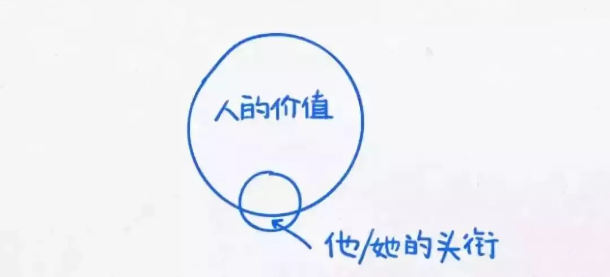

**来源：****中国管理会计网**

**导读：**你能清晰地了解自己的行为、目标及思考问题的方式吗？

杜克大学作为全美最优秀的大学之一，在全球教育中有着巨大的影响力。今日借杜克大学的13幅逻辑图与你一块探讨关于生活的哲学，这13幅图或许将帮助你选择正确的方式去实现心中所想与所需。

**一**

**什么是生活**

****

生活中，我们往往因为缺乏对自我的认知而错过了很多原本属于自己的生活，总是在不经意间错过了那些最美好的东西。

“Pay close attention. This is your life.”

请留意生活中的细节，这是你的生活。

**二**

**明天比今天更重要**

人们总是过于在意那些重要的决定 （比如接受什么样的工作或者职位）， 但是实际上明天总是模糊的。潜心规划，向你认为最好的目标大胆进发，要知道，很少有所谓完全“正确”或是“错误”的决定，因为它们只不过都是一个让你的生命进入下一个阶段的台阶。

认真地思考，清楚地知道自己的追求及内心深处想要的东西是什么，这是航行中的灯塔。没有了这个灯塔，前行的路上就会有更多“错误”的选择，今天到明天是一条不可逆转的路，珍惜每个当下及生命中的过客。

**三**

**获得满足感**

****

和你得到的实物相比，你可以从和别人建立的关系中获得更多的满足。

在现实生活中，我们总是错误地追求“物质”所带来的快感，就如常说的，钱绝对不是我们人生的追求，它只不过是满足我们需求的工具而已，可是很多人只看了工具，却没有想清楚，努力获得这个工具用来干什么？在现实生活中往往会出现两种情况：

（1）钱有了，却无所事事；

（2）钱没了，所有的精力及焦点都陷入到“求生存”的状态，几乎没有心智考虑幸福的事情，然后越来越穷，越来越没有幸福感。

**四**

**体现生命的价值**

****

在这里的“头衔”是指他人的评价，也就是所谓的面子，我们往往太在意他人的评价而忽略了自己最真实的需求，有一句话说得很好“外面只有自己，没有别人”；这句话反过来说也挺有意义：“里面只有别人，没有自己”。其实，我们在生活的道场中要认真的反思与修行。尊重人比尊重头衔重要，每个人的生命都有自己的价值。

外面只有自己，没有别人。

里面只有别人，没有自己。

**五**

**不要轻易说“不”**

**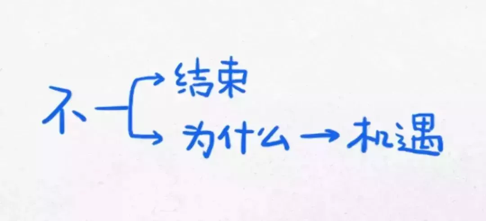**

学会重新认识拒绝。当你努力想要成为领导者或者建立公司的时候，人们会经常告诉你“不行”。但是与其把这个NO视为事情的结束，不如把它看作一个寻找原因的机会：你是不是找了错误的人?你是不是还没有展现出你具有承担这个新责任的能力? 水滴石穿，NO会变成另一个等待、学习和再次尝试的机会。

其实人们最大的问题在于遭受拒绝的时候“郁闷”的心情，由于情绪的影响我们不愿意发现自己的问题，而更愿意用找借口的方式去处理。这个过程逃避了“发现自己问题”痛苦，就像吃了止疼药，虽然现在不疼了，可问题还是会出现，因此多去“求证为什么”是一种非常好的思维模式。

**六**

**挑战自我**

**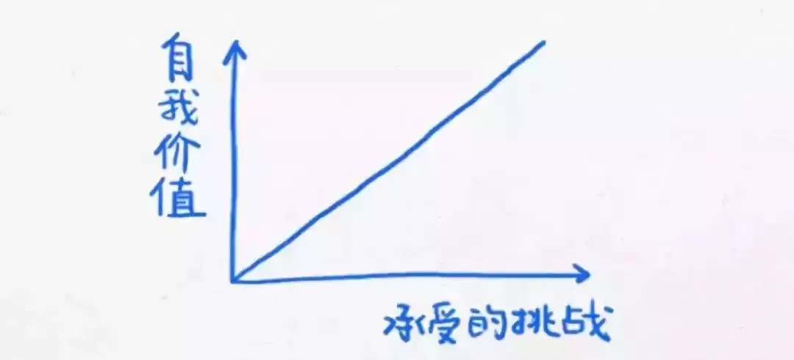**

“Find a place where you can be challenged. Ask yourself: Am I proud of my work?”找到一个挑战自己的事业。自省：“我是否为我的工作感到自豪”？

这是一幅很有意义的图，如果你不去热爱你的工作与生活，不能发现工作与生活中的价值，即便经过再大的努力，你的人生体验都会停留在峰底。

**七**

**别害怕不确定性**

**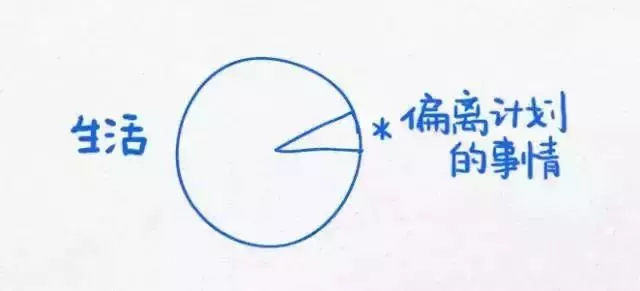**

别害怕偏离你的计划，勇敢地接受不确定性。那些在你感情、工作和生活上表现出不确定性和高风险的东西，往往都是很值得你尝试的。

其实偏离计划的事情，往往可以帮助自己打破“舒适圈”。你可以选择一些自己不愿意做的事情，当然这些事情不会带来太大的负面情绪与结果，然后反思这个过程。这个过程里，个人的成长还是很大的，所以尝试你没有尝试过的，是一种进步！

**八**

**回顾过去的经历**

**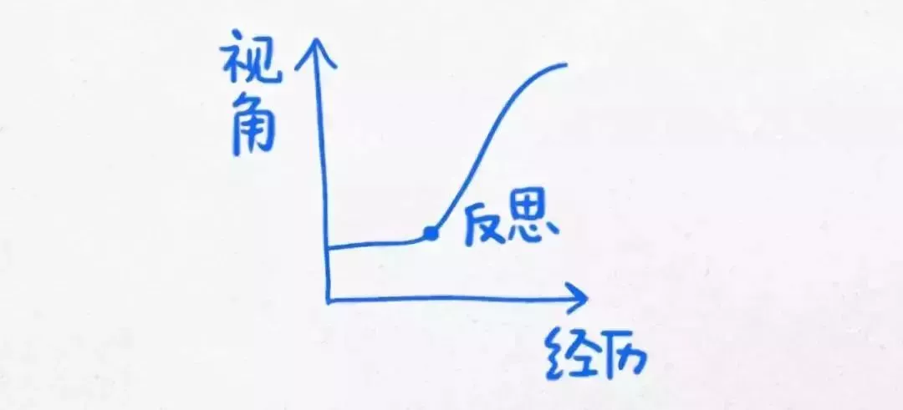**

当你进入你人生的新阶段，别忘了停下来回头看看，去发现你过去经历的意义。它可以让你更好地了解你是谁，将到哪里去，如何去那里。

这真心是一个不错的建议。所有的经历，如果没有反思，则失去了成长的意义。如果一直按照一个思维方式去思考问题，经历再多，结果也是一样，不管是工作还是感情都符合这条规则。

**九**

**受到教育不等于聪明**

**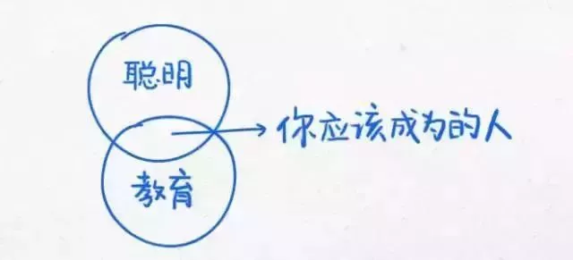**

“Never confuse being educated with being smart。”别把受到教育这件事和聪明这件事混为一个概念。

别把自己的高等教育当回事，即便你的学历再高，如果让你说出小学五年级第一篇语文课文的题目，你恐怕早已经不记得了。真正的思考能力、创新能力及优秀的品格，才是职业发展的源动力。

**十**

**阅读能激发灵感**

**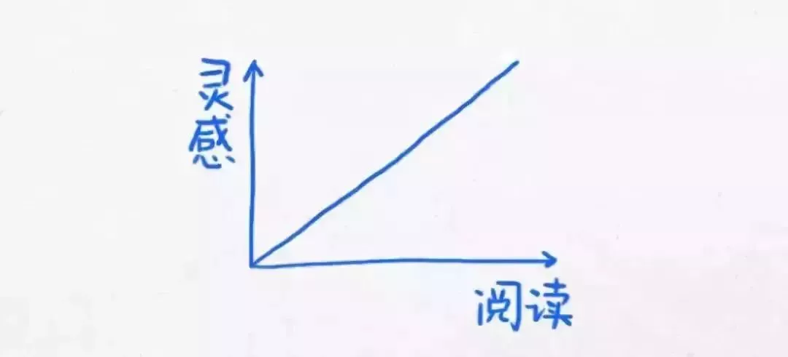**

广泛的阅读，热情的阅读。创造力是一个必需的生存技能，而一些灵感就来自于你没有期待的来源。

这是一幅需要铭记在心的图画。你阅读得越多，你的灵感就越多。找到恰当的书籍，在阅读的同时联想解决自己遇到的问题，是一种非常高效的学习方法。

**十一**

**诚实比什么都重要**

**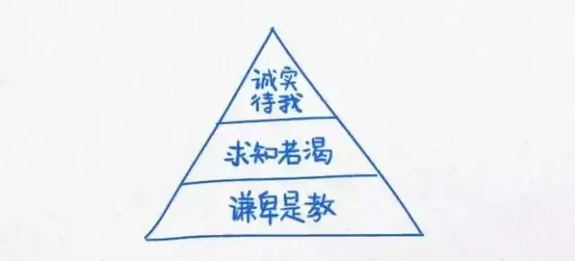**

“Be true to yourself. Be willing to learn and to be coachable.”诚实地对待自己，愿意学习，愿意被指导。

我们中的一部分人不能诚实地对待别人，更不能诚实地对待自己的内心世界。所谓的诚实地对待别人，是真诚+真实的想法；所谓诚实的对待自己，是认清自己真实的想法，能够允许并接纳自己的喜怒哀乐！

**十二**

**拥有感恩的心**

**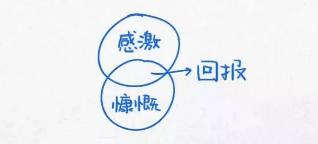**

“Give back—serve from a sense of gratitude.”用感恩的心，感恩身边的人和事。

关于感恩的心，很多时候被解读为知恩图报，实际上，还应该解读为一种幸福生活的方式。因为常怀感恩之心的人，内心总是充满了感动。如果对身边的一切只是抱着理所当然的心态，或者是一味地扮演索取者的角色，你是永远无法感受到这份感动的，反而会时常陷入到得不偿失的痛苦之中。

**十三**

**坚持**

**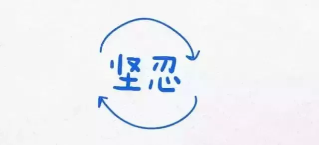**

“Stick with it，and keep moving”坚持，坚持，再坚持。

人生最大的遗憾在于坚持了不该坚持的，而放弃了不该放弃的。明智的选择，谨慎的行动是一种生活的阅历。比如说，你的坚持与倔强用在了人际关系中，这就叫坚持了不该坚持的，但是在事业与工作上却很放纵自己，不求上进，这就叫放弃了不该放弃的！

版权归原作者所有,如有侵权请联系删除。

免责声明：本文系网络转载，版权归原作者所有。但因转载众多，无法确认真正原始作者，故仅标明转载来源。本文所用视频、图片、文字如涉及作品版权问题，请第一时间告知，我们将根据您提供的证明材料确认版权并按国家标准支付稿酬或立即删除内容！本文内容为原作者观点，并不代表本公众号赞同其观点和对其真实性负责。

**订阅号推荐：****EPLAN易盼软件**

**欢迎新老朋友扫码关注！**

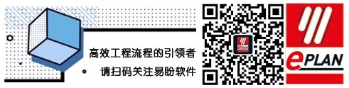

​                                              

​    