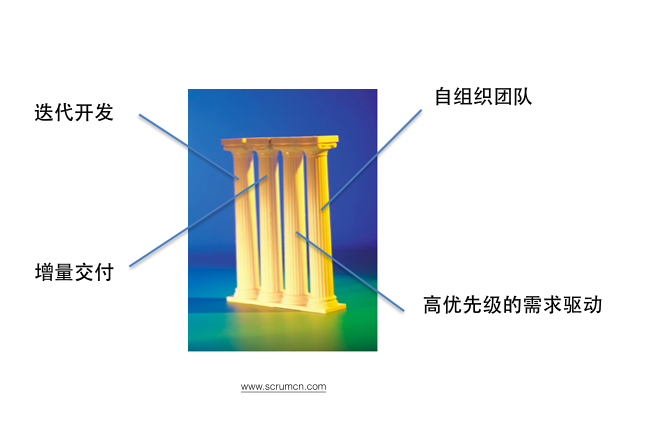
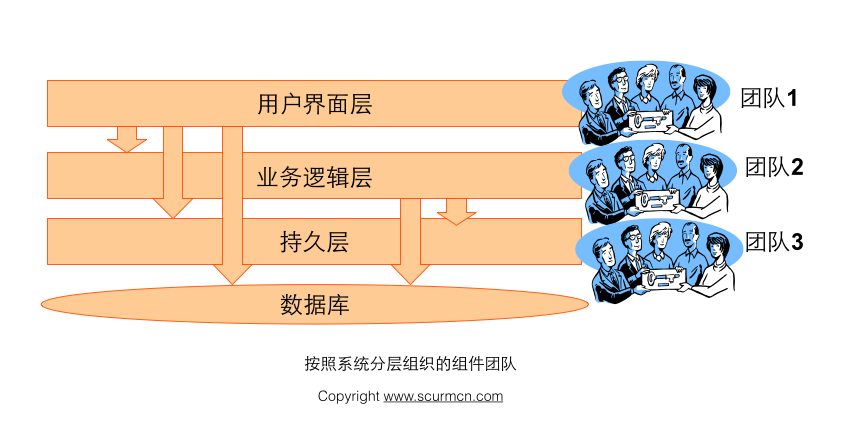
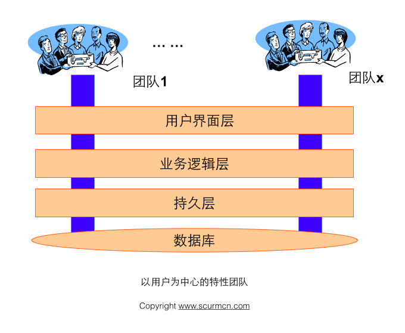
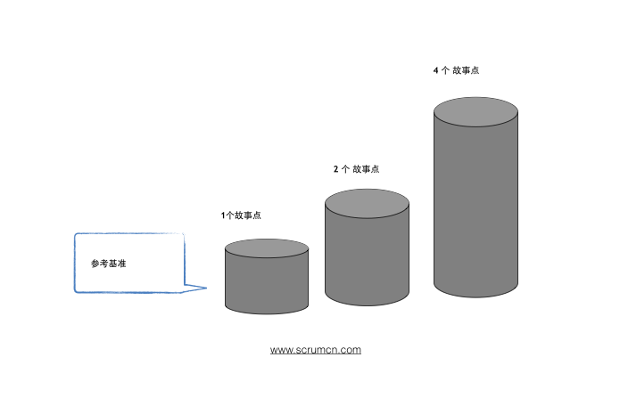
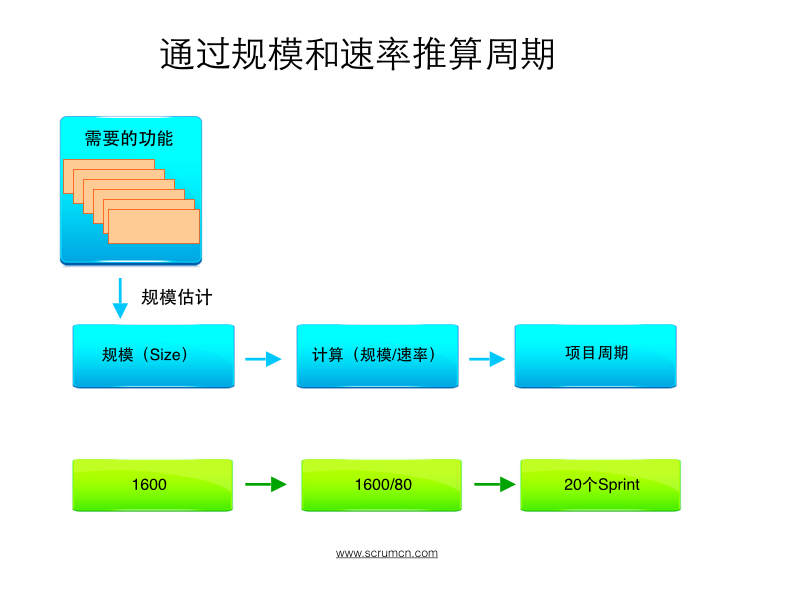

## Scrum的三个工件

Scrum 的工件以不同的方式展现工作和价值,可以用来提供透明性以及检验和适应的机会。Scrum 中所定义的工件能最大化关键信息的透明性,来保证 Scrum 团队成功地交付完成的增量。

## 工件一：Product Backlog – 产品待办事项列表

产品待办事项列表是一个排序的列表,包含所有产品需要的东西,也是产品需求变动的唯一来源。产品负责人负责产品待办事项列表的内容、可用性和优先级。

产品待办事项列表是一个持续完善的清单, 最初的版本只列出最初始的和众所周知的需求。 产品待办事项列表根据产品和开发环境的变化而演进。待办事项列表是动态的,它经常发生变化以识别使产品合理、有竞争力和有用所必需的东西。只要产品存在,产品待办事项列表就存在。

产品待办事项列表列出了所有的特性、功能、需求、改进方法和缺陷修复等对未来发布产品进行的改变。产品待办事项列表条目包含描述、次序和估算的特征。

产品待办事项列表通常以价值、风险、优先级和必须性排序。它是一个按照优先级由高到低排列的一个序列，每个条目有唯一的顺序。排在顶部的产品待办事项列表条目需要立即进行开发。排序越高,产品待办事项列表条目越紧急,就越需要仔细斟酌,并且对其价值的意见越一致。

排序越高的产品待办事项列表条目比排序低的更清晰、更具体。根据更清晰的内容和  更详尽的信息就能做出更准确的估算。优先级越低,细节信息越少。开发团队在接下来的 Sprint  中将要进行开发的产品待办事项列表条目是细粒度的,已经被分解过,因此,任何 一个条目在 Sprint 的时间盒内都可以被“完成”。开发团队在一个  Sprint 中可以“完 成”的产品待办事项列表条目被认为是“准备好的”或者“可执行的”,能在 Sprint 计 划会议中被选择。

随着产品的使用、价值的获取以及市场的反馈,产品待办事项列表变成了更大、更详 尽的列表。因为需求永远不会停止改变,所以产品待办事项列表是个不断更新的工件。业 务需求、市场形势和技术的变化都会引起产品待办事项列表的变化。

若干个 Scrum 团队常常会一起开发某个产品。但描述下一步产品开发工作的产品待办事项列表只能有一个。那么这就需要使用对产品待办事项列表条目进行分组的属性。

通过产品Backlog地梳理来增添细节、估算和排序。这是一个持续不断 的过程,产品负责人和开发团队协作讨论产品代表事项列表条目的细节。在产品待办事项列表梳理的时候,条目会被评审和修改。然而, 产品负责人可以随时更新产品代办事项列表条目或酌情决定。

梳理在 Sprint 中是一项兼职活动,在产品负责人和开发团队之间展开。通常,开发 团队有自行优化的领域知识。然而,何时如何完成优化是 Scrum 团队的决定。优化通常占用不超过开发团队 10%的时间。

开发团队负责所有的估算工作。产品负责人可以通过协助团队权衡取舍来影响他们的 决定。但是,最后的估算是由执行工作的人来决定的。

### 监控向目标前进的进度

在任何时间,达成目标的剩余工作量是可以被累计的。产品负责人至少在每个 Sprint 评审的时候追踪剩余工作总量。产品负责人把这个数量与之前  Sprint 评审时的剩余工作 量做比较,来评估在希望的时间点完成预计工作达成目标的进度。这份信息对所有的干系人都透明。

Scrum 不考虑已经花在产品代办事项列表条目上的工作时间。我们只关心剩余工作和日期这两个变量。

各种趋势燃尽图、燃烧图和其他计划实践都能用来预测进度。它们已经被证实有用。 然而,这并不能代替经验主义的重要性。在复杂的环境下,将要发生的东西是未知的,只有已经发生的事情才能用来做前瞻式的决策。

## 工件二：Sprint Backlog

Sprint 代办事项列表是一组为当前 Sprint 选出的产品代办事项列表条目,外加交付 产品增量和实现 Sprint 目标的计划。Sprint 代办事项列表是开发团队对于哪些功能要包 含在下个增量中,以及交付那些功能所需工作的预计。

Sprint 代办事项列表定义了开发团队把产品代办事项列表条目转换成“完成”的增量 所需要执行的工作。Sprint 代办事项列表使开发团队确定的、达到 Sprint 目标所需的工 作清晰可见。

Sprint 代办事项列表是一份足够具体的计划,使得进度上的改变能在每日例会中得到 理解。开发团队在整个 Sprint 中都会修改  Sprint 代办事项列表,Sprint 代办事项列表也 会在 Sprint 的进程中慢慢显现,比如开发团队按照计划工作并对完成 Sprint  目标所需的 工作有更多的了解。

当出现新工作时,开发团队需要将其追加到 Sprint 待办事项列表中去。随着任务进  行或者被完成,需要更新每项任务的估算剩余工作量。如果计划中某个部分失去开发的意 义,就可以将其除去。在 Sprint 内只有开发团队可以对  Sprint 待办事项列表进行修改。 Sprint 待办事项列表是高度可见的,是对团队计划在当前 Sprint 内完成工作的实时反  映,并且,该列表只属于开发团队。

Product Backlog 功能点被放到Sprint的固定周期中，Sprint Backlog 会因为如下原因发生变化:

\1. 随着时间的变化，开发团队对于需求有了更好的理解，有可能发现需要增加一些新的任务到Sprint Backlog中。

\2. 程序缺陷做为新的任务加进来，这个都做为承诺提交任务中未完成的工作。

Product Owner也许会和Scrum team一起工作，以帮助team更好的理解Sprint的目标，ScrumMaster和team也许会觉得小的调整不会影响sprint的进度，但会给客户带来更多商业价值。

### 监控 Sprint 进度

在 Sprint 中的任意时间点,Sprint 待办事项列表的所有剩余工作总和都可以被计  算。开发团队至少在每日例会时追踪所有的剩余工作。开发团队每天追踪剩余总和并预测 达成 Sprint 目标的可能性。通过在 Sprint  中不断追踪剩余工作,开发团队可以管理自己 的进度。

Scrum 不考虑已经花在 Sprint 待办事项列表上的工作时间。我们只关心剩余工作和日期这两个变量。

### 通过燃尽图（Burn-down Chart)跟进进展

#### Sprint燃尽图（Sprint Burn-down Chart)

Sprint Burndown Chart 显示了Sprint中累积剩余的工作量，它是一个反映工作量完成状况的趋势图。 图中Y轴代表的是剩余工作量，X轴代表的是Sprint的工作日。

在Sprint开始的时候，Scrum  Team会标示和估计在这个Sprint需要完成的详细的任务。所有这个Sprint中需要完成，但没有完成的任务的工作量是累积工作量，团队会根据进展情况每天更新累积工作量，如果在Sprint结束时，累积工作量降低到0，Sprint就成功结束。

由于在Sprint的刚开始的时候，增加的任务工作量可能大于完成的任务工作量，所以燃尽图有可能略微呈上升趋势。

#### 发布燃尽图（Release Burn-down Chart）

在Scrum项目中，团队通过每个Sprint结束时更新的发布燃尽图来跟踪整个发布计划的进展。发布燃尽图记录了在一段时间内产品Backlog的总剩余估算工作量的变化趋势。X轴代表的项目周期，以Sprint为单位，  Y轴代表的是剩余工作量，通常以用户故事点、理想人天或者team-days为单位。

## 工件三：产品增量（Product Increment）

增量是一个 Sprint 完成的所有产品待办列表项的总和，以及之前所有 Sprint 所产生的增量的价值总和。在 Sprint  的最后，新的增量必须是“完成”的，这意味着它必须可用并且达到了 Scrum 团队“完成”的定义的标准。增量是在 Sprint  结束时支持经验主义的可检视的和已完成的产品组成部分。增量是迈向愿景或目标的一步。无论产品负责人是否决定发布它，增量必须可用。

## 

### 

##   

### 

### 

### 

### 

## 

- 
- 
- 
- 
- 

- 
- 
- 
- 
- 
- 
- 
- 
- 
- 

## 

### 

### 

- 
- 
- 
- 
- 

- 
- 
- 
- 
- 

- 
- 
- 
- 
- 
- 

- 
- 
- 
- 
- 

- 
- 
- 
- 
- 

## 

- 
- 
- 

- 
- 
- 
- 
- 
- 

# 

1. 

- 
- 
- 
- 
- 
- 
- 

- 
- 
- 

## 

### 

### 

- 
- 
- 

### 

### 

### 

### 

## 

# 

- 
- 
- 
- 
- 
- 
- 
- 
- 
- 
- 
- 

- 
- 
- 
- 
- 
- 
- 
- 
- 
- 
- 
- 
- 
- 

- 
- 
- 
- 
- 
- 
- 
- 
- 

- 
- 
- 
- 
- 
- 

