# Edraw安装破解教程（附下载链接）

​                                                   2018年09月22日 08:52:09           [Lee.Ho](https://me.csdn.net/qq_38388811)           阅读数：36509                   

​                   

链接：https://pan.baidu.com/s/1-QCBrj8iz_HWd2LV2PIi1g
 提取码：zewv

1、下载解压，得到edraw max 9.1中文原程序和注册机文件；
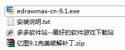
 2、首先双击文件“edrawmax-cn-9.1”安装亿图图示专家原程序，点击我同意继续安装；
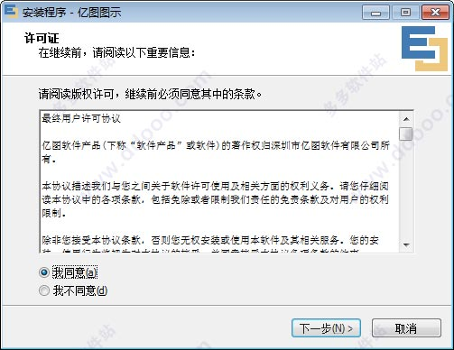
 3、软件安装目录默认为【C:\Program Files (x86)\亿图图示9.1】，用户可以自行更改；
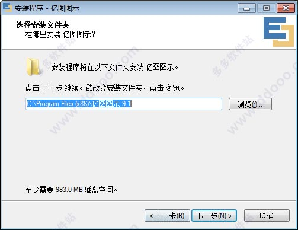
 4、创建桌面图标；
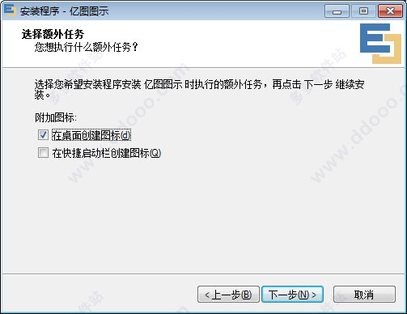
 5、软件正在安装中，请耐心等待一会儿；
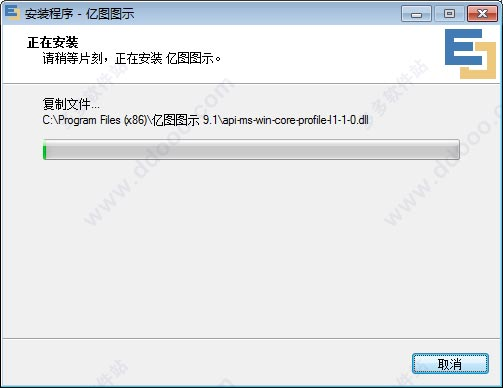
 6、成功安装，先不要运行软件，破解后再运行；
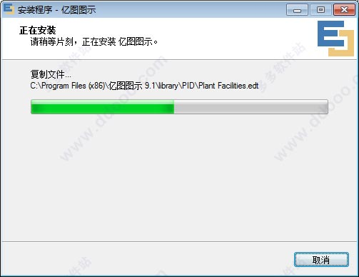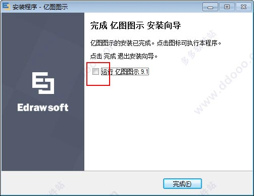
 7、接下来，将亿图图示9.1和谐补丁和注册机复制到软件安装目录下，默认安装目录为【C:\Program Files (x86)\亿图图示 9.1】
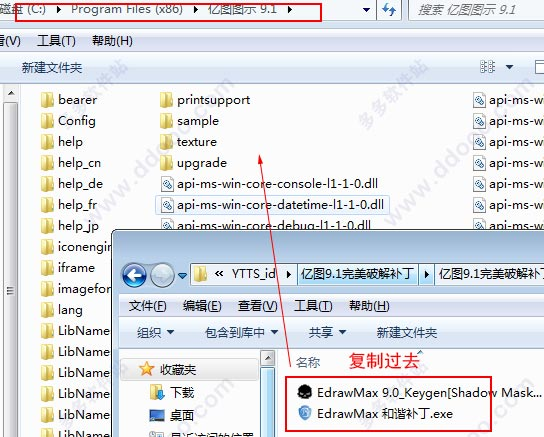
 8、首先运行“EdrawMax 和谐补丁.exe”，如果360弹出安全提示，请全部允许，最后完成可以看到补丁成功；
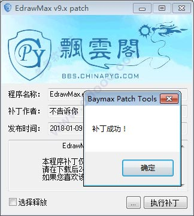
 9、先将网络断开(拨了网络或禁用网络)，再运行注册机“EdrawMax 9.0_Keygen[Shadow Mask].exe”得到注册码；
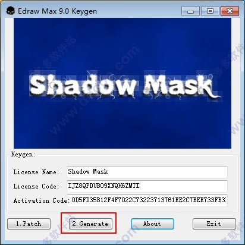
 10、打开亿图图示9.1软件，选择帮助菜单--激活--再手工输入上一步得到的注册码，最后点击手动激活即可；
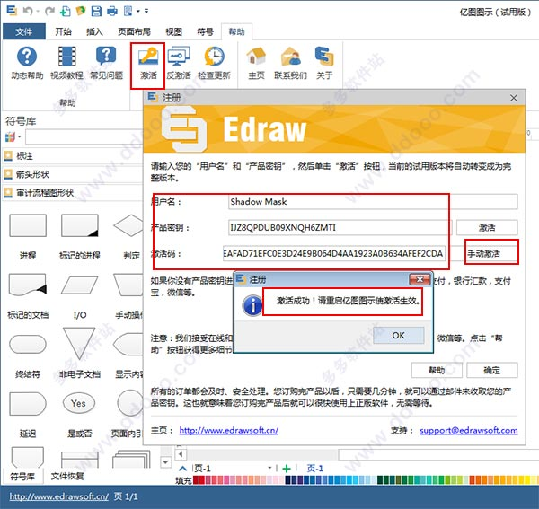
 11、重启软件，再次打开，亿图图示9.1破解版成功激活，用户可以无限制免费使用。
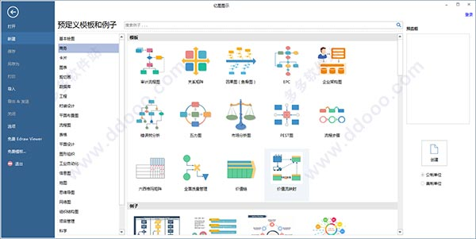

 教程来源：<http://www.ddooo.com/>

如有侵权，请告知，立即删文！！

### 欢迎关注下面的公众号交流！

