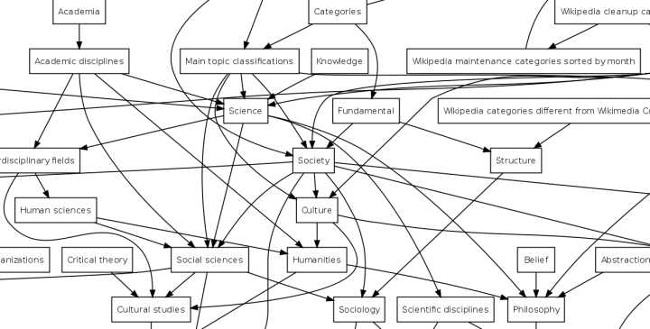
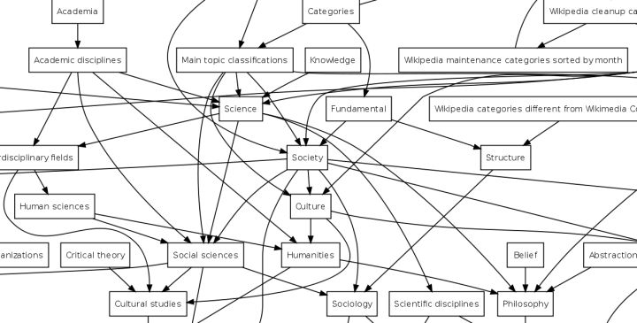

作者：Logician

链接：https://www.zhihu.com/question/20483634/answer/15253791

来源：知乎

著作权归作者所有。商业转载请联系作者获得授权，非商业转载请注明出处。

我觉得还是参考wikipedia的目录结构吧

http://en.wikipedia.org/wiki/Wikipedia:Categorization

> Category tree organization
>
> 
>
> 
>
> Partial view of Wikipedia's category system. Note how the arrows point downwards.
>
> Categories are organized as overlapping “trees”, formed by creating links between inter-related categories. Any category may contain (or “branch into”) 
>
> subcategories
>
> , and it is possible for a category to be a subcategory of more than one “parent” category. (A is said to be a 
>
> parent category
>
>  of B when B is a subcategory of A). 
>
> There is one top-level category, Category:Contents. All other categories are found below this. Hence every category apart from this top one must be a subcategory of at least one other category.
>
> There are two main kinds of category:
>
> 
>
> 1. **Topic categories** are named after a topic (usually sharing a name with the Wikipedia article on that topic). For example, Category:France contains articles relating to the topic France.
> 2. **Set categories** are named after a class (usually in the plural). For example, Category:Cities in France contains articles whose subjects are cities in France.
>
> Sometimes, for convenience, the two types can be combined, to create a 
>
> set-and-topic
>
>  category (such as Category:Voivodeships of Poland, which contains articles about particular voivodeships as well as articles relating to voivodeships in general).
>
> Subcategorization
>
> Many subcategories have two or more parent categories. For example, Category:British writers should be in both Category:Writers by nationalityand Category:British people by occupation. When making one category a subcategory of another, ensure that the members of the first really can be expected (with possibly a few exceptions) to belong to the second also. Category chains formed by parent-child relationships should never form closed loops. If two categories are closely related but are not in a subset relation, then links between them can be included in the text of the category pages.If logical membership of one category implies logical membership of a second, then the first category should be made a subcategory (directly or indirectly) of the second. For example, Cities in France is a subcategory of Populated places in France, which in turn is a subcategory of Geography of France.
>
> Diffusing large categories
>
> A category may be diffused using several coexisting schemes; for example, Category:Albums is broken down by artist, by date, by genre etc.
>
> Metacategories
>
>  may be created as ways of organizing schemes of subcategories. For example, the subcategories called "
>
> Artistname
>
>  albums" are not placed directly into Category:Albums, but into the metacategory Category:Albums by artist, which itself appears in Category:Albums.Although there is no limit on the size of categories, a large category will often be broken down ("diffused") into smaller, more specific subcategories. For example, Category:Rivers of Europe is broken down by country into the subcategories Rivers of Albania, Rivers of Andorra, etc.
>
> It is possible for a category to be only partially diffused – some members are placed in subcategories, while others remain in the main category.
>
> Information about how a category is diffused may be given on the category page. Categories which are intended to be fully broken down into subcategories can be marked with the {{catdiffuse}} template, which indicates that any pages which editors might add to the main category should be moved to the appropriate subcategories when sufficient information is available. (If the proper subcategory for an article does not exist yet, either create the subcategory or leave the article in the parent category for the time being.)
>
> To suggest that a category is so large that it ought to be diffused into subcategories, you can add the {{verylarge}} template to the category page.
>
> Non-diffusing subcategories
>
> It is useful to identify non-diffusing subcategories with a note on the category page. The {{All included}} and {{Distinguished subcategory}} templates can be used.Not all subcategories serve the "diffusion" function described above; some are simply subsets which have some special characteristic of interest, such as Best Actor Academy Award winners as a subcategory of Film actors, Toll bridges in New York City as a subcategory of Bridges in New York City, and Musical films as a subcategory of Musicals. These are called 
>
> non-diffusing subcategories
>
> . They sometimes provide an exception to the general rule that pages are not placed in both a category and its subcategory: there is no need to take pages out of the parent category 
>
> purely
>
>  because of their membership of a non-diffusing subcategory. (Of course, if the pages also belong to other subcategories that do cause diffusion, then they will not appear in the parent category directly.)
>
> Subcategories defined by ethnicity and sexuality are often non-diffusing subcategories. See also the gender, race and sexuality categorization guideline.

[编辑于 2012-09-17]()