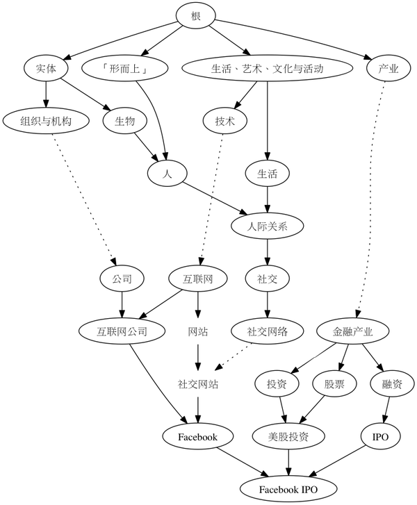

# 知乎话题结构在数据库中是如何设计和实现的？

# 知乎话题结构在数据库中是如何设计和实现的？

目前掌握的信息：

1、知乎的话题是一个**有根、无循环、有向图**。

2、话题中存在**弱节点**和**弱关系**

需要实现类似知乎话题，使用关系型数据库还是非关系型数据库？

被浏览

1,626

## 你可以邀请下面用户，快速获得回答

[![[object Object\]](https://pic2.zhimg.com/v2-fa6fa100dd2fe435f38d168c8b14436f_im.jpg)](https://www.zhihu.com/people/unclexiaofly)

## [趣你的肖蜀黍](https://www.zhihu.com/people/unclexiaofly)

最近回答过该领域问题

[![[object Object\]](https://pic4.zhimg.com/da8e974dc_im.jpg)](https://www.zhihu.com/people/wen-yuan-61-35)

## [文渊](https://www.zhihu.com/people/wen-yuan-61-35)

在「数据库设计」话题下有 12 个回答

[![[object Object\]](https://pic2.zhimg.com/v2-35e668877463b369ca55ad73628ac1a5_im.jpg)](https://www.zhihu.com/people/robinma)

## [Robin](https://www.zhihu.com/people/robinma)

在「数据库设计」话题下获得过 22 个赞

[![[object Object\]](https://pic2.zhimg.com/v2-2fb5d1a9cb248065489e7dcac376ca62_im.jpg)](https://www.zhihu.com/people/justabug)

## [justabug](https://www.zhihu.com/people/justabug)

最近回答过该领域问题

[![[object Object\]](https://pic3.zhimg.com/v2-ec7416738e3d645a38363bc89d899c33_im.jpg)](https://www.zhihu.com/people/bridata)

## [BriData](https://www.zhihu.com/people/bridata)

最近回答过该领域问题

#### 3 个回答

[Michael](https://www.zhihu.com/people/purekid)

程序员，关注高可用、全栈、DevOPS。

用图数据库很适合 可以试试neo4j

[发布于 2017-04-08](https://www.zhihu.com/question/20441924/answer/156063229)

[吴筠](https://www.zhihu.com/people/wuxuanyu)

互联网创业者

表结构：
id - title - fids
0 - 根 - (-1)
1 - 实体 - 0; 
2 - 学科 - 0;
3 - 科学 - 1;2
4 - 产业 - 0;1;

1、一个节点下的所有子节点
select * from tree where fids like '%0;%'

2、一个节点的所有父节点
select fids from tree where id = ?

3、 一个节点和根节点之间的路径
用递归查询，第2种情况的递归。

大致应该是这样的，如果查询慢的话，做俩个表
tree 做结构存储，再生成一个查询表，可以不考虑笛卡尔乘积的问题。

[发布于 2013-11-14](https://www.zhihu.com/question/20441924/answer/20068101)

匿名用户

简单分析一下

1个话题可以有多个之话题，也可以有多个父话题。

我的理解这个一个类似N叉树的结构。任意只话题可以有多个线路到达顶级节点，每个话题也存在多个子节点。

限制：如果a是b的子节点，那么在b节点的上面就不能够在添加a节点，反之也是。

一起来讨论讨论一下技术实现。语言不限，但是基于数据库的。

表结构初定3个字段

tagid     tagname     pid

[发布于 2012-08-25](https://www.zhihu.com/question/20441924/answer/15144642)